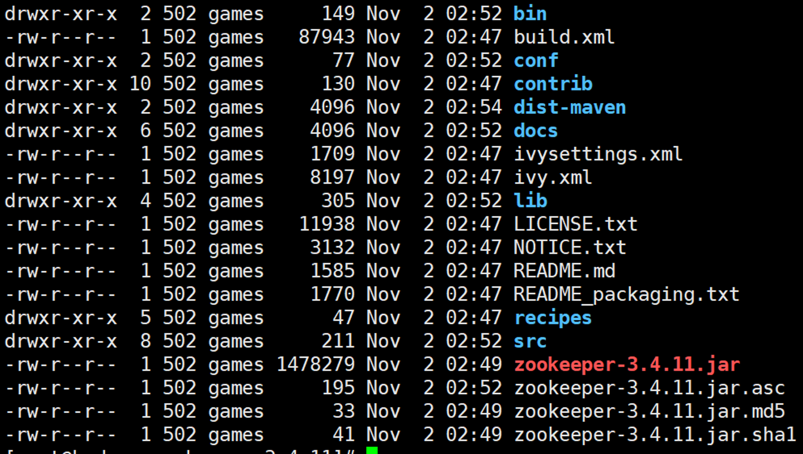
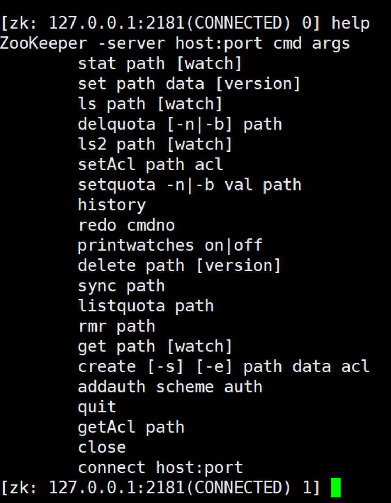

## 下载安装

1. https://zookeeper.apache.org/releases.html
2. tar -zxvf zookeeper-3.4.11.tar.gz
3. 官方参考文档：https://zookeeper.apache.org/doc/r3.4.11/zookeeperStarted.html
<!--more-->

## 目录结构

<div align=center>



</div>

### bin目录

zk的可执行脚本目录，包括zk服务进程，zk客户端，等脚本。其中，.sh是Linux环境下的脚本，.cmd是Windows环境下的脚本。使用文本编辑器打开zkServer.cmd或者zkServer.sh文件，可以看到其会调用zkEnv.cmd或者zkEnv.sh脚本。zkEnv脚本的作用是设置zk运行的一些环境变量，例如配置文件的位置和名称等。

<div align=center>


</div>

### conf目录

配置文件目录。zoo_sample.cfg为样例配置文件，需要修改为自己的名称，一般为zoo.cfg。log4j.properties为日志配置文件.

<div align=center>


</div>

### lib:zk依赖的包

<div align=center>


</div>

### contrib目录:一些用于操作zk的工具包

<div align=center>


</div>

### recipes目录:zk某些用法的代码示例

<div align=center>


</div>

## 安装模式

### 配置文件说明

```conf
# The number of milliseconds of each tick
# 时长单位为毫秒（默认2000ms），为zk使用的基本时间度量单位。
# 例如，1*tickTime是客户端与张昆服务端的心跳时间，2*tickTime是客户端会话的超时时间。
# 更低的tickTime可以更快的发现超时问题，但是也会导致更高的网络流量（心跳消息）和更高的cpu使用率（会话的跟踪处理）。
tickTime=2000
# The number of ticks that the initial initLimit*tickTime
# synchronization phase can take
# ZooKeeper集群模式下包含多个zk进程，其中一个进程为leader，余下的进程为follower。 
# 当follower最初与leader建立连接时，它们之间会传输相当多的数据，尤其是follower的数据落后leader很多。
# initLimit配置follower与leader之间建立连接后进行同步的最长时间。
initLimit=10
# The number of ticks that can pass between syncLimit*tickTime
# sending a request and getting an acknowledgement
# 配置follower和leader之间发送消息，请求和应答的最大时间长度。
syncLimit=5
# the directory where the snapshot is stored.
# do not use /tmp for storage, /tmp here is just 
# example sakes.
# 无默认配置，必须配置，用于配置存储快照文件的目录。如果没有配置dataLogDir，那么事务日志也会存储在此目录。
# 集群模式下还有一个myid文件。myid文件的内容只有一行，且内容只能为1 - 255之间的数字，
# 这个数字即是server.id中的id，表示zk进程的id。
dataDir=/tmp/zookeeper
# the port at which the clients will connect
# zk服务进程监听的TCP端口，默认情况下，服务端会监听2181端口
clientPort=2181
# the maximum number of client connections.
# increase this if you need to handle more clients
#maxClientCnxns=60
#
# Be sure to read the maintenance section of the 
# administrator guide before turning on autopurge.
#
# http://zookeeper.apache.org/doc/current/zookeeperAdmin.html#sc_maintenance
#
# The number of snapshots to retain in dataDir
#autopurge.snapRetainCount=3
# Purge task interval in hours
# Set to "0" to disable auto purge feature
#autopurge.purgeInterval=1
#其中id为一个数字，表示zk进程的id，这个id也是dataDir目录下myid文件的内容。 
#host是该zk进程所在的IP地址，port1表示follower和leader交换消息所使用的端口，port2表示选举leader所使用的端口。
#server.id=host:port1:port2
```

### 单机模式

```conf
在conf下配置zoo.cfg配置文件内容参考如下：
tickTime=2000
dataDir=/app/zookeeper-3.4.11/data
dataLogDir=/app/zookeeper-3.4.11/logs
clientPort=2181
```

<div align=center>


</div>

### 集群模式

```conf
tickTime=2000
initLimit=5
syncLimit=2
dataDir=/app/zookeeper-3.4.11/data
dataLogDir=/app/zookeeper-3.4.11/logs
clientPort=2181
server.43=10.1.39.43:2888:3888  
server.47=10.1.39.47:2888:3888
server.48=10.1.39.48:2888:3888
```

## 启动连接

### 启动

```bash
./zkServer.sh start
```

<div align=center>


</div>

如果想在前台中运行以便查看服务器进程的输出日志，可以通过以下命令运行：  

```bash
./zkServer.sh start-foreground
```

执行此命令，可以看到大量详细信息的输出，以便允许查看服务器发生了什么。  

### 连接

```bash
bin/zkCli.sh -server 127.0.0.1:2181
#连接一个zk集群
bin/zkCli.sh -server 192.168.229.160:2181,192.168.229.161:2181,192.168.229.162:2181
```

<div align=center>


</div>

### 可用命令

<div align=center>



</div>
