## 安装包下载

https://dev.mysql.com/downloads/mysql/  
根据系统版本下载

<div align=center>

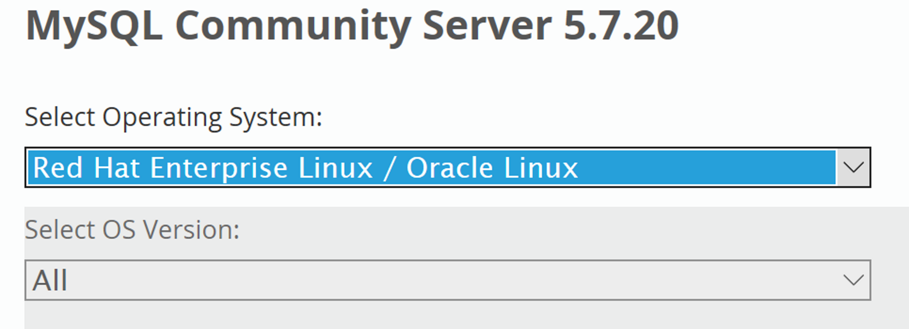

</div>
<!--more-->

## 安装新版mysql前，需将系统自带的mariadb-lib卸载

```bash
[root@hadoop ~]# rpm -qa|grep mariadb
mariadb-libs-5.5.52-1.el7.x86_64
[root@hadoop ~]# rpm -e --nodeps mariadb-libs-5.5.52-1.el7.x86_64
[root@hadoop ~]# rpm -qa|grep mariadb
```

## 解压安装包

```bash
tar -xvf mysql-5.7.20-1.el7.x86_64.rpm-bundle.tar
```

<div align=center>

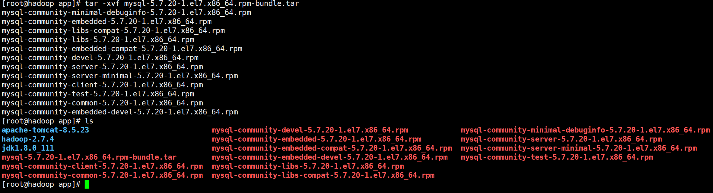

</div>

## 安装

### mysql-community-common-5.7.20-1.el7.x86_64.rpm

```bash
rpm -ivh mysql-community-common-5.7.20-1.el7.x86_64.rpm
```

<div align=center>

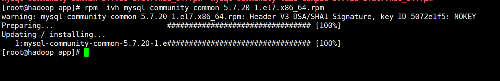

</div>

### mysql-community-libs-5.7.20-1.el7.x86_64.rpm

```bash
rpm -ivh mysql-community-libs-5.7.20-1.el7.x86_64.rpm
```

<div align=center>

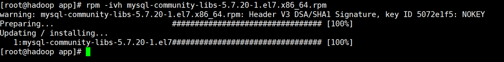

</div>

### mysql-community-client-5.7.20-1.el7.x86_64.rpm

```bash
rpm -ivh mysql-community-client-5.7.20-1.el7.x86_64.rpm 

```

<div align=center>

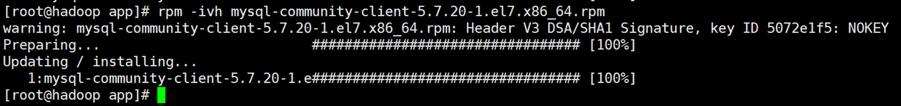

</div>

### mysql-community-server-5.7.20-1.el7.x86_64.rpm

在安装之前需要安装libaio  

```bash
[root@hadoop app]# rpm -qa|grep libaio
libaio-0.3.109-13.el7.x86_64
```

如果不存需要下载离线包：  
http://mirror.centos.org/centos/6/os/x86_64/Packages/  

<div align=center>

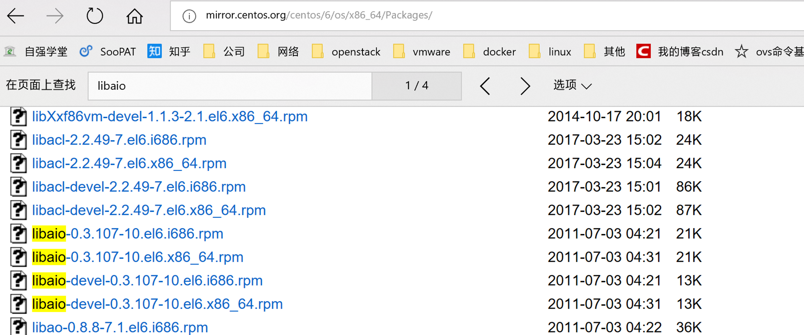

</div>

#### 安装libaio库

```bash
rpm -ivh libaio-0.3.107-10.el6.x86_64.rpm（若在有网情况下可执行yum install libaio）
```

#### 安装server

```bash
rpm -ivh mysql-community-server-5.7.20-1.el7.x86_64.rpm
```

出现如下错误：（最好安装服务版的centos，最小化安装会出现如下错误，处理比较麻烦，需要安装各种依赖包）

```bash
error: Failed dependencies:
	/usr/bin/perl is needed by mysql-community-server-5.7.20-1.el7.x86_64
	perl(Getopt::Long) is needed by mysql-community-server-5.7.20-1.el7.x86_64
	perl(strict) is needed by mysql-community-server-5.7.20-1.el7.x86_64
```

#### 安装依赖包

```bash
yum -y install perl*
```

<div align=center>

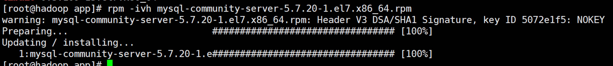

</div>

## 初始化数据库

```bash
// 指定datadir, 执行后会生成~/.mysql_secret密码文件（5.7以后不在使用）
[root@slave mytmp]# mysql_install_db --datadir=/var/lib/mysql

// 初始化，执行生会在/var/log/mysqld.log生成随机密码
[root@slave mytmp]# mysqld --initialize
```

## 更改mysql数据库目录的所属用户及其所属组（没用创建mysql用户）

```bash
chown mysql:mysql /var/lib/mysql -R
```

## 启动mysql

`systemctl start mysqld.service`

<div align=center>

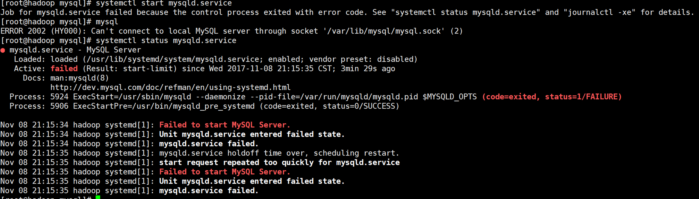

</div>

### 问题

Process: 5924 ExecStart=/usr/sbin/mysqld --daemonize --pid-file=/var/run/mysqld/mysqld.pid $MYSQLD_OPTS (code=exited, status=1/FAILURE)

### 跟踪日志/var/log/mysqld.log

<div align=center>

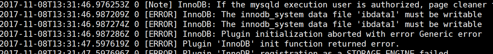

</div>

### 授权

`chmod -R 777 mysql`  

在启动查看：  
<div align=center>

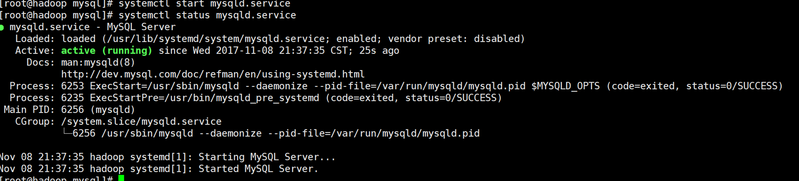

</div>

## 登录到mysql，更改root用户的密码

命令可以查看初始密码  

`grep 'temporary password' /var/log/mysqld.log`  

<div align=center>

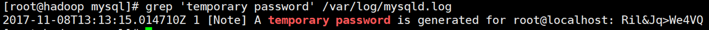

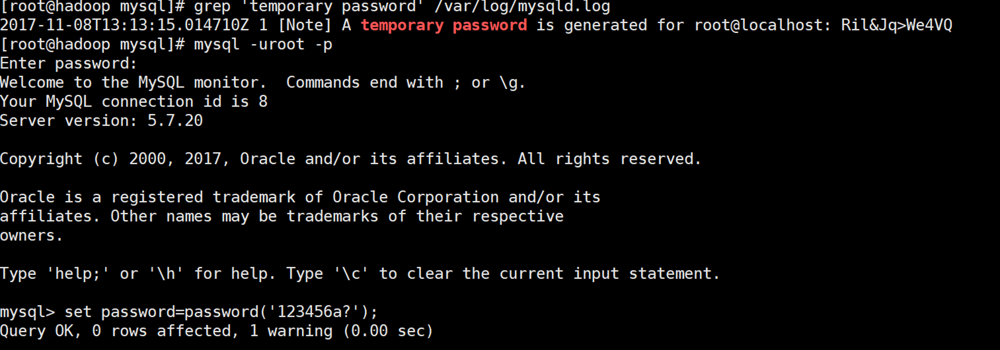

</div>

`set password=password('123456a?');`  

## 创建用户，及作权限分配

```sql
CREATE USER 'sunld'@'%' IDENTIFIED BY '123456a?';

GRANT ALL PRIVILEGES ON *.* TO 'sunld'@'%';

flush privileges;
```

<div align=center>

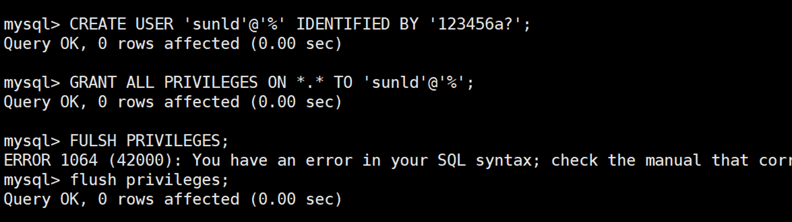

</div>

## 远程登陆授权

```sql
grant all privileges on *.* to 'root'@'%' identified by '123456a?' with grant option;

flush privileges;
```

<div align=center>

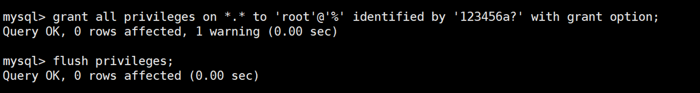

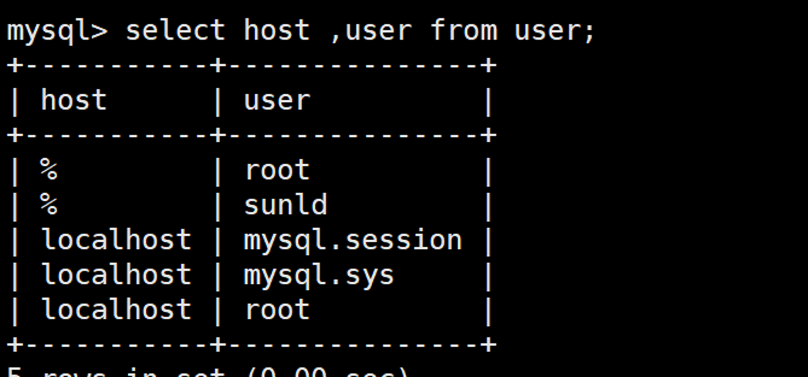

</div>

## 设置mysql开机启动

```bash
// 检查是否已经是开机启动
systemctl list-unit-files | grep mysqld
// 开机启动
systemctl enable mysqld.service
```

<div align=center>

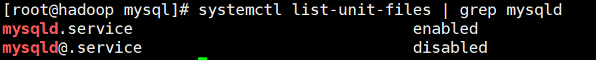

</div>

## 默认配置文件路径

1. 配置文件：/etc/my.cnf
2. 日志文件：/var/log/mysqld.log
3. 服务启动脚本：/usr/lib/systemd/system/mysqld.service
4. socket文件：/var/run/mysqld/mysqld.pid

## 配置默认编码为utf8

修改/etc/my.cnf配置文件，在[mysqld]下添加编码配置，如下所示：

```sql
[mysqld]
character_set_server=utf8
init_connect='SET NAMES utf8'
```

## 参考
