## 虚拟机基本配置

### 设置机器名（重启后生效）--使用ubuntu

<div align=center>

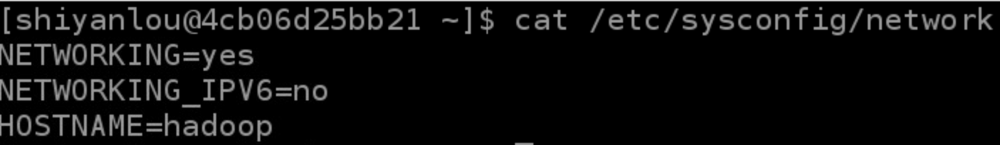


</div>
<!--more-->
对于ubuntu修改文件是/etc/hostname

### 设置host映射文件

```bash
sudo vi /etc/hosts
```

<div align=center>


</div>
使用ping命令验证配置是否正确

### 关闭防火墙

```bash
sudo service iptables status（sudo ufw status）
sudo chkconfig iptables off（sudo ufw enable|disable ）
```

#### Centos7

```bash
systemctl stop firewalld.service #停止firewall
systemctl disable firewalld.service #禁止firewall开机启动
firewall-cmd --state #查看默认防火墙状态（关闭后显示notrunning，开启后显示running）
```

### 关闭Selinux（ubuntu不需要）

1. 使用getenforce命令查看是否关闭
2. 修改/etc/selinux/config 文件

将SELINUX=enforcing改为SELINUX=disabled，执行该命令后重启机器生效

## SSH

```bash
ps -e | grep ssh
sudo yum install openssh-server
/etc/init.d/ssh start
```

<div align=center>

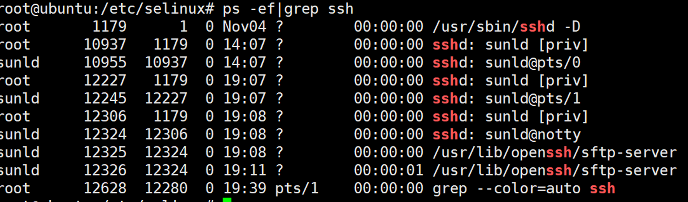

</div>

### 无密钥SHH

在ROOT用户下执行：`ssh-keygen -t rsa`

<div align=center>

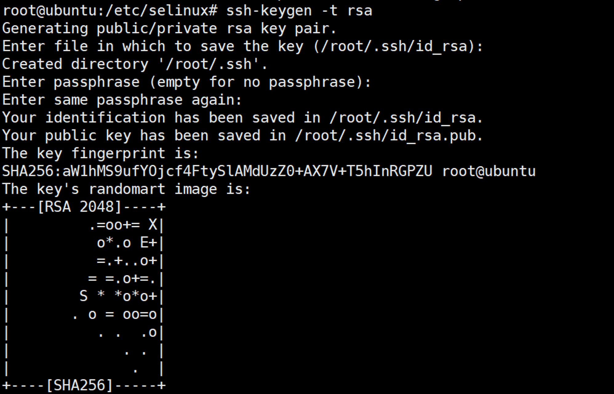

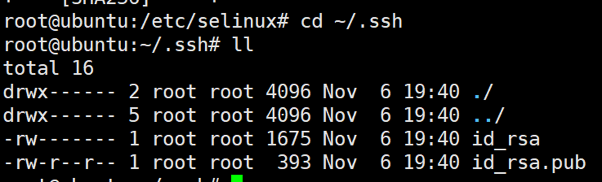

</div>

`cat id_rsa.pub > authorized_keys`

<div align=center>

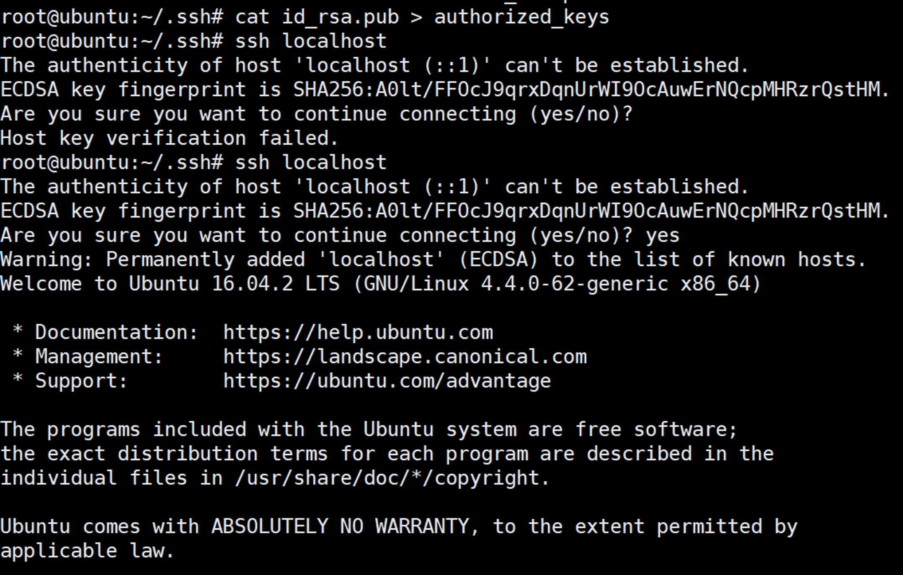

</div>

## JDK

下载安装包，并且完成安装：

```bash
tar -zxvf jdk-8u111-linux-x64.tar.gz
```

### 配置环境变量

```bash
# vi /etc/profile
#JAVA INFO START
export JAVA_HOME=/app/jdk1.8.0_111
export JRE_HOME=/app/jdk1.8.0_111/jre
export PATH=$JAVA_HOME/bin:$JRE_HOME/bin:$PATH
export CLASSPATH=.:$JAVA_HOME/jre/lib/rt.jar:$JAVA_HOME/lib/dt.jar:$JAVA_HOME/lib/tools.jar
#JAVA INFO END
```

<div align=center>

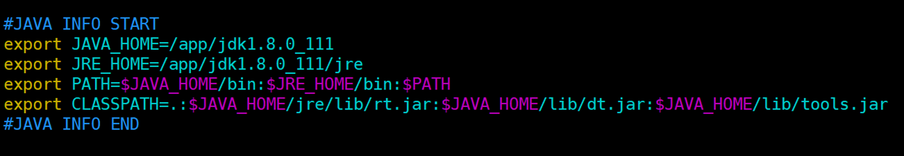

</div>

保存，退出！

```bash
shell> source /etc/profile    #使之立即生效
```

### 验证

<div align=center>

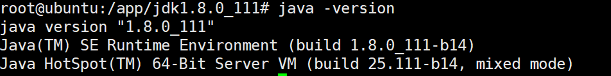

</div>

### 【建议也设置默认启动】

```bash
# vi /etc/rc.local

#JAVA INFO START
export JAVA_HOME=/app/jdk1.8.0_111
export JRE_HOME=/app/jdk1.8.0_111/jre
export PATH=$JAVA_HOME/bin:$JRE_HOME/bin:$PATH
export CLASSPATH=.:$JAVA_HOME/jre/lib/rt.jar:$JAVA_HOME/lib/dt.jar:$JAVA_HOME/lib/tools.jar
#JAVA INFO END
```

<div align=center>

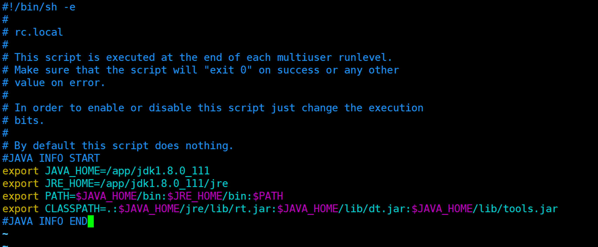

</div>

### 设置全局环境变量

## Mysql

## Tomcat

```bash
tar -zxvf apache-tomcat-8.0.23.tar.gz
gedit startup.sh
JAVA_HOME=/app/jdk1.8.0_111
JRE_HOME=$JAVA_HOME/jre
PATH=$PATH:$JAVA_HOME/bin:$JRE_HOME
CLASSPATH=.:$JRE_HOME/lib/rt.jar:$JAVA_HOME/lib/dt.jar:$JAVA_HOME/lib/tools.jar
TOMCAT_HOME=/app/apache-tomcat-8.5.23
```

<div align=center>

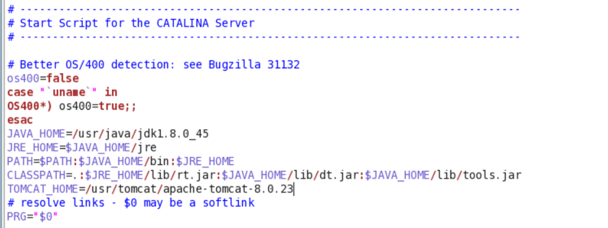

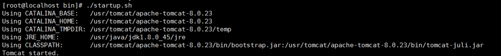

</div>

### 防火墙

```bash
gedit /etc/sysconfig/iptables
```

<div align=center>

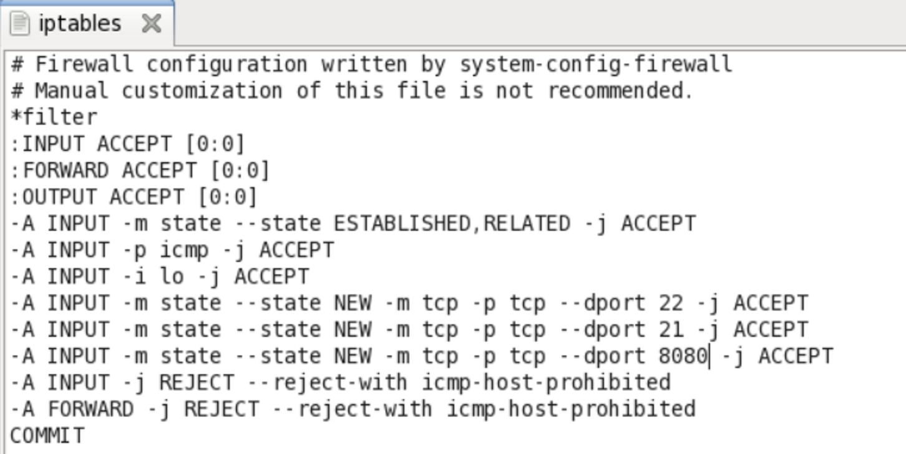

</div>

```bash
/etc/init.d/iptables restart
```

### vsftpd

1. 查看是否安装：rpm –qa|grep vsftpd
2. 安装：yum -y install vsftpd
3. 启动：service vsftpd start
4. 重启：service vsftpd restart
5. 设置相关参数：setsebool -P ftp_home_dir 1

<div align=center>

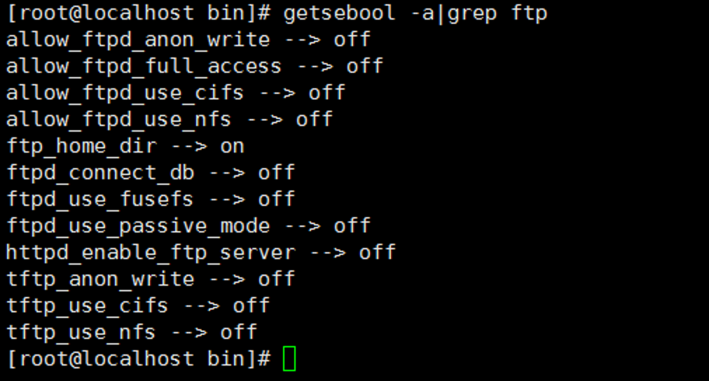

</div>

## Mongodb

```bash
tar -zxvf mongodb-linux-x86_64-3.0.3.gz
mkdir data
mkdir data/mongodb
touch logs
```

```conf
#【代表端口号，如果不指定则默认为   27017   】
port=27017
#数据库路径】
dbpath= /usr/mongodb/mongodb-linux-x86_64-3.0.3/data/mongodb
#【日志路径】
logpath= /usr/mongodb/mongodb-linux-x86_64-3.0.3/logs
#【日志文件自动累加，而不是覆盖】
logappend=true
```

<div align=center>


</div>

```bash
/usr/mongodb/mongodb-linux-x86_64-3.0.3/bin/mongod -f /usr/mongodb/mongodb-linux-x86_64-3.0.3/mongodb.conf
pkill mongod
进入mongo shell ：运行 db.shutdownServer()
/usr/mongodb/mongodb-linux-x86_64-3.0.3/bin/mongo
```

## Hadoop

### 下载安装安装包

```bash
tar -zxvf hadoop-2.7.4.tar.gz
```

### 配置环境变量

```bash
vim /etc/profile

#hadoop info start
export HADOOP_HOME=/app/hadoop-2.7.4
export PATH=$HADOOP_HOME/bin:$PATH
#hadoop info end
```

<div align=center>

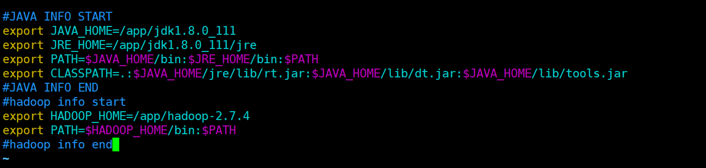

</div>

`source /etc/profile`  

加入rc.local  

<div align=center>

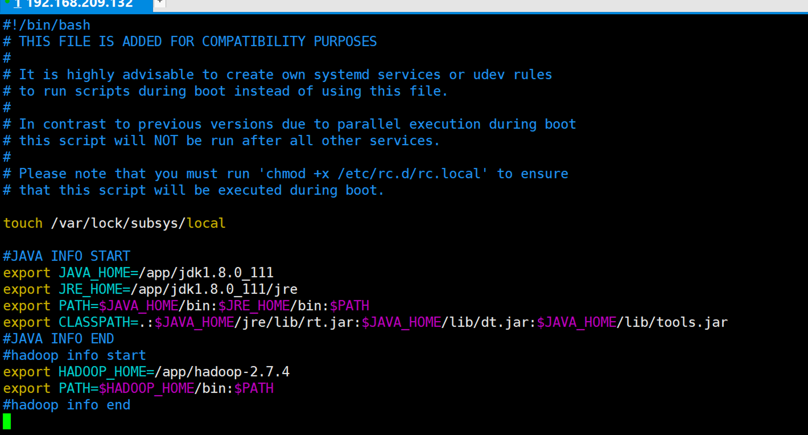

</div>

### 创建文件目录

```bash
root@ubuntu:/app/hadoop-2.7.4# mkdir hdfs
root@ubuntu:/app/hadoop-2.7.4# mkdir hdfs/name
root@ubuntu:/app/hadoop-2.7.4# mkdir hdfs/data
root@ubuntu:/app/hadoop-2.7.4# mkdir tmp
root@ubuntu:/app/hadoop-2.7.4# mkdir mapred
root@ubuntu:/app/hadoop-2.7.4# mkdir mapred/local
root@ubuntu:/app/hadoop-2.7.4# mkdir mapred/system
```

<div align=center>

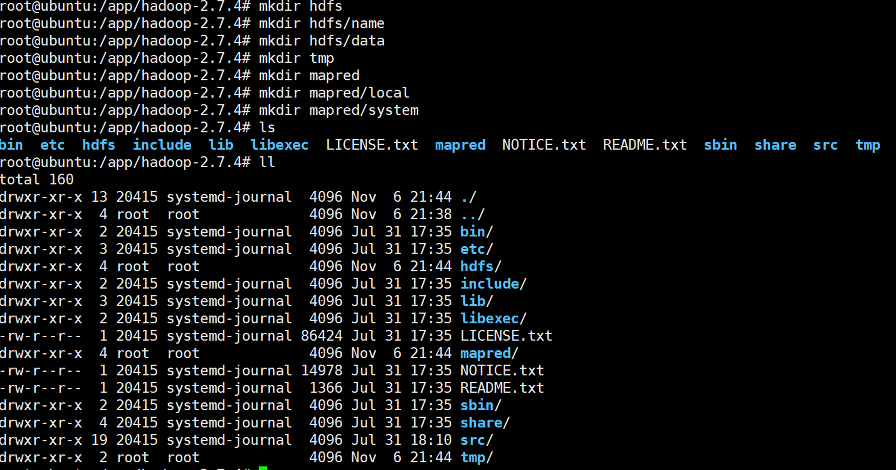

</div>

### 编辑配置文件

配置文件目录位置：/app/hadoop-2.7.4/etc/hadoop，注意如果在配置文件中使用ip需要使用实际的ip比如192.168.209.132，不要使用127.0.0.1或者localhost

#### hadoop-env.sh（可以不修改）

```bash
vim hadoop-env.sh

# The java implementation to use.
export JAVA_HOME=/app/jdk1.8.0_111
```

<div align=center>

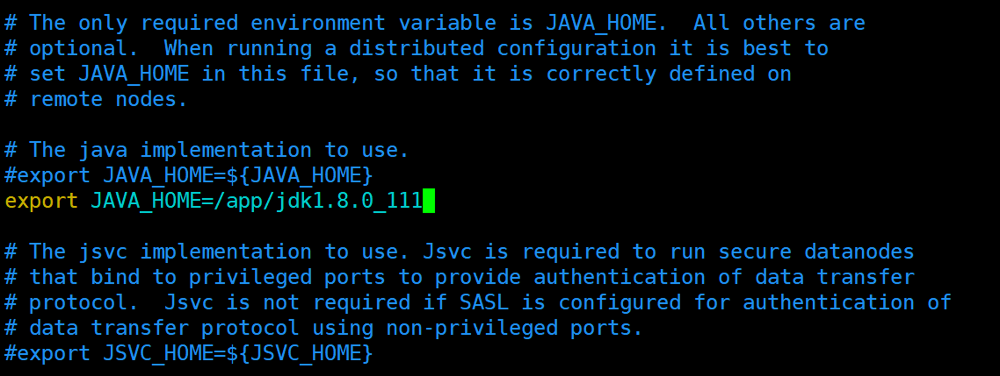

</div>

#### core-site.xml

vim core-site.xml

```conf
<configuration>
  <property>
    <name>fs.defaultFS</name>
    <value>hdfs://192.168.209.132:9000</value>
  </property>
  <property>
    <name>hadoop.tmp.dir</name>
    <value>file:/app/hadoop-2.7.4/tmp</value>
  </property>
  <property>
    <name>dfs.namenode.name.dir</name>
    <value>file:/app/hadoop-2.7.4/hdfs/name</value>
  </property>

  <property>
    <name>dfs.datanode.data.dir</name>
    <value>file:/app/hadoop-2.7.4/hdfs/data</value>
  </property>
</configuration>
```

<div align=center>

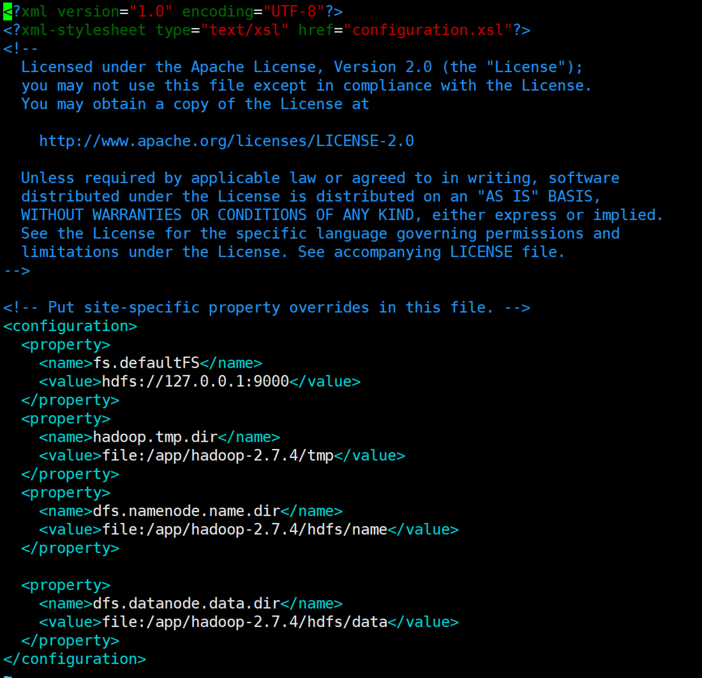

</div>

#### hdfs-site.xml

vim hdfs-site.xml

```conf
<configuration>
  <property>
    <name>dfs.replication</name>
    <value>1</value>
  </property>

  <property>
    <name>dfs.permissions</name>
    <value>false</value>
  </property>

  <property>
    <name>dfs.namenode.name.dir</name>
    <value>file:/app/hadoop-2.7.4/hdfs/name</value>
  </property>

  <property>
    <name>dfs.datanode.data.dir</name>
    <value>file:/app/hadoop-2.7.4/hdfs/data</value>
  </property>
</configuration>
```

<div align=center>

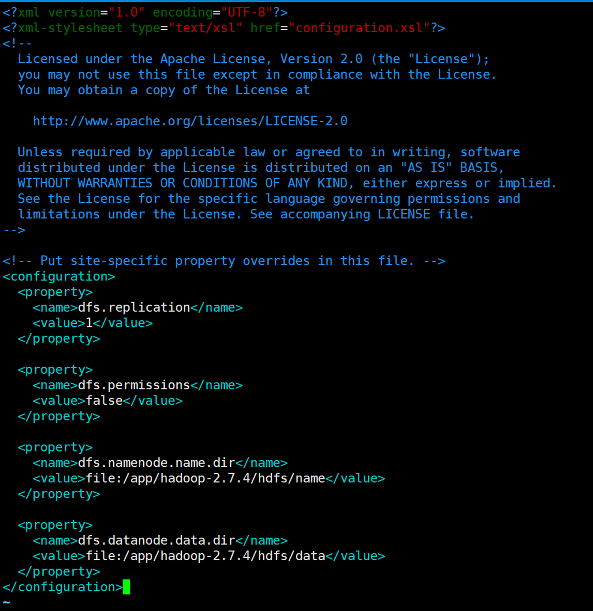

</div>

#### mapred-site.xml

修改mapred-site.xml(默认没有这个配置文件，可以拷贝改目录下的mapred-site.xml.template    :  cp mapred-site.xml.template mapred-site.xml)内容如下  

cp mapred-site.xml.template mapred-site.xml  

vim mapred-site.xml  

```conf
<configuration>
  <property>
    <name>mapreduce.jobtracker.address</name>
    <value>192.168.209.132:9001</value>
    <final>true</final>
  </property>
  <property>
    <name>mapred.system.dir</name>
    <value>file:/app/hadoop-2.7.4/mapred/system</value>
    <final>true</final>
  </property>

  <property>
    <name>mapred.local.dir</name>
    <value>file:/app/hadoop-2.7.4/mapred/local</value>
    <final>true</final>
  </property>
</configuration>
```

<div align=center>

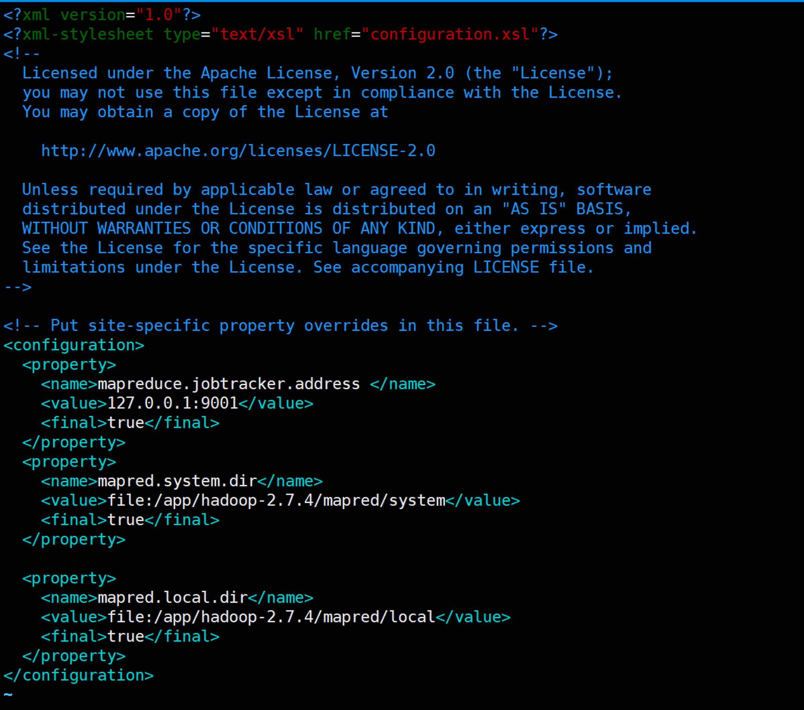

</div>

#### yarn-site.xml

```conf
<configuration>
<!-- Site specific YARN configuration properties -->
  <!--<property>
    <name>mapreduce.framework.name</name>
    <value>yarn</value>
  </property>  -->

  <property>
    <name>yarn.nodemanager.aux-services</name>
    <value>mapreduce_shuffle</value>
  </property>
</configuration>
```

<div align=center>

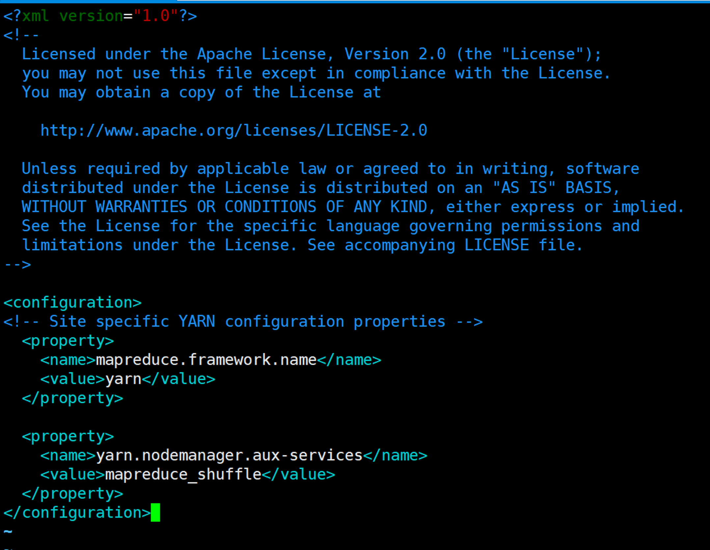

</div>

### 启动

#### 格式化

首次运行需要进行hdfs格式化：hdfs namenode -format  

/app/hadoop-2.7.4/bin/hdfs namenode -format  

<div align=center>

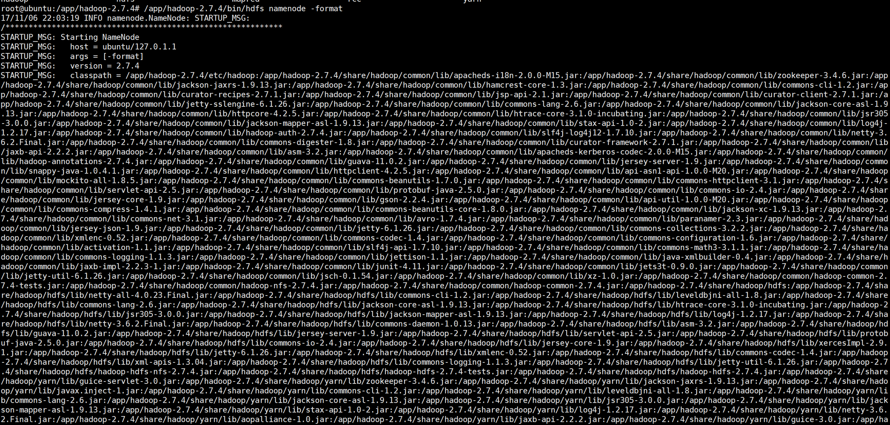

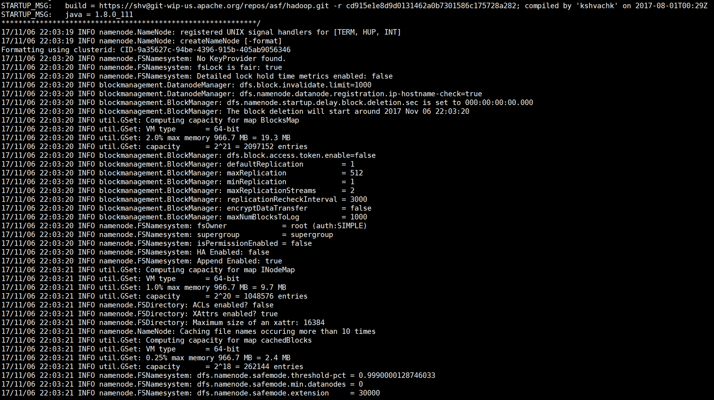

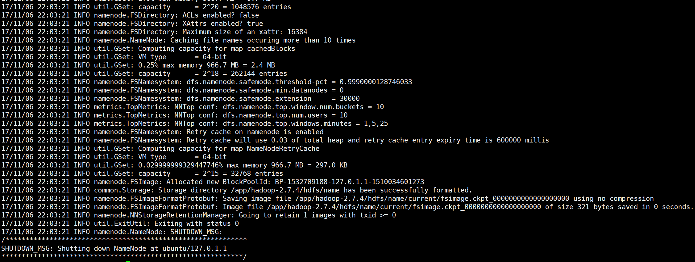

</div>

#### 启动

进入sbin文件夹，执行：./start-all.sh  
/app/hadoop-2.7.4/sbin/start-all.sh  

<div align=center>

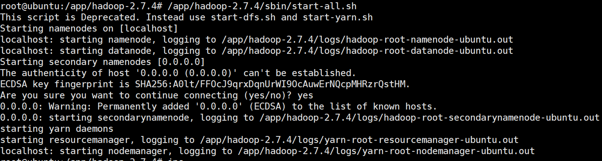

</div>

#### 验证

运行启动后，使用jps命令查看是否将服务启动成功：  

##### 输入命令：jps

包括NameNode,SecondaryNameNode, ResourceManager, DataNode, NodeManager和jps；

<div align=center>

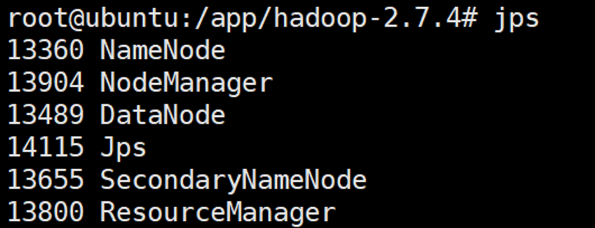

</div>

##### 192.168.209.135:8088/cluster

<div align=center>

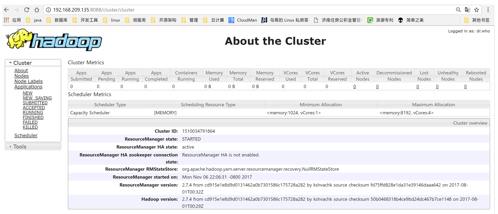

</div>

##### 192.168.209.135:50070

<div align=center>

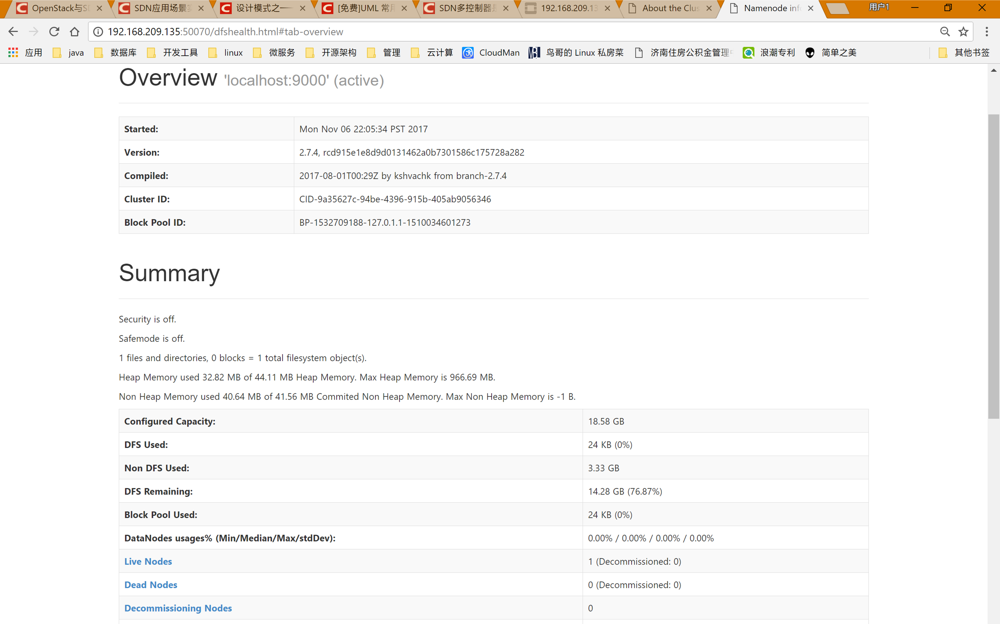

</div>

##### ps -ef|grep hadoop

<div align=center>

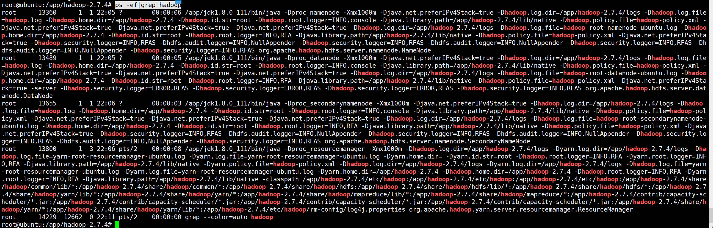

</div>

##### 使用测试用例测试

###### 创建测试目录

```bash
/app/hadoop-2.7.4/bin/hadoop fs -mkdir -p /class3/input
/app/hadoop-2.7.4/bin/hadoop fs -ls /class3/
```

<div align=center>

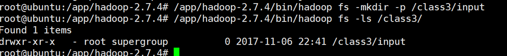

</div>

###### 准备数据

```bash
/app/hadoop-2.7.4/bin/hadoop fs -copyFromLocal /app/hadoop-2.7.4/etc/hadoop/* /class3/input
```

<div align=center>

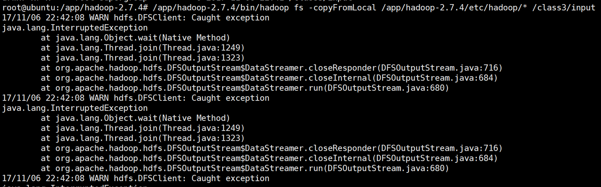

</div>

该异常处理：（hadoop的本身bug,不用处理，使用centos7安装没问题）  
重新复制文件(可以不使用)  

```bash
/app/hadoop-2.7.4/bin/hadoop fs -rm -r -f /class3/
/app/hadoop-2.7.4/bin/hadoop fs -mkdir -p /class3/input
/app/hadoop-2.7.4/bin/hadoop fs -ls /class3/
/app/hadoop-2.7.4/bin/hadoop fs -copyFromLocal /app/hadoop-2.7.4/etc/hadoop/* /class3/input
```

/app/hadoop-2.7.4/bin/hadoop fs -ls /class3/input  

<div align=center>

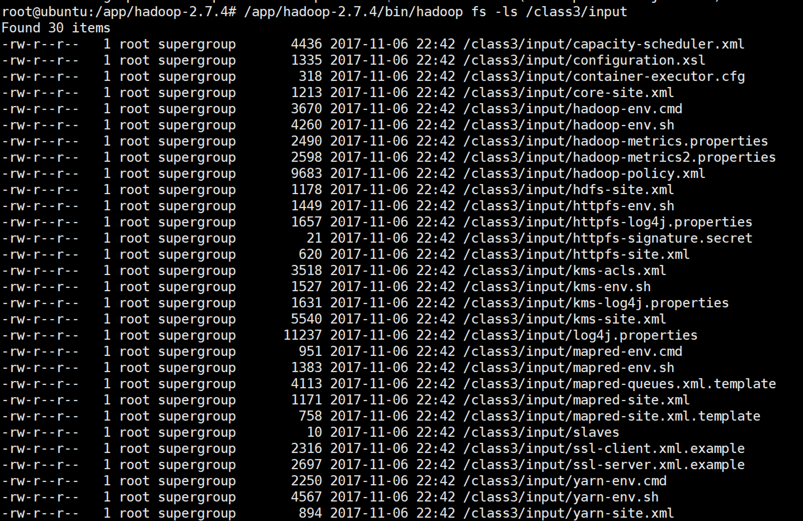

</div>

###### 运行wordcount例子

```bash
cd /app/hadoop-2.7.4/
bin/hadoop jar share/hadoop/mapreduce/hadoop-mapreduce-examples-2.7.4.jar wordcount /class3/input /class3/output
```

任务卡住，解决方案：
<div align=center>

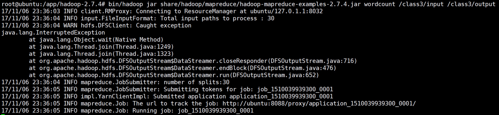

</div>

修改yarn-site.xml配置文件，增加如下信息  

```conf
 <property>  
     <name>yarn.nodemanager.resource.memory-mb</name>  
     <value>2048</value>  
 </property>
 <property>  
     <name>yarn.scheduler.minimum-allocation-mb</name>
     <value>2048</value>
 </property>
 <property>
     <name>yarn.nodemanager.vmem-pmem-ratio</name>
     <value>2.1</value>
 </property>  
 <property>
     <name>yarn.log-aggregation-enable</name>
     <value>true</value>
 </property>
 <property>
     <name>yarn.log-aggregation.retain-seconds</name>
     <value>604800</value>
 </property>
 <!--<property>
     <name>yarn.resourcemanager.hostname</name>
     <value>ubuntu</value>
 </property>-->
```

###### 查看结果

```bash
bin/hadoop fs -ls /class3/output/  
bin/hadoop fs -cat /class3/output/part-r-00000 | less
```
