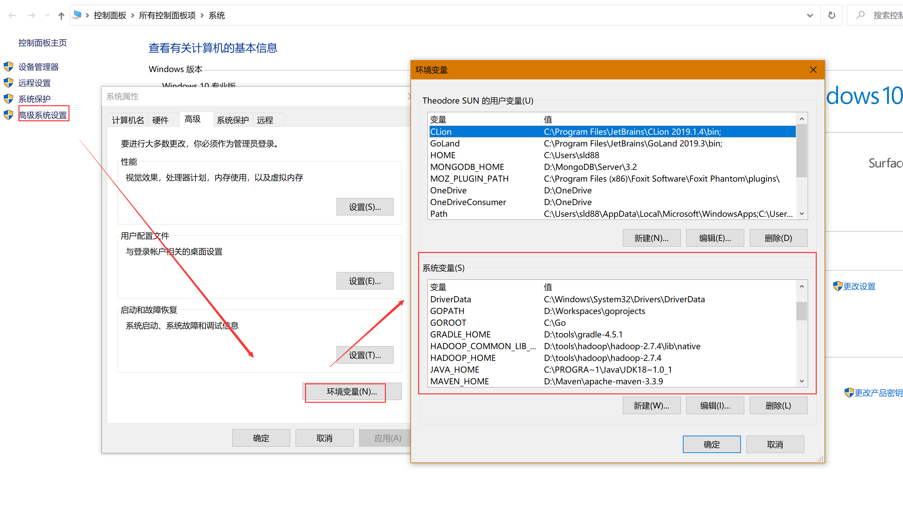
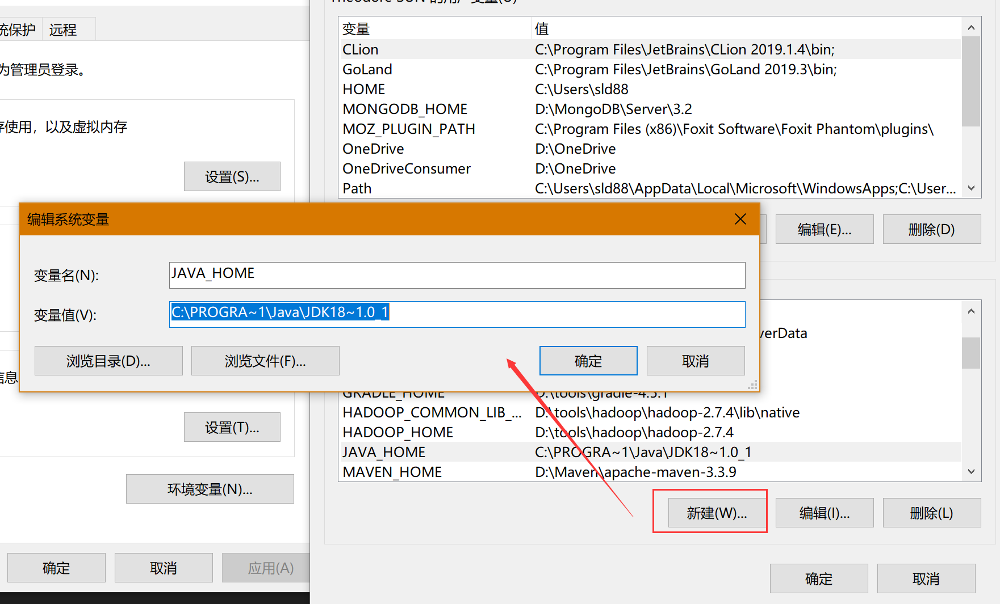
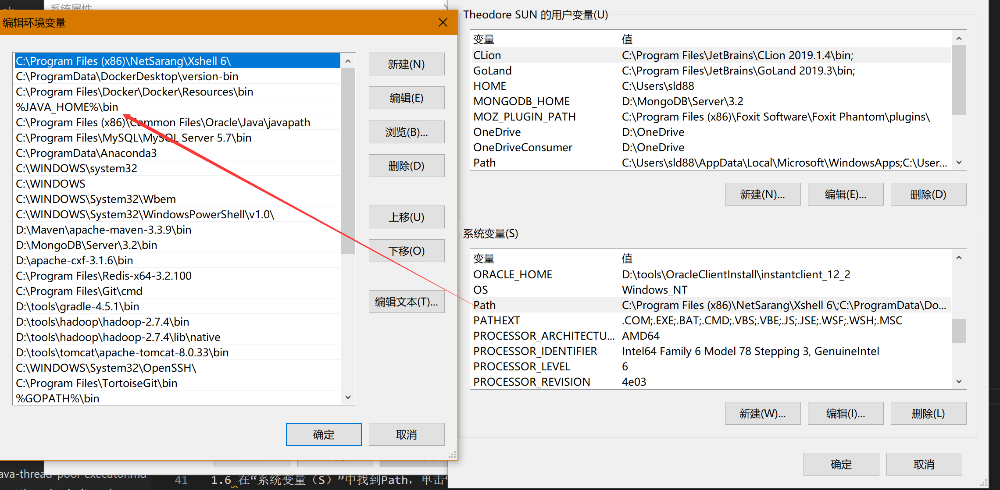

## Windows版本

### 版本说明

1. 操作系统版本：Window10 X64，其他操作系统类似
2. JDK版本：jdk1.8.0_192，安装后目录：`C:\Program Files\Java\jdk1.8.0_192`
<!--more-->

### 配置步骤

1. 打开环境变量配置页面
   

2. 在环境变量中新建`JAVA_HOME`,输入实际地址`C:\Program Files\Java\jdk1.8.0_192`

3. 修改Path：找到Path点击编辑打开编辑页面，在编辑页面中新增JDK的相关配置`%JAVA_HOME%\bin`

4. 增加classpath，输入为`.;%JAVA_HOME%\lib;%JAVA_HOME%\lib\tools.jar`

5. 配置完成之后保存，并且关闭环境变量配置的相关窗口

### 测试

重新打开cmd窗口输入`java`和`java`显示出对应的信息，则表示配置成功。

## Linux版本
