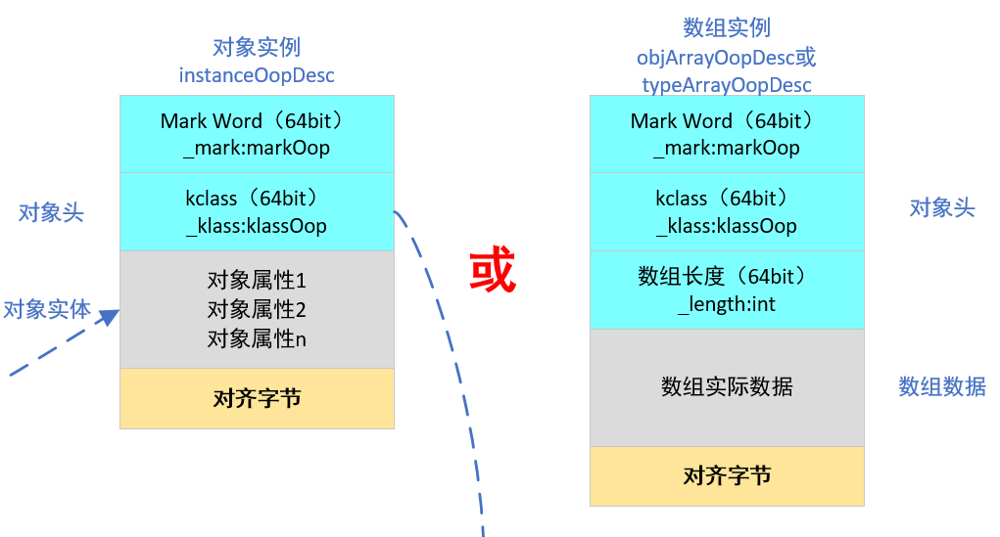
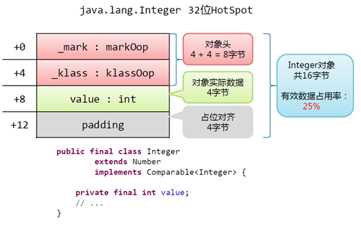
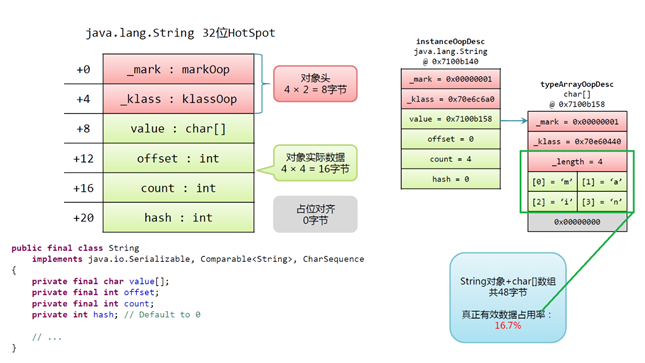

## 对象的创建

## 对象的内存布局

在HotSpot虚拟机中，对象在内存中存储的布局可以分为3块区域：对象头（Header）、实例数据（Instance Data）和对齐填充（Padding）。
<div align=center>



</div>

<!--more-->

### 对象头

Object Header（64或96bit）,包括：Mark Word（32bit）、Klass World（32bits）、array length（32bits，存在数据组对象时）

#### Markword

在HotSpot中，GC堆上的对象需要维持一些状态信息，具体如下：
1. unused：表示未使用
2. 身份哈希码（identity hash code），采用延迟加载技术。调用`System.identityHashCode()`计算后会写入对象头中。当对象加锁后（偏向、轻量级、重量级），MarkWord的字节没有足够的空间保存hashCode，因此该值会移动到管程Monitor中。
3. 当前是否已被GC标记（只在GC过程中需要）
4. 当前对象年龄（经历GC的次数，最大15）这就是-XX:MaxTenuringThreshold选项最大值为15的原因
5. biased_lock：对象是否启用偏向锁标记，只占1个二进制位
6. lock：2位的锁状态标记位

<style type="text/css">
.tg  {border-collapse:collapse;border-color:#bbb;border-spacing:0;}
.tg td{background-color:#E0FFEB;border-color:#bbb;border-style:solid;border-width:1px;color:#594F4F;
  font-family:Arial, sans-serif;font-size:14px;overflow:hidden;padding:10px 5px;word-break:normal;}
.tg th{background-color:#9DE0AD;border-color:#bbb;border-style:solid;border-width:1px;color:#493F3F;
  font-family:Arial, sans-serif;font-size:14px;font-weight:normal;overflow:hidden;padding:10px 5px;word-break:normal;}
.tg .tg-0lax{text-align:left;vertical-align:top}
.tg .tg-sjuo{background-color:#C2FFD6;text-align:left;vertical-align:top}
</style>
<table class="tg">
<thead>
  <tr>
    <th class="tg-0lax">&nbsp;&nbsp;&nbsp;&nbsp;状态&nbsp;&nbsp;&nbsp;&nbsp;</th>
    <th class="tg-0lax">&nbsp;&nbsp;&nbsp;&nbsp;标志位&nbsp;&nbsp;&nbsp;&nbsp;</th>
    <th class="tg-0lax">&nbsp;&nbsp;&nbsp;&nbsp;存储内容&nbsp;&nbsp;&nbsp;&nbsp;</th>
  </tr>
</thead>
<tbody>
  <tr>
    <td class="tg-sjuo">&nbsp;&nbsp;&nbsp;未锁定&nbsp;&nbsp;&nbsp;</td>
    <td class="tg-sjuo">&nbsp;&nbsp;&nbsp;01&nbsp;&nbsp;&nbsp;</td>
    <td class="tg-sjuo">&nbsp;&nbsp;&nbsp;对象哈希码、对象分代年龄&nbsp;&nbsp;&nbsp;</td>
  </tr>
  <tr>
    <td class="tg-0lax">&nbsp;&nbsp;&nbsp;轻量级锁定&nbsp;&nbsp;&nbsp;</td>
    <td class="tg-0lax">&nbsp;&nbsp;&nbsp;00&nbsp;&nbsp;&nbsp;</td>
    <td class="tg-0lax">&nbsp;&nbsp;&nbsp;指向锁记录的指针&nbsp;&nbsp;&nbsp;</td>
  </tr>
  <tr>
    <td class="tg-sjuo">&nbsp;&nbsp;&nbsp;膨胀(重量级锁定)&nbsp;&nbsp;&nbsp;</td>
    <td class="tg-sjuo">&nbsp;&nbsp;&nbsp;10&nbsp;&nbsp;&nbsp;</td>
    <td class="tg-sjuo">&nbsp;&nbsp;&nbsp;执行重量级锁定的指针&nbsp;&nbsp;&nbsp;</td>
  </tr>
  <tr>
    <td class="tg-0lax">&nbsp;&nbsp;&nbsp;GC标记&nbsp;&nbsp;&nbsp;</td>
    <td class="tg-0lax">&nbsp;&nbsp;&nbsp;11&nbsp;&nbsp;&nbsp;</td>
    <td class="tg-0lax">&nbsp;&nbsp;&nbsp;空(不需要记录信息)&nbsp;&nbsp;&nbsp;</td>
  </tr>
  <tr>
    <td class="tg-sjuo">&nbsp;&nbsp;&nbsp;可偏向&nbsp;&nbsp;&nbsp;</td>
    <td class="tg-sjuo">&nbsp;&nbsp;&nbsp;01&nbsp;&nbsp;&nbsp;</td>
    <td class="tg-sjuo">&nbsp;&nbsp;&nbsp;偏向线程ID、偏向时间戳、对象分代年龄&nbsp;&nbsp;&nbsp;</td>
  </tr>
</tbody>
</table>

7. 最近持有该对象锁的线程ID（用于偏向锁）
8. epoch：偏向锁的时间戳
9. ptr_to_lock_record：轻量级锁状态下，指向栈中锁记录的指针。
10. ptr_to_heavyweight_monitor：重量级锁状态下，指向对象监视器Monitor的指针。

##### 32位虚拟机markword

<style type="text/css">
.tg  {border-collapse:collapse;border-spacing:0;}
.tg td{border-color:black;border-style:solid;border-width:1px;font-family:Arial, sans-serif;font-size:14px;
  overflow:hidden;padding:10px 5px;word-break:normal;}
.tg th{border-color:black;border-style:solid;border-width:1px;font-family:Arial, sans-serif;font-size:14px;
  font-weight:normal;overflow:hidden;padding:10px 5px;word-break:normal;}
.tg .tg-baqh{text-align:center;vertical-align:top}
.tg .tg-29iq{background-color:#FFFFC7;text-align:center;vertical-align:top}
.tg .tg-fw9x{background-color:#96FFFB;text-align:left;vertical-align:top}
</style>
<table class="tg">
<thead>
  <tr>
    <th class="tg-fw9x" rowspan="3">锁状态</th>
    <th class="tg-29iq" colspan="5">32bit</th>
  </tr>
  <tr>
    <td class="tg-29iq" colspan="2">25bit</td>
    <td class="tg-29iq">4bit</td>
    <td class="tg-29iq">1bit</td>
    <td class="tg-29iq">2bit</td>
  </tr>
  <tr>
    <td class="tg-29iq">23bit</td>
    <td class="tg-29iq">2bit</td>
    <td class="tg-29iq">age</td>
    <td class="tg-29iq">偏向模式</td>
    <td class="tg-29iq">标志位</td>
  </tr>
</thead>
<tbody>
  <tr>
    <td class="tg-fw9x">未锁定</td>
    <td class="tg-baqh" colspan="2">对象哈希码（25）</td>
    <td class="tg-baqh">分代年龄</td>
    <td class="tg-baqh">0</td>
    <td class="tg-baqh">01</td>
  </tr>
  <tr>
    <td class="tg-fw9x">轻量级锁<br>自旋锁<br>无锁</td>
    <td class="tg-baqh" colspan="4">指向调用栈中锁记录指针（Lock Record）<br>ptr_to_lock_record(30)</td>
    <td class="tg-baqh">00</td>
  </tr>
  <tr>
    <td class="tg-fw9x">重量级锁定<br>（锁碰撞）</td>
    <td class="tg-baqh" colspan="4">指向互斥量（重量级锁）的指针<br>ptr_to_heavyweigth_monitor(30)</td>
    <td class="tg-baqh">10</td>
  </tr>
  <tr>
    <td class="tg-fw9x">GC标记</td>
    <td class="tg-baqh" colspan="4">空（30，CMS过程中用到的标记信息）</td>
    <td class="tg-baqh">11</td>
  </tr>
  <tr>
    <td class="tg-fw9x">可偏向</td>
    <td class="tg-baqh">当前线程指针JavaThread*（23）</td>
    <td class="tg-baqh">Epoch</td>
    <td class="tg-baqh">分代年龄</td>
    <td class="tg-baqh">1</td>
    <td class="tg-baqh">01</td>
  </tr>
</tbody>
</table>

##### 64位虚拟机markword

<style type="text/css">
.tg  {border-collapse:collapse;border-spacing:0;}
.tg td{border-color:black;border-style:solid;border-width:1px;font-family:Arial, sans-serif;font-size:14px;
  overflow:hidden;padding:10px 5px;word-break:normal;}
.tg th{border-color:black;border-style:solid;border-width:1px;font-family:Arial, sans-serif;font-size:14px;
  font-weight:normal;overflow:hidden;padding:10px 5px;word-break:normal;}
.tg .tg-mukq{background-color:#96FFFB;border-color:inherit;text-align:left;vertical-align:top}
.tg .tg-c3ow{border-color:inherit;text-align:center;vertical-align:top}
.tg .tg-hafo{background-color:#fffc9e;border-color:inherit;text-align:center;vertical-align:top}
</style>
<table class="tg">
<thead>
  <tr>
    <th class="tg-mukq" rowspan="3">锁状态</th>
    <th class="tg-hafo" colspan="7">64bit</th>
  </tr>
  <tr>
    <td class="tg-hafo" colspan="3">56bit</td>
    <td class="tg-hafo">1bit</td>
    <td class="tg-hafo">4bit</td>
    <td class="tg-hafo">1bit</td>
    <td class="tg-hafo">2bit</td>
  </tr>
  <tr>
    <td class="tg-hafo">25bit</td>
    <td class="tg-hafo">29bit</td>
    <td class="tg-hafo">2bit</td>
    <td class="tg-hafo">1bit</td>
    <td class="tg-hafo">age</td>
    <td class="tg-hafo">偏向模式</td>
    <td class="tg-hafo">标志位</td>
  </tr>
</thead>
<tbody>
  <tr>
    <td class="tg-mukq">未锁定</td>
    <td class="tg-c3ow">unused</td>
    <td class="tg-c3ow" colspan="2">对象哈希码（31）</td>
    <td class="tg-c3ow">unused</td>
    <td class="tg-c3ow">分代年龄</td>
    <td class="tg-c3ow">0</td>
    <td class="tg-c3ow">01</td>
  </tr>
  <tr>
    <td class="tg-mukq">轻量级锁<br>自旋锁<br>无锁</td>
    <td class="tg-c3ow" colspan="6">指向调用栈中锁记录指针（Lock Record）<br>ptr_to_lock_record(62)</td>
    <td class="tg-c3ow">00</td>
  </tr>
  <tr>
    <td class="tg-mukq">重量级锁定<br>（锁碰撞）</td>
    <td class="tg-c3ow" colspan="6">指向互斥量（重量级锁）的指针<br>ptr_to_heavyweigth_monitor(62)</td>
    <td class="tg-c3ow">10</td>
  </tr>
  <tr>
    <td class="tg-mukq">GC标记</td>
    <td class="tg-c3ow" colspan="6">空（CMS过程中用到的标记信息）</td>
    <td class="tg-c3ow">11</td>
  </tr>
  <tr>
    <td class="tg-mukq">可偏向</td>
    <td class="tg-c3ow" colspan="2">当前线程指针JavaThread*（54）</td>
    <td class="tg-c3ow">Epoch（2）</td>
    <td class="tg-c3ow">unused</td>
    <td class="tg-c3ow">分代年龄</td>
    <td class="tg-c3ow">1</td>
    <td class="tg-c3ow">01</td>
  </tr>
</tbody>
</table>

#### klass

对象头的另外一部分是klass类型指针，即对象指向它的类元数据的指针，虚拟机通过这个指针来确定这个对象是哪个类的实例.
1. 在Hotspot中，所有存储在由GC管理的堆（Java堆和PermGen）的子类的实例都有一个_klass字段，用于指向一个描述自身的元数据的对象
2. Java对象和数组对象的klass并不是Java中的Class。klass用于运行而Class只用于Java中的反射；klass中有_java_mirror字段执行java中的class
3. 可压缩：每个Class的属性指针（即静态变量）、每个对象的属性指针（即对象变量）、普通对象数组的每个元素指针
4. 不可压缩：比如指向Metaspace的Class对象指针(JDK8中指向元空间的Class对象指针)、本地变量、堆栈元素、入参、返回值和NULL指针等

#### 数组长度（只有数组对象有）

如果对象是一个数组, 那在对象头中还必须有一块数据用于记录数组长度.

### 实例数据

1. 实例数据部分是对象真正存储的有效信息，也是在程序代码中所定义的各种类型的字段内容。无论是从父类继承下来的，还是在子类中定义的，都需要记录起来。
2. 在Hotspot中对象实例数据紧跟在对象头后面分配空间
3. 字段的分配顺序与代码中的顺序和Hotspot的分配策略相关
4. 无论哪种策略都必须满足
   - 宽度相同的字段总是相邻分配
   - 不同宽度的字段可能存在对象填充（padding）
5. 一般是基类声明的实例字段会出现在派生类声明字段之前，但是如果开启压缩模式时派生类较短的字段可能会插入到基类的实例字段之间的对齐填充部分
6. 相关参数，参考FieldsAllocationStyle、CompactFields


###	对齐填充

1. 对齐填充并不是必然存在的，也没有特别的含义，它仅仅起着占位符的作用。
2. 在Hotspot中，GC堆上的对象要求**起始地址是8的倍数，占用的空间也必须是8的倍数**，如果不足则用0补齐
3. 对齐可能出现不同宽度的字段之间，也可能出现在对象的末尾
4. 不存在为对齐数据时则不会对齐填充
5. **对象头部分正好是8字节的倍数**（1倍或者2倍）
6. 对象实例数据部分没有对齐时，就需要通过对齐填充来补全

## 对象大小计算

1. 在32位系统下，存放Class指针的空间大小是4字节,MarkWord是4字节，对象头为8字节。
2. 在64位系统下，存放Class指针的空间大小是8字节,MarkWord是8字节，对象头为16字节。
3. 64位压缩，
   - 对象：存放Class指针的空间大小是4字节，MarkWord是8字节，对象头为12字节+对齐4=16字节。 
   - 数组：MarkWord是8字节+存放Class指针的空间大小是4字节+数组长度4字节=16字节。
4. 静态属性不算在对象大小内。

<div align=center>



</div>

<div align=center>



</div>

## 对象分析工具JOL

### maven

```xml
    <dependency>
      <groupId>org.openjdk.jol</groupId>
      <artifactId>jol-core</artifactId>
      <version>0.9</version>
    </dependency>
```

### 虚拟机信息

```java
package com.sunld.jvm;

import org.openjdk.jol.info.ClassLayout;
import org.openjdk.jol.vm.VM;

public class Test {

    public static void main(String[] args) {
        //返回有关当前 VM 模式的信息详细信息
        //ClassLayout:class的内存内存布局
        //parseInstance:表示解析传入的对象
        //toPrintable:表示转换为一种可输出的格式打印
        System.out.println(VM.current().details());
    }
}

```

结果输出：

```java
# WARNING: Unable to attach Serviceability Agent. You can try again with escalated privileges. Two options: a) use -Djol.tryWithSudo=true to try with sudo; b) echo 0 | sudo tee /proc/sys/kernel/yama/ptrace_scope
# Running 64-bit HotSpot VM.
# Using compressed oop with 3-bit shift.
# Using compressed klass with 3-bit shift.
# WARNING | Compressed references base/shifts are guessed by the experiment!
# WARNING | Therefore, computed addresses are just guesses, and ARE NOT RELIABLE.
# WARNING | Make sure to attach Serviceability Agent to get the reliable addresses.
# Objects are 8 bytes aligned.
# Field sizes by type: 4, 1, 1, 2, 2, 4, 4, 8, 8 [bytes]
# Array element sizes: 4, 1, 1, 2, 2, 4, 4, 8, 8 [bytes]
```

1. 第一行表示警告信息，可以忽略
2. 第二行表示使用的虚拟机是64位
3. 第三行表示启用普通对象指针压缩，即-XX:+UseCompressedOops
4. 第四行表示启用类型指针压缩，即-XX:+UseCompressedClassPointers开启参数
5. 第八行：对象的大小必须8bytes对齐。
6. 第九行：表示字段类型的指针长度（bytes），依次为引用句柄（对象指针），byte, boolean, char, short, int, float, double, long类型。
7. 第十行：表示数组类型的指针长度（bytes），依次为引用句柄（对象指针），byte, boolean, char, short, int, float, double, long类型。

### 普通对象信息

#### 参考代码

```java
package com.sunld.jvm;

import org.openjdk.jol.info.ClassLayout;

public class Test {

    public static void main(String[] args) {
        System.out.println("----------- obj1 details ------------");
        JoLObj  obj1 = new JoLObj();
        System.out.println(ClassLayout.parseInstance(obj1).toPrintable());
    }
}
class JoLObj{
    private boolean flag = false;
    private int number = 256;
    static int number_1 = 10;
    final int number_2 = 11;
    final static int number_3 = 12;
}


```

#### 输出结果

```java
com.sunld.jvm.JoLObj object internals:
 OFFSET  SIZE      TYPE DESCRIPTION                               VALUE
      0     4           (object header)                           01 00 00 00 (00000001 00000000 00000000 00000000) (1)
      4     4           (object header)                           00 00 00 00 (00000000 00000000 00000000 00000000) (0)
      8     4           (object header)                           43 c1 00 f8 (01000011 11000001 00000000 11111000) (-134168253)
     12     4       int JoLObj.number                             256
     16     4       int JoLObj.number_2                           11
     20     1   boolean JoLObj.flag                               false
     21     3           (loss due to the next object alignment)
Instance size: 24 bytes
Space losses: 0 bytes internal + 3 bytes external = 3 bytes total
```

#### 结果分析

1. 使用了64位vm，且进行了压缩
2. 对象头占用12个Byte。 （8个Byte的markword，和被压缩后的klasss point为4个Byte）
3. 对象实例9个Byte（int：4 + int：4 + boolean：1）
4. 对齐占用了3个字节（因为在64位虚拟机上对象的大小必须是Word字长的倍数，既8字节的倍数）
5. 静态变量不在对象头中

### hashcode分析

#### 参考代码

```java
package com.sunld.jvm;

import org.openjdk.jol.info.ClassLayout;

public class Test {

    public static void main(String[] args) {
        JoLObj  obj1 = new JoLObj();
        System.out.println("----------- before hash ------------");
        System.out.println(ClassLayout.parseInstance(obj1).toPrintable());
        System.out.println("obj1 hashcode is: " + Integer.toBinaryString(obj1.hashCode()));
        System.out.println("obj1 hashcode is: " + Integer.toHexString(obj1.hashCode()));
        System.out.println("----------- after hash ------------");
        System.out.println(ClassLayout.parseInstance(obj1).toPrintable());
    }
}
class JoLObj{
    private boolean flag = false;
    private int number = 256;
    static int number_1 = 10;
    final int number_2 = 11;
    final static int number_3 = 12;
}

```

#### 输出结果

```java
com.sunld.jvm.JoLObj object internals:
 OFFSET  SIZE      TYPE DESCRIPTION                               VALUE
      0     4           (object header)                           01 00 00 00 (00000001 00000000 00000000 00000000) (1)
      4     4           (object header)                           00 00 00 00 (00000000 00000000 00000000 00000000) (0)
      8     4           (object header)                           43 c1 00 f8 (01000011 11000001 00000000 11111000) (-134168253)
     12     4       int JoLObj.number                             256
     16     4       int JoLObj.number_2                           11
     20     1   boolean JoLObj.flag                               false
     21     3           (loss due to the next object alignment)
Instance size: 24 bytes
Space losses: 0 bytes internal + 3 bytes external = 3 bytes total

obj1 hashcode is: 100100001101111100011011011100
obj1 hashcode is: 2437c6dc
----------- after hash ------------
com.sunld.jvm.JoLObj object internals:
 OFFSET  SIZE      TYPE DESCRIPTION                               VALUE
      0     4           (object header)                           01 dc c6 37 (00000001 11011100 11000110 00110111) (935779329)
      4     4           (object header)                           24 00 00 00 (00100100 00000000 00000000 00000000) (36)
      8     4           (object header)                           43 c1 00 f8 (01000011 11000001 00000000 11111000) (-134168253)
     12     4       int JoLObj.number                             256
     16     4       int JoLObj.number_2                           11
     20     1   boolean JoLObj.flag                               false
     21     3           (loss due to the next object alignment)
Instance size: 24 bytes
Space losses: 0 bytes internal + 3 bytes external = 3 bytes total
```

#### 结果分析

<style type="text/css">
.tg  {border-collapse:collapse;border-spacing:0;}
.tg td{border-color:black;border-style:solid;border-width:1px;font-family:Arial, sans-serif;font-size:14px;
  overflow:hidden;padding:10px 5px;word-break:normal;}
.tg th{border-color:black;border-style:solid;border-width:1px;font-family:Arial, sans-serif;font-size:14px;
  font-weight:normal;overflow:hidden;padding:10px 5px;word-break:normal;}
.tg .tg-0lax{text-align:left;vertical-align:top}
</style>
<table class="tg">
<thead>
  <tr>
    <th class="tg-0lax"></th>
    <th class="tg-0lax">对象markword（小端）</th>
  </tr>
</thead>
<tbody>
  <tr>
    <td class="tg-0lax">计算hashcode前</td>
    <td class="tg-0lax">00000001 00000000 00000000 00000000 00000000 00000000 00000000 00000000</td>
  </tr>
  <tr>
    <td class="tg-0lax">计算hashcode后</td>
    <td class="tg-0lax">00000001 11011100 11000110 00110111 00100100 00000000 00000000 00000000</td>
  </tr>
</tbody>
</table>

<style type="text/css">
.tg  {border-collapse:collapse;border-spacing:0;}
.tg td{border-color:black;border-style:solid;border-width:1px;font-family:Arial, sans-serif;font-size:14px;
  overflow:hidden;padding:10px 5px;word-break:normal;}
.tg th{border-color:black;border-style:solid;border-width:1px;font-family:Arial, sans-serif;font-size:14px;
  font-weight:normal;overflow:hidden;padding:10px 5px;word-break:normal;}
.tg .tg-0lax{text-align:left;vertical-align:top}
</style>
<table class="tg">
<thead>
  <tr>
    <th class="tg-0lax"></th>
    <th class="tg-0lax">对象markword（大端）</th>
  </tr>
</thead>
<tbody>
  <tr>
    <td class="tg-0lax">计算hashcode前</td>
    <td class="tg-0lax">00000000 00000000 00000000 00000000 00000000 00000000 00000000 00000001</td>
  </tr>
  <tr>
    <td class="tg-0lax">计算hashcode后</td>
    <td class="tg-0lax">00000000 00000000 00000000 00100100 00110111 11000110 11011100 00000001</td>
  </tr>
</tbody>
</table>

1. 在未计算hashcode之前，markword中默认都是0，计算之后保存到对象头的markword中
2. 25bit表示unused
3. 31bit表示hashcode：0100100 00110111 11000110 11011100
4. 4bit（0000）表示age， GC中分代年龄。由于age只有4位，所以最大值为15
5. 1个bit为：biased_lock，值为0，表示无偏向锁（计算hashcode后不在使用偏向锁）
6. 2个bit为：lock状态，值为01，表示未锁定

### age变化

#### 参考代码

```java
package com.sunld.jvm;

import org.openjdk.jol.info.ClassLayout;

import java.nio.ByteOrder;

public class Test {

    public static void main(String[] args) {
        System.out.println("nativeOrder:" + ByteOrder.nativeOrder()); //查看当前JVM使用字节序是大端、小端。
        JoLObj  obj1 = new JoLObj();
        System.out.println("----------- before gc ------------");
        System.out.println(ClassLayout.parseInstance(obj1).toPrintable());
        System.gc(); // 人工发起GC
        System.out.println("----------- after GC ------------");
        System.out.println(ClassLayout.parseInstance(obj1).toPrintable());
    }
}
class JoLObj{
    private boolean flag = false;
    private int number = 256;
    static int number_1 = 10;
    final int number_2 = 11;
    final static int number_3 = 12;
}

```

#### 输出结果

```java
com.sunld.jvm.JoLObj object internals:
 OFFSET  SIZE      TYPE DESCRIPTION                               VALUE
      0     4           (object header)                           01 00 00 00 (00000001 00000000 00000000 00000000) (1)
      4     4           (object header)                           00 00 00 00 (00000000 00000000 00000000 00000000) (0)
      8     4           (object header)                           43 c1 00 f8 (01000011 11000001 00000000 11111000) (-134168253)
     12     4       int JoLObj.number                             256
     16     4       int JoLObj.number_2                           11
     20     1   boolean JoLObj.flag                               false
     21     3           (loss due to the next object alignment)
Instance size: 24 bytes
Space losses: 0 bytes internal + 3 bytes external = 3 bytes total

----------- after GC ------------
com.sunld.jvm.JoLObj object internals:
 OFFSET  SIZE      TYPE DESCRIPTION                               VALUE
      0     4           (object header)                           09 00 00 00 (00001001 00000000 00000000 00000000) (9)
      4     4           (object header)                           00 00 00 00 (00000000 00000000 00000000 00000000) (0)
      8     4           (object header)                           43 c1 00 f8 (01000011 11000001 00000000 11111000) (-134168253)
     12     4       int JoLObj.number                             256
     16     4       int JoLObj.number_2                           11
     20     1   boolean JoLObj.flag                               false
     21     3           (loss due to the next object alignment)
Instance size: 24 bytes
Space losses: 0 bytes internal + 3 bytes external = 3 bytes total
```

#### 结果分析

可以看到大端的最后一个字节数据：从00000001变成了00001001，既age增加了1

### 其他

关于锁的对象头分析请参考<a href="https://www.sunliaodong.cn/2021/02/08/Java%E5%B9%B6%E5%8F%91%E7%BC%96%E7%A8%8B%E4%B9%8B%E9%94%81/" target="_blank">java并发编程之锁</a>

## 对象的定位

参考：<a href="https://www.sunliaodong.cn/2021/02/05/JVM%E5%86%85%E5%AD%98%E5%8C%BA%E5%9F%9F/" target="_blank">JVM内存区域</a>

### HotSpot对象模型

HotSpot中采用了**OOP-Klass**模型，它是描述Java对象实例的模型，它分为两部分：

1. 类加载到内存时封装为**klass**，klass包含类的元数据信息（比如类的方法、常量池等信息，类似于java.lang.Class对象）
2. **OOP（Ordinary Object Pointer）** ：普通对象指针，包含MarkWord（存储当前指针指向的对象运行时的一些状态数据） 和元数据指针（指向klass，表示使用的对象类型）

> HotSopt JVM的设计者把对象模型拆成**klass和oop**，其中oop中不含有任何虚函数，而klass就含有虚函数表，可以进行method dispatch。
> HotSpot中，OOP-Klass实现的代码都在/hotspot/src/share/vm/oops/路径下，oop的实现为**instanceOop 和 arrayOop**，他们来描述对象头，其中arrayOop对象用于描述数组类型。

以下就是oop.hhp文件中oopDesc的源码，可以看到两个变量_mark就是MarkWord，_metadata就是元数据指针，指向klass对象，这个指针压缩的是32位，未压缩的是64位；

```c
volatile markOop _mark; // 标识运行时数据
union _metadata {
  Klass* _klass;
  narrowKlass _compressed_klass;
} _metadata; //klass指针
```

一个Java对象在内存中的布局可以连续分成两部分：instanceOop（继承自oop.hpp）和实例数据；通过栈帧中的对象引用reference找到Java堆中的对象，再通过对象的**instanceOop中的元数据指针klass来找到方法区中的instanceKlass**，从而确定该对象的类型。执行过程：
1. **类加载**：在JVM内部创建一个instanceKlass对象表示这个类的运行时元数据（类似Class对象）
2. **初始化对象的时候**（执行invokespecial ***::），JVM就会创建一个instanceOopDesc对象表示这个对象的实例，然后进行Mark Word的填充，将元数据指针指向Klass对象，并填充实例变量。
3. 元数据—— instanceKlass 对象会存在元空间（方法区）
4. 对象实例—— instanceOopDesc 会存在Java堆。Java虚拟机栈中会存有这个对象实例的引用。

###	成员变量重排序

为了提高性能，每个对象的起始地址都对齐于8字节，当封装对象的时候为了高效率，对象字段声明的顺序会被重排序成下列基于字节大小的顺序：

1. double (8字节) 和 long (8字节)
2. int (4字节) 和 float (4字节)
3. short (2字节) 和 char (2字节)：char在java中是2个字节。java采用unicode，2个字节（16位）来表示一个字符。
4. boolean (1字节) 和 byte (1字节)
5. reference引用 (4/8 字节)
6. <子类字段重复上述顺序>

我们可以测试一下java对不同类型的重排序，使用jdk1.8，采用反射的方式先获取到unsafe类，然后获取到每个field在类里面的偏移地址，就能看出来了
测试代码如下：

```java
package com.sunld.jvm;

import sun.misc.Contended;
import sun.misc.Unsafe;

import java.lang.reflect.Field;

public class TypeSequence {

    @Contended
    private boolean contended_boolean;

    private volatile byte a;
    private volatile boolean b;

    @Contended
    private int contended_short;

    private volatile char d;
    private volatile short c;


    private volatile int e;
    private volatile float f;

    @Contended
    private int contended_int;

    @Contended
    private double contended_double;

    private volatile double g;
    private volatile long h;

    public static  Unsafe UNSAFE;

    static {
        try {
            @SuppressWarnings("ALL")
            Field theUnsafe = Unsafe.class.getDeclaredField("theUnsafe");
            theUnsafe.setAccessible(true);
            UNSAFE = (Unsafe) theUnsafe.get(null);
        } catch (Exception e) {
            e.printStackTrace();
        }
    }

    public static void main(String[] args) throws NoSuchFieldException, SecurityException{
        System.out.println("e:int    \t"+UNSAFE.objectFieldOffset(TypeSequence.class.getDeclaredField("e")));
        System.out.println("g:double \t"+UNSAFE.objectFieldOffset(TypeSequence.class.getDeclaredField("g")));
        System.out.println("h:long   \t"+UNSAFE.objectFieldOffset(TypeSequence.class.getDeclaredField("h")));
        System.out.println("f:float  \t"+UNSAFE.objectFieldOffset(TypeSequence.class.getDeclaredField("f")));
        System.out.println("c:short  \t"+UNSAFE.objectFieldOffset(TypeSequence.class.getDeclaredField("c")));
        System.out.println("d:char   \t"+UNSAFE.objectFieldOffset(TypeSequence.class.getDeclaredField("d")));
        System.out.println("a:byte   \t"+UNSAFE.objectFieldOffset(TypeSequence.class.getDeclaredField("a")));
        System.out.println("b:boolean\t"+UNSAFE.objectFieldOffset(TypeSequence.class.getDeclaredField("b")));


        System.out.println("contended_boolean:boolean\t"+UNSAFE.objectFieldOffset(TypeSequence.class.getDeclaredField("contended_boolean")));
        System.out.println("contended_short:short\t"+UNSAFE.objectFieldOffset(TypeSequence.class.getDeclaredField("contended_short")));
        System.out.println("contended_int:int\t"+UNSAFE.objectFieldOffset(TypeSequence.class.getDeclaredField("contended_int")));
        System.out.println("contended_double:double\t"+UNSAFE.objectFieldOffset(TypeSequence.class.getDeclaredField("contended_double")));
    }
}
```

以上代码运行结果如下:

```java
e:int    	40
g:double 	24
h:long   	32
f:float  	44
c:short  	54
d:char   	52
a:byte   	57
b:boolean	58
contended_boolean:boolean	56
contended_short:short	12
contended_int:int	48
contended_double:double	16

```

除了int字段跑到了前面来了，还有两个添加了contended注解的字段外，其它字段都是按照重排序的顺序，类型由最长到最短的顺序排序的；

#### 对象头对成员变量排序的影响

有的童鞋疑惑了，为啥int跑到前面来了呢？这是因为int字段被提升到前面填充对象头了，对象头有12个字节，会优先在字段中选择一个或多个能够将对象头填充为16个字节的field放到前面，如果填充不满，就加上padding，上面的例子加上一个4字节的int，正好是16字节，地址按8字节对齐；

#### 扩展contended对成员变量排序的影响

1. 解决cpu缓存行伪共享问题的
2. 加了contended注解的字段会按照声明的顺序放到末尾，contended注解如果是用在类的field上会在该field前面插入128字节的padding，如果是用在类上则会在类所有field的前后都加上128字节的padding

### ObjectMonitor对象（每个对象都具备jdk1.8）

objectMonitor.hpp

```c
ObjectMonitor() {
    _header       = NULL;
    _count        = 0;     // 重入次数
    _waiters      = 0,     // 等待线程数
    _recursions   = 0;
    _object       = NULL;
    _owner        = NULL;  // 当前持有锁的线程
    _WaitSet      = NULL;  // 调用wait方法的线程被阻塞放置在这里
    _WaitSetLock  = 0 ;
    _Responsible  = NULL ;
    _succ         = NULL ;
    _cxq          = NULL ;
    FreeNext      = NULL ;
    _EntryList    = NULL ; // 等待锁处于block的线程，才有资格成为候选资源的线程
    _SpinFreq     = 0 ;
    _SpinClock    = 0 ;
    OwnerIsThread = 0 ;
    _previous_owner_tid = 0;
  }
```

## 参考

1. [记一次生产频繁出现 Full GC 的 GC日志图文详解](https://www.toutiao.com/i6799522958990639628)
2. [openjdk](http://openjdk.java.net/)
3. [jol](https://github.com/openjdk/jol)
4. [Java对象头Object Header、偏向锁、轻量锁、重量锁研究](https://blog.csdn.net/zyplanke/article/details/106893992)
