## 知识图谱

<div align=center>

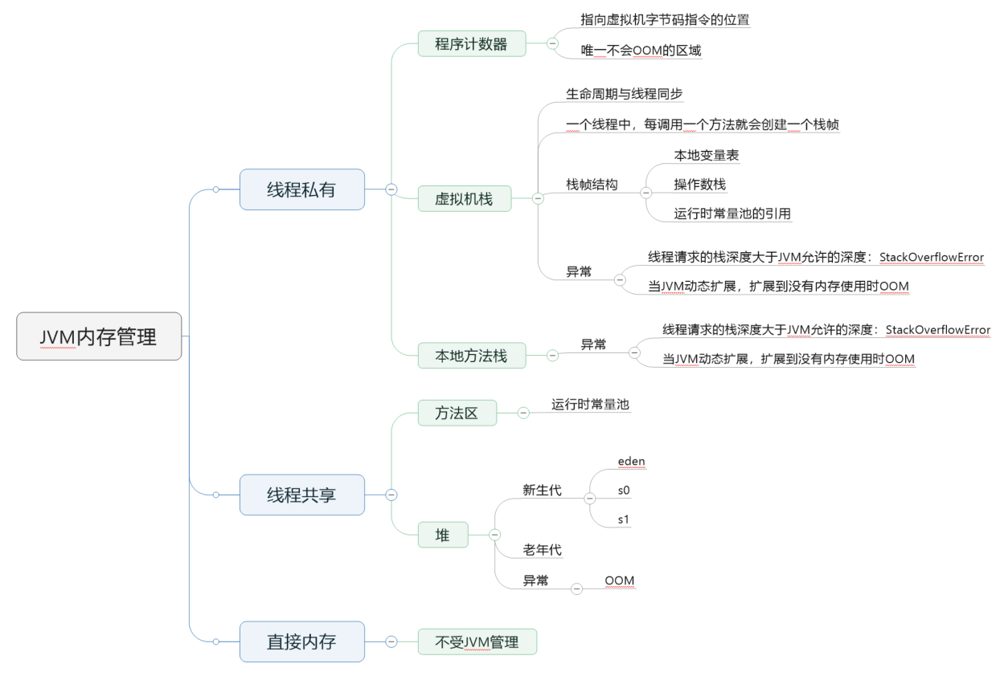

</div>

<!--more-->

## 总体介绍

1. JVM 内存区域主要分为线程私有区域【程序计数器、虚拟机栈、本地方法区】、线程共享区域【JAVA 堆、方法区】、直接内存。
2. 线程私有数据区域生命周期与线程相同, 依赖用户线程的启动/结束而创建/销毁，线程共享区域随虚拟机的启动/关闭而创建/销毁。
3. 直接内存并不是 JVM 运行时数据区的一部分, 但也会被频繁的使用（NIO，DirectByteBuffer）

<div align=center>

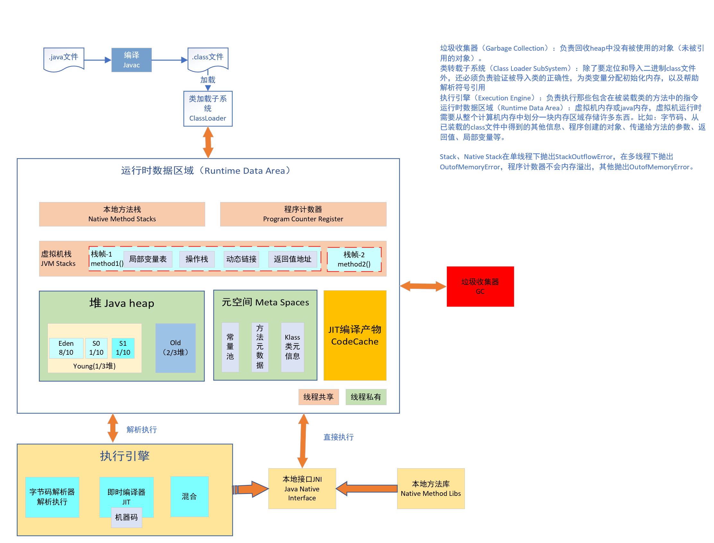

</div>

## 程序计数器(线程私有)

 由于JAVA的多线程是通过线程轮流切换分配处理时间的方式实现，为了保证能够恢复到线程的正确位置，每个线程再启动的时候都会创建**一块较小的内存区域**，这块区域是**线程隔离**的，生命周期同线程绑定，线程结束，则释放该内存区域，可以看作是当前线程所执行的字节码的行号子令器。  

**字节码子令器的工作模式是通过改变这个计数器的值来选取下一条需要执行的字节码指令，分支、循环、跳转、异常处理、线程恢复等基础功能都需要依赖这个计数器来完成。**  

计数器的大小是一个字长，因此既可以持有一个本地指针，又可以持有一个returnAddress。计数器中记录的内容根据方法类型就行划分，如果当前方法是java方法，这个计数器记录的是正在执行的虚拟机字节码指令的地址（可以是一个本地指针，也可以是在方法字节码中相对于该方法起始指令的偏移量）；如果方法是Native方法，这个计数器记录的内容则为Undefined。  

> Each thread of a running program has its own pc register, or program counter, which is created when the thread is started. The pc register is one word in size, so it can hold both a native pointer and a returnValue. As a thread executes a Java method, the pc register contains the address of the current instruction being executed by the thread. An “address” can be a native pointer or an offset from the beginning of a method’s bytecodes. If a thread is executing a native method, the value of the pc register is undefined.

**此内存区域是唯一一个在Java虚拟机规范中没有规定任何OutOfMemoryError情况的区域。**

### 程序计数器总结

1. 占用的 JVM 内存空间较小
2. 每个线程生命周期内独享自己的程序计数器（内部存放的是字节码指令的地址引用）
3. 不会发生 OOM

## 虚拟机栈(线程私有)

用于描述java方法执行的线程内存模型，每个方法被执行的时候线程都会在栈中创建一个栈帧（Stack Frame），用于存储局部变量表、操作数栈、动态链接、返回值等信息的数据集。生命周期与线程同步，每个方法从调用到执行完成就是一个栈帧在VM Stack中入栈出栈的过程。

<div align=center>

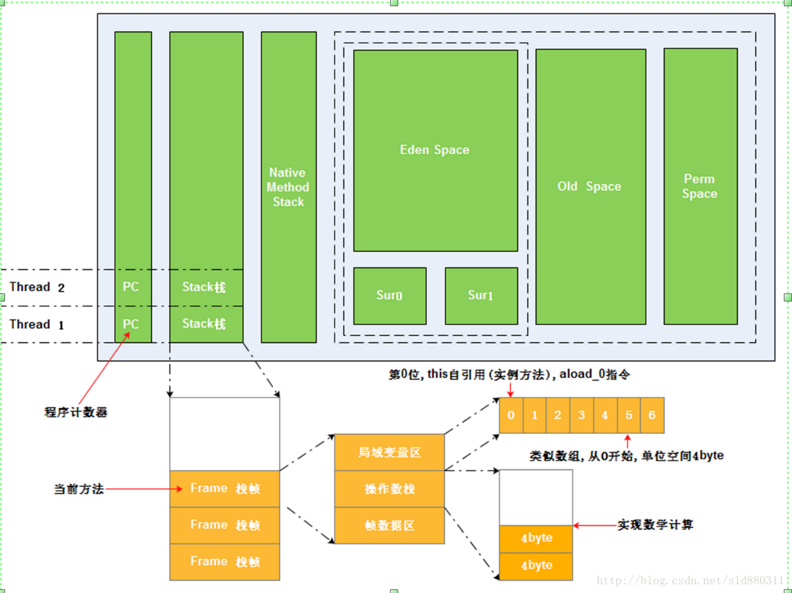


</div>
栈帧的数据结构：  

1. 局部变量表：输入参数和输出参数以及方法内的变量；
2. 操作数栈：记录出栈和入栈的操作；
3. 栈帧数据：包括类文件、方法等等。

### 局部变量表

可以理解为使用素组管理内存的方式，从0开始；存放编译期可知的Java基本类型（8种）、对象引用、入参信息以及出参信息（returnAddress）。

#### slot

局部变量表中存储空间以局部变量槽（Slot，32位）表示，局部变量表所需要的内存在编译阶段完成分配。64位的long和double使用两个slot。

#### 举例

```java
public static int runClassMethod(int i,long l,float f,double d,Object o,byte b) {
    return 0;
}
public int runInstanceMethod(char c,double d,short s,boolean b) {
    return 0;
}
```

<div align=center>

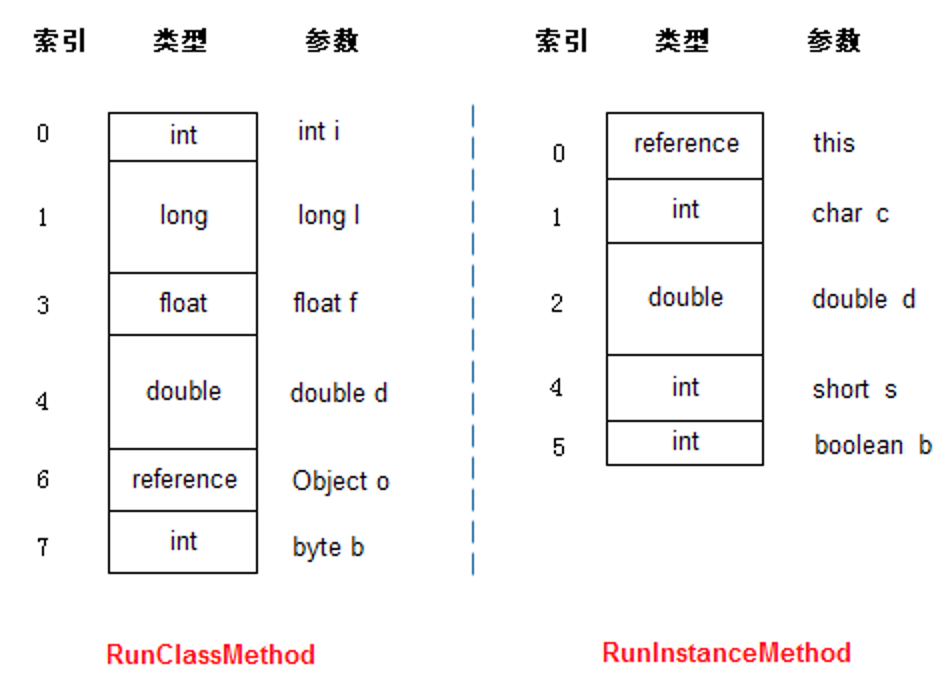

</div>

runInstanceMethod的局部变量区第一项是个reference（引用），它指定的就是对象本身的引用，也就是我们常用的this,但是在runClassMethod方法中，没这个引用，那是因为runClassMethod是个静态方法。

### 操作数栈

与局部变量表类似，组织成一个以字长为单位的数组。但是是使用出栈入栈的方式进行访问；操作数栈是临时数据的存储区域。

```java
int a= 100;
int b =5;
int c = a+b;
```

对应的操作数栈变化为：  

<div align=center>

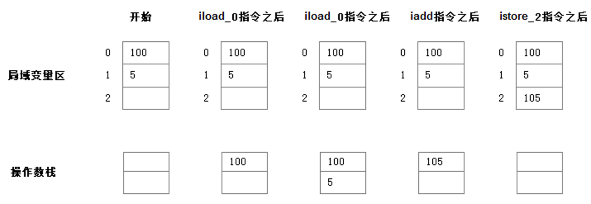

</div>

> JVM实现里，有一种基于栈的指令集(Hotspot，oracle JVM)，还有一种基于寄存器的指令集(DalvikVM，安卓 JVM)

### 帧数据区

帧数据区存放了指向常量池的指针地址，当某些指令需要获得常量池的数据时，通过帧数据区中的指针地址来访问常量池的数据。此外，帧数据区还存放方法正常返回和异常终止需要的一些数据。

### 异常情况

1. 如果线程请求的栈深度大于虚拟机所允许的深度，将抛出StackOverflowError异常。
2. 如果VM栈可以动态扩展，在初始化新线程时没有足够内存创建栈则抛出OutOfMemoryError异常。

### 虚拟机栈图解

<div align=center>

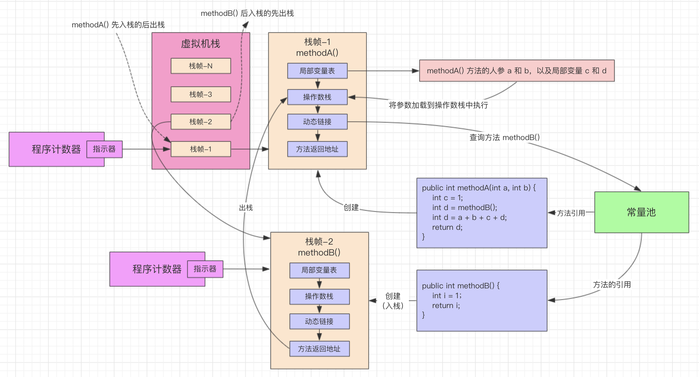

</div>

### 内存设置

```java
# -Xss ：用于设置栈的大小，栈的大小决定了方法调用的深度。
# 设置线程栈大小为 512k（以字节为单位）
-Xss 512k
```

### 虚拟机栈总结

1. 内部结构是栈帧，每个方法在执行的时候都会创建一个栈帧，用于存储局部变量表，操作数栈，动态链接，方法返回地址等信息
2. 某方法在调用另一个方法是通过动态链接在常量池中查询方法的引用，进而完成方法调用
3. 某方法在调用另一个方法的过程，即是一个栈帧在虚拟机中的入栈到出栈的过程
4. 虚拟机中的方法入栈的顺序和方法的调用顺序是一致的

## 本地方法栈(线程私有)

与Java Stack类似，主要区别是，Java Stack用于执行Java方法服务，本地方法栈用于native方法服务。
1. 和虚拟机栈类似，内部结构是栈帧，每个 Native 方法执行时创建一个栈帧
2. 该部分没有规定内存大小

### 实现方式

当调用一个native方法时，jvm使用c-linkage模型支持native调用，并且创建一个C栈，由于《Java虚拟机规范》没有对该实现有具体要求，所以不同厂商的实现方式不同，比如HotSpot VM 直接就把本地方法栈和虚拟机栈合二为一。它的具体做法是在本地方法栈中登记native方法，在执行引擎执行时加载Native Liberies。

## Java堆（Heap-线程共享）-运行时数据区

1. 线程共享区域
2. 存储对象和数组数据
3. 垃圾回收重点关注区域（内存最大的一块区域）
4. 从 GC 的角度还可以细分为:**新生代(Eden区、From Survivor区和To Survivor区)和老年代。**
5. 从分配内存的角度看，所有线程共享的Java堆中可以划分出多个线程私有的分配缓冲区（Thread LocalAllocation Buffer，TLAB），以提升对象分配时的效率。
6. 通过-Xmx和-Xms设置内存大小，内存溢出则出现OOM错误，最小默认为物理内存的1/64，最大为物理内存的1/4
7. 默认当空余堆内存小于40%时，JVM会增大Heap到-Xmx指定的大小，可通过-XX:MinHeapFreeRation=来指定这个比列；当空余堆内存大于70%时，JVM会减小heap的大小到-Xms指定的大小，可通过XX:MaxHeapFreeRation=来指定这个比列
8. 建议-Xmx和-Xms设置一致

<div align=center>


</div>

### 新生代

1. 存放新创建的对象
2. 占用堆的1/3空间
3. 回收机制：MinorGC
4. 划分Eden 区、ServivorFrom、ServivorTo 三个区。
5. 可通过-Xmn参数来指定新生代的大小，也可以通过-XX:SurvivorRation来调整Eden Space及Survivor Space的大小。

#### Eden 区

Java新对象的出生地（如果新创建的对象占用内存很大，则直接分配到老代）。当Eden区内存不够的时候就会触发MinorGC，对新生代区进行一次垃圾回收。

#### ServivorFrom

上一次 GC 的幸存者，作为这一次 GC 的被扫描者。

#### ServivorTo

保留了一次 MinorGC 过程中的幸存者。

#### MinorGC 的过程（复制->清空->互换）

1. MinorGC 采用复制算法。
2. 把Eden和ServivorFrom区域中存活的对象复制到ServicorTo区域（如果有对象的年龄以及达到了老年的标准，则赋值到老年代区），同时把这些对象的年龄+1（如果 ServicorTo 不够位置了就放到老年区）；
3. 清空 Eden 和 ServicorFrom 中的对象；
4. ServicorTo 和 ServicorFrom 互换，原 ServicorTo 成为下一次 GC的ServicorFrom 区。

### 老年代

1. 存放生命周期较长的对象
2. 该区域对象比较稳定，MajorGC不会频繁执行
3. 进行 MajorGC 前一般都先进行了一次 MinorGC，使得有新生代的对象晋身入老年代，导致空间不够用时才触发。
4. 当无法找到足够大的连续空间分配给新创建的较大对象时也会提前触发一次 MajorGC 进行垃圾回收腾出空间。
5. MajorGC 采用标记清除算法：首先扫描一次所有老年代，标记出存活的对象，然后回收没有标记的对象。MajorGC 的耗时比较长，因为要扫描再回收。MajorGC 会产生内存碎片，为了减少内存损耗，我们一般需要进行合并或者标记出来方便下次直接分配。当老年代也满了装不下的时候，就会抛出 OOM（Out of Memory）异常。
6. 新建对象直接进入该区域的条件：①.大对象，可通过启动参数设置-XX:PretenureSizeThreshold=1024(单位为字节，默认为0)来代表超过多大时就不在新生代分配，而是直接在老年代分配。②.大的数组对象，切数组中无引用外部对象。
7. 内存大小为-Xmx对应的值减去-Xmn对应的值

### 内存展现图例

<div align=center>

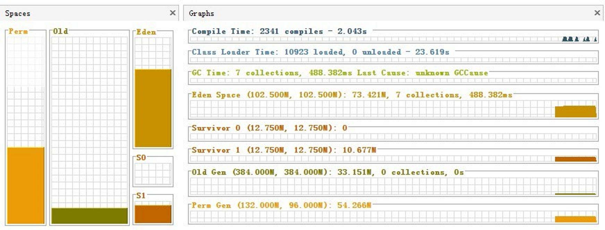

</div>

### 内存参数设置

```java
# 设置堆区的初始大小
-Xms1024m
# 设置堆区的存储空间最大值，一般与堆区的初始大小相等
-Xmx1024m
# 设置年轻代堆的大小
-Xmn512m
# 设置如下参数，在出现OOM时进行堆转储
-XX:+HeapDumpOnOutOfMemoryError
# 设置以上设置时，需配置以下参数，堆转储文件输出的位置
-XX:HeapDumpPath=/usr/log/java_dump.hprof
```

## 方法区/永久代（Permanent Generation，线程共享）

1. 线程共享
2. 存储被jvm加载的类型信息、常量、静态变量、即时编译期编译后的代码缓存数据
3. HotSpot VM也会针对该区域进行垃圾回收，主要是针对常量池回收和类型卸载，收益比较低
4. 内存不足出现OOM
5. JDK8之后使用元空间替代了永久代
6. 默认最小16MB，最大64MB，可以通过-XX:PermSize 和 -XX:MaxPermSize 参数限制方法区的大小

<div align=center>

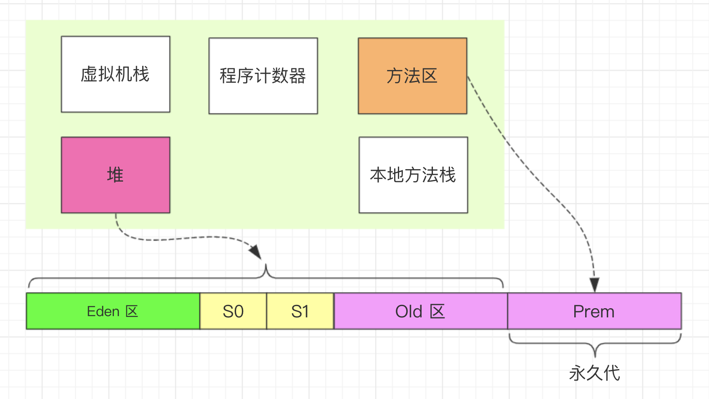
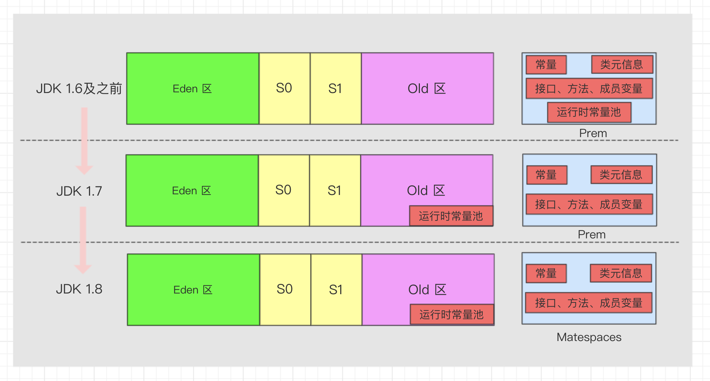
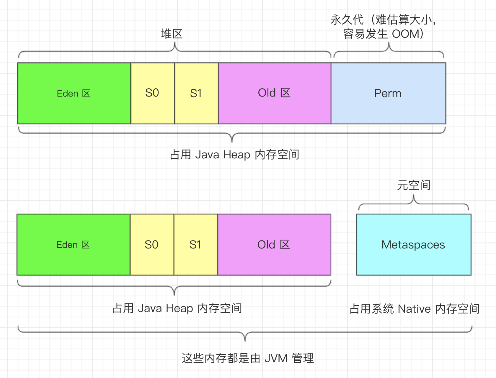

</div>

### 内存参数设置

```java
# jdk1.7 设置永久代内存初始大小
-XX:PermSize=512m
# jdk1.7 设置永久代内存最大值
-XX:MaxPermSize=512m
# jdk1.8 设置元空间内存初始大小
-XX:MetaspaceSize=1024m
# jdk1.8 设置元空间内存最大值
-XX:MaxMetaspaceSize=1024m
```

### JAVA8 与元数据

在Java8中，永久代已经被移除，被一个称为“元数据区”（元空间）的区域所取代。元空间的本质和永久代类似，元空间与永久代之间最大的区别在于：**元空间并不在虚拟机中，而是使用本地内存**。因此，默认情况下，元空间的大小仅受本地内存限制。**类的元数据放入native memory, 字符串池和类的静态变量放入 java 堆中**，这样可以加载多少类的元数据就不再由
MaxPermSize 控制, 而由系统的实际可用空间来控制。

### 运行时常量池（Runtime Constant Pool）

1. Class文件中的常量池表
2. 存放编译期生成的各种**字面量和符号引用**，这部分内容将在类加载后存放到方法区的运行时常量池中。
3. 相较于Class文件常量池，运行时常量池更具动态性，在运行期间也可以将新的变量放入常量池中，而不是一定要在编译时确定的常量才能放入。最主要的运用便是String类的intern()方法。
4. 内存不足会出现OOM

<div align=center>

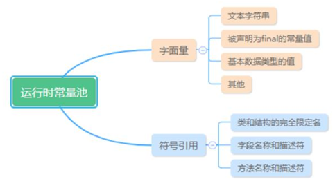

</div>

## 直接内存（Direct Memory）

1. 不属于JVM运行时的数据区域
2. 内存不足会出现OOM错误
3. JDK中NIO使用通道和缓冲区的IO方式，使用native函数库直接在堆外分配内存，然后通过一个存储在Java堆里面的DirectByteBuffer对象作为这块内存的引用进行操作
4. 受限于本机内存

## 执行引擎(Execution Engine)

执行引擎执行包在装载类的方法中的指令，也就是方法。执行引擎以指令为单位读取Java字节码。它就像一个CPU一样，一条一条地执行机器指令。每个字节码指令都由一个1字节的操作码和附加的操作数组成。执行引擎取得一个操作码，然后根据操作数来执行任务，完成后就继续执行下一条操作码。

执行引擎必须把字节码转换成可以直接被JVM执行的语言。字节码可以通过以下两种方式转换成合适的语言：

1. 解释器： 一条一条地读取，解释并执行字节码执行，所以它可以很快地解释字节码，但是执行起来会比较慢。
2. 即时编译器：用来弥补解释器的缺点，执行引擎首先按照解释执行的方式来执行，然后在合适的时候，即时编译器把整段字节码编译成本地代码。然后，执行引擎就没有必要再去解释执行方法了，它可以直接通过本地代码去执行。执行本地代码比一条一条进行解释执行的速度快很多，编译后的代码可以执行的很快，因为本地代码是保存在缓存里的。

<div align=center>

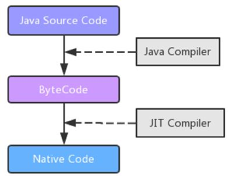

</div>

## 场景内存溢出分析

## 对象分析(ObjectA a = new ObjectA())

### 对象创建

<div align=center>

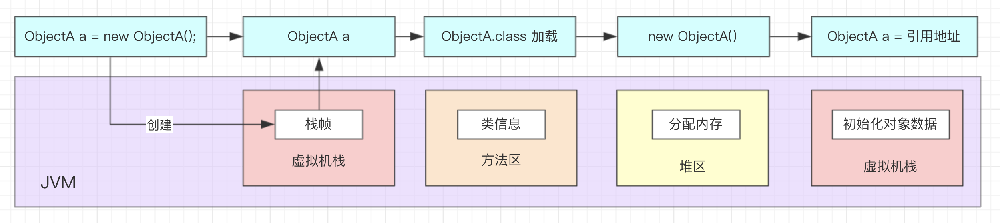

</div>

1. 在虚拟机栈创建栈帧
2. 栈帧内创建对象的引用
3. 方法区进行类的加载
4. Java 堆区进行分配内存并内存初始化
5. 回到栈帧中初始化对象的数据

### 内存分配过程

#### 指针碰撞

1. 支持**压缩功能**的垃圾收集器Serial、ParNew 等（Compact 过程），
2. 分开已使用和未使用的内存，两者之间使用一个指针作为分界点指示器
3. 分配内存只需移动指针，分界点指示器向未使用的内存一侧移动一段与对象大小相等的空间

<div align=center>

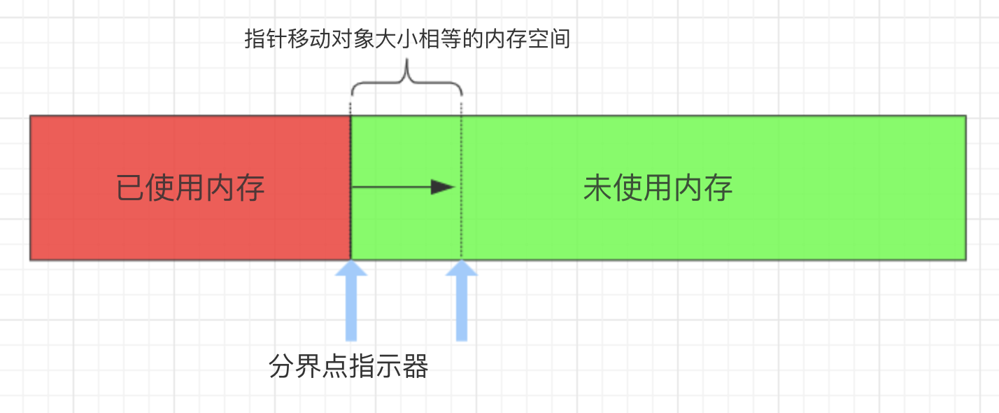

</div>

#### 空闲列表

1. 使用**标记清除（Mark-Sweep）算法**的 CMS 垃圾回收器
2. 内存划分成网格区（Region），内存分配不规整，即已使用的和未使用的内存随机分布
3. JVM 维护一个记录表，用于记录那些内存可用于分配
4. 需要给对象分配内存区域时，寻找一块足够大的内存空间分配给对象，并更新记录表

<div align=center>

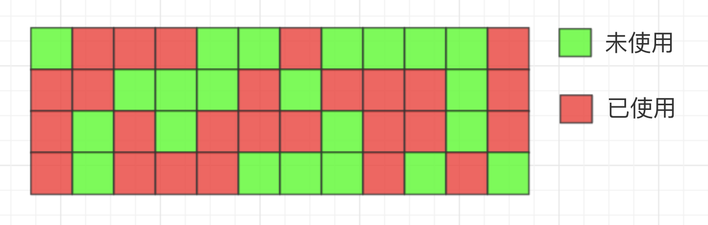

</div>

### 并发控制

#### 同步处理

内存分配的动作采用同步机制，JVM 为了增加效率采用了 CAS 方式。

#### TLAB 

1. 全称：Thread Local Allocation Buffer
2. 原理：每个线程在 Java 堆中预先分配一小块内存，叫做本地线程分配缓冲区。类似于ThreadLocal
3. 哪个线程需要分配内存先去各自的 TLAB 中分配，但是这个缓冲区比较小，是为了加速对象的分配。只有在线程的 TLAB 用完才会去堆中进行内存分配，此时才需要同步机制。

<div align=center>

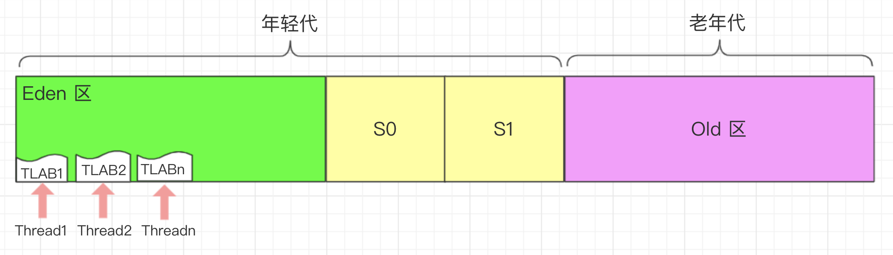

</div>

### 对象访问

#### 直接访问（HotSpot使用）

<div align=center>

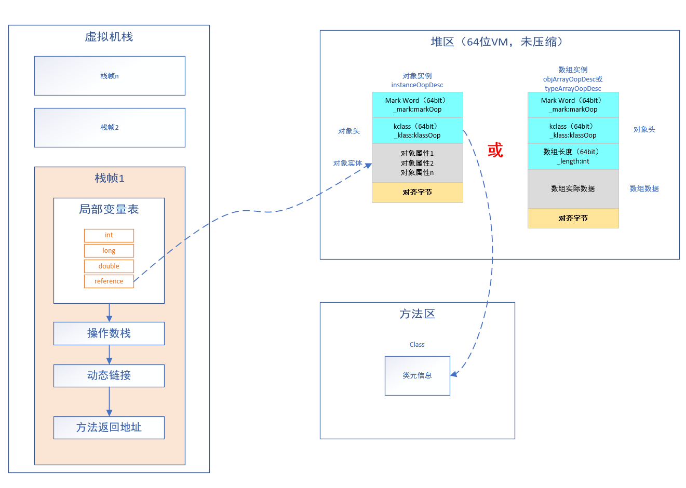

</div>

**优点**：相对于句柄访问定位的方式，减少了一次指针定位的开销（也减少了句柄池的存储空间），HotSpot JVM 实现采用的是直接访问的方式进行对象访问定位。

#### 句柄访问

<div align=center>

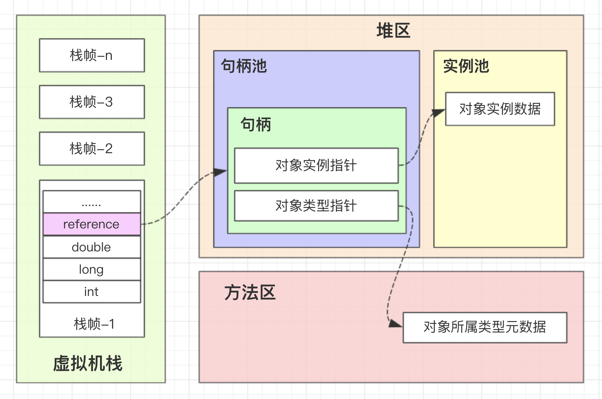

</div>

**优点**：在垃圾回收的时候对象要经常转移，这时候只需改变句柄中指向对象实例数据的指针即可（不用修改 reference）

### 对象内存布局

参考《<a href="https://www.sunliaodong.cn/2021/02/05/JVM-HotSpot%E8%99%9A%E6%8B%9F%E6%9C%BA%E5%AF%B9%E8%B1%A1%E6%8E%A2%E7%A7%98/" target="_blank">JVM HotSpot虚拟机对象探秘</a>》。

<div align=center>


</div>

## 其他

### JVM 中 GC 参数的设置

```java
# 在控制台输出GC情况
-verbose:gc 
# GC日志输出
-XX:+PrintGC
# GC日志详细输出
-XX:+PrintGCDetails
# GC输出时间戳
-XX:+PrintGCDateStamps
# GC日志输出指定文件中
-Xloggc:/log/gc.log
```

## 参考

1. 《深入理解Java虚拟机》
2. [从Java代码运行聊到JVM及对象创建-分配-定位-布局-垃圾回收](https://www.toutiao.com/i6797907413220459019)
