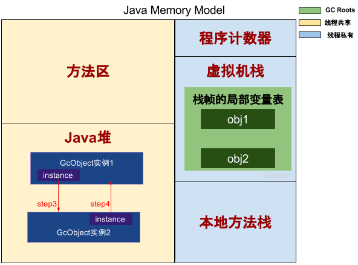
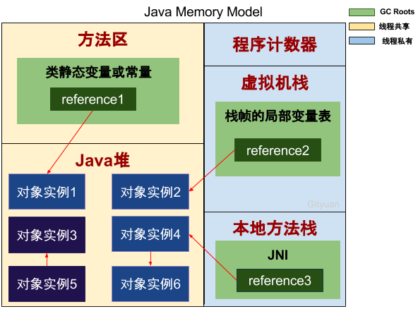
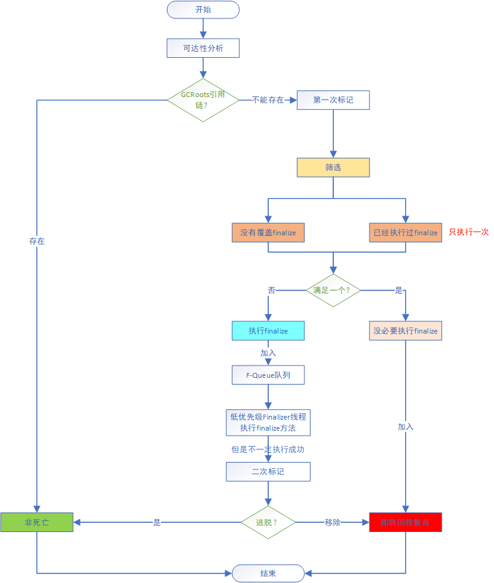
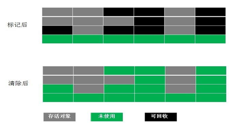
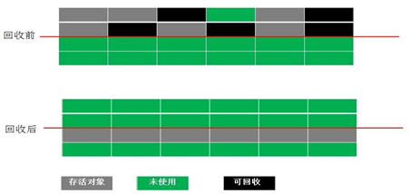
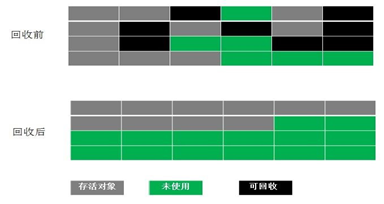
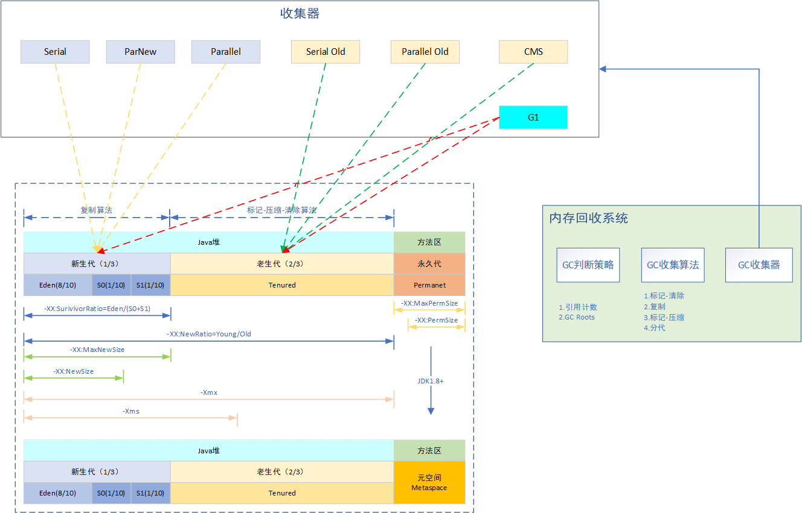
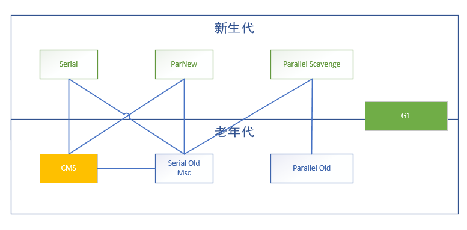

## 对象已死

### 引用计数算法（reference-counting）

**定义**：在对象中添加一个引用计数器，每当有一个地方引用它时，计数器值就加一；当引用失效时，计数器值就减一；任何时刻计数器为零的对象就是不可能再被使用的。

**缺点**：无法简单的处理对象循环引用

<div align=center>



</div>

### 可达性算法（GC Roots Tracing）

**定义**：通过一系列称为“GC Roots”的根对象作为起始节点集，从这些节点开始，根据引用关系向下搜索，搜索过程所走过的路径称为“引用链”（Reference Chain），如果某个对象到GC Roots间没有任何引用链相连，或者用图论的话来说就是从GC Roots到这个对象不可达时，则证明此对象是不可能再被使用的。

<!--more-->

<div align=center>



</div>

#### GCRoot对象

1. 在虚拟机栈（栈帧中的本地变量表）中引用的对象，譬如各个线程被调用的方法堆栈中使用到的参数、局部变量、临时变量等。
2. 在方法区中类静态属性引用的对象，譬如Java类的引用类型静态变量。
3. 在方法区中常量引用的对象，譬如字符串常量池（StringTable）里的引用。
4. 在本地方法栈中JNI（即通常所说的Native方法）引用的对象。
5. Java虚拟机内部的引用，如基本数据类型对应的Class对象，一些常驻的异常对象（比如NullPointExcepiton、OutOfMemoryError）等，还有系统类加载器。
6. 所有被同步锁（synchronized关键字）持有的对象。
7. 反映Java虚拟机内部情况的JMXBean、JVMTI中注册的回调、本地代码缓存等。

#### 对象死亡

<div align=center>



</div>

### 引用

**定义**：如果reference类型的数据中存储的数值代表的是另外一块内存的起始地址，就称该reference数据是代表某块内存、某个对象的引用

#### 强引用

在程序代码之中普遍存在的，类似`Object obj = new Object()`这类的引用，只要强引用还存在，垃圾收集器永远不会回收掉被引用的对象；

#### 软引用

描述一些还有用但非必需的对象。对于软引用关联着的对象，**在系统将要发生内存溢出异常之前**，将会把这些对象列进回收范围之中进行第二次回收。如果这次回收还没有足够的内存，才会抛出内存溢出异常；

#### 弱引用

描述非必需对象的，但是它的强度比软引用更弱一些，被弱引用关联的对象**只能生存到下一次垃圾收集发生之前**。当垃圾收集器工作时，无论当前内存是否足够，都会回收掉只被弱引用关联的对象；

#### 虚引用

最弱的一种引用关系。一个对象是否有虚引用的存在，完全不会对其生存时间构成影响，也无法通过虚引用来取得一个对象实例。为一个对象设置虚引用关联的唯一目的就是能在这个对象被收集器回收时收到一个系统通知；

### 回收方法区

方法区的垃圾收集主要回收两部分内容：**废弃常量和无用的类**。

#### 回收废弃常量

1. 与Java堆中的对象回收类似
2. 举例：字符串常量“java”，如果jvm中没有其他地方引用这个字面量并且没有任何字符串对象已用这个常量；jvm有可能会把该常量移除常量池
3. 类（接口）、方法、自动的符号引用类似

#### 如何判断一个类是否是无用的类

1. 该类所有的实例都已经被回收，也就是Java堆中不存在该类的任何实例；
2. 加载该类的**ClassLoader**已经被回收；
3. 该类对应的java.lang.Class对象没有在任何地方被引用，无法在任何地方通过反射访问该类的方法；

虚拟机可以对满足上述3个条件的无用类进行回收，这里说的仅仅是可以，而并不是和对象一样，不使用了就必然会回收。

> 关于是否要对类型进行回收，HotSpot虚拟机提供了-Xnoclassgc参数进行控制，还可以使用-verbose：class以及-XX：+TraceClass-Loading、-XX：+TraceClassUnLoading查看类加载和卸载信息，其中-verbose：class和-XX：+TraceClassLoading可以在Product版的虚拟机中使用，-XX：+TraceClassUnLoading参数需要FastDebug版的虚拟机支持。

## GC触发条件

<style type="text/css">
.tg  {border-collapse:collapse;border-color:#bbb;border-spacing:0;}
.tg td{background-color:#E0FFEB;border-color:#bbb;border-style:solid;border-width:1px;color:#594F4F;
  font-family:Arial, sans-serif;font-size:14px;overflow:hidden;padding:10px 5px;word-break:normal;}
.tg th{background-color:#9DE0AD;border-color:#bbb;border-style:solid;border-width:1px;color:#493F3F;
  font-family:Arial, sans-serif;font-size:14px;font-weight:normal;overflow:hidden;padding:10px 5px;word-break:normal;}
.tg .tg-0lax{text-align:left;vertical-align:top}
</style>
<table class="tg">
<thead>
  <tr>
    <th class="tg-0lax">GC类型</th>
    <th class="tg-0lax">触发条件</th>
    <th class="tg-0lax">触发时发生的事情</th>
    <th class="tg-0lax">注意</th>
    <th class="tg-0lax">查看方式</th>
  </tr>
</thead>
<tbody>
  <tr>
    <td class="tg-0lax">&nbsp;&nbsp;&nbsp;<br>YGC&nbsp;&nbsp;&nbsp;</td>
    <td class="tg-0lax">&nbsp;&nbsp;&nbsp;<br>eden空间不足&nbsp;&nbsp;&nbsp;</td>
    <td class="tg-0lax">清空eden+from survivor中的所有no ref对象占用的内存<br>将eden+from survivor中所有存活的对象copy到to survivor中<br>一些对象升级到old中：to survivor放不下、存储次数超过turing threshold<br>重新计算tenuring threshold(serial parallel   GC会触发此项)<br>重新调整Eden 和from的大小(parallel GC会触发此项)   </td>
    <td class="tg-0lax">全部暂停应用<br>是否为多线程处理由具体的GC决定   </td>
    <td class="tg-0lax">jstat -gcutil<br>gc log   </td>
  </tr>
  <tr>
    <td class="tg-0lax">&nbsp;&nbsp;&nbsp;<br>FGC&nbsp;&nbsp;&nbsp;</td>
    <td class="tg-0lax">old空间不足<br>perm空间不足<br>显示调用System.GC，RMI等定时触发<br>YGC的悲观策略<br>Dump live内存信息时（jmap   -dump:live）   </td>
    <td class="tg-0lax">清空heap中的no ref的对象<br>permgen中已经呗卸载的classloader中加载的class信息<br>如果配置了CollectGenOFirst/ScavengeBeforeFullGC，则先触发YGC（针对serival GC）   </td>
    <td class="tg-0lax">全部暂停应用<br>是否为多线程处理由具体的GC决定<br>是否压缩需要看配置的具体GC   </td>
    <td class="tg-0lax">jstat -gcutil<br>gc log   </td>
  </tr>
</tbody>
</table>

permanent generation空间不足会引发Full GC,仍然不够会引发PermGen Space错误。

### GC信息的选项

```java
-XX:+PrintGCDetails 显示GC的详细信息
-XX:+PrintGCApplicationConcurrentTime 打印应用执行的时间
-XX:+PrintGCApplicationStoppedTime 打印应用被暂停的时间
```

## 垃圾收集器整体介绍

<style type="text/css">
.tg  {border-collapse:collapse;border-color:#bbb;border-spacing:0;}
.tg td{background-color:#E0FFEB;border-color:#bbb;border-style:solid;border-width:1px;color:#594F4F;
  font-family:Arial, sans-serif;font-size:14px;overflow:hidden;padding:10px 5px;word-break:normal;}
.tg th{background-color:#9DE0AD;border-color:#bbb;border-style:solid;border-width:1px;color:#493F3F;
  font-family:Arial, sans-serif;font-size:14px;font-weight:normal;overflow:hidden;padding:10px 5px;word-break:normal;}
.tg .tg-z9od{font-size:12px;text-align:left;vertical-align:top}
</style>
<table class="tg" style="undefined;table-layout: fixed; width: 791px">
<colgroup>
<col style="width: 82px">
<col style="width: 218px">
<col style="width: 250px">
<col style="width: 241px">
</colgroup>
<thead>
  <tr>
    <th class="tg-z9od"><span style="font-weight:bold">类别</span></th>
    <th class="tg-z9od"><span style="font-weight:bold">Serial collector串行</span></th>
    <th class="tg-z9od"><span style="font-weight:bold">Parallel</span>&nbsp;&nbsp;<span style="font-weight:bold">Collector并行</span><br><span style="font-weight:bold">（throughput collector</span></th>
    <th class="tg-z9od"><span style="font-weight:bold">Concurrent&nbsp;&nbsp;&nbsp;collector并发</span><br><br><span style="font-weight:bold">（concurrent low pause collector）</span></th>
  </tr>
</thead>
<tbody>
  <tr>
    <td class="tg-z9od">   <br>介绍   </td>
    <td class="tg-z9od">单线程收集器<br>使用单线程完成所有的gc工作，没有线程间的通信，这种方式会相对较高效&nbsp;&nbsp;&nbsp;</td>
    <td class="tg-z9od">并行收集器<br>使用多线程的方式，利用多CPU来提高GC的效率，主要以达到<span style="color:red">一定的吞吐量</span>为目标&nbsp;&nbsp;&nbsp;</td>
    <td class="tg-z9od">并发收集器<br>使用多线程的方式，利用多CPU来提高GC的效率<span style="color:red">并发</span>完成大部分工作，提高gc&nbsp;&nbsp;&nbsp;pause&nbsp;&nbsp;&nbsp;</td>
  </tr>
  <tr>
    <td class="tg-z9od">使用场景&nbsp;&nbsp;&nbsp;</td>
    <td class="tg-z9od">单处理器且没有pause time的要求&nbsp;&nbsp;&nbsp;</td>
    <td class="tg-z9od">科学计算和后台处理有中规模/大规模数据集大小的应用且运行在多个处理器上，<span style="color:red">关注吞吐量（throughput）</span>&nbsp;&nbsp;&nbsp;</td>
    <td class="tg-z9od">中规模/大规模数据集大小的应用，应用服务，电信领域。<span style="color:red">关注响应时间</span>&nbsp;&nbsp;&nbsp;</td>
  </tr>
  <tr>
    <td class="tg-z9od">&nbsp;&nbsp;&nbsp;<br>使用&nbsp;&nbsp;&nbsp;</td>
    <td class="tg-z9od">Client模式下默认<br>可使用-XX:UseSerialGC强制使用<br>优点：对server应用没有优点<br>缺点：不能充分使用硬件资源&nbsp;&nbsp;&nbsp;</td>
    <td class="tg-z9od">Server模式下默认 <br>--YGC:PS&nbsp;&nbsp;&nbsp;FGC:Parallel MSC <br>可用-XX:+UseParallelGC或-XX+UseParallelOldGC强制指定<br>--ParallelGC代表FGC为Parallel MSC<br>--ParallelOldGC代表FGC为Parallel Compacting<br>优点:高效<br>缺点:当heap变大后,造成的暂停时间会变得比较长</td>
    <td class="tg-z9od">可用-XX:+UseConcMarkSweepGC强制指定<br>优点:<br>对old进行回收时,对应用造成的暂停时间非常短,适合对latency要求比较高的应用<br>缺点:<br>1.内存碎片和浮动垃圾<br>2.old去的内存分配效率低<br>3.回收的整个耗时比较长<br>4.和应用争抢CPU&nbsp;&nbsp;&nbsp;</td>
  </tr>
  <tr>
    <td class="tg-z9od">   <br>内存回收触发   </td>
    <td class="tg-z9od"><span style="font-weight:bold">YGC</span><br>eden空间不足<br><span style="font-weight:bold">FGC</span><br>old空间不足<br>perm空间不足<br>显示调用System.gc()&nbsp;&nbsp;&nbsp;,包括RMI等的定时触发<br>YGC时的悲观策略<br>dump live的内存信息时(jmap&nbsp;&nbsp;&nbsp;–dump:live)&nbsp;&nbsp;&nbsp;</td>
    <td class="tg-z9od"><span style="font-weight:bold">YGC</span><br>eden空间不足<br><span style="font-weight:bold">FGC</span><br>old空间不足<br>perm空间不足<br>显示调用System.gc()&nbsp;&nbsp;&nbsp;,包括RMI等的定时触发<br>YGC时的悲观策略--YGC前&amp;YGC后<br>dump live的内存信息时(jmap&nbsp;&nbsp;&nbsp;–dump:live)&nbsp;&nbsp;&nbsp;</td>
    <td class="tg-z9od"><span style="font-weight:bold">YGC</span><br>eden空间不足<br><span style="font-weight:bold">CMS GC</span><br>1.old Gen的使用率大于一定的比率 默认为92%<br>2.配置了CMSClassUnloadingEnabled,且Perm Gen的使用达到一定的比率 默认为92%<br>3.Hotspot自己根据估计决定是否要触法<br>4.在配置了ExplictGCInvokesConcurrent的情况下显示调用了System.gc.<br>Full GC(Serial MSC)<br>promotion failed 或 concurrent&nbsp;&nbsp;&nbsp;Mode Failure时;&nbsp;&nbsp;&nbsp;</td>
  </tr>
  <tr>
    <td class="tg-z9od">   <br>发生的事情   </td>
    <td class="tg-z9od"><span style="font-weight:bold">YGC</span><br>eden空间不足<br><span style="font-weight:bold">FGC</span><br>old空间不足<br>perm空间不足<br>显示调用System.gc()&nbsp;&nbsp;&nbsp;,包括RMI等的定时触发<br>YGC时的悲观策略<br>dump live的内存信息时(jmap&nbsp;&nbsp;&nbsp;–dump:live)&nbsp;&nbsp;&nbsp;</td>
    <td class="tg-z9od"><span style="font-weight:bold">YGC</span><br>同serial动作基本相同,不同点:<br>1.多线程处理<br>2.YGC的最后不仅重新计算Tenuring&nbsp;&nbsp;&nbsp;Threshold,还会重新调整Eden和From的大小<br><span style="font-weight:bold">FGC</span><br>1.如配置了ScavengeBeforeFullGC(默认),则先触发YGC(??)<br>2.MSC:清空heap中的no ref对象,permgen中已经被卸载的classloader中加载的class信息,并进行压缩<br>3.Compacting:清空heap中部分no ref的对象,permgen中已经被卸载的classloader中加载的class信息,并进行部分压缩<br>多线程做以上动作.&nbsp;&nbsp;&nbsp;</td>
    <td class="tg-z9od"><span style="font-weight:bold">YGC</span><br>同serial动作基本相同,不同点:<br>1.多线程处理<br><span style="font-weight:bold">CMSGC</span>:<br>1.old gen到达比率时只清除old&nbsp;&nbsp;&nbsp;gen中no ref的对象所占用的空间<br>2.perm gen到达比率时只清除已被清除的classloader加载的class信息<br><span style="font-weight:bold">FGC</span><br>同serial&nbsp;&nbsp;&nbsp;</td>
  </tr>
  <tr>
    <td class="tg-z9od">   <br>细节参数   </td>
    <td class="tg-z9od">可用-XX:+UseSerialGC强制使用<br>-XX:SurvivorRatio=x,控制eden/s0/s1的大小<br>-XX:MaxTenuringThreshold,用于控制对象在新生代存活的最大次数<br>-XX:PretenureSizeThreshold=x,控制超过多大的字节的对象就在old分配.&nbsp;&nbsp;&nbsp;</td>
    <td class="tg-z9od"><span style="font-weight:bold">-</span>XX:SurvivorRatio=x,控制eden/s0/s1的大小<br>-XX:MaxTenuringThreshold,用于控制对象在新生代存活的最大次数<br>-XX:UseAdaptiveSizePolicy 去掉YGC后动态调整eden from已经tenuringthreshold的动作<br>-XX:ParallelGCThreads&nbsp;&nbsp;&nbsp;设置并行的线程数&nbsp;&nbsp;&nbsp;</td>
    <td class="tg-z9od">-XX:CMSInitiatingOccupancyFraction 设置old gen使用到达多少比率时触发<br>-XX:CMSInitiatingPermOccupancyFraction,设置Perm Gen使用到达多少比率时触发<br>-XX:+UseCMSInitiatingOccupancyOnly禁止hostspot自行触发CMS GC&nbsp;&nbsp;&nbsp;</td>
  </tr>
</tbody>
</table>

## 垃圾收集算法

<style type="text/css">
.tg  {border-collapse:collapse;border-color:#bbb;border-spacing:0;}
.tg td{background-color:#E0FFEB;border-color:#bbb;border-style:solid;border-width:1px;color:#594F4F;
  font-family:Arial, sans-serif;font-size:14px;overflow:hidden;padding:10px 5px;word-break:normal;}
.tg th{background-color:#9DE0AD;border-color:#bbb;border-style:solid;border-width:1px;color:#493F3F;
  font-family:Arial, sans-serif;font-size:14px;font-weight:normal;overflow:hidden;padding:10px 5px;word-break:normal;}
.tg .tg-0lax{text-align:left;vertical-align:top}
</style>
<table class="tg" style="undefined;table-layout: fixed; width: 776px">
<colgroup>
<col style="width: 130px">
<col style="width: 646px">
</colgroup>
<thead>
  <tr>
    <th class="tg-0lax"><span style="font-weight:bold">算法</span></th>
    <th class="tg-0lax"><span style="font-weight:bold">说明</span></th>
  </tr>
</thead>
<tbody>
  <tr>
    <td class="tg-0lax">&nbsp;&nbsp;&nbsp;<br>标记-清除&nbsp;&nbsp;&nbsp;</td>
    <td class="tg-0lax">
    基础算法（以下算法以此为基础）<br>
    标记：标记出所有需要回收的对象<br>
    回收：回收掉所有被标记的对象<br>
    缺点：效率太低；出现大量碎片后，无法分配大的对象<br>   
    
    </td>
  </tr>
  <tr>
    <td class="tg-0lax">&nbsp;&nbsp;&nbsp;<br>复制&nbsp;&nbsp;&nbsp;</td>
    <td class="tg-0lax">
    内存空间平均分成两块，每次使用其中一块<br>
    优点：不用考虑内存碎片；实现简单，效率高<br>
    缺点：浪费内存；长时间存活的对象复制效率低  <br> 
    
    </td>
  </tr>
  <tr>
    <td class="tg-0lax">&nbsp;&nbsp;&nbsp;<br>标记-压缩&nbsp;&nbsp;&nbsp;</td>
    <td class="tg-0lax">
    标记过程与“标记-清除”算法一样<br>
    回收：存活对象移动到另一端，然后直接清理另一端的内存<br>  
     
    </td>
  </tr>
  <tr>
    <td class="tg-0lax">&nbsp;&nbsp;&nbsp;<br>分代收集&nbsp;&nbsp;&nbsp;</td>
    <td class="tg-0lax">
    假设：<span style="color:red">绝大部分对象的生命周期都非常短暂，存活时间短</span><br>
    把Java堆分为新生代和老年代，采用同的回收算法<br>
    新生代：复制算法（大量死去，少量存活）<br>
    老年代：“标记-压缩-清除”（存活率高，没有额外空间复制）<br>
     
    </td>
  </tr>
</tbody>
</table>

## 垃圾收集器

<style type="text/css">
.tg  {border-collapse:collapse;border-color:#bbb;border-spacing:0;}
.tg td{background-color:#E0FFEB;border-color:#bbb;border-style:solid;border-width:1px;color:#594F4F;
  font-family:Arial, sans-serif;font-size:14px;overflow:hidden;padding:10px 5px;word-break:normal;}
.tg th{background-color:#9DE0AD;border-color:#bbb;border-style:solid;border-width:1px;color:#493F3F;
  font-family:Arial, sans-serif;font-size:14px;font-weight:normal;overflow:hidden;padding:10px 5px;word-break:normal;}
.tg .tg-0lax{text-align:left;vertical-align:top}
</style>
<table class="tg" style="undefined;table-layout: fixed; width: 799px">
<colgroup>
<col style="width: 149px">
<col style="width: 650px">
</colgroup>
<thead>
  <tr>
    <th class="tg-0lax"><span style="font-weight:bold">收集器</span><br></th>
    <th class="tg-0lax"><span style="font-weight:bold">说明</span><br></th>
  </tr>
</thead>
<tbody>
  <tr>
    <td class="tg-0lax">&nbsp;&nbsp;&nbsp;<br>Serial收集器&nbsp;&nbsp;&nbsp;</td>
    <td class="tg-0lax">
    最基础、最古老的简单高效收集器；<br>
    单线程收集，暂停其他所有工作线程（JVM后台完成，STW）<br>
    <span style="color:red">新生代：复制算法</span><br>
    适用于客户端模式<br>
    -XX:+UseSerialGC  串行收集器   </td>
  </tr>
  <tr>
    <td class="tg-0lax">&nbsp;&nbsp;&nbsp;<br>ParNew收集器&nbsp;&nbsp;&nbsp;</td>
    <td class="tg-0lax">
    Serial收集器的多线程并行版本<br>
    <span style="color:red">新生代：复制算法</span><br>
    -XX:+UseParNewGC  ParNew收集器<br>
    -XX:ParallelGCThreads   限制线程数量   </td>
  </tr>
  <tr>
    <td class="tg-0lax">&nbsp;&nbsp;&nbsp;<br>Parallel Scavenge收集器&nbsp;&nbsp;&nbsp;</td>
    <td class="tg-0lax">
    <span style="color:red">类似ParNew，Parallel收集器更关注系统的吞吐量（通过参数动态调整）</span><br>
    吞吐量=运行用户代码时间/（运行用户代码时间+垃圾收集时间）<br>
    <span style="color:red">新生代：复制算法</span><br>
    -XX:+UseParallelGC<br>
    -XX：MaxGCPauseMillis 最大垃圾收集停顿时间<br>
    -XX：GCTimeRatio 吞吐量大小<br>
    </td>
  </tr>
  <tr>
    <td class="tg-0lax">&nbsp;&nbsp;&nbsp;<br>Parallel&nbsp;&nbsp;&nbsp;Old 收集器&nbsp;&nbsp;&nbsp;</td>
    <td class="tg-0lax">Parallel Scavenge收集器的老年代版本，使用多线程和“<span style="color:red">标记－整理</span>”算法。<br>
    JDK 1.6中才开始提供<br>
    -XX:+UseParallelOldGC <br></td>
  </tr>
  <tr>
    <td class="tg-0lax">&nbsp;&nbsp;&nbsp;<br>CMS收集器&nbsp;&nbsp;&nbsp;</td>
    <td class="tg-0lax">特点：<br>
    1. <span style="color:red">一种以获取最短回收停顿时间为目标的收集器</span><br>
    2. <span style="color:red">基于标记-清除算法</span><br>
    3. <span style="color:red">顶一个真正意义的并发收集器（回收和用户线程同时工作）</span><br>
   <span style="font-weight:bold">收集步骤：</span><br>
   1. 初始标记（CMS initial mark）：会出现短暂SWT，标记GC Roots能直接关联到的对象<br>
   2. 并发标记（CMS concurrent mark）：执行GC Root Tracing<br>
   3. 重新标记（CMS remark）：出现SWT（稍长），修正并发标记中由于用户程序执行产生变动的对象<br>
   4. 并发清除（CMS concurrent sweep）：开启用户线程，同时GC线程开始对标记的区域做清扫<br>
优点：并发收集、低停顿<br>
缺点：<br>
1. 对CPU资源敏感<br>
2. 无法处理浮动垃圾（Floating Garbage）；<br>
3. 基于标记-清除算法实现的收集器，这意味着收集结束时会有大量空间碎片产生<br>
  </td>
  </tr>
  <tr>
    <td class="tg-0lax">&nbsp;&nbsp;&nbsp;<br>G1收集器&nbsp;&nbsp;&nbsp;</td>
    <td class="tg-0lax">
    一种面向服务端应用的收集器，对于多CPU和大内存的机器可以极高满足停顿时间和吞吐量<br>
    特点：<br>
    1. <span style="color:red">并行与并发：充分利用CPU，基于多核硬件缩短SWT</span><br>
    2. <span style="color:red">分代收集：管理整个GC堆，但保留了分代收集的概念</span><br>
    3. <span style="color:red">空间整合：整体上基于标记-整理算法，局部上基于复制算法，无碎片化</span><br>
    4. <span style="color:red">可预测的停顿：建立可预测的停顿时间模型，便于使用者指定停顿时间</span><br>
   
G1跟踪各个Region里面的垃圾堆积的价值大小（回收所获得的空间大小以及回收所需时间的经验值），在后台维护一个优先列表，每次根据允许的收集时间，优先回收价值最大的Region（这也就是Garbage-First名称的来由）。这种使用Region划分内存空间以及有优先级的区域回收方式，保证了G1收集器在有限的时间内可以获取尽可能高的收集效率。<br>
   
   <span style="font-weight:bold">收集步骤：</span><br>
1. 初始标记（Initial Marking）：标记GC Roots直接关联对象，修改TAMS指针的值，让下一阶段用户线程并发运行时，能正确地在可用的Region中分配新对象；借用Minor GC的时候同步完成短暂停顿<br>
2. 并发标记（Concurrent Marking）：对象可达性分析，找出需要回收的对象，这阶段耗时较长，但可与用户程序并发执行处理完成后，需要重新处理SATB记录下的在并发时有引用变动的对象。<br>
3. 最终标记（Final Marking）：对用户线程做另一个短暂的暂停，用于处理并发阶段结束后仍遗留下来的最后那少量的SATB记录。<br>
4. 筛选回收（Live Data Counting and Evacuation）：负责更新Region的统计数据，对各个Region的回收价值和成本进行排序，根据用户所期望的停顿时间来制定回收计划，可以自由选择任意多个Region构成回收集，然后把决定回收的那一部分Region的存活对象复制到空的Region中，再清理掉整个旧Region的全部空间。这里的操作涉及存活对象的移动，是必须暂停用户线程，由多条收集器线程并行完成的。<br>
  </tr>
</tbody>
</table>

## 收集器组合

<div align=center>



</div>

<style type="text/css">
.tg  {border-collapse:collapse;border-spacing:0;}
.tg td{border-color:black;border-style:solid;border-width:1px;font-family:Arial, sans-serif;font-size:14px;
  overflow:hidden;padding:10px 5px;word-break:normal;}
.tg th{border-color:black;border-style:solid;border-width:1px;font-family:Arial, sans-serif;font-size:14px;
  font-weight:normal;overflow:hidden;padding:10px 5px;word-break:normal;}
.tg .tg-rz5g{background-color:#92D050;text-align:left;vertical-align:top}
.tg .tg-0lax{text-align:left;vertical-align:top}
</style>
<table class="tg" style="undefined;table-layout: fixed; width: 819px">
<colgroup>
<col style="width: 142px">
<col style="width: 137px">
<col style="width: 540px">
</colgroup>
<thead>
  <tr>
    <th class="tg-rz5g"><span style="font-weight:bold">YGC</span></th>
    <th class="tg-rz5g"><span style="font-weight:bold">FGC</span></th>
    <th class="tg-rz5g"><span style="font-weight:bold">说明</span></th>
  </tr>
</thead>
<tbody>
  <tr>
    <td class="tg-0lax">Serial   </td>
    <td class="tg-0lax">Serial   Old   </td>
    <td class="tg-0lax">Serial和Serial   Old都是单线程进行GC，特点就是GC时暂停所有应用线程。</td>
  </tr>
  <tr>
    <td class="tg-0lax">Serial   </td>
    <td class="tg-0lax">CMS+Serial   Old   </td>
    <td class="tg-0lax">CMS（Concurrent Mark   Sweep）是并发GC，实现GC线程和应用线程并发工作，不需要暂停所有应用线程。另外，当CMS进行GC失败时，会自动使用Serial Old策略进行GC。   </td>
  </tr>
  <tr>
    <td class="tg-0lax">ParNew   </td>
    <td class="tg-0lax">CMS   </td>
    <td class="tg-0lax">使用-XX:+UseParNewGC选项来开启。ParNew是Serial的并行版本，可以指定GC线程数，默认GC线程数为CPU的数量。可以使用-XX:ParallelGCThreads选项指定GC的线程数。<br>如果指定了选项-XX:+UseConcMarkSweepGC选项，则新生代默认使用ParNew   GC策略。   </td>
  </tr>
  <tr>
    <td class="tg-0lax">ParNew   </td>
    <td class="tg-0lax">Serial   Old   </td>
    <td class="tg-0lax">使用-XX:+UseParNewGC选项来开启。新生代使用ParNew   GC策略，年老代默认使用Serial Old GC策略。   </td>
  </tr>
  <tr>
    <td class="tg-0lax">Parallel   Scavenge  </td>
    <td class="tg-0lax">Serial   Old   </td>
    <td class="tg-0lax">Parallel Scavenge策略主要是关注一个可控的吞吐量：应用程序运行时间   / (应用程序运行时间 + GC时间)，可见这会使得CPU的利用率尽可能的高，适用于后台持久运行的应用程序，而不适用于交互较多的应用程序。   </td>
  </tr>
  <tr>
    <td class="tg-0lax">Parallel   Scavenge </td>
    <td class="tg-0lax">Parallel   Old   </td>
    <td class="tg-0lax">Parallel Old是Serial Old的并行版本   </td>
  </tr>
  <tr>
    <td class="tg-0lax">G1GC   </td>
    <td class="tg-0lax">G1GC   </td>
    <td class="tg-0lax">-XX:+UnlockExperimentalVMOptions   -XX:+UseG1GC        #开启<br>-XX:MaxGCPauseMillis   =50                  #暂停时间目标<br>-XX:GCPauseIntervalMillis   =200          #暂停间隔目标<br>-XX:+G1YoungGenSize=512m            #年轻代大小<br>-XX:SurvivorRatio=6                            #幸存区比例   </td>
  </tr>
</tbody>
</table>

## 如何选择收集器

1. app运行在单处理器机器上且没有pause time的要求，让vm选择UseSerialGC.
2. 重点考虑peak application performance(高性能)，没有pause time太严格要求，让vm选择或者UseParallelGC+UseParallelOldGC(optionally).
3. 重点考虑response time,pause time要小，UseConcMarkSweepGC.
4. 默认情况下，**JDK5.0以前都是使用串行收集器**，如果需要使用其他收集器需要在启动的是时候加入相应的参数。JDK5.0以后，JVM会根据当前系统的配置进行判断。

**并行**：指多条垃圾收集器线程并行工作，但此时仍是“Stop The World”状态，即用户线程处于等待状态；
**并发**：指用户线程和垃圾收集线程同时执行（不一定是并行的，很有可能是线程交替运行），用户线程继续运行，而垃圾收集程序运行在另一个CPU上。

### 吞吐量优先的并行收集器

#### 说明

并行收集器主要以达到一定的吞吐量为目标，适用于科学技术和后台处理。分为两种：
1. 并行收集器（-XX:+ UseParallelGC）在次要回收中使用多线程来执行，在主要回收中使用单线程执行；
2. 并行旧生代收集器（Parallet Old Collection）(XX:+UseParallelOldGC),在次要回收和主要回收都使用多线程，当年老区填满后会触发主要回收

#### 典型配置

```java
java -Xmx3800m -Xms3800m -Xmn2g -Xss128k -XX:UseParallelGC -XX:ParallelGCThreans = 20
java -Xmx3500m -Xms3500m -Xmn2g -Xss128k -XX:+UseparallelGC - XX:ParallelGCThreans = 20 -XX:+UseParallelOldGC
java -Xms3550m -Xmm3550m -Xmn2g -Xss128k -XX:+UseparallelGC -XX:MaxGCPauseMillis = 100
java -Xms3550m -Xmm3550m -Xmn2g -Xss128k -XX:+UseparallelGC -XX:MaxGCPauseMillis = 100 -XX:+UseAdaptiveSizePolicy
```

<style type="text/css">
.tg  {border-collapse:collapse;border-color:#bbb;border-spacing:0;}
.tg td{background-color:#E0FFEB;border-color:#bbb;border-style:solid;border-width:1px;color:#594F4F;
  font-family:Arial, sans-serif;font-size:14px;overflow:hidden;padding:10px 5px;word-break:normal;}
.tg th{background-color:#9DE0AD;border-color:#bbb;border-style:solid;border-width:1px;color:#493F3F;
  font-family:Arial, sans-serif;font-size:14px;font-weight:normal;overflow:hidden;padding:10px 5px;word-break:normal;}
.tg .tg-0lax{text-align:left;vertical-align:top}
</style>
<table class="tg" style="undefined;table-layout: fixed; width: 808px">
<colgroup>
<col style="width: 214px">
<col style="width: 594px">
</colgroup>
<thead>
  <tr>
    <th class="tg-0lax"><span style="font-weight:bold">参数</span></th>
    <th class="tg-0lax"><span style="font-weight:bold">说明</span></th>
  </tr>
</thead>
<tbody>
  <tr>
    <td class="tg-0lax"><span style="font-weight:bold">-Xmx3800m</span>   </td>
    <td class="tg-0lax">最大堆大小   </td>
  </tr>
  <tr>
    <td class="tg-0lax"><span style="font-weight:bold">-Xms3800m</span>   </td>
    <td class="tg-0lax">初始堆大小,此值可以设置与-Xmx相同，以避免每次垃圾回收完成后JVM重新分配内存   </td>
  </tr>
  <tr>
    <td class="tg-0lax"><span style="font-weight:bold">-Xmn2g</span>   </td>
    <td class="tg-0lax">设置<span style="color:red">年轻</span>代大小为2G。<span style="font-weight:bold;color:red">整个JVM内存大小=年轻代大小 + 年老代大小 + 持久代大小</span>。持久代一般固定大小为64m，所以增大年轻代后，将会减小年老代大小。此值对系统性能影响较大，Sun官方推荐配置为整个堆的3/8。   </td>
  </tr>
  <tr>
    <td class="tg-0lax"><span style="font-weight:bold">-Xss128k</span>   </td>
    <td class="tg-0lax">设置每个线程的<span style="color:red">堆栈大小</span>。JDK5.0以后每个线程堆栈大小为1M,以前每个线程堆栈大小为256K。根据应用的线程所需内存大小进行调整。<span style="font-weight:bold;color:red">在相同物理内存下，减小这个值能生成更多的线程</span>。但是操作系统对一个进程内的线程数还是有限制的，<br>不能无限生成，经验值在3000~5000左右。   </td>
  </tr>
  <tr>
    <td class="tg-0lax"><span style="font-weight:bold">-XX:+UseParallelGC</span>   </td>
    <td class="tg-0lax">选择垃圾收集器为并行收集器。<span style="font-weight:bold;color:red">此配置仅对年轻代有效</span>。即该配置下，年轻代使用并发收集，而年老代仍旧使用串行收集。   </td>
  </tr>
  <tr>
    <td class="tg-0lax"><span style="font-weight:bold">-XX:ParallelGCThreans = 20</span>   </td>
    <td class="tg-0lax">配置并行收集器的线程数，即：同时多少个线程一起进行垃圾回收。<span style="font-weight:bold;color:red">此值的配置最好与处理器数目相等</span>。   </td>
  </tr>
  <tr>
    <td class="tg-0lax"><span style="font-weight:bold">-XX:+UseParallelOldGC</span>   </td>
    <td class="tg-0lax">配置老年代垃圾收集器为并行收集。JDK6.0支持对老年代并行收集   </td>
  </tr>
  <tr>
    <td class="tg-0lax"><span style="font-weight:bold">-XX:MaxGCPauseMillis = 100</span>   </td>
    <td class="tg-0lax">设置每次年轻代垃圾回收的最长时间，如果无法满足此时间，JVM会自动调整年轻代大小，以满足此值   </td>
  </tr>
  <tr>
    <td class="tg-0lax"><span style="font-weight:bold">-XX:+UseAdaptiveSizePolicy</span>   </td>
    <td class="tg-0lax">设置此项以后，并行收集器会自动选择年轻代大小和相应的Surivior区比例，以达到目标系统规定的最低响应时间或者收集频率等，<span style="color:red">此值建议使用并行收集器时一直打开</span>   </td>
  </tr>
</tbody>
</table>

### 响应时间优先并发收集器

#### 说明

并发收集器主要保证系统的响应时间，减少垃圾收集的停顿时间。适用于应用服务器、电信领域。
CMS（Concurrent Mark Sweep）并发标记清理收集器
CMS（-XX:+UseConcMarkSweepGC）收集器在老年代使用，专门收集那些在主要回收中不可能到达的年老对象。它与应用程序并发执行，在年老代保持一直有足够的空间以保证不会发生年轻代晋升失败。

#### 典型配置

```java
java -Xmx3550m -Xmm3550m -Xmn2g -Xss128K -XX:ParallelGCThread = 20 -XX:+UseConcMarkSweepGC -XX:+UseParNewGC
java -Xmx3550m -Xms3550m -Xmn2g -Xss128k -XX:+UseConcMarkSweepGC -XX:CMSFULLGCsBeforCompaction=5 -XX:+UseCMSCompactAtFullCollection
```

<style type="text/css">
.tg  {border-collapse:collapse;border-spacing:0;}
.tg td{border-color:black;border-style:solid;border-width:1px;font-family:Arial, sans-serif;font-size:14px;
  overflow:hidden;padding:10px 5px;word-break:normal;}
.tg th{border-color:black;border-style:solid;border-width:1px;font-family:Arial, sans-serif;font-size:14px;
  font-weight:normal;overflow:hidden;padding:10px 5px;word-break:normal;}
.tg .tg-rz5g{background-color:#92D050;text-align:left;vertical-align:top}
.tg .tg-0lax{text-align:left;vertical-align:top}
</style>
<table class="tg" style="undefined;table-layout: fixed; width: 808px">
<colgroup>
<col style="width: 284px">
<col style="width: 524px">
</colgroup>
<thead>
  <tr>
    <th class="tg-rz5g">参数</th>
    <th class="tg-rz5g">说明<br></th>
  </tr>
</thead>
<tbody>
  <tr>
    <td class="tg-0lax"><span style="font-weight:bold">-XX:+UseConcMarkSweepGC</span>   <br></td>
    <td class="tg-0lax">设置年老代为并发收集   </td>
  </tr>
  <tr>
    <td class="tg-0lax">-<span style="font-weight:bold">XX:+UseParNewGC</span>   <br></td>
    <td class="tg-0lax">设置年轻代为并行收集。可以和CMS收集同时使用。JDK5.0以上，JVM会根据系统配置自行配置，所以无需再配置此值。   </td>
  </tr>
  <tr>
    <td class="tg-0lax"><span style="font-weight:bold">-XX:CMSFULLGCsBeforCompaction=5</span>   </td>
    <td class="tg-0lax">由于并发收集器不对内粗空间进行压缩、整理，所以运行一段时间会产生“碎片”，使得运行效率低。此值设置运行多少次GC以后对内训空间进行压缩、整理   </td>
  </tr>
  <tr>
    <td class="tg-0lax"><span style="font-weight:bold">-XX:+UseCMSCompactAtFullCollection</span>   </td>
    <td class="tg-0lax">打开对年老代的压缩。可能会影响性能，但是可以消除碎片   </td>
  </tr>
</tbody>
</table>

## 常用配置

### JAVA_OPTS

<style type="text/css">
.tg  {border-collapse:collapse;border-color:#bbb;border-spacing:0;}
.tg td{background-color:#E0FFEB;border-color:#bbb;border-style:solid;border-width:1px;color:#594F4F;
  font-family:Arial, sans-serif;font-size:14px;overflow:hidden;padding:10px 5px;word-break:normal;}
.tg th{background-color:#9DE0AD;border-color:#bbb;border-style:solid;border-width:1px;color:#493F3F;
  font-family:Arial, sans-serif;font-size:14px;font-weight:normal;overflow:hidden;padding:10px 5px;word-break:normal;}
.tg .tg-0lax{text-align:left;vertical-align:top}
</style>
<table class="tg" style="undefined;table-layout: fixed; width: 749px">
<colgroup>
<col style="width: 170px">
<col style="width: 192px">
<col style="width: 122px">
<col style="width: 265px">
</colgroup>
<thead>
  <tr>
    <th class="tg-0lax"><span style="font-weight:bold">参数名称</span></th>
    <th class="tg-0lax"><span style="font-weight:bold">含义</span></th>
    <th class="tg-0lax"><span style="font-weight:bold">默认值</span></th>
    <th class="tg-0lax"><span style="background-color:#FFF">详细说明</span></th>
  </tr>
</thead>
<tbody>
  <tr>
    <td class="tg-0lax"><span style="color:#333">-Xms</span><br></td>
    <td class="tg-0lax"><span style="color:#333">初始堆大小</span><br></td>
    <td class="tg-0lax">物理内存的1/64(&lt;1GB)<br></td>
    <td class="tg-0lax">默认(MinHeapFreeRatio参数可以调整)空余堆内存小于40%时，JVM就会增大堆直到-Xmx的最大限制</td>
  </tr>
  <tr>
    <td class="tg-0lax"><span style="color:#333">-Xmx</span><br></td>
    <td class="tg-0lax"><span style="color:#333">最大堆大小</span><br></td>
    <td class="tg-0lax">物理内存的1/4(&lt;1GB)<br></td>
    <td class="tg-0lax">默认(MaxHeapFreeRatio参数可以调整)空余堆内存大于70%时，JVM会减少堆直到 -Xms的最小限制</td>
  </tr>
  <tr>
    <td class="tg-0lax"><span style="color:#333">-Xmn</span><br></td>
    <td class="tg-0lax">年轻代大小(1.4or lator)<br></td>
    <td class="tg-0lax"></td>
    <td class="tg-0lax"><span style="font-weight:bold">注意</span>：此处的大小是（eden+ 2 survivor space).与jmap   -heap中显示的New gen是不同的。<br><span style="background-color:red">整个堆大小=年轻代大小 + 年老代大小 + 持久代大小.</span><br>增大年轻代后,将会减小年老代大小.此值对系统性能影响较大,Sun官方推荐配置为整个堆的3/8</td>
  </tr>
  <tr>
    <td class="tg-0lax"><span style="color:#333">-XX:NewSize</span></td>
    <td class="tg-0lax">设置年轻代大小(for   1.3/1.4)</td>
    <td class="tg-0lax"></td>
    <td class="tg-0lax"></td>
  </tr>
  <tr>
    <td class="tg-0lax"><span style="color:#333">-XX:MaxNewSize</span></td>
    <td class="tg-0lax">年轻代最大值(for 1.3/1.4)</td>
    <td class="tg-0lax"></td>
    <td class="tg-0lax"></td>
  </tr>
  <tr>
    <td class="tg-0lax"><span style="color:#333">-XX:PermSize</span></td>
    <td class="tg-0lax">设置持久代(perm gen)初始值</td>
    <td class="tg-0lax">物理内存的1/64</td>
    <td class="tg-0lax"></td>
  </tr>
  <tr>
    <td class="tg-0lax"><span style="color:#333">-XX:MaxPermSize</span></td>
    <td class="tg-0lax"><span style="color:#333">设置持久代最大值</span></td>
    <td class="tg-0lax">物理内存的1/4</td>
    <td class="tg-0lax"></td>
  </tr>
  <tr>
    <td class="tg-0lax"><span style="color:#333">-Xss</span><br></td>
    <td class="tg-0lax"><span style="color:#333">每个线程的堆栈大小</span><br></td>
    <td class="tg-0lax"></td>
    <td class="tg-0lax">JDK5.0以后每个线程堆栈大小为1M,以前每个线程堆栈大小为256K. 根据应用的线程所需内存大小进行   调整.在相同物理内存下,减小这个值能生成更多的线程.但是操作系统对一个进程内的线程数还是有限制的,不能无限生成,经验值在3000~5000左右<br>一般小的应用， 如果栈不是很深， 应该128k够用的 大的应用建议使用256k。这个选项对性能影响比较大，需要严格的测试。<br>和threadstacksize选项解释很类似,官方文档似乎没有解释,在论坛中有这样一句话:”-Xss is translated in a VM flag named   ThreadStackSize”. 一般设置128k或者256k这个值就可以了。</td>
  </tr>
  <tr>
    <td class="tg-0lax">-<span style="font-style:italic">XX:ThreadStackSize</span></td>
    <td class="tg-0lax"><span style="color:#333">Thread   Stack Size</span><br></td>
    <td class="tg-0lax"></td>
    <td class="tg-0lax"><span style="color:#333">(0   means use default stack size) [Sparc: 512; Solaris x86: 320 (was 256 prior in   5.0 and earlier); Sparc 64 bit: 1024; Linux amd64: 1024 (was 0 in 5.0 and   earlier); all others 0.]</span></td>
  </tr>
  <tr>
    <td class="tg-0lax"><span style="color:#333">-XX:NewRatio</span></td>
    <td class="tg-0lax">年轻代(包括Eden和两个Survivor区)与年老代的比值(除去持久代)</td>
    <td class="tg-0lax"></td>
    <td class="tg-0lax">-XX:NewRatio=4表示年轻代与年老代所占比值为1:4,年轻代占整个堆栈的1/5<br>Xms=Xmx并且设置了Xmn的情况下，该参数不需要进行设置。</td>
  </tr>
  <tr>
    <td class="tg-0lax"><span style="color:#333">-XX:SurvivorRatio</span></td>
    <td class="tg-0lax">Eden区与Survivor区的大小比值<br></td>
    <td class="tg-0lax"></td>
    <td class="tg-0lax">设置为8,则两个Survivor区与一个Eden区的比值为2:8,一个Survivor区占整个年轻代的1/10</td>
  </tr>
  <tr>
    <td class="tg-0lax"><span style="color:#333">-XX:LargePageSizeIn</span><br><span style="color:#333">Bytes</span></td>
    <td class="tg-0lax">内存页的大小不可设置过大， 会影响Perm的大小</td>
    <td class="tg-0lax"></td>
    <td class="tg-0lax"><span style="color:#333">=128m</span><br></td>
  </tr>
  <tr>
    <td class="tg-0lax"><span style="color:#333">-XX:+UseFastAccessor</span><br><span style="color:#333">Methods</span><br></td>
    <td class="tg-0lax"><span style="color:#333">原始类型的快速优化</span></td>
    <td class="tg-0lax"></td>
    <td class="tg-0lax"></td>
  </tr>
  <tr>
    <td class="tg-0lax"><span style="color:#333">-XX:+DisableExplicitGC</span></td>
    <td class="tg-0lax">关闭System.gc()</td>
    <td class="tg-0lax"></td>
    <td class="tg-0lax"><span style="color:#333">这个参数需要严格的测试</span></td>
  </tr>
  <tr>
    <td class="tg-0lax"><span style="color:#333">-XX:MaxTenuring</span><br><span style="color:#333">Threshold</span><br></td>
    <td class="tg-0lax"><span style="color:#333">垃圾最大年龄</span><br></td>
    <td class="tg-0lax"></td>
    <td class="tg-0lax">如果设置为0的话,则年轻代对象不经过Survivor区,直接进入年老代. 对于年老代比较多的应用,可以提高效率.如果将此值设置为一个较大值,则年轻代对象会在Survivor区进行多次复制,这样可以增加对象再年轻代的存活   时间,增加在年轻代即被回收的概率<br>该参数只有在串行GC时才有效.</td>
  </tr>
  <tr>
    <td class="tg-0lax"><span style="color:#333">-XX:+AggressiveOpts</span></td>
    <td class="tg-0lax"><span style="color:#333">加快编译</span></td>
    <td class="tg-0lax"></td>
    <td class="tg-0lax"></td>
  </tr>
  <tr>
    <td class="tg-0lax"><span style="color:#333">-XX:+UseBiasedLocking</span></td>
    <td class="tg-0lax"><span style="color:#333">锁机制的性能改善</span></td>
    <td class="tg-0lax"></td>
    <td class="tg-0lax"></td>
  </tr>
  <tr>
    <td class="tg-0lax"><span style="color:#333">-Xnoclassgc</span></td>
    <td class="tg-0lax"><span style="color:#333">禁用垃圾回收</span></td>
    <td class="tg-0lax"></td>
    <td class="tg-0lax"></td>
  </tr>
  <tr>
    <td class="tg-0lax"><span style="color:#333">-XX:SoftRefLRUPolicy</span><br><span style="color:#333">MSPerMB</span></td>
    <td class="tg-0lax">每兆堆空闲空间中SoftReference的存活时间</td>
    <td class="tg-0lax"><span style="color:#333">1s</span><br></td>
    <td class="tg-0lax"><span style="color:#333">softly   reachable objects will remain alive for some amount of time after the last   time they were referenced. The default value is one second of lifetime per   free megabyte in the heap</span></td>
  </tr>
  <tr>
    <td class="tg-0lax"><span style="color:#333">-XX:PretenureSize</span><br><span style="color:#333">Threshold</span></td>
    <td class="tg-0lax"><span style="color:#333">对象超过多大是直接在旧生代分配</span><br></td>
    <td class="tg-0lax"><span style="background-color:#FFF">0</span></td>
    <td class="tg-0lax">单位字节 新生代采用Parallel   Scavenge GC时无效<br>另一种直接在旧生代分配的情况是大的数组对象,且数组中无外部引用对象.</td>
  </tr>
  <tr>
    <td class="tg-0lax"><span style="color:#333">-XX:TLABWasteTarget</span><br><span style="color:#333">Percent</span><br></td>
    <td class="tg-0lax">TLAB占eden区的百分比<br></td>
    <td class="tg-0lax"><span style="color:#333">1%</span><br></td>
    <td class="tg-0lax"></td>
  </tr>
  <tr>
    <td class="tg-0lax"><span style="color:#333">-XX:+</span><span style="font-style:italic">CollectGen0First</span></td>
    <td class="tg-0lax">FullGC时是否先YGC</td>
    <td class="tg-0lax"><span style="color:#333">false</span></td>
    <td class="tg-0lax"></td>
  </tr>
</tbody>
</table>

### 并行收集器相关参数设置

<style type="text/css">
.tg  {border-collapse:collapse;border-color:#bbb;border-spacing:0;}
.tg td{background-color:#E0FFEB;border-color:#bbb;border-style:solid;border-width:1px;color:#594F4F;
  font-family:Arial, sans-serif;font-size:14px;overflow:hidden;padding:10px 5px;word-break:normal;}
.tg th{background-color:#9DE0AD;border-color:#bbb;border-style:solid;border-width:1px;color:#493F3F;
  font-family:Arial, sans-serif;font-size:14px;font-weight:normal;overflow:hidden;padding:10px 5px;word-break:normal;}
.tg .tg-0lax{text-align:left;vertical-align:top}
</style>
<table class="tg" style="undefined;table-layout: fixed; width: 814px">
<colgroup>
<col style="width: 190px">
<col style="width: 186px">
<col style="width: 53px">
<col style="width: 385px">
</colgroup>
<thead>
  <tr>
    <th class="tg-0lax">参数</th>
    <th class="tg-0lax">说明</th>
    <th class="tg-0lax">默认值</th>
    <th class="tg-0lax">详细说明</th>
  </tr>
</thead>
<tbody>
  <tr>
    <td class="tg-0lax"><span style="color:#333">-XX:+UseParallelGC</span></td>
    <td class="tg-0lax">Full GC采用parallel MSC<br>(此项待验证)</td>
    <td class="tg-0lax"></td>
    <td class="tg-0lax">选择垃圾收集器为并行收集器.此配置仅对年轻代有效.即上述配置下,年轻代使用并发收集,而年老代仍旧使用串行收集.(此项待验证)</td>
  </tr>
  <tr>
    <td class="tg-0lax"><span style="color:#333">-XX:+UseParNewGC</span></td>
    <td class="tg-0lax"><span style="color:#333">设置年轻代为并行收集</span><br></td>
    <td class="tg-0lax"></td>
    <td class="tg-0lax">可与CMS收集同时使用<br>JDK5.0以上,JVM会根据系统配置自行设置,所以无需再设置此值</td>
  </tr>
  <tr>
    <td class="tg-0lax"><span style="color:#333">-XX:ParallelGCThreads</span><br></td>
    <td class="tg-0lax"><span style="color:#333">并行收集器的线程数</span><br></td>
    <td class="tg-0lax"></td>
    <td class="tg-0lax">此值最好配置与处理器数目相等 同样适用于CMS</td>
  </tr>
  <tr>
    <td class="tg-0lax"><span style="color:#333">-XX:+UseParallelOldGC</span></td>
    <td class="tg-0lax">年老代垃圾收集方式为并行收集(Parallel   Compacting)</td>
    <td class="tg-0lax"></td>
    <td class="tg-0lax">这个是JAVA 6出现的参数选项</td>
  </tr>
  <tr>
    <td class="tg-0lax"><span style="color:#333">-XX:MaxGCPauseMillis</span></td>
    <td class="tg-0lax">每次年轻代垃圾回收的最长时间(最大暂停时间)</td>
    <td class="tg-0lax"></td>
    <td class="tg-0lax">如果无法满足此时间,JVM会自动调整年轻代大小,以满足此值.</td>
  </tr>
  <tr>
    <td class="tg-0lax"><span style="color:#333">-XX:+UseAdaptiveSizePolicy</span></td>
    <td class="tg-0lax">自动选择年轻代区大小和相应的Survivor区比例</td>
    <td class="tg-0lax"></td>
    <td class="tg-0lax">设置此选项后,并行收集器会自动选择年轻代区大小和相应的Survivor区比例,以达到目标系统规定的最低相应时间或者收集频率等,此值建议使用并行收集器时,一直打开.</td>
  </tr>
  <tr>
    <td class="tg-0lax"><span style="color:#333">-XX:GCTimeRatio</span></td>
    <td class="tg-0lax"><span style="color:#333">设置垃圾回收时间占程序运行时间的百分比</span></td>
    <td class="tg-0lax"></td>
    <td class="tg-0lax">公式为1/(1+n)<br></td>
  </tr>
  <tr>
    <td class="tg-0lax"><span style="color:#333">-XX:+</span><span style="font-style:italic">ScavengeBeforeFullGC</span></td>
    <td class="tg-0lax">Full GC前调用YGC</td>
    <td class="tg-0lax"><span style="color:#333">true</span></td>
    <td class="tg-0lax"><span style="color:#333">Do   young generation GC prior to a full GC. (Introduced in 1.4.1.)</span></td>
  </tr>
</tbody>
</table>

### CMS相关参数设置

<style type="text/css">
.tg  {border-collapse:collapse;border-color:#bbb;border-spacing:0;}
.tg td{background-color:#E0FFEB;border-color:#bbb;border-style:solid;border-width:1px;color:#594F4F;
  font-family:Arial, sans-serif;font-size:14px;overflow:hidden;padding:10px 5px;word-break:normal;}
.tg th{background-color:#9DE0AD;border-color:#bbb;border-style:solid;border-width:1px;color:#493F3F;
  font-family:Arial, sans-serif;font-size:14px;font-weight:normal;overflow:hidden;padding:10px 5px;word-break:normal;}
.tg .tg-0lax{text-align:left;vertical-align:top}
</style>
<table class="tg" style="undefined;table-layout: fixed; width: 777px">
<colgroup>
<col style="width: 210px">
<col style="width: 165px">
<col style="width: 53px">
<col style="width: 349px">
</colgroup>
<thead>
  <tr>
    <th class="tg-0lax">参数</th>
    <th class="tg-0lax">说明</th>
    <th class="tg-0lax">默认值</th>
    <th class="tg-0lax">详细说明</th>
  </tr>
</thead>
<tbody>
  <tr>
    <td class="tg-0lax"><span style="color:#333">-XX:+UseConcMarkSweepGC</span><br></td>
    <td class="tg-0lax">使用CMS内存收集<br></td>
    <td class="tg-0lax"></td>
    <td class="tg-0lax">测试中配置这个以后,-XX:NewRatio=4的配置失效了,原因不明.所以,此时年轻代大小最好用-Xmn设置.???</td>
  </tr>
  <tr>
    <td class="tg-0lax"><span style="color:#333">-XX:+AggressiveHeap</span></td>
    <td class="tg-0lax"></td>
    <td class="tg-0lax"></td>
    <td class="tg-0lax"><span style="color:#333">试图是使用大量的物理内存</span><br><span style="color:#333">长时间大内存使用的优化，能检查计算资源（内存， 处理器数量）</span><br>至少需要256MB内存<br>大量的CPU／内存， （在1.4.1在4CPU的机器上已经显示有提升）</td>
  </tr>
  <tr>
    <td class="tg-0lax"><span style="color:#333">-XX:CMSFullGCsBefore</span><br><span style="color:#333">Compaction</span></td>
    <td class="tg-0lax"><span style="color:#333">多少次后进行内存压缩</span></td>
    <td class="tg-0lax"></td>
    <td class="tg-0lax">由于并发收集器不对内存空间进行压缩,整理,所以运行一段时间以后会产生"碎片",使得运行效率降低.此值设置运行多少次GC以后对内存空间进行压缩,整理.</td>
  </tr>
  <tr>
    <td class="tg-0lax"><span style="color:#333">-XX:+CMSParallelRemark</span><br><span style="color:#333">Enabled</span></td>
    <td class="tg-0lax"><span style="color:#333">降低标记停顿</span><br></td>
    <td class="tg-0lax"></td>
    <td class="tg-0lax"></td>
  </tr>
  <tr>
    <td class="tg-0lax"><span style="color:#333">-XX+UseCMSCompact</span><br><span style="color:#333">AtFullCollection</span></td>
    <td class="tg-0lax">在FULL GC的时候， 对年老代的压缩</td>
    <td class="tg-0lax"></td>
    <td class="tg-0lax">CMS是不会移动内存的， 因此，   这个非常容易产生碎片， 导致内存不够用， 因此， 内存的压缩这个时候就会被启用。 增加这个参数是个好习惯。<br>可能会影响性能,但是可以消除碎片</td>
  </tr>
  <tr>
    <td class="tg-0lax"><span style="color:#333">-XX:+UseCMSInitiating</span><br><span style="color:#333">OccupancyOnly</span></td>
    <td class="tg-0lax">使用手动定义初始化定义开始CMS收集</td>
    <td class="tg-0lax"></td>
    <td class="tg-0lax">禁止hostspot自行触发CMS GC</td>
  </tr>
  <tr>
    <td class="tg-0lax"><span style="color:#333">-XX:CMSInitiating</span><br><span style="color:#333">OccupancyFraction=70</span></td>
    <td class="tg-0lax">使用cms作为垃圾回收<br>使用70％后开始CMS收集</td>
    <td class="tg-0lax"><span style="color:#333">92</span></td>
    <td class="tg-0lax"><span style="color:#333">为了保证不出现promotion   failed(见下面介绍)错误,该值的设置需要满足以下公式</span><a href="http://www.cnblogs.com/redcreen/archive/2011/05/04/2037057.html#CMSInitiatingOccupancyFraction_value" target="_blank" rel="noopener noreferrer"><span style="font-weight:bold">CMSInitiatingOccupancyFraction计算公式</span></a></td>
  </tr>
  <tr>
    <td class="tg-0lax"><span style="color:#333">-XX:CMSInitiating</span><br><span style="color:#333">PermOccupancyFraction</span></td>
    <td class="tg-0lax">设置Perm Gen使用到达多少比率时触发<br></td>
    <td class="tg-0lax"><span style="color:#333">92</span><br></td>
    <td class="tg-0lax"></td>
  </tr>
  <tr>
    <td class="tg-0lax"><span style="color:#333">-XX:+CMSIncrementalMode</span></td>
    <td class="tg-0lax"><span style="color:#333">设置为增量模式</span></td>
    <td class="tg-0lax"></td>
    <td class="tg-0lax">用于单CPU情况</td>
  </tr>
  <tr>
    <td class="tg-0lax"><span style="color:#333">-XX:+CMSClassUnloading</span><br><span style="color:#333">Enabled</span></td>
    <td class="tg-0lax"></td>
    <td class="tg-0lax"></td>
    <td class="tg-0lax"></td>
  </tr>
</tbody>
</table>

### 辅助信息

<style type="text/css">
.tg  {border-collapse:collapse;border-color:#bbb;border-spacing:0;}
.tg td{background-color:#E0FFEB;border-color:#bbb;border-style:solid;border-width:1px;color:#594F4F;
  font-family:Arial, sans-serif;font-size:14px;overflow:hidden;padding:10px 5px;word-break:normal;}
.tg th{background-color:#9DE0AD;border-color:#bbb;border-style:solid;border-width:1px;color:#493F3F;
  font-family:Arial, sans-serif;font-size:14px;font-weight:normal;overflow:hidden;padding:10px 5px;word-break:normal;}
.tg .tg-0lax{text-align:left;vertical-align:top}
</style>
<table class="tg" style="undefined;table-layout: fixed; width: 761px">
<colgroup>
<col style="width: 188px">
<col style="width: 188px">
<col style="width: 385px">
</colgroup>
<thead>
  <tr>
    <th class="tg-0lax"><span style="color:#333">-XX:+PrintGC</span></th>
    <th class="tg-0lax"></th>
    <th class="tg-0lax">输出形式:<br><span style="color:#333">[GC   118250K-&gt;113543K(130112K), 0.0094143 secs]</span><br><span style="color:#333">[Full   GC 121376K-&gt;10414K(130112K), 0.0650971 secs]</span></th>
  </tr>
</thead>
<tbody>
  <tr>
    <td class="tg-0lax"><span style="color:#333">-XX:+PrintGCDetails</span><br></td>
    <td class="tg-0lax"></td>
    <td class="tg-0lax">输出形式:[GC [DefNew:   8614K-&gt;781K(9088K), 0.0123035 secs] 118250K-&gt;113543K(130112K),   0.0124633 secs]<br><span style="color:#333">[GC   [DefNew: 8614K-&gt;8614K(9088K), 0.0000665 secs][Tenured:   112761K-&gt;10414K(121024K), 0.0433488 secs] 121376K-&gt;10414K(130112K),   0.0436268 secs]</span></td>
  </tr>
  <tr>
    <td class="tg-0lax"><span style="color:#333">-XX:+PrintGCTimeStamps</span></td>
    <td class="tg-0lax"></td>
    <td class="tg-0lax"></td>
  </tr>
  <tr>
    <td class="tg-0lax"><span style="color:#333">-XX:+PrintGC:PrintGCTime</span><br><span style="color:#333">Stamps</span></td>
    <td class="tg-0lax"></td>
    <td class="tg-0lax">可与-XX:+PrintGC   -XX:+PrintGCDetails混合使用<br>输出形式:11.851: [GC   98328K-&gt;93620K(130112K), 0.0082960 secs]</td>
  </tr>
  <tr>
    <td class="tg-0lax"><span style="color:#333">-XX:+PrintGCApplication</span><br><span style="color:#333">StoppedTime</span></td>
    <td class="tg-0lax">打印垃圾回收期间程序暂停的时间.可与上面混合使用</td>
    <td class="tg-0lax">输出形式:Total time for   which application threads were stopped: 0.0468229 seconds<br></td>
  </tr>
  <tr>
    <td class="tg-0lax"><span style="color:#333">-XX:+PrintGCApplication</span><br><span style="color:#333">ConcurrentTime</span></td>
    <td class="tg-0lax">打印每次垃圾回收前,程序未中断的执行时间.可与上面混合使用</td>
    <td class="tg-0lax">输出形式:Application   time: 0.5291524 seconds</td>
  </tr>
  <tr>
    <td class="tg-0lax"><span style="color:#333">-XX:+PrintHeapAtGC</span></td>
    <td class="tg-0lax">打印GC前后的详细堆栈信息</td>
    <td class="tg-0lax"></td>
  </tr>
  <tr>
    <td class="tg-0lax"><span style="color:#333">-Xloggc:filename</span></td>
    <td class="tg-0lax">把相关日志信息记录到文件以便分析.<br><span style="color:#333">与上面几个配合使用</span></td>
    <td class="tg-0lax"></td>
  </tr>
  <tr>
    <td class="tg-0lax"><span style="color:#333">-XX:+PrintClassHistogram</span></td>
    <td class="tg-0lax"><span style="color:#333">garbage   collects before printing the histogram.</span></td>
    <td class="tg-0lax"></td>
  </tr>
  <tr>
    <td class="tg-0lax"><span style="color:#333">-XX:+PrintTLAB</span></td>
    <td class="tg-0lax">查看TLAB空间的使用情况</td>
    <td class="tg-0lax"></td>
  </tr>
  <tr>
    <td class="tg-0lax"><span style="background-color:#FFF">-</span><span style="color:#333">XX:+PrintTenuring</span><br><span style="color:#333">Distribution</span></td>
    <td class="tg-0lax">查看每次minor GC后新的存活周期的阈值<br></td>
    <td class="tg-0lax"><span style="color:#333">Desired   survivor size 1048576 bytes, new threshold 7 (max 15)</span><br>new threshold 7即标识新的存活周期的阈值为7。</td>
  </tr>
</tbody>
</table>

## 调优技巧

### 年轻代大小选择

1. **响应时间优先的应用**：尽可能设大，直到接近系统的最低响应时间限制（根据实际情况选择）。在此种情况下，年轻代收集发生的频率也是最小的。同时，减少到达年老代的对象
2. **吞吐量优先的应用**：尽可能的设置大，可能到达Gbit的程度。因为对响应时间没有要求，垃圾收集可以并行进行，一般适合8CPU以上的应用

### 年老代大小选择

1. **响应时间优先的应用**：年老代使用并发收集器，所以其大小需要小心设置，一般要考虑并发会话率和会话持续时间等一些参数。如果堆设置小了，可以会造成内存碎片、高回收频率以及应用暂停而使用传统的标记清除方式；如果堆大了，则需要较长的收集时间。最优化的方案，一般需要参考以下数据获得：
   - 并发垃圾收集信息
   - 持久代并发收集次数
   - 传统GC信息
   - 花在年轻代和年老代回收上的时间比例
   - 减少年轻代和年老代花费的时间，一般会提高应用的效率

2. **吞吐量优先的应用**：一般吞吐量优先的应用都有一个很大的年轻代和一个较小的年老代。原因是，这样可以尽可能回收掉大部分短期对象，减少中期的对象，而年老代尽存放长期存活对象。

### 注意事项

#### 较小堆引起的碎片问题 

因为年老代的并发收集器使用标记、清除算法，所以不会对堆进行压缩。当收集器回收时，他会把相邻的空间进行合并，这样可以分配给较大的对象。但是，当堆空间较小时，运行一段时间以后，就会出现“碎片”，如果并发收集器找不到足够的空间，那么并发收集器将会停止，然后使用传统的标记、清除方式进行回收。如果出现“碎片”，可能需要进行如下配置：`-XX:+UseCMSCompactAtFullCollection`：使用并发收集器时，开启对年老代的压缩。`-XX:CMSFullGCsBeforeCompaction=0：`上面配置开启的情况下，这里设置多少次Full GC后，对年老代进行压缩

## HotSpot算法实现细节

### 根节点枚举

可作为GC Roots节点的主要数据为：

1. 全局引用：如常量或类静态属性
2. 执行上线文：如栈帧中的本地变量表

所有的收集器在收集GC Roots可达对象时都会出现SWT；在Hotspot中使用OopMap（记录了在该类型的对象内什么偏移量上是什么类型的数据）结构可以指导在那些地方存放着对象的引用，这样可以减少停顿时间（不需要重头到尾的扫描）。

> 每个被JIT编译过后的方法也会在一些特定的位置记录下OopMap，记录了执行到该方法的某条指令的时候，栈上和寄存器里哪些位置是引用。这样GC在扫描栈的时候就会查询这些OopMap就知道哪里是引用了。这些特定的位置(safepoint)主要在： 
1、循环的末尾 
2、方法临返回前 / 调用方法的call指令后 
3、可能抛异常的位置

### 安全点

安全点（Safepoint）。有了安全点的设定，也就决定了用户程序执行时并非在代码指令流的任意位置都能够停顿下来开始垃圾收集，而是强制要求必须执行到达安全点后才能够暂停。生成OopMap的地方。到达安全点的方法：
1. 抢先式中断：垃圾收集时触发，中断全部用户线程，如果发现用户线程不在安全点上，就恢复该线程执行，之后在重新中断，直到在安全点上。很少有收集器使用该方式。
2. 主动式中断：收集器需要中断时，只是记录一个标志位，各个线程在执行过程中会不停的主动轮询这个标志，一旦发现为真就自己在最近的安全点上主动中断挂起。Hotspot使用内存保护陷阱的方式（精简至一条汇编指令），提高轮询的效率。

### 安全区域

当线程处于sleep或阻塞状态时，自己无法中断自己达到安全点；为了解决这个问题引入安全区域。安全区域是指能够确保在某一段代码片段中，引用关系不发生变化。处理过程如下：
1. 用户线程执行到安全区域时，标识自己进入安全区域
2. 垃圾回收时不处理该区域的数据
3. 线程离开安全区域时，首先检测JVM是否完成根节点枚举，如果完成则线程继续执行，否则一直等待直到可以离开安全区域

### 记忆卡与卡表

1. 在新生代中建立记忆卡，避免整个老年代加入GC Roots扫描（跨代引用）
2. 记忆卡是一种用于记录从非收集区域指向收集区域的指针集合的抽象数据结构
3. 字节数组CARD_TABLE的每一个元素都对应着其标识的内存区域中一块特定大小的内存块，这个内存块被称作“卡页”（Card Page）
4. 一个卡页中可能会包含多个对象，只要存在一个对象引用则记录为脏页；来及回收时只需要把脏页加入GC Roots中扫描即可

### 写屏障（卡表原始维护）

1. 变脏的时间点：引用类型赋值的那一刻
2. Hotspot中使用写屏障维护卡表的状态，在虚拟机层面对引用类型字段赋值的AOP切面
3. 伪共享：当多线程修改互相独立的变量时，如果这些变量恰好共享同一个缓存行，就会彼此影响（写回、无效化或者同步）而导致性能降低
4. 解决伪共享：不采用无条件的写屏障，需要先检查卡表记录，只有未标记时才标记为脏
5. -XX：+UseCondCardMark：是否开启卡表更新的条件判断

### 并发的可达性分析

可达性分析算法理论上要求全过程都基于一个能保障一致性的快照中才能够进行分析，这意味着必须全程冻结用户线程的运行。

是否可达的三色法（灰色对象是黑色对象与白色对象之间的中间态）：

1. 白色：尚未被垃圾收集器访问过；初始状态都是白色；如果分析结束后还是白色则表示不可达
2. 黑色：已经被访问过且所有引用都被访问过；如果有其它的对象引用指向了黑色对象，无须重新扫描一遍。黑色对象不可能直接（不经过灰色对象）指向某个白色对象。
3. 灰色：表示对象已经被垃圾回收器访问过，但这个对象至少存在一个引用还没有被扫描过。

#### 对象消失的问题

产生条件：
1. 条件一：赋值器插入了一条或者多条从黑色对象到白色对象的新引用。
2. 条件二：赋值器删除了全部从灰色对象到该白色对象的直接或间接引用。

解决方式：

增量更新（Incremental Update）和原始快照（Snapshot At The Beginning，SATB）；CMS是基于增量更新来做并发标记的，G1、Shenandoah则是用原始快照来实现。

## 参考

1. [Java GC收集器配置说明](https://www.cnblogs.com/parryyang/p/5750146.html)
2. [GC算法 垃圾收集器](https://www.cnblogs.com/ityouknow/p/5614961.html)
3. [垃圾收集器与内存分配策略](https://segmentfault.com/a/1190000020483916)
4. [面试官:你说你熟悉jvm?那你讲一下并发的可达性分析](https://www.cnblogs.com/thisiswhy/p/12354864.html)