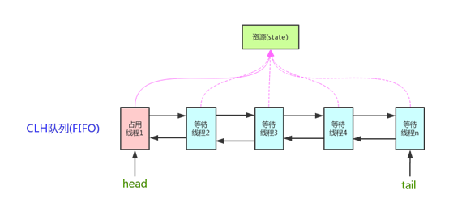
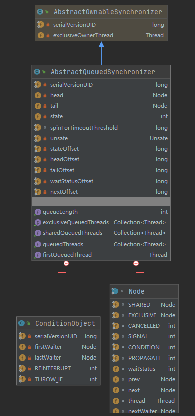
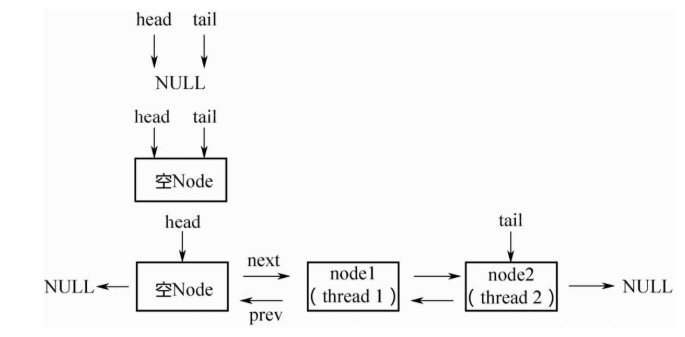
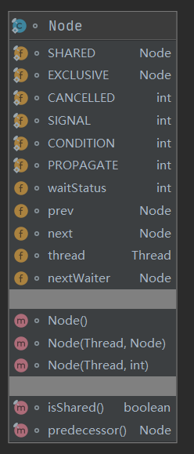
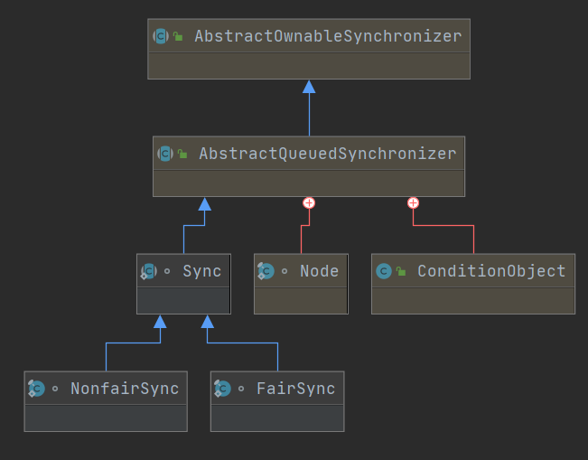
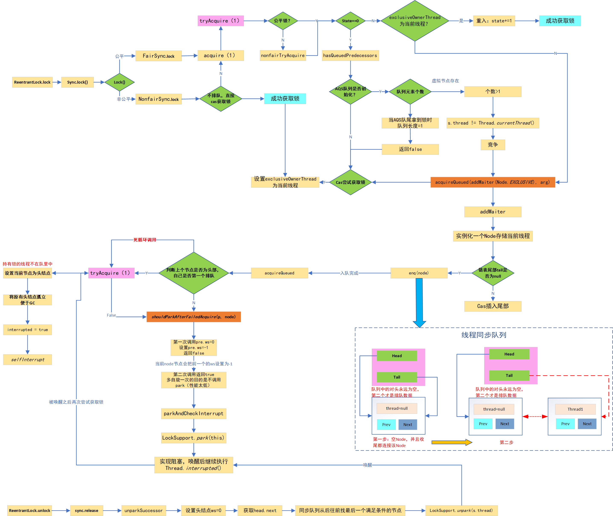
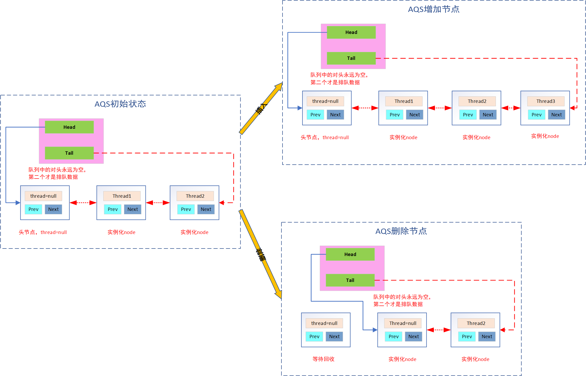

<font color="red">AQS是实现同步器的基础组件，并发包中锁的底层实现就是使用AQS来完成的</font>

## 原理结构

<div align=center>



</div>
<!--more-->


1. 使用`volatile int state`代码共享资源的状态，有三总访问方式
   -  getState()
   -  setState()
   -  compareAndSetState()
2. 多线程竞争资源时使用阻塞的方式进入FIFO双向等待队列
3. 两种资源共享方式
   - Exclusive独占资源-ReentrantLock ，只有一个线程执行
   - Share共享资源-Semaphore/CountDownLatch，多个线程同时执行
4. 自定义同步器在实现时只需要实现共享资源 state 的获取与释放方式即可，至于具体线程等待队列的维护（如获取资源失败入队/ 唤醒出队等），AQS 已经在顶层实现好了。自定义同步器实现时主要实现以下几种方法： 
   - isHeldExclusively()：该线程是否正在独占资源。只有用到 condition 才需要去实现它。 
   - tryAcquire(int)：独占。尝试获取资源，成功true，失败false。 
   - tryRelease(int)：独占。尝试释放资源，成功true，失败false。
   - tryAcquireShared(int)：共享。尝试获取资源。负数表示失败；0 表示成功，但没有剩余可用资源；正数表示成功，且有剩余资源。 
   - tryReleaseShared(int)：共享方式。尝试释放资源，如果释放后允许唤醒后续等待结点返回 true，否则返回 false。 

## 类结构

<div align=center>



</div>

## 锁的实现要点

### state（锁状态）

需要一个state变量，标记该锁的状态,state变量至少有两个值：0、1。对state变量的操作，要确保线程安全，也就是会用到CAS
   
   ```java
    /**
     * The synchronization state.
     * 锁状态
     * 当state=0时，没有线程持有锁，exclusiveOwnerThread=null；
     * 当state=1时，有一个线程持有锁，exclusiveOwnerThread=该线程；
     * 当state>1时，说明该线程重入了该锁。
     */
    private volatile int state;

    /**
     * Returns the current value of synchronization state.
     * This operation has memory semantics of a {@code volatile} read.
     * @return current state value
     */
    protected final int getState() {
        return state;
    }

    /**
     * Sets the value of synchronization state.
     * This operation has memory semantics of a {@code volatile} write.
     * @param newState the new state value
     */
    protected final void setState(int newState) {
        state = newState;
    }

    /**
     * Atomically sets synchronization state to the given updated
     * value if the current state value equals the expected value.
     * This operation has memory semantics of a {@code volatile} read
     * and write.
     *
     * @param expect the expected value
     * @param update the new value
     * @return {@code true} if successful. False return indicates that the actual
     *         value was not equal to the expected value.
     */
    protected final boolean compareAndSetState(int expect, int update) {
        // See below for intrinsics setup to support this
        return unsafe.compareAndSwapInt(this, stateOffset, expect, update);
    }
   ```

### 需要记录当前是哪个线程持有锁。
   
   ```java
    /**
     * The current owner of exclusive mode synchronization.
     * 记录锁被哪个线程持有
     */
    private transient Thread exclusiveOwnerThread;
   ```

### 阻塞与唤醒

需要底层支持对一个线程进行阻塞或唤醒操作,基于LockSupport中的park和Uunpark，实际调用的是Unsafe中的相关方法

    ```java
    public native void unpark(Object var1);
    public native void park(boolean var1, long var2);
    ```

    ```java
    public class LockSupport {
        
        public static void unpark(Thread thread) {
            if (thread != null)
                UNSAFE.unpark(thread);
        }

        public static void park() {
            UNSAFE.park(false, 0L);
        }
    }
    ```

### 阻塞队列


1. FIFO的CLH队列，即CLH队列，提供先来先服务的公平性
2. AQS的同步机制就是依靠CLH队列实现的
3. 队列中维护所有阻塞的线程，该队列**必须线程安全的无锁队列**
4. CLH队列是**FIFO的双端双向链表队列**(方便尾部节点插入)。线程通过AQS获取锁失败，就会将线程封装成一个Node节点，通过**CAS原子操作插入队列尾**。当有线程释放锁时，会尝试让队头的next节点占用锁，AQS具有如下几个特点：
   - 在AQS 同步队列中 -1 表示线程在睡眠状态
   - 当前Node节点线程会把前一个Node.ws = -1
   - 持有锁的线程永远不在队列中
   - 在AQS队列中第二个才是最先排队的线程
   - 如果是交替型任务或者单线程任务，即使用了Lock也不会涉及到AQS 队列
   - 不到万不得已不要轻易park线程，很耗时的！所以排队的头线程会自旋的尝试几个获取锁


   ```java
    /**
     * Head of the wait queue, lazily initialized.  Except for
     * initialization, it is modified only via method setHead.  Note:
     * If head exists, its waitStatus is guaranteed not to be
     * CANCELLED.
     */
    private transient volatile Node head;

    /**
     * Tail of the wait queue, lazily initialized.  Modified only via
     * method enq to add new wait node.
     */
    private transient volatile Node tail;
   ```

<div align=center>



</div>

## 独占式获取

### accquire（非中断）

1. 不可中断获取锁
2. 独占式获取锁
3. 成功则直接返回，否则加入等待队列（**不响应中断**）
4. 获取资源后进行自我中断`selfInterrupt()`

```java
    public final void acquire(int arg) {
        if (!tryAcquire(arg) &&
                // 加入阻塞队列，并且阻塞该线程（自旋获取锁）
                acquireQueued(addWaiter(Node.EXCLUSIVE), arg))
            selfInterrupt();
    }

    /**
     * Convenience method to interrupt current thread.
     * 当前线程发起中断
     */
    static void selfInterrupt() {
        Thread.currentThread().interrupt();
    }
```

#### tryAcquire(arg)

尝试获取锁，**需要子类实现**，一般要求是：
   - 如果该锁没有被另一个线程保持，则获取该锁并立即返回，将锁的保持计数设置为 1。
   - 如果当前线程已经保持该锁，则将保持计数加 1，并且该方法立即返回。
   - 如果该锁被另一个线程保持，则出于线程调度的目的，禁用当前线程，并且在获得锁之前，该线程将一直处于休眠状态，此时锁保持计数被设置为 1。
   ```java
    protected boolean tryAcquire(int arg) {
        throw new UnsupportedOperationException();
    }
   ```


#### addWaiter(Node.EXCLUSIVE)

一旦尝试获取锁未成功，就要使用该方法将其加入同步队列尾部，由于可能有多个线程并发加入队尾产生竞争，因此采用compareAndSetTail锁方法来保证同步

```java
    /**
     * Creates and enqueues node for current thread and given mode.
     * 把当前线程封装成Node，然后把Node放入双向链表的尾部。
     * 注意：只是把当前线程放入队列，线程本身并未阻塞
     *
     * @param mode Node.EXCLUSIVE for exclusive, Node.SHARED for shared
     * @return the new node
     */
    private Node addWaiter(Node mode) {
        // 用当前线程构造一个Node对象，mode是一个表示Node类型的字段，或者说是这个节点是独占的还是共享的
        Node node = new Node(Thread.currentThread(), mode);
        // Try the fast path of enq; backup to full enq on failure
        // 将目前队列中尾部节点给pred
        Node pred = tail;
        // 队列不为空的时候
        if (pred != null) {
            node.prev = pred;
            // 尝试加入队尾，失败之后执行enq(node)
            // 先尝试通过AQS方式修改尾节点为最新的节点，如果修改失败，意味着有并发，
            if (compareAndSetTail(pred, node)) {
                pred.next = node;
                return node;
            }
        }
        //第一次尝试添加尾部失败说明有并发，此时进入自旋
        enq(node);
        return node;
    }
```

#### enq

```java
    /**
     * Inserts node into queue, initializing if necessary. See picture above.
     * 这里进行了循环，如果此时存在了tail就执行同上一步骤的添加队尾操作，如果依然不存在，
     * 就把当前线程作为head结点。插入节点后，调用acquireQueued()进行阻塞
     * @param node the node to insert
     * @return node's predecessor
     */
    private Node enq(final Node node) {
        /**
         * 1. 内部进行队列的初始化，初始化为空的Node
         * 2. 采用自旋的方式尝试加入队尾，直到成功为止
         */
        for (;;) {
            Node t = tail;
            if (t == null) { // Must initialize
                if (compareAndSetHead(new Node()))
                    tail = head;
            } else {
                node.prev = t;
                if (compareAndSetTail(t, node)) {
                    t.next = node;
                    return t;
                }
            }
        }
    }
```

#### acquireQueued(addWaiter(Node.EXCLUSIVE), arg)

一旦加入同步队列，就需要使用该方法，自旋阻塞 唤醒来不断的尝试获取锁，直到被中断或获取到锁。

```java
    /**
     * Acquires in exclusive uninterruptible mode for thread already in
     * queue. Used by condition wait methods as well as acquire.
     *
     * 虽然该函数不会中断响应，但它会记录被阻塞期间有没有其他线程向它发送过中断信号。
     * 如果有，则该函数会返回true；否则，返回false。
     * 当返回true则会执行selfInterrupt（自己给自己发起中断信号）
     *
     * @param node the node
     * @param arg the acquire argument
     * @return {@code true} if interrupted while waiting
     */
    final boolean acquireQueued(final Node node, int arg) {
        boolean failed = true;
        try {
            boolean interrupted = false;
            // 自旋检查当前节点的前驱节点是否为头结点，才能获取锁
            for (;;) {
                // 获取当前节点的上一个节点：Node.prev（前驱节点）
                final Node p = node.predecessor();
                // 处理头结点，如果是头结点则直接返回false，不响应中断(获取锁)
                if (p == head && tryAcquire(arg)) {
                    // 节点中的线程循环的检查，自己的前驱节点是否为头节点
                    // 只有当前节点 前驱节点是头节点才会 再次调用我们实现的方法tryAcquire
                    // 接下来无非就是将当前节点设置为头结点，移除之前的头节点
                    setHead(node);
                    p.next = null; // help GC
                    failed = false;
                    return interrupted;
                }
                // 否则检查前一个节点的状态，看当前获取锁失败的线程是否要挂起
                if (shouldParkAfterFailedAcquire(p, node) &&
                    // 如果需要挂起，借助JUC包下面的LockSupport类的静态方法park挂起当前线程，直到被唤醒
                    parkAndCheckInterrupt())
                    // 两个判断都是true说明 则置true
                    interrupted = true;
            }
        } finally {
            //如果等待过程中没有成功获取资源（如timeout，或者可中断的情况下被中断了），那么取消结点在队列中的等待。
            if (failed)
                //取消请求，将当前节点从队列中移除
                cancelAcquire(node);
        }
    }

    /**
     * Convenience method to park and then check if interrupted
     *
     * @return {@code true} if interrupted
     */
    private final boolean parkAndCheckInterrupt() {
        // 阻塞当前线程，直到被其他线程唤醒
        // 1.其他线程调用了LockSupport.unpark(Thread t)
        // 2.其他线程调用了t.interrupt（）
        LockSupport.park(this);
        // 被唤醒之后，通过Thread.interrupted（）来判断是否被中断唤醒。
        // 如果是情况1，会返回false；如果是情况2，则返回true
        return Thread.interrupted();
    }
```

### acquireInterruptibly（中断式）

1. 如果线程中断则直接抛出`InterruptedException`异常，如果未中断则尝试获取锁
2. 调用`tryAcquire()`获取锁，同accquire（非中断）章节的说明
3. 如果锁空闲则获锁并立即返回，state = 1
4. 如果当前线程已持此锁，state + 1，并且该方法立即返回（可重入）
5. 如果锁被另一个线程保持，出于线程调度目的，禁用当前线程，线程休眠，除非锁由当前线程获得或者当前线程被中断了，中断后会抛出InterruptedException，并且清除当前线程的已中断状态
6. 此方法是一个显式中断点，所以要优先考虑响应中断。

```java
    public final void acquireInterruptibly(int arg)
            throws InterruptedException {
        if (Thread.interrupted())
            throw new InterruptedException();
        if (!tryAcquire(arg))
            doAcquireInterruptibly(arg);
    }

    /**
     * Acquires in exclusive interruptible mode.
     * @param arg the acquire argument
     */
    private void doAcquireInterruptibly(int arg)
        throws InterruptedException {
        final Node node = addWaiter(Node.EXCLUSIVE);
        boolean failed = true;
        try {
            for (;;) {
                final Node p = node.predecessor();
                if (p == head && tryAcquire(arg)) {
                    setHead(node);
                    p.next = null; // help GC
                    failed = false;
                    return;
                }
                if (shouldParkAfterFailedAcquire(p, node) &&
                    parkAndCheckInterrupt())
                    throw new InterruptedException();
            }
        } finally {
            if (failed)
                cancelAcquire(node);
        }
    }
```

### tryAcquireNanos（超时中断）


1. 支持中断，当前线程在超时时间内被中断，抛中断异常后，线程退出
2. 支持超时失败，在指定时间内，线程获取到锁则返回true
3. 到截止时间后线程仍未获取到锁，此时线程获得锁失败，不再等待直接返回false。
4. 原理：
   - 剩余时间小于0那么acquire失败
   - 该时间大于一次自旋锁时间(spinForTimeoutThreshold = 1000)，并且可以被阻塞，那么调用LockSupport.parkNanos方法阻塞线程。

```java
    /**
     * Attempts to acquire in exclusive mode, aborting if interrupted,
     * and failing if the given timeout elapses.  Implemented by first
     * checking interrupt status, then invoking at least once {@link
     * #tryAcquire}, returning on success.  Otherwise, the thread is
     * queued, possibly repeatedly blocking and unblocking, invoking
     * {@link #tryAcquire} until success or the thread is interrupted
     * or the timeout elapses.  This method can be used to implement
     * method {@link Lock#tryLock(long, TimeUnit)}.
     *
     * @param arg the acquire argument.  This value is conveyed to
     *        {@link #tryAcquire} but is otherwise uninterpreted and
     *        can represent anything you like.
     * @param nanosTimeout the maximum number of nanoseconds to wait
     * @return {@code true} if acquired; {@code false} if timed out
     * @throws InterruptedException if the current thread is interrupted
     */
    public final boolean tryAcquireNanos(int arg, long nanosTimeout)
            throws InterruptedException {
        if (Thread.interrupted())
            throw new InterruptedException();
        return tryAcquire(arg) ||
            doAcquireNanos(arg, nanosTimeout);
    }

    /**
     * Acquires in exclusive timed mode.
     *
     * @param arg the acquire argument
     * @param nanosTimeout max wait time
     * @return {@code true} if acquired
     */
    private boolean doAcquireNanos(int arg, long nanosTimeout)
            throws InterruptedException {
        if (nanosTimeout <= 0L)
            return false;
        final long deadline = System.nanoTime() + nanosTimeout;
        final Node node = addWaiter(Node.EXCLUSIVE);
        boolean failed = true;
        try {
            for (;;) {
                final Node p = node.predecessor();
                if (p == head && tryAcquire(arg)) {
                    setHead(node);
                    p.next = null; // help GC
                    failed = false;
                    return true;
                }
                nanosTimeout = deadline - System.nanoTime();
                if (nanosTimeout <= 0L)
                    return false;
                if (shouldParkAfterFailedAcquire(p, node) &&
                    nanosTimeout > spinForTimeoutThreshold)
                    LockSupport.parkNanos(this, nanosTimeout);
                if (Thread.interrupted())
                    throw new InterruptedException();
            }
        } finally {
            if (failed)
                cancelAcquire(node);
        }
    }
```


## 共享式获取

### acquireShared

```java
    /**
     * Acquires in shared mode, ignoring interrupts.  Implemented by
     * first invoking at least once {@link #tryAcquireShared},
     * returning on success.  Otherwise the thread is queued, possibly
     * repeatedly blocking and unblocking, invoking {@link
     * #tryAcquireShared} until success.
     *
     * @param arg the acquire argument.  This value is conveyed to
     *        {@link #tryAcquireShared} but is otherwise uninterpreted
     *        and can represent anything you like.
     */
    public final void acquireShared(int arg) {
        if (tryAcquireShared(arg) < 0)
            doAcquireShared(arg);
    }
```

#### tryAcquireShared(arg) 

**模板方法**，尝试获得资源，返回值代表如下含义：**负数表示失败。0 表示成功，但没有剩余可用资源。正数表示成功，且有剩余资源**。

```java
    /**
     * Attempts to acquire in shared mode. This method should query if
     * the state of the object permits it to be acquired in the shared
     * mode, and if so to acquire it.
     *
     * <p>This method is always invoked by the thread performing
     * acquire.  If this method reports failure, the acquire method
     * may queue the thread, if it is not already queued, until it is
     * signalled by a release from some other thread.
     *
     * <p>The default implementation throws {@link
     * UnsupportedOperationException}.
     *
     * @param arg the acquire argument. This value is always the one
     *        passed to an acquire method, or is the value saved on entry
     *        to a condition wait.  The value is otherwise uninterpreted
     *        and can represent anything you like.
     * @return a negative value on failure; zero if acquisition in shared
     *         mode succeeded but no subsequent shared-mode acquire can
     *         succeed; and a positive value if acquisition in shared
     *         mode succeeded and subsequent shared-mode acquires might
     *         also succeed, in which case a subsequent waiting thread
     *         must check availability. (Support for three different
     *         return values enables this method to be used in contexts
     *         where acquires only sometimes act exclusively.)  Upon
     *         success, this object has been acquired.
     * @throws IllegalMonitorStateException if acquiring would place this
     *         synchronizer in an illegal state. This exception must be
     *         thrown in a consistent fashion for synchronization to work
     *         correctly.
     * @throws UnsupportedOperationException if shared mode is not supported
     */
    protected int tryAcquireShared(int arg) {
        throw new UnsupportedOperationException();
    }
```

#### doAcquireShared

创建节点然后加入到队列中去，这一块和独占模式下的 **addWaiter** 代码差不多，不同的是结点的模式是SHARED，在独占模式 EXCLUSIVE。

```java
    /**
     * Acquires in shared uninterruptible mode.
     * @param arg the acquire argument
     */
    private void doAcquireShared(int arg) {
        final Node node = addWaiter(Node.SHARED);
        boolean failed = true;
        try {
            boolean interrupted = false;
            for (;;) {
                final Node p = node.predecessor();
                if (p == head) {
                    int r = tryAcquireShared(arg);
                    if (r >= 0) {
                        setHeadAndPropagate(node, r);
                        p.next = null; // help GC
                        if (interrupted)
                            selfInterrupt();
                        failed = false;
                        return;
                    }
                }
                if (shouldParkAfterFailedAcquire(p, node) &&
                    parkAndCheckInterrupt())
                    interrupted = true;
            }
        } finally {
            if (failed)
                cancelAcquire(node);
        }
    }
```

### acquireSharedInterruptibly（共享中断）

```java
    /**
     * Acquires in shared mode, aborting if interrupted.  Implemented
     * by first checking interrupt status, then invoking at least once
     * {@link #tryAcquireShared}, returning on success.  Otherwise the
     * thread is queued, possibly repeatedly blocking and unblocking,
     * invoking {@link #tryAcquireShared} until success or the thread
     * is interrupted.
     * @param arg the acquire argument.
     * This value is conveyed to {@link #tryAcquireShared} but is
     * otherwise uninterpreted and can represent anything
     * you like.
     * @throws InterruptedException if the current thread is interrupted
     */
    public final void acquireSharedInterruptibly(int arg)
            throws InterruptedException {
        if (Thread.interrupted())
            throw new InterruptedException();
        // tryAcquireShared由具体的子类实现
        if (tryAcquireShared(arg) < 0)
            doAcquireSharedInterruptibly(arg);
    }

    /**
     * Acquires in shared interruptible mode.
     * @param arg the acquire argument
     */
    private void doAcquireSharedInterruptibly(int arg)
        throws InterruptedException {
        final Node node = addWaiter(Node.SHARED);
        boolean failed = true;
        try {
            for (;;) {
                final Node p = node.predecessor();
                if (p == head) {
                    int r = tryAcquireShared(arg);
                    if (r >= 0) {
                        setHeadAndPropagate(node, r);
                        p.next = null; // help GC
                        failed = false;
                        return;
                    }
                }
                if (shouldParkAfterFailedAcquire(p, node) &&
                    parkAndCheckInterrupt())
                    throw new InterruptedException();
            }
        } finally {
            if (failed)
                cancelAcquire(node);
        }
    }
```

### tryAcquireSharedNanos（超时中断）

```java
    /**
     * Attempts to acquire in shared mode, aborting if interrupted, and
     * failing if the given timeout elapses.  Implemented by first
     * checking interrupt status, then invoking at least once {@link
     * #tryAcquireShared}, returning on success.  Otherwise, the
     * thread is queued, possibly repeatedly blocking and unblocking,
     * invoking {@link #tryAcquireShared} until success or the thread
     * is interrupted or the timeout elapses.
     *
     * @param arg the acquire argument.  This value is conveyed to
     *        {@link #tryAcquireShared} but is otherwise uninterpreted
     *        and can represent anything you like.
     * @param nanosTimeout the maximum number of nanoseconds to wait
     * @return {@code true} if acquired; {@code false} if timed out
     * @throws InterruptedException if the current thread is interrupted
     */
    public final boolean tryAcquireSharedNanos(int arg, long nanosTimeout)
            throws InterruptedException {
        if (Thread.interrupted())
            throw new InterruptedException();
        return tryAcquireShared(arg) >= 0 ||
            doAcquireSharedNanos(arg, nanosTimeout);
    }

    /**
     * Acquires in shared timed mode.
     *
     * @param arg the acquire argument
     * @param nanosTimeout max wait time
     * @return {@code true} if acquired
     */
    private boolean doAcquireSharedNanos(int arg, long nanosTimeout)
            throws InterruptedException {
        if (nanosTimeout <= 0L)
            return false;
        final long deadline = System.nanoTime() + nanosTimeout;
        final Node node = addWaiter(Node.SHARED);
        boolean failed = true;
        try {
            for (;;) {
                final Node p = node.predecessor();
                if (p == head) {
                    int r = tryAcquireShared(arg);
                    if (r >= 0) {
                        setHeadAndPropagate(node, r);
                        p.next = null; // help GC
                        failed = false;
                        return true;
                    }
                }
                nanosTimeout = deadline - System.nanoTime();
                if (nanosTimeout <= 0L)
                    return false;
                if (shouldParkAfterFailedAcquire(p, node) &&
                    nanosTimeout > spinForTimeoutThreshold)
                    LockSupport.parkNanos(this, nanosTimeout);
                if (Thread.interrupted())
                    throw new InterruptedException();
            }
        } finally {
            if (failed)
                cancelAcquire(node);
        }
    }
```

## 独占式释放

1. 调用`unlock`方法，实际调用`AQS的release`方法
2. 如果同步状态释放成功（tryRelease返回true）则会执行if块中的代码，当head指向的头结点不为null，并且该节点的状态值不为0的话才会执行unparkSuccessor()方法。

```java
    /**
     * Releases in exclusive mode.  Implemented by unblocking one or
     * more threads if {@link #tryRelease} returns true.
     * This method can be used to implement method {@link Lock#unlock}.
     *
     * @param arg the release argument.  This value is conveyed to
     *        {@link #tryRelease} but is otherwise uninterpreted and
     *        can represent anything you like.
     * @return the value returned from {@link #tryRelease}
     */
    public final boolean release(int arg) {
        // 释放锁
        if (tryRelease(arg)) {
            Node h = head;
            if (h != null && h.waitStatus != 0)
                // 唤醒队列中的后继者
                unparkSuccessor(h);
            return true;
        }
        return false;
    }
```

### tryRelease（模板方法）

```java
    /**
     * Attempts to set the state to reflect a release in exclusive
     * mode.
     *
     * <p>This method is always invoked by the thread performing release.
     *
     * <p>The default implementation throws
     * {@link UnsupportedOperationException}.
     *
     * @param arg the release argument. This value is always the one
     *        passed to a release method, or the current state value upon
     *        entry to a condition wait.  The value is otherwise
     *        uninterpreted and can represent anything you like.
     * @return {@code true} if this object is now in a fully released
     *         state, so that any waiting threads may attempt to acquire;
     *         and {@code false} otherwise.
     * @throws IllegalMonitorStateException if releasing would place this
     *         synchronizer in an illegal state. This exception must be
     *         thrown in a consistent fashion for synchronization to work
     *         correctly.
     * @throws UnsupportedOperationException if exclusive mode is not supported
     */
    protected boolean tryRelease(int arg) {
        throw new UnsupportedOperationException();
    }
```

## 共享式释放

```java
    /**
     * Releases in shared mode.  Implemented by unblocking one or more
     * threads if {@link #tryReleaseShared} returns true.
     *
     * @param arg the release argument.  This value is conveyed to
     *        {@link #tryReleaseShared} but is otherwise uninterpreted
     *        and can represent anything you like.
     * @return the value returned from {@link #tryReleaseShared}
     */
    public final boolean releaseShared(int arg) {
        if (tryReleaseShared(arg)) {// 由具体子类实现
            doReleaseShared();//一次性唤醒队列中所有阻塞的线程
            return true;
        }
        return false;
    }
```

### tryReleaseShared（模板方法）

```java
    /**
     * Attempts to set the state to reflect a release in shared mode.
     *
     * <p>This method is always invoked by the thread performing release.
     *
     * <p>The default implementation throws
     * {@link UnsupportedOperationException}.
     *
     * @param arg the release argument. This value is always the one
     *        passed to a release method, or the current state value upon
     *        entry to a condition wait.  The value is otherwise
     *        uninterpreted and can represent anything you like.
     * @return {@code true} if this release of shared mode may permit a
     *         waiting acquire (shared or exclusive) to succeed; and
     *         {@code false} otherwise
     * @throws IllegalMonitorStateException if releasing would place this
     *         synchronizer in an illegal state. This exception must be
     *         thrown in a consistent fashion for synchronization to work
     *         correctly.
     * @throws UnsupportedOperationException if shared mode is not supported
     */
    protected boolean tryReleaseShared(int arg) {
        throw new UnsupportedOperationException();
    }
```

### doReleaseShared

```java
    /**
     * Release action for shared mode -- signals successor and ensures
     * propagation. (Note: For exclusive mode, release just amounts
     * to calling unparkSuccessor of head if it needs signal.)
     */
    private void doReleaseShared() {
        /*
         * Ensure that a release propagates, even if there are other
         * in-progress acquires/releases.  This proceeds in the usual
         * way of trying to unparkSuccessor of head if it needs
         * signal. But if it does not, status is set to PROPAGATE to
         * ensure that upon release, propagation continues.
         * Additionally, we must loop in case a new node is added
         * while we are doing this. Also, unlike other uses of
         * unparkSuccessor, we need to know if CAS to reset status
         * fails, if so rechecking.
         */
        for (;;) {
            Node h = head;
            if (h != null && h != tail) {
                int ws = h.waitStatus;
                if (ws == Node.SIGNAL) {
                    if (!compareAndSetWaitStatus(h, Node.SIGNAL, 0))
                        continue;            // loop to recheck cases
                    unparkSuccessor(h);
                }
                else if (ws == 0 &&
                         !compareAndSetWaitStatus(h, 0, Node.PROPAGATE))
                    continue;                // loop on failed CAS
            }
            if (h == head)                   // loop if head changed
                break;
        }
    }
```

## CLH

> 是一个自旋锁，能确保无饥饿性，提供先来先服务的公平性。
> CLH 锁也是一种基于链表的可扩展、高性能、公平的自旋锁，申请线程只在本地变量上自旋，它不断轮询前驱的状态，如果发现前驱释放了锁就结束自旋。

## Node

### 类图

<div align=center>



</div>

### Node源码

```java
    static final class Node {
        /** 共享锁标识 */
        static final Node SHARED = new Node();
        /** 独占锁标识 */
        static final Node EXCLUSIVE = null;

        /** waitStatus value to indicate thread has cancelled */
        static final int CANCELLED =  1;
        /** waitStatus value to indicate successor's thread needs unparking */
        static final int SIGNAL    = -1;
        /** waitStatus value to indicate thread is waiting on condition */
        static final int CONDITION = -2;
        /**
         * waitStatus value to indicate the next acquireShared should
         * unconditionally propagate
         */
        static final int PROPAGATE = -3;

        /**
         * Status field, taking on only the values:
         *   SIGNAL:     The successor of this node is (or will soon be)
         *               blocked (via park), so the current node must
         *               unpark its successor when it releases or
         *               cancels. To avoid races, acquire methods must
         *               first indicate they need a signal,
         *               then retry the atomic acquire, and then,
         *               on failure, block.
         *   CANCELLED:  This node is cancelled due to timeout or interrupt.
         *               Nodes never leave this state. In particular,
         *               a thread with cancelled node never again blocks.
         *   CONDITION:  This node is currently on a condition queue.
         *               It will not be used as a sync queue node
         *               until transferred, at which time the status
         *               will be set to 0. (Use of this value here has
         *               nothing to do with the other uses of the
         *               field, but simplifies mechanics.)
         *   PROPAGATE:  A releaseShared should be propagated to other
         *               nodes. This is set (for head node only) in
         *               doReleaseShared to ensure propagation
         *               continues, even if other operations have
         *               since intervened.
         *   0:          None of the above
         *
         * The values are arranged numerically to simplify use.
         * Non-negative values mean that a node doesn't need to
         * signal. So, most code doesn't need to check for particular
         * values, just for sign.
         *
         * The field is initialized to 0 for normal sync nodes, and
         * CONDITION for condition nodes.  It is modified using CAS
         * (or when possible, unconditional volatile writes).
         */
        volatile int waitStatus;

        /** 前置节点 */
        volatile Node prev;

        /** 后置节点 */
        volatile Node next;

        /**
         * The thread that enqueued this node.  Initialized on
         * construction and nulled out after use.
         * 获取锁失败的线程保存在Node节点中。
         */
        volatile Thread thread;

        /**
         * Link to next node waiting on condition, or the special
         * value SHARED.  Because condition queues are accessed only
         * when holding in exclusive mode, we just need a simple
         * linked queue to hold nodes while they are waiting on
         * conditions. They are then transferred to the queue to
         * re-acquire. And because conditions can only be exclusive,
         * we save a field by using special value to indicate shared
         * mode.
         * 当我们调用了Condition后他也有一个等待队列
         */
        Node nextWaiter;

        /**
         * Returns true if node is waiting in shared mode.
         */
        final boolean isShared() {
            return nextWaiter == SHARED;
        }

        /**
         * Returns previous node, or throws NullPointerException if null.
         * Use when predecessor cannot be null.  The null check could
         * be elided, but is present to help the VM.
         *
         * @return the predecessor of this node
         */
        final Node predecessor() throws NullPointerException {
            Node p = prev;
            if (p == null)
                throw new NullPointerException();
            else
                return p;
        }
    }
```

### waitStatus说明

1. CANCELLED = 1：当前节点已被取消调度。触发条件：超时或被中断（响应中断的情况下）；进入该状态后的结点将不会再变化。
2. SIGNAL = -1：后续节点等待当前节点唤醒；后继结点入队时，会将前继结点的状态更新为 SIGNAL。
3. CONDITION = -2：结点等待在 Condition 上，当其他线程调用了 Condition 的 signal() 方法后，CONDITION状态的结点将从等待队列转移到同步队列中，等待获取同步锁。
4. PROPAGATE = -3：共享模式下，前继结点不仅会唤醒其后继结点，同时也可能会唤醒后继的后继结点。
5. INITIAL = 0：新结点入队时的默认状态。

## 公平锁与非公平锁

<div align=center>



</div>

ReentrantLock中的实现：

```java
    /**
     * Sync object for non-fair locks
     */
    static final class NonfairSync extends Sync {

        /**
         * Performs lock.  Try immediate barge, backing up to normal
         * acquire on failure.
         */
        final void lock() {
            /**
             * 直接尝试获取锁，不考虑队列中是否存在其他线程
             */
            if (compareAndSetState(0, 1))
                setExclusiveOwnerThread(Thread.currentThread());
            else
                acquire(1);
        }
    }

    /**
     * Sync object for fair locks
     */
    static final class FairSync extends Sync {

        final void lock() {
            acquire(1);
        }
    }
```

### Sync默认实现非公平锁

```java
    abstract static class Sync extends AbstractQueuedSynchronizer {

        /**
         * Performs non-fair tryLock.  tryAcquire is implemented in
         * subclasses, but both need nonfair try for trylock method.
         */
        final boolean nonfairTryAcquire(int acquires) {
            final Thread current = Thread.currentThread();
            int c = getState();
            if (c == 0) {// 无锁情况下，进行抢锁
                if (compareAndSetState(0, acquires)) {
                    // 获取到锁，星期设置当前线程获取该锁
                    setExclusiveOwnerThread(current);
                    return true;
                }
            }
            //重入，只需要更新state
            else if (current == getExclusiveOwnerThread()) {
                int nextc = c + acquires;
                if (nextc < 0) // overflow
                    throw new Error("Maximum lock count exceeded");
                setState(nextc);
                return true;
            }
            return false;
        }
    }
```

### FairSync.tryAcquire

```java
    static final class FairSync extends Sync {
        /**
         * Fair version of tryAcquire.  Don't grant access unless
         * recursive call or no waiters or is first.
         */
        protected final boolean tryAcquire(int acquires) {
            final Thread current = Thread.currentThread();
            int c = getState();
            if (c == 0) {
                // 只有当c==0（没有线程持有锁），并且排在队列的第1个时（即当队列中没有其他线程的时候），
                // 才去抢锁，否则继续排队
                if (!hasQueuedPredecessors() &&
                    compareAndSetState(0, acquires)) {
                    setExclusiveOwnerThread(current);
                    return true;
                }
            }
            else if (current == getExclusiveOwnerThread()) {
                int nextc = c + acquires;
                if (nextc < 0)
                    throw new Error("Maximum lock count exceeded");
                setState(nextc);
                return true;
            }
            return false;
        }
    }
```

## 原理分析（ReentrantLock）

<div align=center>



</div>

### 独占式加入同步队列

1. [tryAcquire](#tryAcquire-arg)：在ReentrantLock中分为公平实现和非公平实现（区别是否调用方法`hasQueuedPredecessors`）。
   
   ```java
        /**
         * Fair version of tryAcquire.  Don't grant access unless
         * recursive call or no waiters or is first.
         */
        protected final boolean tryAcquire(int acquires) {
            final Thread current = Thread.currentThread();
            int c = getState();
            if (c == 0) {
                // 只有当c==0（没有线程持有锁），并且排在队列的第1个时（即当队列中没有其他线程的时候），
                // 才去抢锁，否则继续排队
                if (!hasQueuedPredecessors() &&
                    compareAndSetState(0, acquires)) {
                    setExclusiveOwnerThread(current);
                    return true;
                }
            }
            else if (current == getExclusiveOwnerThread()) {
                int nextc = c + acquires;
                if (nextc < 0)
                    throw new Error("Maximum lock count exceeded");
                setState(nextc);
                return true;
            }
            return false;
        }
   ```

2. [addWaiter(Node.EXCLUSIVE,arg)](#addWaiter-Node-EXCLUSIVE)：如果尝试获取同步状态失败的话,则构造同步节点（独占式的Node.EXCLUSIVE），通过addWaiter(Node node,int args)方法将该节点加入到同步队列的队尾
3. [enq](#enq)：自旋enq 方法将并发添加节点的请求通过CAS跟自旋将尾节点的添加变得串行化起来。说白了就是让节点放到正确的队尾位置。
4. [acquireQueued](#acquireQueued-addWaiter-Node-EXCLUSIVE-arg)： 是当前Node节点线程在死循环中获取同步状态，而只有前驱节点是头节点才能尝试获取锁，原因是：头结点是成功获取同步状态（锁）的节点，而头节点的线程释放了同步状态以后，将会唤醒其后继节点，后继节点的线程被唤醒后要检查自己的前驱节点是否为头结点。维护同步队列的FIFO原则，节点进入同步队列之后，会尝试自旋几次。
5. shouldParkAfterFailedAcquire
   
   ```java
    /**
     * Checks and updates status for a node that failed to acquire.
     * Returns true if thread should block. This is the main signal
     * control in all acquire loops.  Requires that pred == node.prev.
     *
     * @param pred node's predecessor holding status
     * @param node the node
     * @return {@code true} if thread should block
     */
    private static boolean shouldParkAfterFailedAcquire(Node pred, Node node) {
        // 获得前驱节点的状态
        int ws = pred.waitStatus;
        if (ws == Node.SIGNAL)
            /*
             * This node has already set status asking a release
             * to signal it, so it can safely park.
             */
            // 2. 返回true，并且执行parkAndCheckInterrupt
            return true;
        if (ws > 0) {
            /*
             * Predecessor was cancelled. Skip over predecessors and
             * indicate retry.
             */
            // 3. 当pred所维护的获取请求被取消时（也就是node.waitStatus = CANCELLED，
            // 这时就会循环移除所有被取消的前继节点pred，直到找到未被取消的pred。
            // 移除所有被取消的前继节点后，直接返回false
            do {
                node.prev = pred = pred.prev;
            } while (pred.waitStatus > 0);
            pred.next = node;
        } else {
            /*
             * waitStatus must be 0 or PROPAGATE.  Indicate that we
             * need a signal, but don't park yet.  Caller will need to
             * retry to make sure it cannot acquire before parking.
             */
            // 1. addWaiter方法调用时执行该方法（初次设置），设置为SIGNAL，并且返回false，继续执行acquireQueued
            compareAndSetWaitStatus(pred, ws, Node.SIGNAL);
        }
        return false;
    }
   ```

6. [parkAndCheckInterrupt](#acquireQueued-addWaiter-Node-EXCLUSIVE-arg) 主要任务是暂停当前线程然后查看是否已经暂停了
7. cancelAcquireacquireQueued方法的finally会判断 failed值，正常运行时候自旋出来的时候会是false，如果中断或者timeout了 则会是true，执行cancelAcquire，其中核心代码是node.waitStatus = Node.CANCELLED
8. [selfInterrupt](#accquire（非中断）)

### 独占式释放队列头节点

release()会调用tryRelease方法尝试释放当前线程持有的锁，成功的话唤醒后继线程，并返回true，否则直接返回false。

1. tryRelease 这个是子类需要自我实现的，没啥说的根据业务需要实现。
2. unparkSuccessor 唤醒头结点的后继节点。

```java
    /**
     * Wakes up node's successor, if one exists.
     *
     * @param node the node
     */
    private void unparkSuccessor(Node node) {
        /*
         * If status is negative (i.e., possibly needing signal) try
         * to clear in anticipation of signalling.  It is OK if this
         * fails or if status is changed by waiting thread.
         */
        // 获得头节点状态
        int ws = node.waitStatus;
        if (ws < 0)
            // 如果头节点装小于0 则将其置为0
            compareAndSetWaitStatus(node, ws, 0);

        /*
         * Thread to unpark is held in successor, which is normally
         * just the next node.  But if cancelled or apparently null,
         * traverse backwards from tail to find the actual
         * non-cancelled successor.
         */
        // 这个是新的头节点
        Node s = node.next;
        if (s == null || s.waitStatus > 0) {
            // 如果新头节点不满足要求
            s = null;
            for (Node t = tail; t != null && t != node; t = t.prev)
                // 从队列尾部开始往前去找最前面的一个waitStatus小于0的节点
                if (t.waitStatus <= 0)
                    s = t;
        }
        if (s != null)
            // 唤醒后继节点对应的线程
            LockSupport.unpark(s.thread);
    }
```

### AQS队列处理过程

<div align=center>



</div>

## 参考

1. [由浅入深逐步讲解Java并发的半壁江山—AQS（上文）](https://www.toutiao.com/i6909690004134527492)
2. [由浅入深逐步讲解Java并发的半壁江山—AQS（下文）](https://www.toutiao.com/i6909690786577924611)