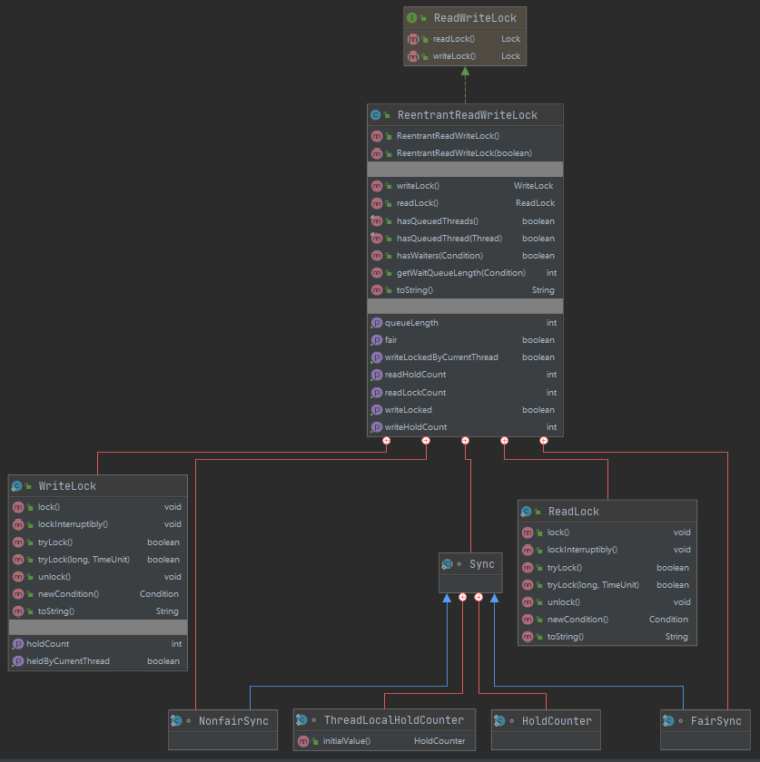

<div align=center>



</div>
<!--more-->

## 实现原理

### 初始化

```java
/**
* Creates a new {@code ReentrantReadWriteLock} with
* the given fairness policy.
*
* @param fair {@code true} if this lock should use a fair ordering policy
*/
public ReentrantReadWriteLock(boolean fair) {
    sync = fair ? new FairSync() : new NonfairSync();
    readerLock = new ReadLock(this);
    writerLock = new WriteLock(this);
}
```

通过ReentrantReadWriteLock的构造函数可知：

1. 支持公平/非公平模式
2. 读写锁使用同一把锁（两个视图），及sync = lock.sync;

### 锁状态

读写锁也是用state变量来表示锁状态的。只是state变量在这里的含义和互斥锁完全不同。在内部类Sync中，对state变量进行了重新定义：

```java
/**
* Synchronization implementation for ReentrantReadWriteLock.
* Subclassed into fair and nonfair versions.
*/
abstract static class Sync extends AbstractQueuedSynchronizer {
    /*
    * Read vs write count extraction constants and functions.
    * Lock state is logically divided into two unsigned shorts:
    * 锁状态被拆分成两种无符号状态，高位16和低16
    * The lower one representing the exclusive (writer) lock hold count,
    * and the upper the shared (reader) hold count.
    * 高位16：记录读锁，可以表示n个线程获取锁或一个线程重入n次
    * 低位16：记录写锁，一个线程重入n次（写锁互斥，所以只能一个线程独占）
    */
    static final int SHARED_SHIFT   = 16;
    static final int SHARED_UNIT    = (1 << SHARED_SHIFT);
    static final int MAX_COUNT      = (1 << SHARED_SHIFT) - 1;
    static final int EXCLUSIVE_MASK = (1 << SHARED_SHIFT) - 1;

    /** Returns the number of shared holds represented in count  */
    // 读锁重入次数
    static int sharedCount(int c)    { return c >>> SHARED_SHIFT; }
    /** Returns the number of exclusive holds represented in count  */
    // 写锁重入次数
    static int exclusiveCount(int c) { return c & EXCLUSIVE_MASK; }
}
```

### 队列