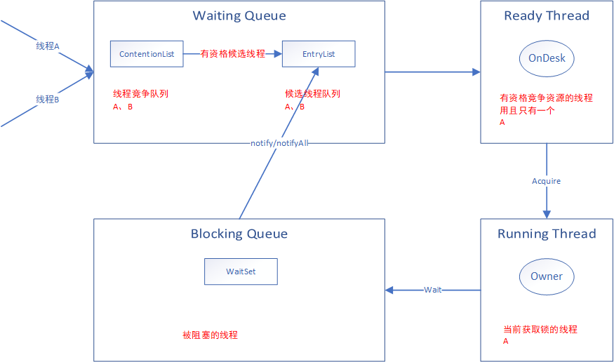

## 特点

1. 任意非NULL对象当作锁
2. 独占式悲观锁
3. 可重入锁
<!--more-->

## Synchronized 语义

1. 同步语法，在JDK1.6之后增加了锁的优化，包括偏向锁、轻量锁、自旋
2. 代码块语义：编译之后在进入同步代码之前写入`monitorenter`字节码指令，执行完成写入`monitorexit`指令（异常退出的时候也会写入该指令） 
3. 方法同步语义：`ACC_SYNCHRONIZED`
4. 锁对象：使用reference类型指明加锁和加锁的对象（自定义对象、this、当前class）
5. 锁计数：通过锁的**计数器**来判断是否释放锁，在执行monitorenter指令时，首先要去尝试获取对象的锁，获取锁或当前拥有锁则计数器+1；执行monitorexit指令时会将锁计数器的值减一；一旦计数器的值为零，锁随即就被释放了
6. 如果获取对象锁失败，那当前线程就应当被阻塞等待，直到请求锁定的对象被持有它的线程释放为止
7. 支持可重入，防止死锁
8. 独占锁，不能强制已经获取锁的线程释放锁；不能强制正在等待锁的线程中断等待或超时退出
9. 作用粒度：对象，用来实现临界资源的同步互斥访问

## Synchronized 作用范围
 
1. 普通同步方法：使用当前实例锁定
2. 静态同步方法：锁是当前类的Class实例，Class数据存在永久代中，是该类的一个全局锁
3. 同步代码块：使用代码块中定义的对象（this、自定义对象、class对象）

## Synchronized 核心组件

1. Wait Set：调用 wait 方法被阻塞的线程被放置在这里； 
2. Contention List：竞争队列，所有请求锁的线程首先被放在这个竞争队列中； 
3. Entry List：Contention List 中那些有资格成为候选资源的线程被移动到 Entry List 中； 
4. OnDeck：任意时刻，最多只有一个线程正在竞争锁资源，该线程被称为 OnDeck； 
5. Owner：当前已经获取到所资源的线程被称为 Owner； 
6. !Owner：当前释放锁的线程。 

```c
ObjectMonitor() {
    _header       = NULL;  // markOop对象头
    _count        = 0;     // 重入次数
    _waiters      = 0,     // 等待线程数
    _recursions   = 0;     // 重入次数
    _object       = NULL;
    _owner        = NULL;  // 指向获得ObjectMonitor对象的线程
    _WaitSet      = NULL;  // 处于wait状态的线程，会被加入到waitset中
    _WaitSetLock  = 0 ;
    _Responsible  = NULL ;
    _succ         = NULL ;
    _cxq          = NULL ; // JVM为每个尝试进入synchronized代码段的线程创建一个ObjectWaiter并添加到该队列
    FreeNext      = NULL ;
    _EntryList    = NULL ; // 处于等待block状态的线程，由ObjectWaiter组成的双向链表
                           // JVM会从该链表中获取一个ObjectWaiter并唤醒对应的JavaThread
    _SpinFreq     = 0 ;
    _SpinClock    = 0 ;
    OwnerIsThread = 0 ;
    _previous_owner_tid = 0; // 监视器前一个拥有者的线程ID
  }
```

## Synchronized 实现原理

重量锁的实现依赖于对象中的警示器monitor，本质依赖于操作系统中的Mutex Lock；

<div align=center>



</div>

1. 线程首先会进入ContentionList队列，JVM复制部分线程到EntryList，JVM从EntryList的尾部获取后选择线程（OnDeck）
   - 为了解决并发进程引入EntryList队列（候选者竞争队列） 
   - 处于 ContentionList、EntryList、WaitSet 中的线程都处于阻塞状态，该阻塞是由操作系统来完成的(Linux 内核下采用 pthread_mutex_lock 内核函数实现的);
2. 当进入OnDeck中的线程获取锁之后：
   - 修改_owner为当前线程
   - 修改markword（地址+状态10）
   - 阻塞后续线程到ContentionList
3. Owner释放锁或则阻塞：
   - 释放锁： 执行1（需要重新竞争锁、提高吞吐量，称为“竞争切换”）
   - 阻塞（wait）：转移到WaitSet，并且释放锁，只有notify 或者 notifyAll 唤醒，会重新进去EntryList中 

## 代码

```java
package com.sunld.thread.lock;

/**
 * @author : sunliaodong
 * @version : V1.0.0
 * @description: TODO
 * @date : 2020/5/30 19:00
 */
public class TestSynchronized {
    
    public synchronized static void test1(){

    }

    public synchronized void test2(){

    }

    public void test3(){
        synchronized(this){

        }
    }

    public static void test4(){
        synchronized(TestSynchronized.class){

        }
    }

    public static void main(String[] args) {

    }
    
}
```

### javap分析

```java
"C:\Program Files\Java\jdk1.8.0_152\bin\javap.exe" -v -c com.sunld.thread.lock.TestSynchronized
Classfile /D:/workspace/learning/target/classes/com/sunld/thread/lock/TestSynchronized.class
  Last modified 2020-5-30; size 834 bytes
  MD5 checksum 9806782e622d7e5e193f3d1b5b8cf61e
  Compiled from "TestSynchronized.java"
public class com.sunld.thread.lock.TestSynchronized
  minor version: 0
  major version: 52
  flags: ACC_PUBLIC, ACC_SUPER
Constant pool:
   #1 = Methodref          #3.#25         // java/lang/Object."<init>":()V
   #2 = Class              #26            // com/sunld/thread/lock/TestSynchronized
   #3 = Class              #27            // java/lang/Object
   #4 = Utf8               <init>
   #5 = Utf8               ()V
   #6 = Utf8               Code
   #7 = Utf8               LineNumberTable
   #8 = Utf8               LocalVariableTable
   #9 = Utf8               this
  #10 = Utf8               Lcom/sunld/thread/lock/TestSynchronized;
  #11 = Utf8               test1
  #12 = Utf8               test2
  #13 = Utf8               test3
  #14 = Utf8               StackMapTable
  #15 = Class              #26            // com/sunld/thread/lock/TestSynchronized
  #16 = Class              #27            // java/lang/Object
  #17 = Class              #28            // java/lang/Throwable
  #18 = Utf8               test4
  #19 = Utf8               main
  #20 = Utf8               ([Ljava/lang/String;)V
  #21 = Utf8               args
  #22 = Utf8               [Ljava/lang/String;
  #23 = Utf8               SourceFile
  #24 = Utf8               TestSynchronized.java
  #25 = NameAndType        #4:#5          // "<init>":()V
  #26 = Utf8               com/sunld/thread/lock/TestSynchronized
  #27 = Utf8               java/lang/Object
  #28 = Utf8               java/lang/Throwable
{
  public com.sunld.thread.lock.TestSynchronized();
    descriptor: ()V
    flags: ACC_PUBLIC
    Code:
      stack=1, locals=1, args_size=1
         0: aload_0
         1: invokespecial #1                  // Method java/lang/Object."<init>":()V
         4: return
      LineNumberTable:
        line 9: 0
      LocalVariableTable:
        Start  Length  Slot  Name   Signature
            0       5     0  this   Lcom/sunld/thread/lock/TestSynchronized;

  public static synchronized void test1();
    descriptor: ()V
    flags: ACC_PUBLIC, ACC_STATIC, ACC_SYNCHRONIZED
    Code:
      stack=0, locals=0, args_size=0
         0: return
      LineNumberTable:
        line 13: 0

  public synchronized void test2();
    descriptor: ()V
    flags: ACC_PUBLIC, ACC_SYNCHRONIZED
    Code:
      stack=0, locals=1, args_size=1
         0: return
      LineNumberTable:
        line 17: 0
      LocalVariableTable:
        Start  Length  Slot  Name   Signature
            0       1     0  this   Lcom/sunld/thread/lock/TestSynchronized;

  public void test3();
    descriptor: ()V
    flags: ACC_PUBLIC
    Code:
      stack=2, locals=3, args_size=1
         0: aload_0
         1: dup
         2: astore_1
         3: monitorenter
         4: aload_1
         5: monitorexit
         6: goto          14
         9: astore_2
        10: aload_1
        11: monitorexit
        12: aload_2
        13: athrow
        14: return
      Exception table:
         from    to  target type
             4     6     9   any
             9    12     9   any
      LineNumberTable:
        line 20: 0
        line 22: 4
        line 23: 14
      LocalVariableTable:
        Start  Length  Slot  Name   Signature
            0      15     0  this   Lcom/sunld/thread/lock/TestSynchronized;
      StackMapTable: number_of_entries = 2
        frame_type = 255 /* full_frame */
          offset_delta = 9
          locals = [ class com/sunld/thread/lock/TestSynchronized, class java/lang/Object ]
          stack = [ class java/lang/Throwable ]
        frame_type = 250 /* chop */
          offset_delta = 4

  public static void test4();
    descriptor: ()V
    flags: ACC_PUBLIC, ACC_STATIC
    Code:
      stack=2, locals=2, args_size=0
         0: ldc           #2                  // class com/sunld/thread/lock/TestSynchronized
         2: dup
         3: astore_0
         4: monitorenter
         5: aload_0
         6: monitorexit
         7: goto          15
        10: astore_1
        11: aload_0
        12: monitorexit
        13: aload_1
        14: athrow
        15: return
      Exception table:
         from    to  target type
             5     7    10   any
            10    13    10   any
      LineNumberTable:
        line 26: 0
        line 28: 5
        line 29: 15
      StackMapTable: number_of_entries = 2
        frame_type = 255 /* full_frame */
          offset_delta = 10
          locals = [ class java/lang/Object ]
          stack = [ class java/lang/Throwable ]
        frame_type = 250 /* chop */
          offset_delta = 4

  public static void main(java.lang.String[]);
    descriptor: ([Ljava/lang/String;)V
    flags: ACC_PUBLIC, ACC_STATIC
    Code:
      stack=0, locals=1, args_size=1
         0: return
      LineNumberTable:
        line 33: 0
      LocalVariableTable:
        Start  Length  Slot  Name   Signature
            0       1     0  args   [Ljava/lang/String;
}
SourceFile: "TestSynchronized.java"
```

## 参考

1. [java 中的锁 -- 偏向锁、轻量级锁、自旋锁、重量级锁](https://blog.csdn.net/zqz_zqz/article/details/70233767)
2. [Java中的锁](book/java-thread-lock.md)
3. [一个synchronized跟面试官扯了半个小时](https://www.toutiao.com/i6918719190144647687)
4. [synchronized原理](https://www.cnblogs.com/wuzhenzhao/p/10250801.html)
5. [啃碎并发（七）：深入分析Synchronized原理](https://www.jianshu.com/p/e62fa839aa41)