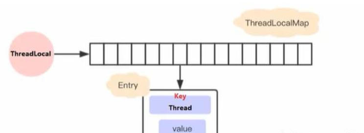
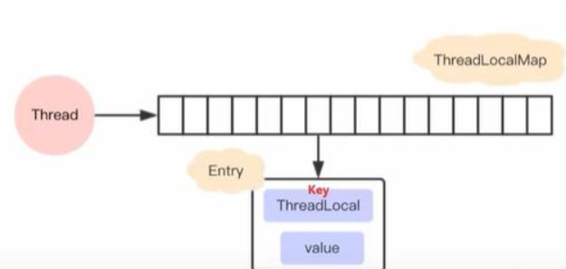
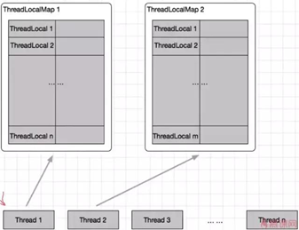
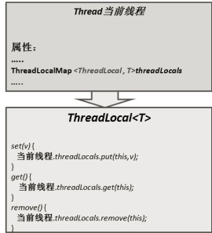
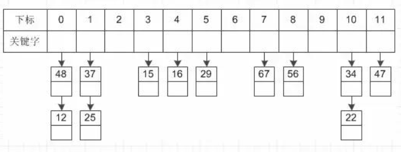

## 概述

### API描述

```java
 * This class provides thread-local variables.  These variables differ from
 * their normal counterparts in that each thread that accesses one (via its
 * {@code get} or {@code set} method) has its own, independently initialized
 * copy of the variable.  {@code ThreadLocal} instances are typically private
 * static fields in classes that wish to associate state with a thread (e.g.,
 * a user ID or Transaction ID).
```

`ThreadLocal`提供一种线程本地变量。这种变量是一种副本的概念，在多线程环境下访问（get、set）能够保证各个线程间的变量互相隔离。`ThreadLocal`通常定义为了`private static`，用来关联线程和线程上下文（比如userId或事物ID）。`ThreadLocal` 的作用是提供线程内的局部变量，这种变量在线程的生命周期内起作用，减少同一个线程内多个函数或者组件之间一些公共变量的传递的复杂度。
<!--more-->

<div align=center>


@startuml
class ThreadLocal<T> {
- private final int threadLocalHashCode;
- private static AtomicInteger nextHashCode;
# protected T initialValue()
+ public T get()
+ public void set(T value)
+ public void remove()
}
@enduml


</div>

### 使用说明

1. 让某个需要用到的对象实现线程之间的隔离（每个线程都有自己独立的对象）
2. 可以在任何方法中轻松的获取到该对象
3. 根据共享对象生成的时机选择使用initialValue方法还是set方法
4. 对象初始化的时机由我们控制的时候使用initialValue 方式
5. 如果对象生成的时机不由我们控制的时候使用 set 方式

### 优点

1. 达到线程安全的目的
2. 不需要加锁，执行效率高
3. 更加节省内存，节省开销
4. 免去传参的繁琐，降低代码耦合度

### ThreadLocal与锁的区别

1. lock 的资源是多个线程共享的，所以访问的时候需要加锁。
2. ThreadLocal 是每个线程都有一个副本，是不需要加锁的。
3. lock 是通过时间换空间的做法。
4. ThreadLocal 是典型的通过空间换时间的做法。

### 结构解析

#### JDK早期设计

<div align=center>



</div>

在早期的设计中每个 `ThreadLocal` 创建一个 `ThreadLocalMap`，然后用**线程**作为 Map 的 key，要存储的局部变量作为 Map 的 value，这样达到线程隔离的目的。**由于该线程绑定的变量不能被自动的回收，因为变量存储在 ThreadLocal 里，必须显式的去回收。(容易出现内存泄露)**

#### JDK1.8设计

在`Thread`类中维护了`ThreadLocalMap`；这个变量用于存储`ThreadLocal`，因为在同一个线程当中可以有多个`ThreadLocal`，并且多次调用`get()`所以需要在内部维护一个`ThreadLocalMap`用来存储多个`ThreadLocal`。`Thread`中的代码如下：

```java
/* ThreadLocal values pertaining to this thread. This map is maintained
* by the ThreadLocal class.
*/
ThreadLocal.ThreadLocalMap threadLocals = null;

/*
* InheritableThreadLocal values pertaining to this thread. This map is
* maintained by the InheritableThreadLocal class.
* 父线程难道子线程共享的数据
*/
ThreadLocal.ThreadLocalMap inheritableThreadLocals = null;
```

如下图所示：
<div align=center>




</div>

**通过代码分析得出以下结论：**

1. ① 每个 `Thread` 内部都有一个 `ThreadLocalMap` `ThreadLocal.ThreadLocalMap threadLocals = null;`达到线程隔离
2. ② `ThreadLocalMap` 里面存储 `ThreadLocal` 对象（key） 和 线程的变量副本（value）`t.threadLocals = new ThreadLocalMap(this, firstValue);`；使用静态并`ThreadLocal`作为key，将不同对象的引用保存到不同线程的`ThreadLocalMap`中。
3. ③ `Thread` 内部的 `ThreadLocalMap` 是由 `ThreadLocal` 维护的，由 `ThreadLocal` 负责向 ThreadLocalMap 设置和获取变量值
4. ④ 对于不同的线程，每次获取副本值时，别的线程并不能获取当前线程的副本值，形成副本的隔离，互不干扰

如下图所示：
<div align=center>



</div>

**好处：**

1. ① 每个 ThreadLocalMap 存储的 Entry 数量变少
2. ② 当 Thread 销毁时，ThreadLocalMap 也随之销毁，减少内存的使用

## 源码解析

### get

获取当前线程中绑定的局部两类。

```java
/**
	* Returns the value in the current thread's copy of this
	* thread-local variable.  If the variable has no value for the
	* current thread, it is first initialized to the value returned
	* by an invocation of the {@link #initialValue} method.
	*
	* @return the current thread's value of this thread-local
	*/
public T get() {
	// 1.获取当前线程中的ThreadLocalMap
	Thread t = Thread.currentThread();
	ThreadLocalMap map = getMap(t);
	/**
	* 2.1 如果不为空：使用当前ThreadLocal获取map中的Entry，如果不为空则获取值
	* 2.2 map 为空 或者 e 为空，通过 initialValue ，也就是 NULL，
	*     然后用 TL 的引用和 value 作为 firstKey 和 firstValue 创建新的 map
	*/
	if (map != null) {
		ThreadLocalMap.Entry e = map.getEntry(this);
		if (e != null) {
			@SuppressWarnings("unchecked")
			T result = (T)e.value;
			return result;
		}
	}
	return setInitialValue();
}
```

### set

使用线程本地变量的方式存储数据，绑定到当前线程中。

```java
/**
* Sets the current thread's copy of this thread-local variable
* to the specified value.  Most subclasses will have no need to
* override this method, relying solely on the {@link #initialValue}
* method to set the values of thread-locals.
*
* @param value the value to be stored in the current thread's copy of
*        this thread-local.
*/
public void set(T value) {
	Thread t = Thread.currentThread(); // 1.获取当前线程
	ThreadLocalMap map = getMap(t); // 2.获取当前线程中的ThreadLocalMap
	/**
	* 3.1 如果map不为空则设置数据，key为ThreadLocal
	* 3.2 如果为空，则给该线程创建 map ，并设置初始值
	*/
	if (map != null)
		map.set(this, value);
	else
		createMap(t, value);
}

/**
* Create the map associated with a ThreadLocal. Overridden in
* InheritableThreadLocal.
*
* @param t the current thread
* @param firstValue value for the initial entry of the map
*/
void createMap(Thread t, T firstValue) {
	t.threadLocals = new ThreadLocalMap(this, firstValue);
}
```

### reomove

清空数据，防止内存泄露

```java
/**
 * Removes the current thread's value for this thread-local
 * variable.  If this thread-local variable is subsequently
 * {@linkplain #get read} by the current thread, its value will be
 * reinitialized by invoking its {@link #initialValue} method,
 * unless its value is {@linkplain #set set} by the current thread
 * in the interim.  This may result in multiple invocations of the
 * {@code initialValue} method in the current thread.
 *
 * @since 1.5
 */
    public void remove() {
        ThreadLocalMap m = getMap(Thread.currentThread());
        if (m != null)
            m.remove(this);
    }
```

### initialValue

该方法用于设置初始值，并且在调用get()方法时才会被触发，所以是懒加载。但是如果在get()之前进行了set()操作，这样就不会调用initialValue()。通常每个线程只能调用一次本方法，但是调用了remove()后就能再次调用.

```java
/**
 * Returns the current thread's "initial value" for this
 * thread-local variable.  This method will be invoked the first
 * time a thread accesses the variable with the {@link #get}
 * method, unless the thread previously invoked the {@link #set}
 * method, in which case the {@code initialValue} method will not
 * be invoked for the thread.  Normally, this method is invoked at
 * most once per thread, but it may be invoked again in case of
 * subsequent invocations of {@link #remove} followed by {@link #get}.
 *
 * <p>This implementation simply returns {@code null}; if the
 * programmer desires thread-local variables to have an initial
 * value other than {@code null}, {@code ThreadLocal} must be
 * subclassed, and this method overridden.  Typically, an
 * anonymous inner class will be used.
 *
 * @return the initial value for this thread-local
 */
protected T initialValue() {
    return null;
}

/**
 * Variant of set() to establish initialValue. Used instead
 * of set() in case user has overridden the set() method.
 *
 * @return the initial value
 */
private T setInitialValue() {
    T value = initialValue();
    Thread t = Thread.currentThread();
    ThreadLocalMap map = getMap(t);
    if (map != null)
        map.set(this, value);
    else
        createMap(t, value);
    return value;
}
```

### ThreadLocalMap

#### ThreadLocalMap类图

<div align=center>


Title "ThreadLocalMap类图"

abstract class Reference
class WeakReference
class Entry
class ThreadLocalMap

Entry *-- ThreadLocalMap
WeakReference <|-- Entry
Reference <|-- WeakReference

class ThreadLocalMap{
-- ThreadLocal的静态内部类
- private void set(ThreadLocal<?> key, Object value)
- private void remove(ThreadLocal<?> key)
- private Entry getEntry(ThreadLocal<?> key)

- private Entry[] table
- private int size
- private int threshold
}

class Entry {
-- ThreadLocalMap的静态内部类
~ Entry(ThreadLocal<?> k, Object v)
~ Object value;
}



</div>

#### ThreadLocalMap源码

```java
/**
* The initial capacity -- MUST be a power of two.
*/
private static final int INITIAL_CAPACITY = 16;

/**
* The table, resized as necessary.
* table.length MUST always be a power of two.
*/
private Entry[] table;

/**
* The number of entries in the table.
*/
private int size = 0;

/**
* The next size value at which to resize.
*/
private int threshold; // Default to 0
```

通过源码分析ThreadLocalMap与HashMap的结构类似。

#### ThreadLocalMap保存数据

```java
/**
* Set the value associated with key.
*
* @param key the thread local object
* @param value the value to be set
*/
private void set(ThreadLocal<?> key, Object value) {

	// We don't use a fast path as with get() because it is at
	// least as common to use set() to create new entries as
	// it is to replace existing ones, in which case, a fast
	// path would fail more often than not.

	Entry[] tab = table;
	int len = tab.length;
	// 计算hash索引位置
	int i = key.threadLocalHashCode & (len-1);
	// 使用线性探测法查找元素（顺序查找数据，找到则结束，并且在查找数据时必须比对key是否相等）
	for (Entry e = tab[i];
			e != null;
			e = tab[i = nextIndex(i, len)]) {
		ThreadLocal<?> k = e.get();

		if (k == key) {// 如果key存在则直接覆盖
			e.value = value;
			return;
		}

		if (k == null) {
			// 如果key为空，但是value不为空则说明ThreadLocal作为key已经被回收，需要进行数据交换
			replaceStaleEntry(key, value, i);
			return;
		}
	}

	tab[i] = new Entry(key, value);
	int sz = ++size;
	if (!cleanSomeSlots(i, sz) && sz >= threshold)
		rehash();
}
```

**通过源码分析如下：**

1. 每个`ThreadLocal`对象都有一个hash值 `threadLocalHashCode` ，每初始化一个`ThreadLocal`对象，hash值就增加一个固定的大小 **0x61c88647** 。
   
   ```java
    /**
     * ThreadLocals rely on per-thread linear-probe hash maps attached
     * to each thread (Thread.threadLocals and
     * inheritableThreadLocals).  The ThreadLocal objects act as keys,
     * searched via threadLocalHashCode.  This is a custom hash code
     * (useful only within ThreadLocalMaps) that eliminates collisions
     * in the common case where consecutively constructed ThreadLocals
     * are used by the same threads, while remaining well-behaved in
     * less common cases.
     */
    private final int threadLocalHashCode = nextHashCode();

	/**
     * Returns the next hash code.
     */
    private static int nextHashCode() {
        return nextHashCode.getAndAdd(HASH_INCREMENT);
    }
   ```

2. 在set数据时首先根据`threadLocalHashCode`对key进行hash，如果当前位置没数据数据则初始化一个Entry放到该位置上。
3. 如果有数据则继续判断当前位置的key是否与当前设置的key相同，如果是则替换当前Entry中的value
4. 如果key不同则for循环继续查找。

#### ThreadLocalMap与HashMap的区别

主要体现在hash冲突解决上。

1. HashMap 的数据结构是数组+链表
2. ThreadLocalMap的数据结构仅仅是数组
3. HashMap 是通过链地址法解决hash 冲突的问题
4. ThreadLocalMap 是通过开放地址法来解决hash 冲突的问题
5. HashMap 里面的Entry 内部类的引用都是强引用
6. ThreadLocalMap里面的Entry 内部类中的**key 是弱引用，value 是强引用**

## 问题

### 内存泄露

某个对象不会再被使用，但是该对象的内存却无法被收回。

#### Java引用的说明（后续会在JVM垃圾回收中详细说明）

Java中存在四种引用类型：**强、弱、软、虚**  

1. 强引用：最常见的是使用new创建的对象，只要存在对象引用，GC就不会回收
2. 软引用：`SoftReference`实现，当系统内存不足时才会被回收
3. 弱引用：`WeakReference`实现，GC 一旦发现弱引用的对象，不管当前内存空间足够与否，都会回收它的内存
4. 虚引用：`PhantomReference`实现，必须和引用队列联合使用，主要用于跟踪对象被垃圾回收的状态

```java
/**
 * The entries in this hash map extend WeakReference, using
 * its main ref field as the key (which is always a
 * ThreadLocal object).  Note that null keys (i.e. entry.get()
 * == null) mean that the key is no longer referenced, so the
 * entry can be expunged from table.  Such entries are referred to
 * as "stale entries" in the code that follows.
 */
static class Entry extends WeakReference<ThreadLocal<?>> {
    /** The value associated with this ThreadLocal. */
    Object value;

    Entry(ThreadLocal<?> k, Object v) {
        super(k);
        value = v;
    }
}
```

#### 原因分析

1. 正常情况: 当Thread运行结束后，ThreadLocal中的value会被回收，因为没有任何强引用了
2. 非正常情况
当Thread一直在运行始终不结束，强引用就不会被回收，存在以下调用链 Thread-->ThreadLocalMap-->Entry(key为null)-->value因为调用链中的 value 和 Thread 存在强引用，所以value无法被回收，就有可能出现OOM。JDK的设计已经考虑到了这个问题，所以在set()、remove()、resize()方法中会扫描到key为null的Entry，并且把对应的value设置为null，这样value对象就可以被回收。

```java
/**
 * Double the capacity of the table.
 */
private void resize() {
    Entry[] oldTab = table;
    int oldLen = oldTab.length;
    int newLen = oldLen * 2;
    Entry[] newTab = new Entry[newLen];
    int count = 0;

    for (int j = 0; j < oldLen; ++j) {
        Entry e = oldTab[j];
        if (e != null) {
            ThreadLocal<?> k = e.get();
            if (k == null) {
                e.value = null; // Help the GC
            } else {
                int h = k.threadLocalHashCode & (newLen - 1);
                while (newTab[h] != null)
                    h = nextIndex(h, newLen);
                newTab[h] = e;
                count++;
            }
        }
    }

    setThreshold(newLen);
    size = count;
    table = newTab;
}
```

> 但是只有在调用set()、remove()、resize()这些方法时才会进行这些操作，如果没有调用这些方法并且线程不停止，那么调用链就会一直存在，所以可能会发生内存泄漏。

#### ThreadLocalMap.Entry被定义为弱引用的原因

<div align=center>


</div>

`ThreadLocal`作为Map中的key，被定义为弱引用，当把`ThreadLocal`实例设置为`null`时，gc就可以顺利回收`ThreadLocal`。但是如果value正常被当前线程使用，只有在当前线程结束之后才能被回收，这也是JDK1.8之后的升级，降低内存泄露的概率。

#### 避免方式

调用remove()方法，就会删除对应的Entry对象，可以避免内存泄漏，所以使用完ThreadLocal后，要调用remove()方法。

### 空指针问题

调用get方法如果返回值为基本类型，则会出现空指针异常，如果是包装类则不会出现。

### 共享对象问题

如果在每个线程中ThreadLocal.set()进去的东西本来就是多个线程共享的同一对象，比如static对象，那么多个线程调用ThreadLocal.get()获取的内容还是同一个对象，还是会发生线程安全问题。

### 可以不使用ThreadLocal就不要强行使用

如果在任务数很少的时候，在局部方法中创建对象就可以解决问题，这样就不需要使用ThreadLocal。

### 优先使用框架的支持，而不是自己创造

例如在Spring框架中，如果可以使用RequestContextHolder，那么就不需要自己维护ThreadLocal，因为自己可能会忘记调用remove()方法等，造成内存泄漏。

#### 源码参考(RequestContextHolder)

```java
/*
 * Copyright 2002-2016 the original author or authors.
 *
 * Licensed under the Apache License, Version 2.0 (the "License");
 * you may not use this file except in compliance with the License.
 * You may obtain a copy of the License at
 *
 *      https://www.apache.org/licenses/LICENSE-2.0
 *
 * Unless required by applicable law or agreed to in writing, software
 * distributed under the License is distributed on an "AS IS" BASIS,
 * WITHOUT WARRANTIES OR CONDITIONS OF ANY KIND, either express or implied.
 * See the License for the specific language governing permissions and
 * limitations under the License.
 */

package org.springframework.web.context.request;

import javax.faces.context.FacesContext;

import org.springframework.core.NamedInheritableThreadLocal;
import org.springframework.core.NamedThreadLocal;
import org.springframework.lang.Nullable;
import org.springframework.util.ClassUtils;

/**
 * Holder class to expose the web request in the form of a thread-bound
 * {@link RequestAttributes} object. The request will be inherited
 * by any child threads spawned by the current thread if the
 * {@code inheritable} flag is set to {@code true}.
 *
 * <p>Use {@link RequestContextListener} or
 * {@link org.springframework.web.filter.RequestContextFilter} to expose
 * the current web request. Note that
 * {@link org.springframework.web.servlet.DispatcherServlet}
 * already exposes the current request by default.
 *
 * @author Juergen Hoeller
 * @author Rod Johnson
 * @since 2.0
 * @see RequestContextListener
 * @see org.springframework.web.filter.RequestContextFilter
 * @see org.springframework.web.servlet.DispatcherServlet
 */
public abstract class RequestContextHolder  {

	private static final boolean jsfPresent =
			ClassUtils.isPresent("javax.faces.context.FacesContext", RequestContextHolder.class.getClassLoader());

	private static final ThreadLocal<RequestAttributes> requestAttributesHolder =
			new NamedThreadLocal<>("Request attributes");

	private static final ThreadLocal<RequestAttributes> inheritableRequestAttributesHolder =
			new NamedInheritableThreadLocal<>("Request context");


	/**
	 * Reset the RequestAttributes for the current thread.
	 */
	public static void resetRequestAttributes() {
		requestAttributesHolder.remove();
		inheritableRequestAttributesHolder.remove();
	}

	/**
	 * Bind the given RequestAttributes to the current thread,
	 * <i>not</i> exposing it as inheritable for child threads.
	 * @param attributes the RequestAttributes to expose
	 * @see #setRequestAttributes(RequestAttributes, boolean)
	 */
	public static void setRequestAttributes(@Nullable RequestAttributes attributes) {
		setRequestAttributes(attributes, false);
	}

	/**
	 * Bind the given RequestAttributes to the current thread.
	 * @param attributes the RequestAttributes to expose,
	 * or {@code null} to reset the thread-bound context
	 * @param inheritable whether to expose the RequestAttributes as inheritable
	 * for child threads (using an {@link InheritableThreadLocal})
	 */
	public static void setRequestAttributes(@Nullable RequestAttributes attributes, boolean inheritable) {
		if (attributes == null) {
			resetRequestAttributes();
		}
		else {
			if (inheritable) {
				inheritableRequestAttributesHolder.set(attributes);
				requestAttributesHolder.remove();
			}
			else {
				requestAttributesHolder.set(attributes);
				inheritableRequestAttributesHolder.remove();
			}
		}
	}

	/**
	 * Return the RequestAttributes currently bound to the thread.
	 * @return the RequestAttributes currently bound to the thread,
	 * or {@code null} if none bound
	 */
	@Nullable
	public static RequestAttributes getRequestAttributes() {
		RequestAttributes attributes = requestAttributesHolder.get();
		if (attributes == null) {
			attributes = inheritableRequestAttributesHolder.get();
		}
		return attributes;
	}

	/**
	 * Return the RequestAttributes currently bound to the thread.
	 * <p>Exposes the previously bound RequestAttributes instance, if any.
	 * Falls back to the current JSF FacesContext, if any.
	 * @return the RequestAttributes currently bound to the thread
	 * @throws IllegalStateException if no RequestAttributes object
	 * is bound to the current thread
	 * @see #setRequestAttributes
	 * @see ServletRequestAttributes
	 * @see FacesRequestAttributes
	 * @see javax.faces.context.FacesContext#getCurrentInstance()
	 */
	public static RequestAttributes currentRequestAttributes() throws IllegalStateException {
		RequestAttributes attributes = getRequestAttributes();
		if (attributes == null) {
			if (jsfPresent) {
				attributes = FacesRequestAttributesFactory.getFacesRequestAttributes();
			}
			if (attributes == null) {
				throw new IllegalStateException("No thread-bound request found: " +
						"Are you referring to request attributes outside of an actual web request, " +
						"or processing a request outside of the originally receiving thread? " +
						"If you are actually operating within a web request and still receive this message, " +
						"your code is probably running outside of DispatcherServlet/DispatcherPortlet: " +
						"In this case, use RequestContextListener or RequestContextFilter to expose the current request.");
			}
		}
		return attributes;
	}


	/**
	 * Inner class to avoid hard-coded JSF dependency.
 	 */
	private static class FacesRequestAttributesFactory {

		@Nullable
		public static RequestAttributes getFacesRequestAttributes() {
			FacesContext facesContext = FacesContext.getCurrentInstance();
			return (facesContext != null ? new FacesRequestAttributes(facesContext) : null);
		}
	}

}
```

## 使用场景

1. To keep state with a thread (user-id, transaction-id, logging-id)
2. To cache objects which you need frequently
3. 最常见的 ThreadLocal 使用场景为 用来解决 数据库连接、Session 管理等。
   
    ```java
    public class TestThreadLocal {

        private static final ThreadLocal<Session> threadSession = new ThreadLocal<>();

        public static Session getSession() throws InfrastructureException {
            Session s = (Session) threadSession.get();
            try {
                if (s == null) {
                    s = getSessionFactory().openSession();
                    threadSession.set(s);
                }
            } catch (HibernateException ex) {
                throw new InfrastructureException(ex);
            }
            return s;
        }

    }
    ```

## 其他

### 如果父子线程共享变量

#### InheritableThreadLocal

### hash冲突解决

#### 链地址法

hash(key)之后的地址i构成一个同义词单链表，并将单链表的头指针存在哈希表的第i个单元中，因而查找、插入和删除主要在同义词链中进行。

<div align=center>



</div>

**链地址法特点**

1. 处理冲突简单，且无堆积现象，平均查找长度短。
2. 链表中的结点是动态申请的，适合构造表不能确定长度的情况。
3. 删除结点的操作易于实现。只要简单地删去链表上相应的结点即可。
4. 指针需要额外的空间，故当结点规模较小时，开放定址法较为节省空间。

#### 开放地址法（线性探测法）

hash(key)一旦发生了冲突，就去寻找下一个空的散列地址，只要散列表足够大，空的散列地址总能找到，并将记录存入。

<div align=center>


</div>

**开放地址法特点**

1. 容易产生堆积问题，不适于大规模的数据存储。
2. 散列函数的设计对冲突会有很大的影响，插入时可能会出现多次冲突的现象。
3. 删除的元素是多个冲突元素中的一个，需要对后面的元素作处理，实现较复杂。

#### ThreadLocalMap采用开放地址法原因

1. ThreadLocal 中看到一个属性 HASH_INCREMENT = 0x61c88647 ，0x61c88647 是一个神奇的数字，让哈希码能均匀的分布在2的N次方的数组里, 即 Entry[] table
2. ThreadLocal 往往存放的数据量不会特别大（而且key 是弱引用又会被垃圾回收，及时让数据量更小），这个时候开放地址法简单的结构会显得更省空间，同时数组的查询效率也是非常高，加上第一点的保障，冲突概率也低

## 参考

1. 《Java并发编程的艺术》
2. [吃透源码的每一个细节和设计原理--ThreadLocal](https://www.toutiao.com/i6750511984854172173/)