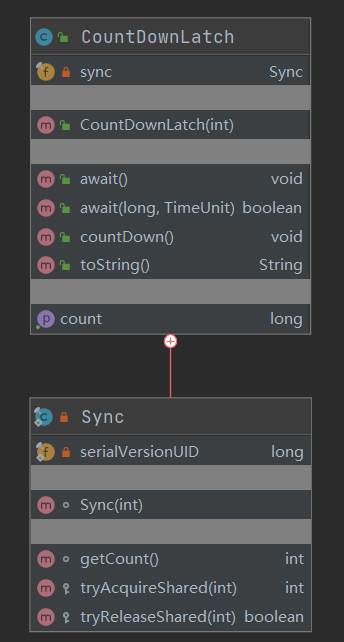
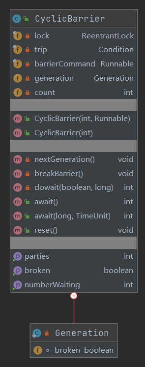
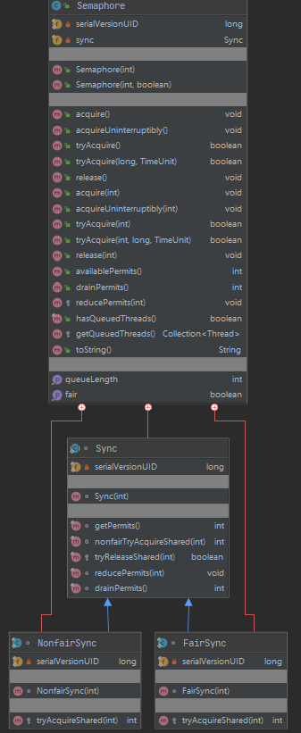
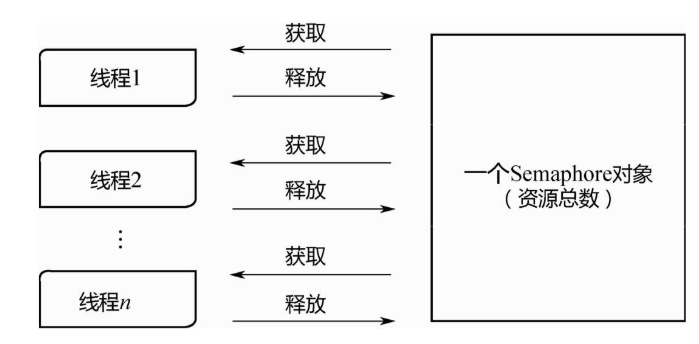

## CountDownLatch

<div align=center>



</div>
<!--more-->

CountDownLatch类位于java.util.concurrent包下，利用它可以实现类似计数器的功能。比如有一个任务 A，它要等待其他 4 个任务执行完毕之后才能执行，此时就可以利用 CountDownLatch 来实现这种功能了。

```java
package com.sunld;

import java.util.concurrent.CountDownLatch;

public class TestCountDownLatch {

	public static void main(String[] args) {
		final CountDownLatch latch = new CountDownLatch(2);

		new Thread() {
			public void run() {
				System.out.println("子线程" + Thread.currentThread().getName() + "正在执行");
				try {
					Thread.sleep(3000);
				} catch (InterruptedException e) {
					e.printStackTrace();
				}
				System.out.println("子线程" + Thread.currentThread().getName() + "执行完毕");
				latch.countDown();
			};
		}.start();

		new Thread() {
			public void run() {
				System.out.println("子线程" + Thread.currentThread().getName() + "正在执行");
				try {
					Thread.sleep(3000);
				} catch (InterruptedException e) {
					e.printStackTrace();
				}
				System.out.println("子线程" + Thread.currentThread().getName() + "执行完毕");
				latch.countDown();
			};
		}.start();
		System.out.println("等待 2 个子线程执行完毕...");
		try {
			latch.await();
		} catch (InterruptedException e) {
			e.printStackTrace();
		}
		System.out.println("2 个子线程已经执行完毕");
		System.out.println("继续执行主线程");
	}

}
```

### await方法

```java

public void await() throws InterruptedException {
	sync.acquireSharedInterruptibly(1);
}

public boolean await(long timeout, TimeUnit unit)
	throws InterruptedException {
	return sync.tryAcquireSharedNanos(1, unit.toNanos(timeout));
}
```

AbstractQueuedSynchronizer.acquireSharedInterruptibly实现

```java
public final void acquireSharedInterruptibly(int arg)
		throws InterruptedException {
	if (Thread.interrupted())
		throw new InterruptedException();
	// tryAcquireShared由具体的子类实现
	if (tryAcquireShared(arg) < 0)
		doAcquireSharedInterruptibly(arg);
}
```

CountDownLatch.Sync.tryAcquireShared

```java
protected int tryAcquireShared(int acquires) {
	// 只要state！=0，调用await（）方法的线程便会被放入AQS的阻塞队列，进入阻塞状态
	return (getState() == 0) ? 1 : -1;
}
```

### countDown方法

```java
public void countDown() {
	sync.releaseShared(1);
}
```

AbstractQueuedSynchronizer.releaseShared实现

```java
/**
* Releases in shared mode.  Implemented by unblocking one or more
* threads if {@link #tryReleaseShared} returns true.
*
* @param arg the release argument.  This value is conveyed to
*        {@link #tryReleaseShared} but is otherwise uninterpreted
*        and can represent anything you like.
* @return the value returned from {@link #tryReleaseShared}
*/
public final boolean releaseShared(int arg) {
	if (tryReleaseShared(arg)) {// 由具体子类实现
		doReleaseShared();//一次性唤醒队列中所有阻塞的线程
		return true;
	}
	return false;
}
```

CountDownLatch.Sync.tryReleaseShared

```java
protected boolean tryReleaseShared(int releases) {
	// Decrement count; signal when transition to zero
	for (;;) {
		int c = getState();
		if (c == 0)
			return false;
		int nextc = c-1;
		if (compareAndSetState(c, nextc))
			return nextc == 0;
	}
}
```

### CountDownLatch总结

因为是基于AQS 阻塞队列来实现的，所以可以让多个线程都阻塞在state=0条件上，通过countDown（）一直累减state，减到0后一次性唤醒所有线程。如图4-4所示，假设初始总数为M，N个线程await（），M个线程countDown（），减到0之后，N个线程被唤醒。

<div align=center>


</div>

### 配合线程池使用

ExecutorService作为一个线程池，然后利用CountDownLatch可以让指定数量的线程都执行完再执行主线程的特性。就可以实现多线程提速了。  
套路是这样的：  
1、实现runnable接口实现一个run方法，里面执行我们的耗时复杂业务操作。  
2、在循环里给list里的每个对象分配一个线程  
3、使用CountDownLatch让主线程等待工作线程全部执行完毕后之后，再继续执行。  

#### 参考实例

```java
package com.sunld.thread;

import java.util.ArrayList;
import java.util.List;
import java.util.concurrent.Callable;
import java.util.concurrent.CountDownLatch;
import java.util.concurrent.ExecutionException;
import java.util.concurrent.ExecutorService;
import java.util.concurrent.Executors;
import java.util.concurrent.Future;
/**
 * 随机生成一个数组，然后并发计算数组求和,注意：未处理中断和线程池关闭
 * @author Theodore SUN
 *
 */
public class RunnerTask implements Callable<Integer> {
	private List<Integer> paramList;
	private CountDownLatch latch;

	public RunnerTask(List<Integer> paramList, CountDownLatch latch) {
		this.paramList = paramList;
		this.latch = latch;
	}
	@Override
	public Integer call() throws Exception {
		System.out.println(Thread.currentThread().getName() + "====start====");
		int sum = 0;
		try {
			Thread.sleep(1000);
			for(Integer i : paramList) {
				sum += i.intValue();
			}
		}finally {
			if (this.latch != null) {
				latch.countDown();
			}
		}
		System.out.println(Thread.currentThread().getName() + "====end====");
		return sum;
	}
	
	public static void main(String[] args) throws InterruptedException {
		List<List<Integer>> taskList = new ArrayList<>();
		for(int i = 0; i < 10; i++) {
			List<Integer> list = new ArrayList<Integer>();
			for(int j = 0; j < 20; j++) {
				list.add((i + 1) * (j + 1));
			}
			taskList.add(list);
		}
		List<Integer> returnList = Test.multiThreadProcess(taskList);
		System.out.println(returnList);
		System.exit(0);
	}
}

class Test {
	private static final ExecutorService taskPool = Executors.newFixedThreadPool(4);
	public static List<Integer> multiThreadProcess(List<List<Integer>> taskList) throws InterruptedException {
		List<Integer> list = new ArrayList<Integer>();
		List<Future<Integer>> list1 = new ArrayList<>();
		if (taskList != null && !taskList.isEmpty()) {
			// 创建闭锁，计数器大小为任务多列的长多
			CountDownLatch latch = new CountDownLatch(taskList.size());
			for (List<Integer> item : taskList) {
				list1.add(taskPool.submit(new RunnerTask(item, latch)));
			}
			// 主线程开始等待，直到计数器大小为0，返回结果
			latch.await();
			for(Future<Integer> f : list1) {
				try {
					list.add(f.get());
				} catch (ExecutionException e) {
					e.printStackTrace();
				}
			}
			return list;
		}
		taskPool.shutdown();
		return new ArrayList<Integer>();
	}
	
}
```

## CyclicBarrier

<div align=center>



</div>

1. 回环栅栏-等待至 barrier 状态再全部同时执行
2. 可重用（回环）：当所有等待线程都被释放以后可重复使用
3. 响应中断：线程没有到齐，如果有线程收到了中断信号，所有阻塞的线程也会被唤醒（breakBarrier）。然后count被重置为初始值（parties），重新开始。
4. 我们暂且把这个状态就叫做 barrier，当调用 await()方法之后，线程就处于 barrier 了。
5. 基于ReentrantLock+Condition实现
6. barrierAction只会被第n个线程执行1次（在唤醒其他n-1个线程之前）

### CyclicBarrier常用方法

CyclicBarrier 中最重要的方法就是 await 方法，它有 2 个重载版本：

1. public int await()：用来挂起当前线程，直至所有线程都到达 barrier 状态再同时执行后续任务；
2. public int await(long timeout, TimeUnit unit)：让这些线程等待至一定的时间，如果还有线程没有到达 barrier 状态就直接让到达 barrier 的线程执行后续任务。

### CyclicBarrier源码分析

```java

public class CyclicBarrier {
    /**
     * Each use of the barrier is represented as a generation instance.
     * The generation changes whenever the barrier is tripped, or
     * is reset. There can be many generations associated with threads
     * using the barrier - due to the non-deterministic way the lock
     * may be allocated to waiting threads - but only one of these
     * can be active at a time (the one to which {@code count} applies)
     * and all the rest are either broken or tripped.
     * There need not be an active generation if there has been a break
     * but no subsequent reset.
     */
    private static class Generation {
        boolean broken = false;
    }

    /** The lock for guarding barrier entry */
    private final ReentrantLock lock = new ReentrantLock();
    /** Condition to wait on until tripped */
    // 用于线程之间互相唤醒
    private final Condition trip = lock.newCondition();
    /** The number of parties */
    // 总线程数
    private final int parties;
    /* The command to run when tripped */
    private final Runnable barrierCommand;
    /** The current generation */
    private Generation generation = new Generation();

    /**
     * Number of parties still waiting. Counts down from parties to 0
     * on each generation.  It is reset to parties on each new
     * generation or when broken.
     */
    private int count;

    /**
     * Updates state on barrier trip and wakes up everyone.
     * Called only while holding lock.
     */
    private void nextGeneration() {
        // signal completion of last generation
        trip.signalAll();
        // set up next generation
        count = parties;
        generation = new Generation();
    }

    /**
     * Sets current barrier generation as broken and wakes up everyone.
     * Called only while holding lock.
     */
    private void breakBarrier() {
        generation.broken = true;
        count = parties;
        trip.signalAll();
    }

    /**
     * Main barrier code, covering the various policies.
     */
    private int dowait(boolean timed, long nanos)
        throws InterruptedException, BrokenBarrierException,
               TimeoutException {
        final ReentrantLock lock = this.lock;
        lock.lock();
        try {
            final Generation g = generation;

            if (g.broken)
                throw new BrokenBarrierException();

            if (Thread.interrupted()) {// 响应中断
                breakBarrier();//唤醒所有被阻塞线程
                throw new InterruptedException();
            }

            // 每个线程调用一次await则执行一次--count，当count==0时则唤醒其他所有线程
            int index = --count;
            if (index == 0) {  // tripped
                boolean ranAction = false;
                try {
                    final Runnable command = barrierCommand;
                    if (command != null)// 一起唤醒之后可以执行一次回调
                        command.run();
                    ranAction = true;
                    // 可重用
                    // 唤醒其他所有线程，并且复原count
                    nextGeneration();
                    return 0;
                } finally {
                    if (!ranAction)
                        breakBarrier();
                }
            }

            // loop until tripped, broken, interrupted, or timed out
            for (;;) {// count！=0的处理，需要阻塞自己
                try {
                    if (!timed)
                        trip.await();//阻塞自己的时候释放锁，别的线程就可以执行该方法
                    else if (nanos > 0L)
                        nanos = trip.awaitNanos(nanos);
                } catch (InterruptedException ie) {
                    if (g == generation && ! g.broken) {
                        breakBarrier();
                        throw ie;
                    } else {
                        // We're about to finish waiting even if we had not
                        // been interrupted, so this interrupt is deemed to
                        // "belong" to subsequent execution.
                        Thread.currentThread().interrupt();
                    }
                }

                if (g.broken)
                    throw new BrokenBarrierException();

                if (g != generation)
                    return index;

                if (timed && nanos <= 0L) {
                    breakBarrier();
                    throw new TimeoutException();
                }
            }
        } finally {
            lock.unlock();
        }
    }

    /**
     * Creates a new {@code CyclicBarrier} that will trip when the
     * given number of parties (threads) are waiting upon it, and which
     * will execute the given barrier action when the barrier is tripped,
     * performed by the last thread entering the barrier.
     *
     * @param parties the number of threads that must invoke {@link #await}
     *        before the barrier is tripped
     * @param barrierAction the command to execute when the barrier is
     *        tripped, or {@code null} if there is no action
     * @throws IllegalArgumentException if {@code parties} is less than 1
     */
    public CyclicBarrier(int parties, Runnable barrierAction) {
        if (parties <= 0) throw new IllegalArgumentException();
        this.parties = parties;
        this.count = parties;
        this.barrierCommand = barrierAction;
    }

    /**
     * Returns the number of parties required to trip this barrier.
     *
     * @return the number of parties required to trip this barrier
     */
    public int getParties() {
        return parties;
    }

    /**
     * Queries if this barrier is in a broken state.
     *
     * @return {@code true} if one or more parties broke out of this
     *         barrier due to interruption or timeout since
     *         construction or the last reset, or a barrier action
     *         failed due to an exception; {@code false} otherwise.
     */
    public boolean isBroken() {
        final ReentrantLock lock = this.lock;
        lock.lock();
        try {
            return generation.broken;
        } finally {
            lock.unlock();
        }
    }

    /**
     * Resets the barrier to its initial state.  If any parties are
     * currently waiting at the barrier, they will return with a
     * {@link BrokenBarrierException}. Note that resets <em>after</em>
     * a breakage has occurred for other reasons can be complicated to
     * carry out; threads need to re-synchronize in some other way,
     * and choose one to perform the reset.  It may be preferable to
     * instead create a new barrier for subsequent use.
     */
    public void reset() {
        final ReentrantLock lock = this.lock;
        lock.lock();
        try {
            breakBarrier();   // break the current generation
            nextGeneration(); // start a new generation
        } finally {
            lock.unlock();
        }
    }

    /**
     * Returns the number of parties currently waiting at the barrier.
     * This method is primarily useful for debugging and assertions.
     *
     * @return the number of parties currently blocked in {@link #await}
     */
    public int getNumberWaiting() {
        final ReentrantLock lock = this.lock;
        lock.lock();
        try {
            return parties - count;
        } finally {
            lock.unlock();
        }
    }
}

```

### 参考代码

```java
package com.sunld;

import java.util.concurrent.BrokenBarrierException;
import java.util.concurrent.CyclicBarrier;

public class TestCyclicBarrier {

	public static void main(String[] args) {
		int N = 4;
        CyclicBarrier barrier  = new CyclicBarrier(N);
        for(int i=0;i<N;i++) {
        	new Writer(barrier).start();
        }
	}
	
	static class Writer extends Thread{
		private CyclicBarrier cyclicBarrier;
		public Writer(CyclicBarrier cyclicBarrier) {
			this.cyclicBarrier = cyclicBarrier;
		}
		
		@Override
		public void run() {
			try {
				//以睡眠来模拟线程需要预定写入数据操作
				Thread.sleep(5000);
				System.out.println("线程"+Thread.currentThread().getName()
						+"写入数据完毕，等待其他线程写入完毕");
				cyclicBarrier.await();
			} catch (InterruptedException e) {
				e.printStackTrace();
			} catch(BrokenBarrierException e){
				e.printStackTrace();
			}
			System.out.println("所有线程写入完毕，继续处理其他任务，比如数据操作");
		}
	}
}

/**
* 线程Thread-1写入数据完毕，等待其他线程写入完毕
* 线程Thread-0写入数据完毕，等待其他线程写入完毕
* 线程Thread-2写入数据完毕，等待其他线程写入完毕
* 线程Thread-3写入数据完毕，等待其他线程写入完毕
* 所有线程写入完毕，继续处理其他任务，比如数据操作
* 所有线程写入完毕，继续处理其他任务，比如数据操作
* 所有线程写入完毕，继续处理其他任务，比如数据操作
* 所有线程写入完毕，继续处理其他任务，比如数据操作
**/
```

## Semaphore

<div align=center>



</div>

1. 信号量，Semaphore 可以控制同时访问的线程个数
2. 通过 acquire() 获取一个许可，如果没有就等待，而 release() 释放一个许可。 
3. Semaphore 是一种基于计数的信号量。它可以设定一个阈值，基于此，多个线程竞争获取许可信号，做完自己的申请后归还，超过阈值后，线程申请许可信号将会被阻塞。
4. Semaphore 可以用来构建一些对象池，资源池之类的，比如数据库连接池实现互斥锁（计数器为1）。我们也可以创建计数为 1 的 Semaphore，将其作为一种类似互斥锁的机制，这也叫二元信号量，表示两种互斥状态。

<div align=center>



</div>

### Semaphore常用方法

1. public void acquire(): 用来获取一个许可，若无许可能够获得，则会一直等待，直到获得许可。
2. public void acquire(int permits):获取 permits 个许可
3. public void release() { } :释放许可。注意，在释放许可之前，必须先获获得许可。
4. public void release(int permits) { }:释放 permits 个许可

上面 4 个方法都会被阻塞，如果想立即得到执行结果，可以使用下面几个方法

1. public boolean tryAcquire():尝试获取一个许可，若获取成功，则立即返回 true，若获取失败，则立即返回 false
2. public boolean tryAcquire(long timeout, TimeUnit unit):尝试获取一个许可，若在指定的时间内获取成功，则立即返回 true，否则则立即返回 false
3. public boolean tryAcquire(int permits):尝试获取 permits 个许可，若获取成功，则立即返回 true，若获取失败，则立即返回 false
4. public boolean tryAcquire(int permits, long timeout, TimeUnit unit): 尝试获取 permits 个许可，若在指定的时间内获取成功，则立即返回 true，否则则立即返回 false
5. 还可以通过 availablePermits()方法得到可用的许可数目。

### 参考代码

```java
package com.sunld;

import java.util.concurrent.Semaphore;

/**
 * 例子：若一个工厂有5 台机器，但是有8个工人，
 * 一台机器同时只能被一个工人使用，只有使用完了，其他工人才能继续使用。
 * @author Theodore SUN
 */
public class TestSemaphore {
	
	public static void main(String[] args) {
		int N = 8;            //工人数
		Semaphore semaphore = new Semaphore(5); //机器数目
		for(int i=0;i<N;i++)
			new Worker(i,semaphore).start();
	}
	
	static class Worker extends Thread{
		private int num;
		private Semaphore semaphore;
		public Worker(int num,Semaphore semaphore){
			this.num = num;
			this.semaphore = semaphore;
		}
		@Override
		public void run() {
			try {
				semaphore.acquire(); 
				System.out.println("工人"+this.num+"占用一个机器在生产...");
				Thread.sleep(2000);
				System.out.println("工人"+this.num+"释放出机器");
				semaphore.release(); 
				} catch (InterruptedException e) {
					e.printStackTrace();
				}
		}
	}
	/**
	 * 工人0占用一个机器在生产...
	 * 工人1占用一个机器在生产...
	 * 工人2占用一个机器在生产...
	 * 工人3占用一个机器在生产...
	 * 工人5占用一个机器在生产...
	 * 工人0释放出机器
	 * 工人3释放出机器
	 * 工人7占用一个机器在生产...
	 * 工人5释放出机器
	 * 工人1释放出机器
	 * 工人2释放出机器
	 * 工人6占用一个机器在生产...
	 * 工人4占用一个机器在生产...
	 * 工人7释放出机器
	 * 工人4释放出机器
	 * 工人6释放出机器
	 */
}
```

## 其他

1. CountDownLatch 和 CyclicBarrier 都能够实现线程之间的等待，只不过它们侧重点不同；CountDownLatch 一般用于某个线程 A 等待若干个其他线程执行完任务之后，它才执行；而 CyclicBarrier 一般用于一组线程互相等待至某个状态，然后这一组线程再同时执行；另外，CountDownLatch 是不能够重用的，而 CyclicBarrier 是可以重用的。
2. Semaphore 其实和锁有点类似，它一般用于控制对某组资源的访问权限。

### Semaphore 与 ReentrantLock

1. Semaphore 基本能完成 ReentrantLock 的所有工作，使用方法也与之类似，
2. 通过 acquire()与 release()方法来获得和释放临界资源。
3. Semaphone.acquire()方法默认为可响应中断锁，与 ReentrantLock.lockInterruptibly()作用效果一致，也就是说在等待临界资源的过程中可以被Thread.interrupt()方法中断。
4. Semaphore 也实现了可轮询的锁请求与定时锁的功能，除了方法名 tryAcquire 与 tryLock 不同，其使用方法与ReentrantLock几乎一致。
5. Semaphore也提供了公平与非公平锁的机制，也可在构造函数中进行设定。
6. Semaphore的锁释放操作也由手动进行，因此与ReentrantLock 一样，为避免线程因抛出异常而无法正常释放锁的情况发生，释放锁的操作也必须在 finally 代码块中完成。

## Exchanger

## Phaser

## 参考
