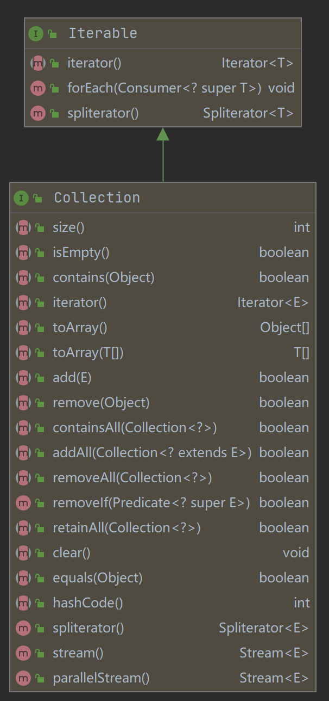
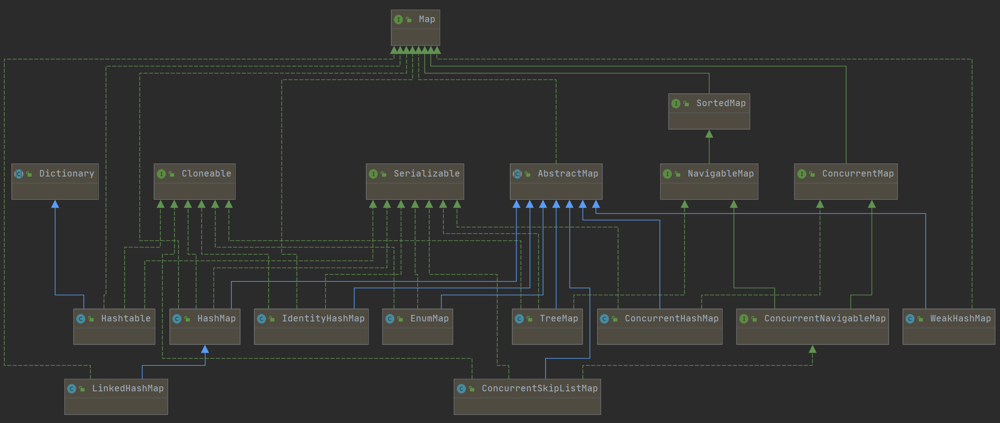
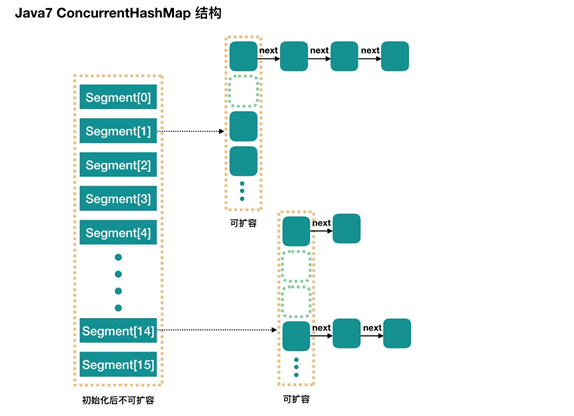
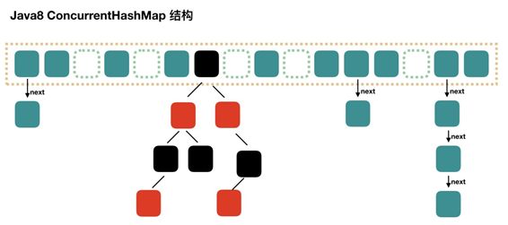

使用集合需要考虑几个关注点：

1. 线程安全性
2. 是否有序
3. 是否重复
4. 关注查询还是关注写入
5. equals和hashCode方法的重写需要同步
6. 使用接口返回集合数据
<!--more-->

## 知识图谱

## 类图

## 概述

### 集合和数组的区别

1. 数组和集合都是Java中的容器
2. 数组的长度是固定的，集合的长度是可变的
3. 数组只能存储相同数据类型的数据，这里的数据类型可以是基本数据类型，也可以是引用类型
4. 集合可以存储不同数据类型的对象的引用(不建议使用这种方式，需要使用泛型控制)，但不能存储基本数据类型

### 接口继承关系和实现

集合类存放于 `Java.util` 包中，主要有 3 种：set(集）、list(列表包含 Queue）和 map(映射)。

1. Collection：Collection 是集合 List、Set、Queue 的最基本的接口。
2. Iterator：迭代器，可以通过迭代器遍历集合中的数据
3. Map：是映射表的基础接口

通过类图可知得出以下结论：  

1. Java集合的根接口是Collection，它又继承了迭代接口Iterable
2. List接口和Set接口继承了Collection接口
3. Map接口是独立的接口，并没有继承Collection接口
4. List接口常用的实现类有：ArrayList、LinkedList、Vector，有序集合
5. Set接口常用的实现类有：HashSet、LinkedHashSet、TreeSet，不重复集合
6. Map接口常用的实现类有：HashMap、HashTable、TreeMap
7. Queue(队列)接口及其子类，提供了基于队列的集合体系。

<table class="tg">
<thead>
  <tr>
    <th class="tg-0lax">接口</th>
    <th class="tg-0lax">集合类</th>
    <th class="tg-0lax">重复性</th>
    <th class="tg-0lax">有序性</th>
    <th class="tg-0lax">判断方法</th>
    <th class="tg-0lax">数据结构</th>
    <th class="tg-0lax">其他</th>
  </tr>
</thead>
<tbody>
  <tr>
    <td class="tg-0lax" rowspan="2">Set</td>
    <td class="tg-0lax">HashSet</td>
    <td class="tg-0lax">否</td>
    <td class="tg-0lax">无序</td>
    <td class="tg-0lax">equals()、hashCode()</td>
    <td class="tg-0lax">Hash 表</td>
    <td class="tg-0lax">插入速度快</td>
  </tr>
  <tr>
    <td class="tg-0lax">LinkedHashSet</td>
    <td class="tg-0lax">否</td>
    <td class="tg-0lax">插入有序</td>
    <td class="tg-0lax">equals()、hashCode()</td>
    <td class="tg-0lax">Hash 表和双向链表</td>
    <td class="tg-0lax"></td>
  </tr>
  <tr>
    <td class="tg-0lax">SortedSet、Set</td>
    <td class="tg-0lax">TreeSet</td>
    <td class="tg-0lax">否</td>
    <td class="tg-0lax">有序</td>
    <td class="tg-0lax">equals()、compareTo()</td>
    <td class="tg-0lax">&平衡树（Balanced tree）</td>
    <td class="tg-0lax"></td>
  </tr>
  <tr>
    <td class="tg-0lax" rowspan="3">List</td>
    <td class="tg-0lax">ArrayList</td>
    <td class="tg-0lax">是</td>
    <td class="tg-0lax">插入有序</td>
    <td class="tg-0lax">equals()</td>
    <td class="tg-0lax">数组</td>
    <td class="tg-0lax">
        动态链表 
        随机查询
    </td>
  </tr>
  <tr>
    <td class="tg-0lax">LinkedList</td>
    <td class="tg-0lax">是</td>
    <td class="tg-0lax">插入有序</td>
    <td class="tg-0lax">equals()</td>
    <td class="tg-0lax">链表</td>
    <td class="tg-0lax">
        用于链表、队列、堆 
        中间写入、删除数据较快
    </td>
  </tr>
  <tr>
    <td class="tg-0lax">Vector</td>
    <td class="tg-0lax">是</td>
    <td class="tg-0lax">插入有序</td>
    <td class="tg-0lax">equals()</td>
    <td class="tg-0lax">数组</td>
    <td class="tg-0lax">线程安全，效率低</td>
  </tr>
  <tr>
    <td class="tg-0lax" rowspan="3">Map</td>
    <td class="tg-0lax">HashMap</td>
    <td class="tg-0lax">key唯一</td>
    <td class="tg-0lax">无序</td>
    <td class="tg-0lax">equals()、hashCode()</td>
    <td class="tg-0lax">Hash 表</td>
    <td class="tg-0lax"></td>
  </tr>
  <tr>
    <td class="tg-0lax">LinkedHashMap</td>
    <td class="tg-0lax">key唯一</td>
    <td class="tg-0lax">Key插入有序</td>
    <td class="tg-0lax">equals()、hashCode()</td>
    <td class="tg-0lax">Hash 表和双向链表</td>
    <td class="tg-0lax"></td>
  </tr>
  <tr>
    <td class="tg-0lax">Hashtable</td>
    <td class="tg-0lax">key唯一</td>
    <td class="tg-0lax">无序</td>
    <td class="tg-0lax">equals()、hashCode()</td>
    <td class="tg-0lax">Hash 表</td>
    <td class="tg-0lax"></td>
  </tr>
  <tr>
    <td class="tg-0lax">SortedMap</td>
    <td class="tg-0lax">TreeMap</td>
    <td class="tg-0lax">key唯一</td>
    <td class="tg-0lax">key有序</td>
    <td class="tg-0lax">equals()、compareTo()</td>
    <td class="tg-0lax">平衡树（Balanced tree）</td>
    <td class="tg-0lax"></td>
  </tr>
</tbody>
</table>

## Collection

### Collection类图

## List

List 是**有序**的 Collection。Java List常用的实现类：ArrayList、Vector 和LinkedList。
List集合包括List接口以及List接口的所有实现类。List集合具有以下特点：

1. 集合中的元素允许重复
2. 集合中的元素是有顺序的，各元素插入的顺序就是各元素的顺序，可以通过索引获取数据
3. 集合中的元素可以通过索引来访问或者设置
4. 提供一个listIterator()方法，返回一个 ListIterator接口，和标准的Iterator接口相比，ListIterator多了一些add()之类的方法，允许添加，删除，设定元素，还能向前或向后遍历

### ArrayList（数组）

1. 内部通过数组实现
2. 元素支持快速随机访问
3. 当从 ArrayList 的中间位置插入或者删除元素时，需要对数组进行复制、移动、代价比较高。因此，它适合随机查找和遍历，不适合插入和删除。
4. 可以为null
5. size，isEmpty，get，set方法运行时间为常数
6. add时间复杂度O(n)
7. 动态扩容，使用ensureCapacity方法来增加ArrayList的容量以提高插入效率

### Vector（数组实现、线程同步）

1. 内部通过数组实现
2. 支持同步，效率慢
3. 如果其他线程在变更链表，使用Iterator将抛出ConcurrentModificationException

### LinkList（链表）

1. 内部使用链表结构实现
2. 适合数据的动态插入和删除
3. 随机访问和遍历速度较慢
4. 提供额外的get、remove、insert方法作用LinkList的头尾，可以当作堆栈、队列和双向队列使用
5. 允许为null
6. 安全化：List list = Collections.synchronizedList(new LinkedList(...));

### Stack

1. Stack继承自Vector，实现一个后进先出的堆栈
2. 基本的push和pop方法，还有peek方法得到栈顶的元素
3. empty方法测试堆栈是否为空
4. search方法检测一个元素在堆栈中的位置
5. Stack刚创建后是空栈

## Set

1. 数据不重复（通过对象的hashCode值判断，可重复添加但是最终只有一个）
2. 存储数据无序(存入和取出的顺序不一定相同)

> 请注意：必须小心操作可变对象（Mutable Object）。如果一个Set中的可变元素改变了自身状态导致Object.equals(Object)=true将导致一些问题

### HashSet（Hash 表）

1. 使用Hash表实现，并且存储的是哈希值
2. 存储的数据顺序无序（不是按照写入顺序定义）
3. 按照哈希值来存储或读取数据，哈希值是通过hashcode获取
4. 判断相同：首先判断哈希值，然后执行equals方法，都通过才认为是同一条数据
5. 哈希碰撞：（哈希值相同，equals不同），可以使用链表进行顺延
6. HashSet 通过 hashCode 值来确定元素在内存中的位置。一个 hashCode 位置上可以存放多个元素。

### TreeSet（二叉树）

1. TreeSet()是使用二叉树的原理对新 add()的对象按照指定的顺序排序（升序、降序），每增加一个对象都会进行排序，将对象插入的二叉树指定的位置。
2. Integer 和 String 对象都可以进行默认的 TreeSet 排序，而自定义类的对象是不可以的，自己定义的类必须实现 Comparable 接口，并且覆写相应的 compareTo()函数，才可以正常使用。
3. 在覆写 compare()函数时，要返回相应的值才能使 TreeSet 按照一定的规则来排序
4. 比较此对象与指定对象的顺序。如果该对象小于、等于或大于指定对象，则分别返回负整数、零或正整数。

### LinkHashSet（HashSet+LinkedHashMap）

1. 通过HashSet+LinkedHashMap实现
2. 使用LinkedHashMap 来保存所有元素

## Map

Map集合包括Map接口以及Map接口的所有实现类。Map集合具有以下特点：

1. Map接口并没有继承Collection接口，提供的是key到value的映射
2. Map中不能包含相同的key

### Hashmap与hashtable的区别

1. HashMap 允许 key 和 value 为 null，Hashtable 不允许。
2. HashMap 的默认初始容量为 16，Hashtable 为 11。
3. HashMap 的扩容为原来的 2 倍，Hashtable 的扩容为原来的 2 倍加 1。
4. HashMap 是非线程安全的，Hashtable是线程安全的。
5. HashMap 的 hash 值重新计算过，Hashtable 直接使用 hashCode。
6. HashMap 去掉了 Hashtable 中的 contains 方法。
7. HashMap 继承自 AbstractMap 类，Hashtable 继承自 Dictionary 类。

### HashMap

1. HashMap 的底层是个 Node 数组（Node<K,V>[] table），在数组的具体索引位置，如果存在多个节点，则可能是以链表或红黑树的形式存在。
2. 增加、删除、查找键值对时，定位到哈希桶数组的位置是很关键的一步，源码中是通过下面3个操作来完成这一步：1）拿到 key 的 hashCode 值；2）将 hashCode 的高位参与运算，重新计算 hash 值；3）将计算出来的 hash 值与 “table.length - 1” 进行 & 运算。
3. HashMap 的默认初始容量（capacity）是 16，capacity 必须为 2 的幂次方；默认负载因子（load factor）是 0.75；实际能存放的节点个数（threshold，即触发扩容的阈值）= capacity * load factor。
4. HashMap 在触发扩容后，阈值会变为原来的 2 倍，并且会对所有节点进行重 hash 分布，重 hash 分布后节点的新分布位置只可能有两个：“原索引位置” 或 “原索引+oldCap位置”。例如 capacity 为16，索引位置 5 的节点扩容后，只可能分布在新表 “索引位置5” 和 “索引位置21（5+16）”。
5. 导致 HashMap 扩容后，同一个索引位置的节点重 hash 最多分布在两个位置的根本原因是：1）table的长度始终为 2 的 n 次方；2）索引位置的计算方法为 “(table.length - 1) & hash”。HashMap 扩容是一个比较耗时的操作，定义 HashMap 时尽量给个接近的初始容量值。
6. HashMap 有 threshold 属性和 loadFactor 属性，但是没有 capacity 属性。初始化时，如果传了初始化容量值，该值是存在 threshold 变量，并且 Node 数组是在第一次 put 时才会进行初始化，初始化时会将此时的 threshold 值作为新表的 capacity 值，然后用 capacity 和 loadFactor 计算新表的真正 threshold 值。
7. 当同一个索引位置的节点在增加后达到 9 个时，并且此时数组的长度大于等于 64，则会触发链表节点（Node）转红黑树节点（TreeNode），转成红黑树节点后，其实链表的结构还存在，通过 next 属性维持。链表节点转红黑树节点的具体方法为源码中的 treeifyBin 方法。而如果数组长度小于64，则不会触发链表转红黑树，而是会进行扩容。
8. 当同一个索引位置的节点在移除后达到 6 个时，并且该索引位置的节点为红黑树节点，会触发红黑树节点转链表节点。红黑树节点转链表节点的具体方法为源码中的 untreeify 方法。
9. HashMap 在 JDK 1.8 之后不再有死循环的问题，JDK 1.8 之前存在死循环的根本原因是在扩容后同一索引位置的节点顺序会反掉。
10. HashMap 是非线程安全的，在并发场景下使用 ConcurrentHashMap 来代替。

详细参考：[JAVA HashMap详解](https://www.sunliaodong.cn/2021/02/04/Java%E7%B3%BB%E7%BB%9F%E5%8C%96%E5%AD%A6%E4%B9%A0%E4%B9%8BHashMap/)

### ConcurrentHashMap

#### Segment 段

ConcurrentHashMap 和 HashMap 思路是差不多的，但是因为它支持并发操作，所以要复杂一
些。整个 ConcurrentHashMap 由一个个 Segment 组成，Segment 代表”部分“或”一段“的意思，所以很多地方都会将其描述为分段锁。注意，行文中，我很多地方用了“槽”来代表一个 segment。 

#### 线程安全（Segment 继承 ReentrantLock 加锁）

简单理解就是，ConcurrentHashMap 是一个 Segment 数组，Segment 通过继承 
ReentrantLock 来进行加锁，所以每次需要加锁的操作锁住的是一个 segment，这样只要保证每个 Segment 是线程安全的，也就实现了全局的线程安全。 

#### 并行度（默认 16）

concurrencyLevel：并行级别、并发数、Segment 数，怎么翻译不重要，理解它。默认是 16，也就是说 ConcurrentHashMap 有 16 个 Segments，所以理论上，这个时候，最多可以同时支持 16 个线程并发写，只要它们的操作分别分布在不同的 Segment 上。这个值可以在初始化的时候设置为其他值，但是一旦初始化以后，它是不可以扩容的。再具体到每个 Segment 内部，其实每个 Segment 很像之前介绍的 HashMap，不过它要保证线程安全，所以处理起来要麻烦些。 

#### Java8 实现 （引入了红黑树）

Java8 对 ConcurrentHashMap 进行了比较大的改动,Java8 也引入了红黑树。 

### HashTable（线程安全）

Hashtable 是遗留类，很多映射的常用功能与 HashMap 类似，不同的是它承自 Dictionary 类，并且是线程安全的，任一时间只有一个线程能写 Hashtable，并发性不如 ConcurrentHashMap，因为 ConcurrentHashMap 引入了分段锁。Hashtable 不建议在新代码中使用，不需要线程安全的场合可以用 HashMap 替换，需要线程安全的场合可以用 ConcurrentHashMap 替换。

### TreeMap（可排序）

 
TreeMap 实现 SortedMap 接口，能够把它保存的记录根据键排序，默认是按键值的升序排序，也可以指定排序的比较器，当用 Iterator 遍历 TreeMap 时，得到的记录是排过序的。如果使用排序的映射，建议使用 TreeMap。 
在使用 TreeMap 时，key 必须实现 Comparable 接口或者在构造 TreeMap 传入自定义的
Comparator，否则会在运行时抛出 java.lang.ClassCastException 类型的异常。 
参考：https://www.ibm.com/developerworks/cn/java/j-lo-tree/index.html 
 
### LinkHashMap（记录插入顺序）

LinkedHashMap 是 HashMap 的一个子类，保存了记录的插入顺序，在用 Iterator 遍历 LinkedHashMap 时，先得到的记录肯定是先插入的，也可以在构造时带参数，按照访问次序排序。参考 1：http://www.importnew.com/28263.html 
参考 2：http://www.importnew.com/20386.html#comment-648123 

## 迭代器Iterator

Iterator是获取集合中元素的过程，实际上帮助获取集合中的元素。
迭代器代替了 Java Collections Framework 中的 Enumeration。迭代器与枚举有两点不同：
迭代器允许调用方利用定义良好的语义在迭代期间从迭代器所指向的集合移除元素。
方法名称得到了改进。
Iterator 仅有一个子接口ListIterator，是列表迭代器，允许程序员按任一方向遍历列表、迭代期间修改列表，并获得迭代器在列表中的当前位置。 ListIterator 没有当前元素；它的光标位置 始终位于调用 previous() 所返回的元素和调用 next() 所返回的元素之间。在长度为 n 的列表中，有 n+1 个有效的索引值，从 0 到 n（包含）。

## 排序

### Comparable 接口

### Comparator 接口

## 参考

