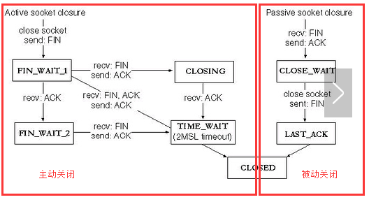

## netstat

### 语法

netstat命令用于显示与IP、TCP、UDP和ICMP协议相关的统计数据，一般用于检验本机各端口的网络连接情况。netstat是在内核中访问网络及相关信息的程序，它能提供TCP连接，TCP和UDP监听，进程内存管理的相关报告。
在Linux下，如果连接数比较大，可以使用效率更高的ss来替代netstat。

```bash
usage: netstat [-vWeenNcCF] [<Af>] -r         netstat {-V|--version|-h|--help}
       netstat [-vWnNcaeol] [<Socket> ...]
       netstat { [-vWeenNac] -I[<Iface>] | [-veenNac] -i | [-cnNe] -M | -s [-6tuw] } [delay]

        -r, --route              display routing table
        -I, --interfaces=<Iface> display interface table for <Iface>
        -i, --interfaces         display interface table
        -g, --groups             display multicast group memberships
        -s, --statistics         display networking statistics (like SNMP)
        -M, --masquerade         display masqueraded connections

        -v, --verbose            be verbose
        -W, --wide               don't truncate IP addresses
        -n, --numeric            don't resolve names
        --numeric-hosts          don't resolve host names
        --numeric-ports          don't resolve port names
        --numeric-users          don't resolve user names
        -N, --symbolic           resolve hardware names
        -e, --extend             display other/more information
        -p, --programs           display PID/Program name for sockets
        -o, --timers             display timers
        -c, --continuous         continuous listing

        -l, --listening          display listening server sockets
        -a, --all                display all sockets (default: connected)
        -F, --fib                display Forwarding Information Base (default)
        -C, --cache              display routing cache instead of FIB
        -Z, --context            display SELinux security context for sockets

  <Socket>={-t|--tcp} {-u|--udp} {-U|--udplite} {-S|--sctp} {-w|--raw}
           {-x|--unix} --ax25 --ipx --netrom
  <AF>=Use '-6|-4' or '-A <af>' or '--<af>'; default: inet
  List of possible address families (which support routing):
    inet (DARPA Internet) inet6 (IPv6) ax25 (AMPR AX.25) 
    netrom (AMPR NET/ROM) ipx (Novell IPX) ddp (Appletalk DDP) 
    x25 (CCITT X.25) 
```
<!--more-->

### 输出结果

```bash
[root@instance-gctg007a ~]# netstat
Active Internet connections (w/o servers)
Proto Recv-Q Send-Q Local Address           Foreign Address         State
tcp        0      0 instance-gctg007a:ssh   ip152.ip-66-70-13:35204 ESTABLISHED
tcp        0      0 instance-gctg007a:42940 100.64.253.36:tdp-suite ESTABLISHED
tcp        0      0 instance-gctg007a:53248 100.64.253.:radius-acct ESTABLISHED
tcp        0      0 instance-gctg007a:52486 100.64.253.41:http      ESTABLISHED
tcp        0      0 instance-gctg007a:ssh   58.56.96.27:59100       ESTABLISHED
tcp        0      0 instance-gctg007a:52504 100.64.253.41:http      ESTABLISHED
tcp6       0      0 localhost:781           localhost:44440         TIME_WAIT  
tcp6       0      0 localhost:781           localhost:44446         TIME_WAIT  
Active UNIX domain sockets (w/o servers)
Proto RefCnt Flags       Type       State         I-Node   Path
unix  2      [ ]         DGRAM                    128926   /var/run/chrony/chronyd.sock
unix  2      [ ]         DGRAM                    13279    /run/systemd/shutdownd
unix  3      [ ]         DGRAM                    7391     /run/systemd/notify
unix  2      [ ]         DGRAM                    7393     /run/systemd/cgroups-agent
unix  6      [ ]         DGRAM                    7405     /run/systemd/journal/socket
unix  14     [ ]         DGRAM                    7407     /dev/log
unix  3      [ ]         STREAM     CONNECTED     243842   /run/systemd/journal/stdout
```

#### 有源TCP连接

Active Internet connections，称为有源TCP连接，其中"Recv-Q"和"Send-Q"指的是接收队列和发送队列。这些数字一般都应该是0。如果不是则表示软件包正在队列中堆积。这种情况只能在非常少的情况见到。

#### 有源Unix域套接口

Active UNIX domain sockets，称为有源Unix域套接口(和网络套接字一样，但是只能用于本机通信，性能可以提高一倍)。

##### 参数说明

- Proto显示连接使用的协议
- RefCnt表示连接到本套接口上的进程号
- Types显示套接口的类型
- State显示套接口当前的状态
- Path表示连接到套接口的其它进程使用的路径名

#### 状态说明

<style type="text/css">
.tg  {border-collapse:collapse;border-spacing:0;border-color:#bbb;}
.tg td{font-family:Arial, sans-serif;font-size:14px;padding:10px 5px;border-style:solid;border-width:1px;overflow:hidden;word-break:normal;border-color:#bbb;color:#594F4F;background-color:#E0FFEB;}
.tg th{font-family:Arial, sans-serif;font-size:14px;font-weight:normal;padding:10px 5px;border-style:solid;border-width:1px;overflow:hidden;word-break:normal;border-color:#bbb;color:#493F3F;background-color:#9DE0AD;}
.tg .tg-cly1{text-align:left;vertical-align:middle}
.tg .tg-0lax{text-align:left;vertical-align:top}
</style>
<table class="tg">
  <tr>
    <th class="tg-cly1">CLOSED</th>
    <th class="tg-0lax">初始（无连接）状态</th>
  </tr>
  <tr>
    <td class="tg-cly1">LISTEN</td>
    <td class="tg-0lax">侦听状态，等待远程机器的连接请求</td>
  </tr>
  <tr>
    <td class="tg-cly1">SYN_SEND</td>
    <td class="tg-0lax">在TCP三次握手期间，主动连接端发送了SYN包后，进入SYN_SEND状态，等待对方的ACK包</td>
  </tr>
  <tr>
    <td class="tg-cly1">SYN_RECV</td>
    <td class="tg-0lax">在TCP三次握手期间，主动连接端收到SYN包后，进入SYN_RECV状态</td>
  </tr>
  <tr>
    <td class="tg-cly1">ESTABLISHED</td>
    <td class="tg-0lax">完成TCP三次握手后，主动连接端进入ESTABLISHED状态。此时，TCP连接已经建立，可以进行通信</td>
  </tr>
  <tr>
    <td class="tg-cly1">FIN_WAIT_1</td>
    <td class="tg-0lax">在TCP四次挥手时，主动关闭端发送FIN包后，进入FIN_WAIT_1状态</td>
  </tr>
  <tr>
    <td class="tg-cly1">FIN_WAIT_2</td>
    <td class="tg-0lax">在TCP四次挥手时，主动关闭端收到ACK包后，进入FIN_WAIT_2状态</td>
  </tr>
  <tr>
    <td class="tg-cly1">TIME_WAIT</td>
    <td class="tg-0lax">在TCP四次挥手时，主动关闭端发送了ACK包之后，进入TIME_WAIT状态，等待最多MSL时间，让被动关闭端收到ACK包</td>
  </tr>
  <tr>
    <td class="tg-cly1">CLOSING</td>
    <td class="tg-0lax">在TCP四次挥手期间，主动关闭端发送了FIN包后，没有收到对应的ACK包，却收到对方的FIN包，此时，进入CLOSING状态</td>
  </tr>
  <tr>
    <td class="tg-cly1">CLOSE_WAIT</td>
    <td class="tg-0lax">在TCP四次挥手期间，被动关闭端收到FIN包后，进入CLOSE_WAIT状态</td>
  </tr>
  <tr>
    <td class="tg-0lax">LAST_ACK</td>
    <td class="tg-0lax">在TCP四次挥手时，被动关闭端发送FIN包后，进入LAST_ACK状态，等待对方的ACK包</td>
  </tr>
</table>

<style type="text/css">
.tg  {border-collapse:collapse;border-spacing:0;border-color:#bbb;}
.tg td{font-family:Arial, sans-serif;font-size:14px;padding:10px 5px;border-style:solid;border-width:1px;overflow:hidden;word-break:normal;border-color:#bbb;color:#594F4F;background-color:#E0FFEB;}
.tg th{font-family:Arial, sans-serif;font-size:14px;font-weight:normal;padding:10px 5px;border-style:solid;border-width:1px;overflow:hidden;word-break:normal;border-color:#bbb;color:#493F3F;background-color:#9DE0AD;}
.tg .tg-cly1{text-align:left;vertical-align:middle}
.tg .tg-0lax{text-align:left;vertical-align:top}
</style>
<table class="tg">
  <tr>
    <th class="tg-cly1">主动连接端可能的状态有</th>
    <th class="tg-0lax">CLOSED        SYN_SEND        ESTABLISHED</th>
  </tr>
  <tr>
    <td class="tg-cly1">主动关闭端可能的状态有</td>
    <td class="tg-0lax">FIN_WAIT_1    FIN_WAIT_2      TIME_WAIT</td>
  </tr>
  <tr>
    <td class="tg-cly1">被动连接端可能的状态有</td>
    <td class="tg-0lax">LISTEN        SYN_RECV        ESTABLISHED</td>
  </tr>
  <tr>
    <td class="tg-cly1">被动关闭端可能的状态有</td>
    <td class="tg-0lax">CLOSE_WAIT    LAST_ACK        CLOSED</td>
  </tr>
</table>

<div align=center>



</div>

### 常用命令

#### 显示网卡列表

```bash
[root@instance-gctg007a ~]# netstat -i
Kernel Interface table
Iface             MTU    RX-OK RX-ERR RX-DRP RX-OVR    TX-OK TX-ERR TX-DRP TX-OVR Flg
docker0          1500        0      0      0 0             0      0      0      0 BMU
eth0             1500 24097762      0      0 0      24283960      0      0      0 BMRU
lo              65536  5213562      0      0 0       5213562      0      0      0 LRU
```

#### 显示组播信息

```bash
[root@instance-gctg007a ~]# netstat -g
IPv6/IPv4 Group Memberships
Interface       RefCnt Group
--------------- ------ ---------------------
lo              1      all-systems.mcast.net
eth0            1      all-systems.mcast.net
docker0         1      all-systems.mcast.net
lo              1      ff02::1
lo              1      ff01::1
eth0            1      ff02::202
eth0            1      ff02::1:ff55:3dea
eth0            1      ff02::1
eth0            1      ff01::1
docker0         1      ff02::1
docker0         1      ff01::1
```

#### 显示网络统计

```bash
[root@instance-gctg007a ~]# netstat -s | more 4
Ip:
    29005184 total packets received
    0 forwarded
    18 with unknown protocol
    0 incoming packets discarded
    29005160 incoming packets delivered
    29191565 requests sent out
```

#### 常用组合

```bash
[root@instance-gctg007a ~]# netstat -lntup
Active Internet connections (only servers)
Proto Recv-Q Send-Q Local Address           Foreign Address         State       PID/Program name    
tcp        0      0 0.0.0.0:3306            0.0.0.0:*               LISTEN      1162/mysqld         
tcp        0      0 0.0.0.0:111             0.0.0.0:*               LISTEN      1/systemd           
tcp        0      0 0.0.0.0:22              0.0.0.0:*               LISTEN      2099/sshd           
tcp        0      0 127.0.0.1:25            0.0.0.0:*               LISTEN      2055/master         
tcp6       0      0 :::781                  :::*                    LISTEN      2145/./bcm-agent    
tcp6       0      0 :::111                  :::*                    LISTEN      1/systemd           
tcp6       0      0 :::22                   :::*                    LISTEN      2099/sshd           
tcp6       0      0 ::1:25                  :::*                    LISTEN      2055/master         
udp        0      0 0.0.0.0:68              0.0.0.0:*                           1580/dhclient       
udp        0      0 0.0.0.0:111             0.0.0.0:*                           1/systemd           
udp        0      0 127.0.0.1:323           0.0.0.0:*                           13421/chronyd       
udp        0      0 0.0.0.0:827             0.0.0.0:*                           13372/rpcbind       
udp6       0      0 :::111                  :::*                                1/systemd           
udp6       0      0 ::1:323                 :::*                                13421/chronyd       
udp6       0      0 :::827                  :::*                                13372/rpcbind
```

#### 显示关于以太网的统计数据

用于显示关于以太网的统计数据。它列出的项目包括传送的数据报的总字节数、错误数、删除数、数据报的数量和广播的数量。这些统计数据既有发送的数据报数量，也有接收的数据报数量。这个选项可以用来统计一些基本的网络流量）

```bash
[root@instance-gctg007a ~]# netstat -e
Active Internet connections (w/o servers)
Proto Recv-Q Send-Q Local Address           Foreign Address         State       User       Inode     
tcp        0      0 instance-gctg007a:52948 100.64.253.41:http      ESTABLISHED root       41318395  
tcp        0      0 localhost:44890         localhost:781           ESTABLISHED root       41318388  
tcp        0      0 instance-gctg007a:42940 100.64.253.36:tdp-suite ESTABLISHED root       41007269  
tcp        0      0 instance-gctg007a:53248 100.64.253.:radius-acct ESTABLISHED root       41007268  
tcp        0      0 instance-gctg007a:ssh   188.131.142.109:51650   ESTABLISHED root       41318433  
tcp        0      0 instance-gctg007a:ssh   58.56.96.27:59100       ESTABLISHED root       41305929  
tcp        0      0 instance-gctg007a:50304 100.64.253.42:http      ESTABLISHED root       41318403  
tcp6       0      0 localhost:781           localhost:44886         TIME_WAIT   root       0         
tcp6       0      0 localhost:781           localhost:44890         ESTABLISHED root       41318389  
Active UNIX domain sockets (w/o servers)
Proto RefCnt Flags       Type       State         I-Node   Path
unix  2      [ ]         DGRAM                    128926   /var/run/chrony/chronyd.sock
unix  2      [ ]         DGRAM                    13279    /run/systemd/shutdownd
unix  3      [ ]         DGRAM                    7391     /run/systemd/notify
unix  2      [ ]         DGRAM                    7393     /run/systemd/cgroups-agent
unix  6      [ ]         DGRAM                    7405     /run/systemd/journal/socket
unix  15     [ ]         DGRAM                    7407     /dev/log
unix  3      [ ]         STREAM     CONNECTED     243842   /run/systemd/journal/stdout
```

#### 显示路由信息

```bash
[root@instance-gctg007a ~]# netstat -r
Kernel IP routing table
Destination     Gateway         Genmask         Flags   MSS Window  irtt Iface
default         gateway         0.0.0.0         UG        0 0          0 eth0
169.254.169.254 192.168.16.2    255.255.255.255 UGH       0 0          0 eth0
172.17.0.0      0.0.0.0         255.255.0.0     U         0 0          0 docker0
192.168.16.0    0.0.0.0         255.255.240.0   U         0 0          0 eth0
```

#### 统计机器中网络连接各个状态个数

```bash
[root@instance-gctg007a ~]# netstat -an | awk '/^tcp/ {++S[$NF]}  END {for (a in S) print a,S[a]} '
LISTEN 8
SYN_RECV 2
ESTABLISHED 5
TIME_WAIT 2
```

#### 查看连接某服务端口最多的的IP地址

```bash
[root@instance-gctg007a ~]# netstat -ant|grep "127.*"|awk '{print $5}'|awk -F: '{print $1}'|sort -nr|uniq -c
      4 127.0.0.1
      1 0.0.0.0
```

#### 找出程序运行的端口

```bash
[root@instance-gctg007a ~]# netstat -ap | grep ssh
tcp        0      0 0.0.0.0:ssh             0.0.0.0:*               LISTEN      2099/sshd           
tcp        0      0 instance-gctg007a:ssh   58.56.96.27:59100       ESTABLISHED 14074/sshd: root@pt 
tcp        0      0 instance-gctg007a:ssh   67.205.138.198:42924    ESTABLISHED 14679/sshd: root [p 
tcp       23      0 instance-gctg007a:ssh   193-93-12-122.sol:41056 ESTABLISHED 14678/sshd: [accept 
tcp6       0      0 [::]:ssh                [::]:*                  LISTEN      2099/sshd           
unix  2      [ ]         DGRAM                    41319468 14678/sshd: [accept  
unix  3      [ ]         STREAM     CONNECTED     41319497 14680/sshd: root [n  
unix  3      [ ]         STREAM     CONNECTED     41319498 14679/sshd: root [p  
unix  2      [ ]         DGRAM                    41319513 14679/sshd: root [p  
unix  2      [ ]         DGRAM                    41306028 14074/sshd: root@pt  
unix  3      [ ]         STREAM     CONNECTED     20226    2099/sshd 
```

#### 在 netstat 输出中显示 TCP连接信息

```bash
[root@instance-gctg007a ~]# netstat -pt
Active Internet connections (w/o servers)
Proto Recv-Q Send-Q Local Address           Foreign Address         State       PID/Program name    
tcp        0      0 instance-gctg007a:53010 100.64.253.41:http      ESTABLISHED 2145/./bcm-agent    
tcp        0      0 instance-gctg007a:42940 100.64.253.36:tdp-suite ESTABLISHED 20485/hosteye       
tcp        0      0 instance-gctg007a:53248 100.64.253.:radius-acct ESTABLISHED 20485/hosteye       
tcp        0      0 instance-gctg007a:53008 100.64.253.41:http      ESTABLISHED 2145/./bcm-agent    
tcp        0      0 instance-gctg007a:ssh   58.56.96.27:59100       ESTABLISHED 14074/sshd: root@pt 
tcp6       0      0 localhost:781           localhost:44944         TIME_WAIT   -                   
tcp6       0      0 localhost:781           localhost:44948         TIME_WAIT   -  
```

## ss

### 语法

ss命令可以用来获取socket统计信息，它可以显示和netstat类似的内容,ss可以提供以下信息：
1. 所有的TCP sockets
2. 所有的UDP sockets
3. 所有ssh/ftp/ttp/https持久连接
4. 所有连接到Xserver的本地进程
5. 使用state（例如：connected, synchronized, SYN-RECV, SYN-SENT,TIME-WAIT）、地址、端口过滤
6. 所有的state FIN-WAIT-1 tcpsocket连接以及更多

ss的优势在于它能够显示更多更详细的有关TCP和连接状态的信息，而且比netstat更快速更高效。原因如下：
1. 当服务器的socket连接数量变得非常大时，无论是使用netstat命令还是直接cat /proc/net/tcp，执行速度都会很慢。当服务器维持的连接达到上万个的时候，使用netstat等于浪费 生命，而用ss才是节省时间。
2. 而ss快的秘诀在于它利用到了TCP协议栈中tcp_diag。tcp_diag是一个用于分析统计的模块，可以获得Linux内核中第一手的信息，这就确保了ss的快捷高效。当然，如果你的系统中没有tcp_diag，ss也可以正常运行，只是效率会变得稍慢（但仍然比 netstat要快）。

```
Usage: ss [ OPTIONS ]
       ss [ OPTIONS ] [ FILTER ]
   -h, --help          this message
   -V, --version       output version information
   -n, --numeric       don't resolve service names
   -r, --resolve       resolve host names
   -a, --all           display all sockets
   -l, --listening     display listening sockets
   -o, --options       show timer information
   -e, --extended      show detailed socket information
   -m, --memory        show socket memory usage
   -p, --processes     show process using socket
   -i, --info          show internal TCP information
   -s, --summary       show socket usage summary
   -b, --bpf           show bpf filter socket information
   -E, --events        continually display sockets as they are destroyed
   -Z, --context       display process SELinux security contexts
   -z, --contexts      display process and socket SELinux security contexts
   -N, --net           switch to the specified network namespace name

   -4, --ipv4          display only IP version 4 sockets
   -6, --ipv6          display only IP version 6 sockets
   -0, --packet        display PACKET sockets
   -t, --tcp           display only TCP sockets
   -S, --sctp          display only SCTP sockets
   -u, --udp           display only UDP sockets
   -d, --dccp          display only DCCP sockets
   -w, --raw           display only RAW sockets
   -x, --unix          display only Unix domain sockets
       --vsock         display only vsock sockets
   -f, --family=FAMILY display sockets of type FAMILY
       FAMILY := {inet|inet6|link|unix|netlink|vsock|help}

   -K, --kill          forcibly close sockets, display what was closed
   -H, --no-header     Suppress header line

   -A, --query=QUERY, --socket=QUERY
       QUERY := {all|inet|tcp|udp|raw|unix|unix_dgram|unix_stream|unix_seqpacket|packet|netlink|vsock_stream|vsock_dgram}[,QUERY]

   -D, --diag=FILE     Dump raw information about TCP sockets to FILE
   -F, --filter=FILE   read filter information from FILE
       FILTER := [ state STATE-FILTER ] [ EXPRESSION ]
       STATE-FILTER := {all|connected|synchronized|bucket|big|TCP-STATES}
         TCP-STATES := {established|syn-sent|syn-recv|fin-wait-{1,2}|time-wait|closed|close-wait|last-ack|listen|closing}
          connected := {established|syn-sent|syn-recv|fin-wait-{1,2}|time-wait|close-wait|last-ack|closing}
       synchronized := {established|syn-recv|fin-wait-{1,2}|time-wait|close-wait|last-ack|closing}
             bucket := {syn-recv|time-wait}
                big := {established|syn-sent|fin-wait-{1,2}|closed|close-wait|last-ack|listen|closing}
```

### 常用命令

```bash
ss -l    显示本地打开的所有端口
ss -pl   显示每个进程具体打开的socket
ss -t -a 显示所有tcp socket
ss -u -a 显示所有的UDP Socekt
ss -o state established '( dport = :smtp or sport = :smtp )' 显示所有已建立的SMTP连接
ss -o state established '( dport = :http or sport = :http )' 显示所有已建立的HTTP连接
ss -x src /tmp/.X11-unix/* 找出所有连接X服务器的进程
ss -s 列出当前socket详细信息:
```

## 其他

## 参考

1. [Linux netstat命令详解](https://www.cnblogs.com/ftl1012/p/netstat.html)
2. [SS命令和Netstat命令比较](https://www.cnblogs.com/kevingrace/p/6211509.html)
3. [解决TIME_WAIT过多造成的问题](https://www.cnblogs.com/dadonggg/p/8778318.html)
4. [一文掌握 Linux 性能分析之网络篇](https://www.cnblogs.com/bakari/p/10515977.html)
5. [Linux系统排查4——网络篇](https://www.cnblogs.com/Security-Darren/p/4700387.html)
6. [Linux网络状态工具ss命令使用详解](http://www.ttlsa.com/linux-command/ss-replace-netstat/)
