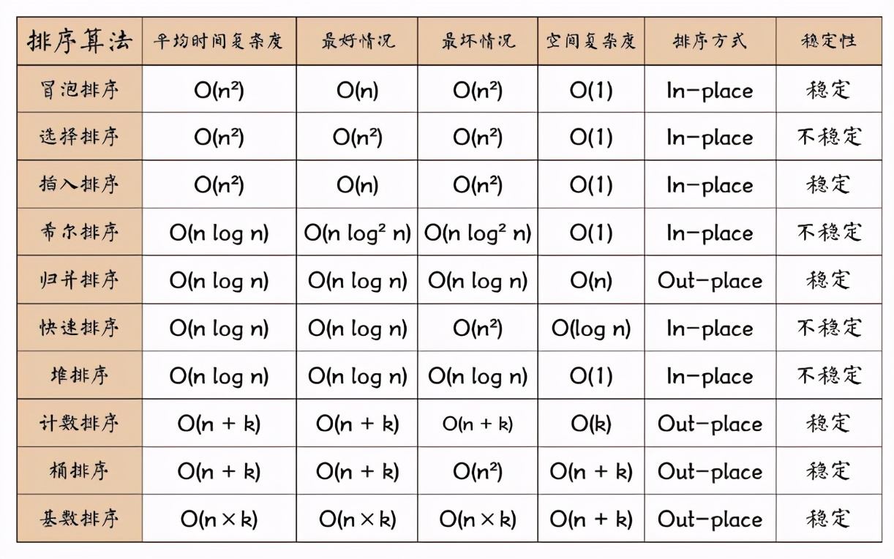

## 排序算法

<div align=center>



</div>

## sort_buffer_size

### sort_buffer_size的特点

1. 每个线程都会分配一个固定的大小，作为排序的buffer
2. 默认256KB，线程独有
3. 使用场景：排序比较大，且内存充足、并发不大时，可以适当增加该值，如果太大会耗尽内存（例如：500个连接将会消耗 500*sort_buffer_size(8M)=4G内存）
4. connection级别的参数，在每个connection（session）第一次需要使用这个buffer的时候，一次性分配设置的内存
5. 内存分配方式：超过2KB的时候，就会使用mmap() 而不是 malloc() 来进行内存分配，导致效率降低
6. 调优检查：explain select*from table where order limit；出现filesort（外部排序）

<!--more-->

### 配置文件

```conf
sort_buffer_size = 512K
```

### sort_buffer_size与待排序数据（data）的关系

1. data <= sort buffer：在内存中进行排序即可。内部排序使用的是**快速排序**（**内排序**）
2. data > sort buffer：MySQL 需要借助外部**容器（通常是文件）进行排序**。通常会将待排序数据分成多个“小文件”，对各个“小文件”进行排序，再汇总成一个有序的“大文件”。外部排序使用的是**归并排序**

## 排序方式

**two-pass、single-pass**

### 全字段排序

1. 只要与最终结果集有关的字段都会被放进 sort buffer，而不管该字段本身是否参与排序。
2. 步骤是：
   - 首先使用索引检索数据（可能回表，如果使用覆盖索引则不需要），把数据放入buffer中
   - 然后在buffer中进行排序，并且返回最终结果

### rowid排序

1. rowid定义：如果有主键则使用主键，否则由MySQL自动创建长度为6字节的rowId
2. rowid排序：**只将与排序相关的字段和 rowId 放入 sort buffer，其余结果集需要用到的数据在排序完成后，通过 rowId 回表取得**
3. 解决全字段排序出现“外部文件排序”的低效率问题
4. 缺点：排序后的数据需要再次回表（需要额外数据时）

### 优先队列排序

1. MySQL 针对带有 LIMIT 的 ORDER BY 语句的优化：使用优先队列进行排序
2. 步骤：
   - 在所有待排序的数据，取数量为 LIMIT的数据，构建一个堆
   - 不断的取下一行数据，更新堆节点
   - 当所有行的扫描完，得到最终的排序结果

### 选择策略

MySQL会在尽可能的情况下选择全字段排序。通过参数 **max_length_for_sort_data** 可以控制用于排序的行数据最大长度，默认值为 1024 字节。如果超过该值则会使用rowid排序。

### 临时表排序

通常对于一个执行较慢的排序语句，在使用 EXPLAIN 进行执行过程分析的时候除了能看到 **Using filesort** 以外，还能看到 **Using temporary**，代表在排序过程中使用到了临时表。

#### 内存临时表排序

1. MySQL 优先使用内存临时表。当 MySQL 使用内存临时表时，临时表存储引擎为 memory 。
2. 如果当前 MySQL 使用的是内存临时表的话，将会直接使用 rowId 排序
3. 使用 rowId 可以在 sort buffer 容纳给多的行，避免或减少外部排序文件的使用。

#### 磁盘临时表排序

1. **tmp_table_size** 参数限制了内存临时表的大小，默认值是 16M。
2. 超过该值转换为磁盘临时表。
3. 使用磁盘临时表的时候，表储存引擎将不再是 memory，而是由 **internal_tmp_disk_storage_engine** 参数控制，默认为 InnoDB 。这时候 MySQL 会根据单行大小是否超过 max_length_for_sort_data 决定采用全字段排序还是 rowId 排序。

## 其他

### 注意事项

1. 进行文件排序使用的临时存储空间会比想象的大得多，因为对**每一个排序记录都会分配一个足够长的定长空间来存放**
2. 关联查询
   - order by中的列都来源于第一个表：MySQL会在处理第一个表时就排序，explain看到“Using filesort”
   - 其他情况：“Using temporary；Using filesort” 
3. Limit会在排序之后生效（MySQL会针对limit进行优化）
4. 使用BLOB或Text字段时，只会使用前缀，然后忽略剩下部分的值，可以使用`max_sort_length`指定前缀的带下

## 参考

1. [MySQL 排序的艺术：你真的懂 Order By 吗？](https://www.toutiao.com/i6928270827142038027)
2. 《高性能MySQL》