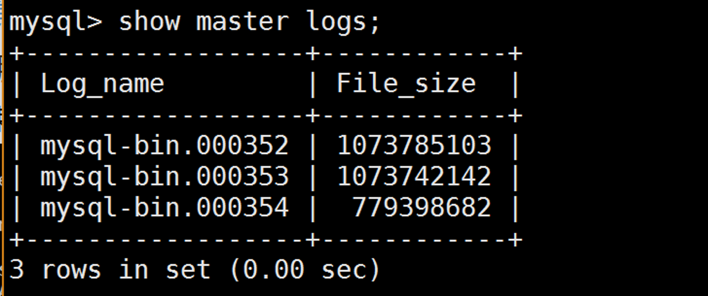
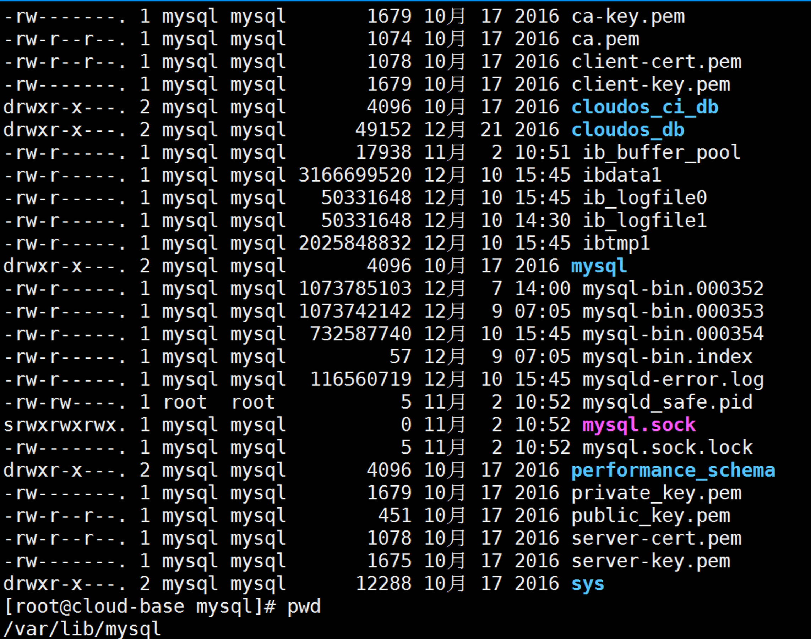
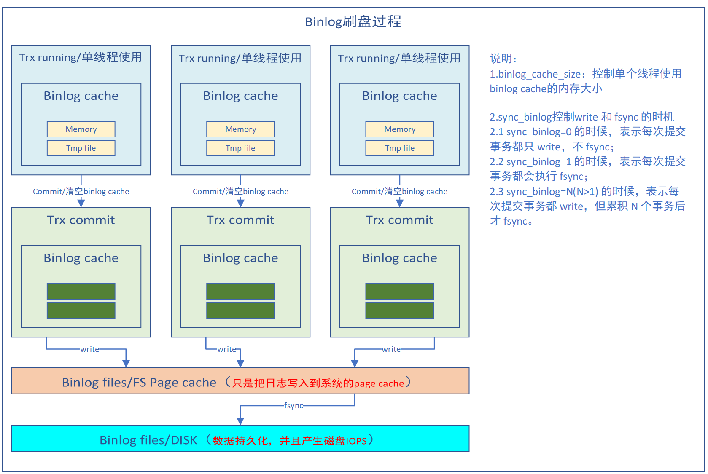
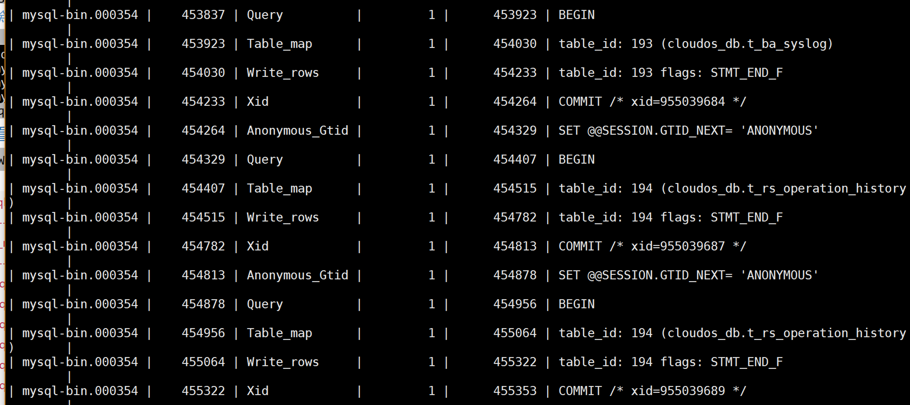

## 记录信息

1. 二进制日志记录 MySQL 数据库中所有与更新相关的操作，即二进制日志记录了所有的 DDL（数据定义语言）语句和 DML（数据操纵语言）语句，但是不包括数据查询语句。常用于恢复数据库和主从复制。
2. 二进制日志主要记录数据库的变化情况，因此可以用作主从库的同步。内容主要包括数据库所有的更新操作，use语句、insert语句、delete语句、update语句、create语句、alter语句、drop语句。用一句更简洁易懂的话概括就是：所有涉及数据变动的操作，都要记录进二进制日志中。

## 特性

1. 只要重启了服务, binlog二进制日志就会自己滚动一个新的, 或者使用flush logs 手动滚动日志
2. 记录的信息 主要是记录修改数据或有可能引起数据改变的MySql语句, 记录时间,操作时长,等等信息
3. 日志格式: 基于(语句, row, mixed) 默认mixed
4. 每一个二进制日志叫做一个Binary log event(二进制日志事件), 每一个二进制日志事件都有自己的元数据(meta data)信息, 时间,操作时长….
5. 每个二进制日志的上限是1G
<!--more-->

## 查看binlog状态

`show variables like 'log_bin%';`

<div align=center>


</div>

开启之后：  

<div align=center>


</div>

## 常用配置

<style type="text/css">
.tg  {border-collapse:collapse;border-spacing:0;}
.tg td{font-family:Arial, sans-serif;font-size:14px;padding:10px 5px;border-style:solid;border-width:1px;overflow:hidden;word-break:normal;border-color:black;}
.tg th{font-family:Arial, sans-serif;font-size:14px;font-weight:normal;padding:10px 5px;border-style:solid;border-width:1px;overflow:hidden;word-break:normal;border-color:black;}
.tg .tg-0lax{text-align:left;vertical-align:top}
</style>
<table class="tg">
  <tr>
    <th class="tg-0lax">参数</th>
    <th class="tg-0lax">说明</th>
  </tr>
  <tr>
    <td class="tg-0lax">sql_log_bin ={ON|OFF}</td>
    <td class="tg-0lax">用于控制会话级别二进制日志功能的开启或关闭。默认为ON，表示启用记录功能。用户可以在会话级别修改此变量的值，但其必须具有SUPER权限。</td>
  </tr>
  <tr>
    <td class="tg-0lax">binlog_cache_size =32768</td>
    <td class="tg-0lax">默认值32768 Binlog Cache用于在打开了二进制日志（binlog）记录功能的环境，是MySQL 用来提高binlog的记录效率而设计的一个用于短时间内临时缓存binlog数据的内存区域。一般来说，如果我们的数据库中没有什么大事务，写入也不是特别频繁，2MB～4MB是一个合适的选择。但是如果我们的数据库大事务较多，写入量比较大，可与适当调高binlog_cache_size。同时，我们可以通过binlog_cache_use 以及 binlog_cache_disk_use来分析设置的binlog_cache_size是否足够，是否有大量的binlog_cache由于内存大小不够而使用临时文件（binlog_cache_disk_use）来缓存了。</td>
  </tr>
  <tr>
    <td class="tg-0lax">binlog_stmt_cache_size= 32768</td>
    <td class="tg-0lax">当非事务语句使用二进制日志缓存，但是超出binlog_stmt_cache_size时，使用一个临时文件来存放这些语句。</td>
  </tr>
  <tr>
    <td class="tg-0lax">log_bin = mysql-bin</td>
    <td class="tg-0lax">指定binlog的位置，默认在数据目录下。</td>
  </tr>
  <tr>
    <td class="tg-0lax">binlog-format= {ROW|STATEMENT|MIXED}</td>
    <td class="tg-0lax">指定二进制日志的类型，默认为MIXED（row）。如果设定了二进制日志的格式，却没有启用二进制日志，则MySQL启动时会产生警告日志信息并记录于错误日志中</td>
  </tr>
  <tr>
    <td class="tg-0lax">sync_binlog = 10</td>
    <td class="tg-0lax">设定多久同步一次二进制日志至磁盘文件中，0表示不同步，任何正数值都表示对二进制每多少次写操作之后同步一次。当autocommit的值为1时，每条语句的执行都会引起二进制日志同步，否则，每个事务的提交会引起二进制日志同步</td>
  </tr>
  <tr>
    <td class="tg-0lax">max_binlog_cache_size= {4096 .. 18446744073709547520}</td>
    <td class="tg-0lax">二进制日志缓存空间大小，5.5.9及以后的版本仅应用于事务缓存，其上限由max_binlog_stmt_cache_size决定。</td>
  </tr>
  <tr>
    <td class="tg-0lax">max_binlog_stmt_cache_size= {4096 .. 18446744073709547520}</td>
    <td class="tg-0lax">二进制日志缓存空间大小，5.5.9及以后的版本仅应用于事务缓存</td>
  </tr>
  <tr>
    <td class="tg-0lax">expire_log_days ={0..99}</td>
    <td class="tg-0lax">设定二进制日志的过期天数，超出此天数的二进制日志文件将被自动删除。默认为0，表示不启用过期自动删除功能。如果启用此功能，自动删除工作通常发生在MySQL启动时或FLUSH日志时。</td>
  </tr>
  <tr>
    <td class="tg-0lax">log_slave_updates</td>
    <td class="tg-0lax">logslvaeupdates 用于主从复制</td>
  </tr>
</table>

### 开启二进制日志

1. 其一、log_bin可以直接定义为文件路径，也可以为ON|OFF。
2. 其二、通过编辑my.cnf中的log-bin选项可以开启二进制日志；形式如下：my.cnf文件

```sql
[mysqld]
log-bin [=DIR \ [filename]]
```

其中，DIR参数指定二进制文件的存储路径；filename参数指定二级制文件的文件名，其形式为filename.number，number的形式为000001、000002等。每次重启mysql服务或运行mysql> flush logs;都会生成一个新的二进制日志文件，这些日志文件的number会不断地递增。除了生成上述的文件外还会生成一个名为filename.index的文件。这个文件中存储所有二进制日志文件的清单又称为二进制文件的索引。

```
log-bin="filename-bin"
```

<div align=center>


</div>

> 注意：如果说我们向某个表的某个字段插入一个数据而这个数据为当前时间(日期时间型)；过段时间将此二进制文件应用到另一台服务器上数据就会变动从而导致数据的不一致性所以说对于这种非确定性的数据使用默认的语句定义并不是可靠的；

### 配置二进制文件大小

设定二进制日志文件上限，单位为字节，最小值为4K，最大值为1G，默认为1G。某事务所产生的日志信息只能写入一个二进制日志文件，因此，实际上的二进制日志文件可能大于这个指定的上限。作用范围为全局级别，可用于配置文件，属动态变量。  
`max_binlog_size={4096 .. 1073741824} ;`  
查看文件  
`show binary logs;`  

<div align=center>


</div>

查看主节点的日志  
<div align=center>



</div>

文件路径一般在mysql的目录下，如下图所示：  
<div align=center>



</div>

## 查看当前正在使用的二进制文件

`show master status;`

<div align=center>


</div>

> 小扩展：二进制日志的记录位置：通常为上一个事件执行结束时间的位置，每一个日志文件本身也有自己的元数据所以说对于当前版本的mysql来说二进制的开始位置通常为107；

```sql
mysql> flushlogs;
Query OK, 0 rowsaffected (0.23 sec)
注意：flush logs一般只会滚动中继日志和二进制日志。
mysql> show master status;
+------------------+----------+--------------+------------------+
| File             | Position | Binlog_Do_DB |Binlog_Ignore_DB |
+------------------+----------+--------------+------------------+
| mysql-bin.000011|      107 |              |                  |
+------------------+----------+--------------+------------------+
1 row in set (0.00sec)
```

## 二进制日志滚动

当 MySQL 服务进程启动、当前二进制日志文件的大小已经超过上限时、执行 FLUSH LOG 时，MySQL 会创建一个新的二进制日志文件。新的编号大1的日志用于记录最新的日志，而原日志名字不会被改变。  
手动滚动命令：flush logs;  

## 定义二进制格式日志

binlog_format= Mixed|Statement|Row  

1. 语句(statement)：默认的记录格式；
2. 行(row)：定义的并非数据本身而是这一行的数据是什么；需要解码
3. 混合模式(mixed)：交替使用行和语句、由mysql服务器自行判断。

其中基于行的定义格式数据量会大一些但是可以保证数据的精确性  

<style type="text/css">
.tg  {border-collapse:collapse;border-spacing:0;border-color:#bbb;}
.tg td{font-family:Arial, sans-serif;font-size:14px;padding:10px 5px;border-style:solid;border-width:1px;overflow:hidden;word-break:normal;border-color:#bbb;color:#594F4F;background-color:#E0FFEB;}
.tg th{font-family:Arial, sans-serif;font-size:14px;font-weight:normal;padding:10px 5px;border-style:solid;border-width:1px;overflow:hidden;word-break:normal;border-color:#bbb;color:#493F3F;background-color:#9DE0AD;}
.tg .tg-cly1{text-align:left;vertical-align:middle}
.tg .tg-0lax{text-align:left;vertical-align:top}
</style>
<table class="tg">
  <tr>
    <th class="tg-cly1">模式</th>
    <th class="tg-cly1">说明</th>
    <th class="tg-0lax">优点</th>
    <th class="tg-0lax">缺点</th>
  </tr>
  <tr>
    <td class="tg-cly1">STATEMENT模式（SBR）</td>
    <td class="tg-cly1">
        基于SQL语句的复制(statement-based replication, SBR)<br>
        每一条会修改数据的sql语句会记录到binlog中。
    </td>
    <td class="tg-0lax">
        不需要记录每一条sql语句和每一行的数据变化，减少了binlog日志量，节约IO，提高性能。<br>
        binlog中包含了所有数据库更改信息，可以据此来审核数据库的安全等情况。<br>
        binlog可以用于实时的还原，而不仅仅用于复制；主从版本可以不一样，从服务器版本可以比主服务器版本高
    </td>
    <td class="tg-0lax">
        在某些情况下会导致master-slave中的数据不一致(如sleep()函数， last_insert_id()，以及user-defined functions(udf)等会出现问题)<br>
        不是所有的UPDATE语句都能被复制，尤其是包含不确定操作的时候。<br>
        调用具有不确定因素的 UDF 时复制也可能出问题<br>
        INSERT ... SELECT 会产生比 RBR 更多的行级锁<br>
        使用以下函数的语句也无法被复制：<br>
        * LOAD_FILE()<br>
        * UUID()<br>
        * USER()<br>
        * FOUND_ROWS()<br>
        * SYSDATE() (除非启动时启用了 --sysdate-is-now 选项)<br>
        复制需要进行全表扫描(WHERE 语句中没有使用到索引)的 UPDATE 时，需要比 RBR 请求更多的行级锁<br>
        对于有 AUTO_INCREMENT 字段的 InnoDB表而言，INSERT 语句会阻塞其他 INSERT 语句<br>
        对于一些复杂的语句，在从服务器上的耗资源情况会更严重，而 RBR 模式下，只会对那个发生变化的记录产生影响<br>
        存储函数(不是存储过程)在被调用的同时也会执行一次 NOW() 函数，这个可以说是坏事也可能是好事<br>
        确定了的 UDF 也需要在从服务器上执行<br>
        数据表必须几乎和主服务器保持一致才行，否则可能会导致复制出错<br>
        执行复杂语句如果出错的话，会消耗更多资源
    </td>
  </tr>
  <tr>
    <td class="tg-cly1">ROW模式（RBR）</td>
    <td class="tg-cly1">基于行的复制(row-based replication, RBR)</td>
    <td class="tg-0lax">
        不记录每条sql语句的上下文信息，仅需记录哪条数据被修改了，修改成什么样了。而且不会出现某些特定情况下的存储过程、或function、或trigger的调用和触发无法被正确复制的问题。<br>
        任何情况都可以被复制，这对复制来说是最安全可靠的<br>
        和其他大多数数据库系统的复制技术一样<br>
        多数情况下，从服务器上的表如果有主键的话，复制就会快了很多<br>
        复制以下几种语句时的行锁更少：<br>
        * INSERT ... SELECT<br>
        * 包含 AUTO_INCREMENT 字段的 INSERT<br>
        * 没有附带条件或者并没有修改很多记录的 UPDATE 或 DELETE 语句<br>
        执行 INSERT，UPDATE，DELETE 语句时锁更少<br>
        从服务器上采用多线程来执行复制成为可能
    </td>
    <td class="tg-0lax">
        会产生大量的日志（binlog 大了很多），尤其是alter table的时候会让日志暴涨。<br>
        复杂的回滚时 binlog 中会包含大量的数据<br>
        主服务器上执行 UPDATE 语句时，所有发生变化的记录都会写到 binlog 中，而 SBR 只会写一次，这会导致频繁发生 binlog 的并发写问题<br>
        UDF 产生的大 BLOB 值会导致复制变慢<br>
        无法从 binlog 中看到都复制了写什么语句<br>
        当在非事务表上执行一段堆积的SQL语句时，最好采用 SBR 模式，否则很容易导致主从服务器的数据不一致情况发生<br>
        另外，针对系统库 mysql 里面的表发生变化时的处理规则如下：<br>
        如果是采用 INSERT，UPDATE，DELETE 直接操作表的情况，则日志格式根据 binlog_format 的设定而记录<br>
        如果是采用 GRANT，REVOKE，SET PASSWORD 等管理语句来做的话，那么无论如何都采用 SBR 模式记录<br>
        注：采用 RBR 模式后，能解决很多原先出现的主键重复问题。
    </td>
  </tr>
  <tr>
    <td class="tg-0lax">MIXED模式（MBR）</td>
    <td class="tg-0lax" colspan="3">
        混合模式复制(mixed-based replication, MBR)<br>
        一般的复制使用STATEMENT模式保存binlog，对于STATEMENT模式无法复制的操作使用ROW模式保存binlog，MySQL会根据执行的SQL语句选择日志保存方式。<br>
        对于执行的SQL语句中包含now()这样的时间函数，会在日志中产生对应的unix_timestamp()*1000的时间字符串，slave在完成同步时，取用的是sqlEvent发生的时间来保证数据的准确性。另外对于一些功能性函数slave能完成相应的数据同步，而对于上面指定的一些类似于UDF函数，导致Slave无法知晓的情况，则会采用ROW格式存储这些Binlog，以保证产生的Binlog可以供Slave完成数据同步。
    </td>
  </tr>
</table>

## 二进制日志的有效天数

`expire_logs_days = 5`

## 实时将缓存中数据同步到硬盘

sync_binlog：sync_binlog 的默认值是0，像操作系统刷其他文件的机制一样，MySQL不会同步到磁盘中去而是依赖操作系统来刷新binary log。 当sync_binlog =N (N>0) ，MySQL 在每写 N次 二进制日志binary log时，会使用fdatasync()函数将它的写二进制日志binary log同步到磁盘中去。（如果启用了autocommit，那么每一个语句statement就会有一次写操作；否则每个事务对应一个写操作）在MySQL中系统默认的设置是sync_binlog=0，也就是不做任何强制性的磁盘刷新指令，这时候的性能是最好的，但是风险也是最大的。因为一旦系统Crash，在binlog_cache中的所有binlog信息都会被丢失。而当设置为“1”的时候，是最安全但是性能损耗最大的设置。因为当设置为1的时候，即使系统Crash，也最多丢失binlog_cache中未完成的一个事务，对实际数据没有任何实质性影响。从以往经验和相关测试来看，对于高并发事务的系统来说，“sync_binlog”设置为0和设置为1的系统写入性能差距可能高达5倍甚至更多。

<div align=center>



</div>

## 数据备份与恢复

### 导出此数据库的信息

`mysqlbinlog mysql-bin.000017 > /tmp/a.sql`

### 导入此数据库的信息

`mysql < a.sql`

### Mysqlbinlog

```sql
语法
-s                          以精简的方式显示日志内容
-v                          以详细的方式显示日志内容
-d=数据库名                  只显示指定数据库的日志内容
-o=n                        忽略日志中前n行MySQL命令
-r=file                    将指定内容写入指定文件
--start-datetime           显示指定时间范围内的日志内容
--stop-datetime
--start-position        显示指定位置间隔内的日志内容
--stop-position
```

mysqlbinlog mysql-bin.******  
--start-datetime=#  
--stop-datetime=#  
--start-position=#  
--stop-position=#  
还可以使用-u,-p,-h 去读取其他主机上的二进制日志  

#### 通过时间恢复方法如下

mysqlbinlog mysql-bin.000017--stop-date="恢复截至时间"|mysql -uroot -proot

#### 通过操作点恢复

mysqlbinlog --stop-position="450" mysql-bin.000017  | mysql -u root –p

## 清除二进制日志 

二进制日志会记录大量的信息（其中包含一些无用的信息）。如果很长时间不清理二进制日志，将会浪费很多的磁盘空间。但是，删除之后可能导致数据库崩溃时无法进行恢复，所以若要删除二进制日志首先将其和数据库备份一份，其中也只能删除备份前的二进制日志，新产生的日志信息不可删(可以做即时点还原)。也不可在关闭mysql服务器之后直接删除因为这样可能会给数据库带来错误的。若非要删除二进制日志需要做如下操作：导出备份数据库和二进制日志文件进行压缩归档存储。

### 清除所有日志（不存在主从复制关系）

使用RESET MASTER语句可以删除所有的二进制日志。  
`RESET MASTER;`

> 解析：首先不建议在生产环境下使用此操作；删除所有的二进制日志后，Mysql将会重新创建新的二进制日志。新二进制日志的编号从000001开始。

### 根据文件或时间点来删除二进制日志

```bash
mysql> PURGE { BINARY | MASTER } LOGS {TO 'log_name' | BEFORE datetime_expr }
```

> 其中TO'log_name'表示把这个文件之前的其他文件都删除掉，也可使用BEFORE datetime_expr指定把哪个时间之前的二进制文件删除了。

#### 清除指定日志之前的所有日志

```bash
PURGE MASTER LOGS TO 'mysql-bin.000352';
```

#### 清除某一时间点前的所有日志

```bash
PURGE MASTER LOGS BEFORE '2015-01-01 00:00:00';
```

#### 清除 n 天前的所有日志

```bash
PURGE MASTER LOGS BEFORE CURRENT_DATE - INTERVAL 10 DAY;
```

> 由于二进制日志的重要性,请仅在确定不再需要将要被删除的二进制文件，或者在已经对二进制日志文件进行归档备份，或者已经进行数据库备份的情况下，才进行删除操作，且不要使用 rm 命令删除。

### 清除二进制日志的最佳实践

清除之前必须将日志文件备份，备份完毕后再次确认，如果确实可以删除则使用以上命令进行删除  
假设binglog备份文件已经备份到日志服务器中，当前本地的数据库日志已经确保无误可以删除

#### 备份二进制文件

`cp mysql-bin.0000* /tmp/`

#### 备份数据库

`mysqldump-u root -p'123456' -A > /tmp/bak.sql`

#### 查询日志

`tail -5 mysql-bin.index`  
<div align=center>


</div>

#### 删除某个日志之前的日志

`purge binary logs to 'mysql-bin.****';`

#### 删除某一事件之前的信息

`cat  mysql-bin.index`

<div align=center>


</div>

```bash
mysql>show binlog events in 'mysql-bin.****' limit 10;
```

## 查看日志详细

```bash
SHOW BINLOG EVENTS [IN ‘log_name’] [FROM pos] [LIMIT [offset,]row_count]
show binlog events in 'mysql-bin.000354';
```

<div align=center>



</div>

每个语句执行结束后都会向日志记录的，因此如果数据量非常庞大的话会影响性能下降的从哪个位置开始查询  

`show binlog events in 'mysql-bin.000354' from 192 limit 2;`

### 使用mysqlbinlog命令行

mysqlbinlog直接在命令行直接去操作二进制文件  
建议对日志操作之前先将其flush logs 滚动一次再对其进行编辑  

```bash
mysqlbinlog --no-defaults --base64-output=decode-rows -v mysql-bin.000001
```

### 查看二进制日志内容信息

`mysqlbinlog mysql-bin.000354  |more`

#### 文件头

<div align=center>


</div>

#### 初始化版本信息

用户通过mysql服务器进行通告  
at 4 表示结束的位置  

<div align=center>


</div>

#### 开始位置123

at 123 #开始处，表明了上一个时间结束的时候开始  
<div align=center>


</div>

#### 境预设再下面就是sql语句了

<div align=center>


</div>

#### 错误

##### mysqlbinlog 查看binlog时报错unknown variable 'default-character-set=utf8' 

原因是mysqlbinlog这个工具无法识别binlog中的配置中的default-character-set=utf8这个指令。
两个方法可以解决这个问题

1. 一是在MySQL的配置/etc/my.cnf中将default-character-set=utf8 修改为 character-set-server = utf8，但是这需要重启MySQL服务，如果你的MySQL服务正在忙，那这样的代价会比较大。
2. 二是用mysqlbinlog --no-defaults mysql-bin.000004 命令打开

## 其他

### mysql二进制日志处理事务与非事务性语句的区别

在事务性语句执行过程中，服务器将会进行额外的处理，在服务器执行时多个事务是并行执行的，为了把他们的记录在一起，需要引入事务缓存的概念。在事务完成被提交的时候一同刷新到二进制日志。对于非事务性语句的处理。遵循以下3条规则：

1. 如果非事务性语句被标记为事务性，那么将被写入事务缓冲。
2. 如果没有标记为事务性语句，而且事务缓存中没有，那么直接写入二进制日志。
3. 如果没有标记为事务性的，但是事务缓存中有，那么写入事务缓冲。  
注意如果在一个事务中有非事务性语句，那么将会利用规则2，优先将该影响非事务表语句直接写入二进制日志。


## 参考

1. [数据库日志文件-- undo log 、redo log、 undo/redo log](https://blog.csdn.net/ggxxkkll/article/details/7616739)
2. [InnoDB事务日志（redo log 和 undo log）详解](https://blog.csdn.net/leonpenn/article/details/72778901)
3. [MySQL源码学习：ib_logfile、bin-log与主从同步](https://www.iteye.com/blog/dinglin-907123)
4. [Mysql日志抽取与解析](https://blog.csdn.net/hackerwin7/article/details/39896173)
5. [mysql data文件夹下的ibdata1 文件作用](https://blog.csdn.net/u010440155/article/details/54914353)
6. [mysql——innodb事务日志详解](https://blog.csdn.net/donghaixiaolongwang/article/details/60961603)
7. [inlog，redo log，undo log区别](https://blog.csdn.net/mydriverc2/article/details/50629599)
8. [高性能MySQL学习笔记（3） --- InnoDB事务日志（redo log 和 undo log）详解](http://www.itwendao.com/article/detail/450198.html)
