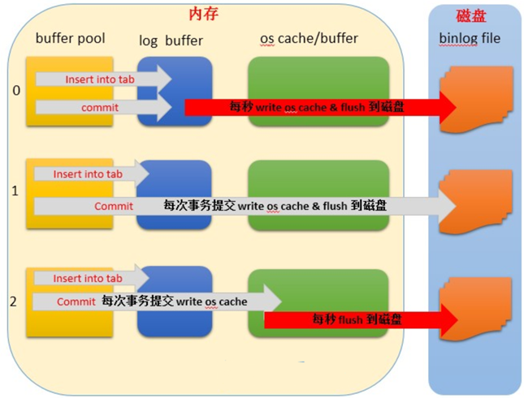
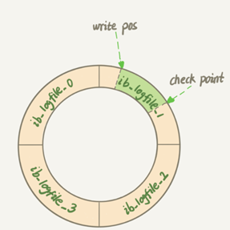

MySQL会最大程度的利用缓存，从而提高数据的访问效率。那么换一句话来说，任何高性能的系统都必须利用到缓存，从各个层面来讲，缓存都发挥了巨大的作用。再上升到一个高度提炼一下：缓存和队列是实现高性能的必走之路。那么对于数据库来说这个却是个很棘手的问题，要保证数据更高效率的读取和存储，所以要利用到缓存。但是要保证数据的一致性，则必须保证所有的数据都必须准确无误的存储到数据库中，及时发生意外，也要保证数据可恢复。我们知道InnoDB是一个事务安全的存储引擎，而一致性是事务ACID中的一个重要特性。InnoDB存储引擎主要是通过InnoDB事务日志实现数据一致性的，InnoDB事务日志包括重做（redo、循环写入）日志，以及回滚（undo）日志。
<!--more-->

## 说明

事务日志（InnoDB特有的日志）可以帮助提高事务的效率。
事物日志是innodb专用功能,这里只考虑innod存储引擎。
出于性能和故障恢复的考虑，MySQL 服务器不会立即执行事务，而是先将事务记录在日志里面，这样可以将随机IO转换成顺序IO，从而提高IO性能。
事物日志默认情况下会有两个文件，名称分别为ib_logfile0和ib_logfile1。当其中一个写满时，MySQL会将事务日志写入另一个日志文件(先清空原有内容)。当 MySQL 从崩溃中恢复时，会读取事务日志，将其中已经 commit 的事务写入数据库，没有 commit 的事务 rollback 。
在事物提交时，innodb是否将缓冲到文件中同步，只要提交则立刻同步，同时又不会保证每个语句都同步，因此性能不会有特别大的影响。
使用事务日志，存储引擎在修改表的数据时只需要修改其内存拷贝，再把该修改行为记录到持久在硬盘上的事务日志中，而不用每次都将修改的数据本身持久到磁盘。
事务日志采用追加的方式，因此写日志的操作是磁盘上一小块区域内的顺序I/O，而不像随机I/O需要在磁盘的多个地方移动磁头，所以采用事务日志的方式相对来说要快得多。
事务日志持久以后，内存中被修改的数据在后台可以慢慢的刷回到磁盘。目前大多数的存储引擎都是这样实现的，我们通常称之为预写式日志，修改数据需要写两次磁盘。
如果数据的修改已经记录到事务日志并持久化，但数据本身还没有写回磁盘，此时系统崩溃，存储引擎在重启时能够自动恢复这部分修改的数据。具有的恢复方式则视存储引擎而定。
事务日志是被轮转的,一启动就分配完毕了, 并且是连续的存储空间,默认每个文件的大小为5M
主要功能: 将随机I/O转换为顺序I/O
ib_logfile0, ib_logfile1, 这两个文件如果坏了那么对于mysql来说是致命的, 所以建议事务log使用raid
会把一些相关信息记录事务日志中(记录对数据文件数据修改的物理位置或叫做偏移量);
作用:在系统崩溃重启时，作事务重做；在系统正常时，每次checkpoint时间点，会将之前写入事务应用到数据文件中。  
有了 redo log，InnoDB 就可以保证即使数据库发生异常重启，之前提交的记录都不会丢失，这个能力称为 crash-safe。  

## 原理

<div align=center>



</div>

<div align=center>



</div>

## 查看事务日志定义

```sql
show global variables like 'innodb_log%';
```

<div align=center>


</div>

### 参数说明

```sql
mysql> show global variables like 'innodb_log%';
+-----------------------------+----------+
| Variable_name               | Value    |
+-----------------------------+----------+
# 定义内存空间的大小，万一都写在buffer里面，如果进程崩溃，也会丢失事物，
# 因此避免这种情况，一旦事物提交了，那么需要立即同步到磁盘中，而不是间断同步
# 事务日志缓存区,可设置1M~8M,默认8M,延迟事务日志写入磁盘,
# 启用大的事务日志缓存,可以将完整运行大事务日志，暂时存放在事务缓存区中,
# 不必(事务提交前)写入磁盘保存,同时也起到节约磁盘空间占用;
| innodb_log_buffer_size      | 16777216 |
| innodb_log_checksums        | ON       |
| innodb_log_compressed_pages | ON       |

# 控制事务日志ib_logfile的大小,范围5MB~4G；
# 所有事务日志ib_logfile0+ib_logfile1+..累加大小不能超过4G，
# 事务日志大，checkpoint会少,节省磁盘IO，
# 但是大的事务日志意味着数据库crash时，恢复起来较慢.
# 引入问题:修改该参数大小，导致ib_logfile文件的大小和之前存在的文件大小不匹配
# 解决方式：在干净关闭数据库情况下，删除ib_logfile，而后重启数据库，会自行创建该文件;
#每个日志的单位大小为5MB，如果有些大数据的话，则需要将其调大，
#否则恢复起来会比较慢，但是太大了也会导致恢复比较慢
| innodb_log_file_size        | 50331648 |

# 至少有两个
| innodb_log_files_in_group   | 2        |

# 定义innodb事务日志组的位置，
# 定义事物日志组的位置，一般来讲会有2个日志，
# 一个写满后会重建文件（达到轮询功能，写满后会同步到磁盘并将其清空）
# 一般来讲，日志文件大小是固定的，凡是mysql已启动日志空间会在磁盘上立即分配，
# 因为他们的主要功能是将随机IO转为顺序IO ，默认大小是每个文件为5MB，
# 明确说明事物日志的路径保存在./ 表示在当前路径下
| innodb_log_group_home_dir   | ./       |
| innodb_log_write_ahead_size | 8192     |
+-----------------------------+----------+
7 rows in set (0.00 sec)

```

#### innodb_flush_log_at_trx_commit

在事务提交时innodb是否同步日志从缓冲到文件中（1表示事务一提交就同步不提交每隔一秒同步一次，性能会很差造成大量的磁盘I/O；定义为2表示只有在事务提交时才会同步但是可能会丢失整个事务 ）
innodb_flush_log_at_trx_commit：控制事务日志何时写盘和刷盘，安全递增：0,2,1；事务缓存区:log_buffer;
如果innodb_flush_log_at_trx_commit设置为0，log buffer将每秒一次地写入log file中，并且log file的flush(刷到磁盘)操作同时进行.该模式下，在事务提交的时候，不会主动触发写入磁盘的操作。 
如果innodb_flush_log_at_trx_commit设置为1，每次事务提交时MySQL都会把log buffer的数据写入log file，并且flush(刷到磁盘)中去. （最安全）
如果innodb_flush_log_at_trx_commit设置为2，每次事务提交时MySQL都会把log buffer的数据写入log file.但是flush(刷到磁盘)操作并不会同时进行。该模式下,MySQL会每秒执行一次 flush(刷到磁盘)操作。
适用环境:

- 0:磁盘IO能力有限,安全方便较差,无复制或复制延迟可以接受，如日志性业务，mysql损坏丢失1s事务数据;
- 2:数据安全性有要求，可以丢失一点事务日志，复制延迟也可以接受，OS损坏时才可能丢失数据;
- 1:数据安全性要求非常高，且磁盘IO能力足够支持业务，如充值消费，敏感业务;

#### innodb_mirrored_log_groups

表示对日志组做镜像

### 文件位置

<div align=center>


</div>

## 参考

1. [数据库日志文件-- undo log 、redo log、 undo/redo log](https://blog.csdn.net/ggxxkkll/article/details/7616739)
2. [InnoDB事务日志（redo log 和 undo log）详解](https://blog.csdn.net/leonpenn/article/details/72778901)
3. [MySQL源码学习：ib_logfile、bin-log与主从同步](https://www.iteye.com/blog/dinglin-907123)
4. [Mysql日志抽取与解析](https://blog.csdn.net/hackerwin7/article/details/39896173)
5. [mysql data文件夹下的ibdata1 文件作用](https://blog.csdn.net/u010440155/article/details/54914353)
6. [mysql——innodb事务日志详解](https://blog.csdn.net/donghaixiaolongwang/article/details/60961603)
7. [inlog，redo log，undo log区别](https://blog.csdn.net/mydriverc2/article/details/50629599)
8. [高性能MySQL学习笔记（3） --- InnoDB事务日志（redo log 和 undo log）详解](http://www.itwendao.com/article/detail/450198.html)
