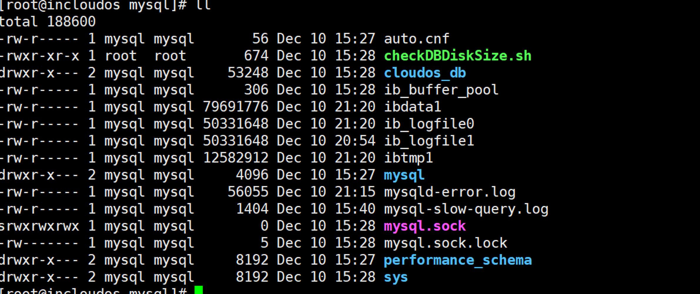

## 说明

在mysql数据库中，错误日志功能是默认开启的。并且，错误日志无法被禁止。默认情况下，错误日志存储在mysql数据库的数据文件中。错误日志文件通常的名称为hostname.err。其中，hostname表示服务器主机名。
错误日志信息可以自己进行配置的，错误日志所记录的信息是可以通过log-error和log-warnings来定义的，其中log-err是定义是否启用错误日志的功能和错误日志的存储位置，log-warnings是定义是否将警告信息也定义至错误日志中。默认情况下错误日志大概记录以下几个方面的信息：服务器启动和关闭过程中的信息（未必是错误信息，如mysql如何启动InnoDB的表空间文件的、如何初始化自己的存储引擎的等等）、服务器运行过程中的错误信息、事件调度器运行一个事件时产生的信息、在从服务器上启动服务器进程时产生的信息。
<!--more-->

## 记录内容

默认情况下错误日志也记录以下几个方面的消息：  

1. 服务器启动和关闭过程中的信息：未必是错误信息，比如mysql是如何去初始化存储引擎的过程记录在错误日志里等等
2. 服务器运行过程中的错误信息：如sock文件找不到，无法加载mysql数据库的数据文件，如果忘记初始化mysql或data dir路径找不到，或权限不正确等，都会记录在此。error 日志并不会记录所有的错误信息，只有MySQL服务实例运行过程中发声的关键错误（critical）才会被记录下来
3. 事件调度器运行一个事件时产生的信息：一旦mysql调度启动一个计划任务的时候，它也会将相关信息记录在错误日志中
4. 在从服务器上启动从服务器进程时产生的信息：在复制环境下，从服务器进程的信息也会被记录进错误日

## 开启

log_error可以直接定义为文件路径，也可以为ON|OFF；log_warings只能使用1|0来定义开关启动。  
log_error = on|文件路径 是否启用错误日志,on表示开启,文件路径表示指定自定义日志路径  
log_warnings = 1|0 是否记录warnings信息到错误日志中  

```sql
mysql> show variables like 'log_error'\G;
*************************** 1. row ***************************
Variable_name: log_error
        Value: /var/lib/mysql/mysqld-error.log
1 row in set (0.00 sec)
```

更改错误日志位置可以使用log_error来设置形式如下：
<div align=center>


</div>

log_error=DIR/[filename]
> 说明：其中，DIR参数指定错误日志的路径filename参数是错误日志的名称，没有指定该参数时默认为主机名。重启mysql服务器即可生效。

## 分析

```sql
2017-12-10T07:27:58.691227Z 0 [Warning] TIMESTAMP with implicit DEFAULT value is deprecated. Please use --explicit_defaults_for_timestamp server option (see documentation for more details).
2017-12-10T07:27:58.700431Z 0 [Warning] You need to use --log-bin to make --log-slave-updates work.
2017-12-10T07:27:59.357341Z 0 [Warning] InnoDB: New log files created, LSN=45790
2017-12-10T07:27:59.462957Z 0 [Warning] InnoDB: Creating foreign key constraint system tables.
2017-12-10T07:28:00.410778Z 1 [Warning] 'user' entry 'root@localhost' ignored in --skip-name-resolve mode.
2017-12-10T07:28:00.410831Z 1 [Warning] 'user' entry 'mysql.sys@localhost' ignored in --skip-name-resolve mode.
2017-12-10T07:28:00.410860Z 1 [Warning] 'db' entry 'sys mysql.sys@localhost' ignored in --skip-name-resolve mode.
2017-12-10T07:28:00.410881Z 1 [Warning] 'proxies_priv' entry '@ root@localhost' ignored in --skip-name-resolve mode.
2017-12-10T07:28:00.410940Z 1 [Warning] 'tables_priv' entry 'sys_config mysql.sys@localhost' ignored in --skip-name-resolve mode.
2017-12-10T07:28:04.222131Z 0 [Warning] Changed limits: max_open_files: 5000 (requested 10000)
2017-12-10T07:28:04.222594Z 0 [Warning] Changed limits: table_open_cache: 1495 (requested 2000)
2017-12-10T07:28:04.429941Z 0 [Warning] TIMESTAMP with implicit DEFAULT value is deprecated. Please use --explicit_defaults_for_timestamp server option (see documentation for more details).
2017-12-10T07:28:04.431994Z 0 [Note] /usr/sbin/mysqld (mysqld 5.7.17-log) starting as process 2255 ...
2017-12-10T07:28:04.435711Z 0 [Warning] You need to use --log-bin to make --log-slave-updates work.
2017-12-10T07:28:04.438402Z 0 [Note] InnoDB: PUNCH HOLE support available
2017-12-10T07:28:04.438441Z 0 [Note] InnoDB: Mutexes and rw_locks use GCC atomic builtins#Mutexes（互斥量）和rw_locks（行级锁）是GCC编译的是InnoDB内置的。
2017-12-10T07:28:04.438448Z 0 [Note] InnoDB: Uses event mutexes
2017-12-10T07:28:04.438454Z 0 [Note] InnoDB: GCC builtin __atomic_thread_fence() is used for memory barrier
2017-12-10T07:28:04.438460Z 0 [Note] InnoDB: Compressed tables use zlib 1.2.3#默认压缩工具是zlib
2017-12-10T07:28:04.438469Z 0 [Note] InnoDB: Using Linux native AIO
2017-12-10T07:28:04.440212Z 0 [Note] InnoDB: Number of pools: 1
2017-12-10T07:28:04.440425Z 0 [Note] InnoDB: Using CPU crc32 instructions
2017-12-10T07:28:04.443133Z 0 [Note] InnoDB: Initializing buffer pool, total size = 128M, instances = 1, chunk size = 128M#InnoDB引擎的缓冲池（buffer pool）的值大小
2017-12-10T07:28:04.457773Z 0 [Note] InnoDB: Completed initialization of buffer pool
2017-12-10T07:28:04.461218Z 0 [Note] InnoDB: If the mysqld execution user is authorized, page cleaner thread priority can be changed. See the man page of setpriority().
2017-12-10T07:28:04.474457Z 0 [Note] InnoDB: Highest supported file format is Barracuda.
2017-12-10T07:28:04.490641Z 0 [Note] InnoDB: Creating shared tablespace for temporary tables
2017-12-10T07:28:04.490762Z 0 [Note] InnoDB: Setting file './ibtmp1' size to 12 MB. Physically writing the file full; Please wait ...
2017-12-10T07:28:04.548037Z 0 [Note] InnoDB: File './ibtmp1' size is now 12 MB.
2017-12-10T07:28:04.549679Z 0 [Note] InnoDB: 96 redo rollback segment(s) found. 96 redo rollback segment(s) are active.
2017-12-10T07:28:04.549703Z 0 [Note] InnoDB: 32 non-redo rollback segment(s) are active.
2017-12-10T07:28:04.551022Z 0 [Note] InnoDB: Waiting for purge to start
2017-12-10T07:28:04.601254Z 0 [Note] InnoDB: 5.7.17 started; log sequence number 2534561
2017-12-10T07:28:04.602149Z 0 [Note] InnoDB: Loading buffer pool(s) from /var/lib/mysql/ib_buffer_pool
2017-12-10T07:28:04.602726Z 0 [Note] Plugin 'FEDERATED' is disabled.
2017-12-10T07:28:04.604540Z 0 [Note] InnoDB: Buffer pool(s) load completed at 171210 15:28:04
2017-12-10T07:28:04.610872Z 0 [Warning] Failed to set up SSL because of the following SSL library error: SSL context is not usable without certificate and private key
2017-12-10T07:28:04.610909Z 0 [Note] Server hostname (bind-address): '*'; port: 3306
2017-12-10T07:28:04.610980Z 0 [Note] IPv6 is available.
2017-12-10T07:28:04.611001Z 0 [Note]   - '::' resolves to '::';#主机名解析
2017-12-10T07:28:04.611025Z 0 [Note] Server socket created on IP: '::'.
2017-12-10T07:28:04.623503Z 0 [Warning] 'user' entry 'root@localhost' ignored in --skip-name-resolve mode.
2017-12-10T07:28:04.623583Z 0 [Warning] 'user' entry 'mysql.sys@localhost' ignored in --skip-name-resolve mode.
2017-12-10T07:28:04.623624Z 0 [Warning] 'db' entry 'sys mysql.sys@localhost' ignored in --skip-name-resolve mode.
2017-12-10T07:28:04.623645Z 0 [Warning] 'proxies_priv' entry '@ root@localhost' ignored in --skip-name-resolve mode.
2017-12-10T07:28:04.625694Z 0 [Warning] 'tables_priv' entry 'sys_config mysql.sys@localhost' ignored in --skip-name-resolve mode.
2017-12-10T07:28:04.637286Z 0 [Note] Event Scheduler: Loaded 0 events#事件调度器没有任何事件，因为没有装载。
2017-12-10T07:28:04.637536Z 1 [Note] Event Scheduler: scheduler thread started with id 1
2017-12-10T07:28:04.637618Z 0 [Note] Executing 'SELECT * FROM INFORMATION_SCHEMA.TABLES;' to get a list of tables using the deprecated partition engine. You may use the startup option '--disable-partition-engine-check' to skip this check.
2017-12-10T07:28:04.637635Z 0 [Note] Beginning of list of non-natively partitioned tables
2017-12-10T07:28:04.654416Z 0 [Note] End of list of non-natively partitioned tables
2017-12-10T07:28:04.654591Z 0 [Note] /usr/sbin/mysqld: ready for connections.#mysql启动完成等待客户端的请求。
Version: '5.7.17-log'  socket: '/var/lib/mysql/mysql.sock'  port: 3306  MySQL Community Server (GPL)#创建一个本地sock用于本地连接。
```

## 删除日志

在mysql5.5.7之前：数据库管理员可以删除很长时间之前的错误日志，以保证mysql服务器上的硬盘空间。mysql数据库中，可以使用mysqladmin命令开启新的错误日志。mysqladmin命令的语法如下：mysqladmin –u root –pflush-logs也可以使用登录mysql数据库中使用FLUSHLOGS语句来开启新的错误日志。
在mysql5.5.7之后：服务器将关闭此项功能。只能使用重命名原来的错误日志文件，手动冲洗日志创建一个新的：方式如下：

```bash
mv host_name.err host_name.err-old
mysqladmin flush-logs
mv host_name.err-old backup-directory

mysqladmin -uroot -p flush-logs
```

<div align=center>



</div>

<div align=center>


</div>

On Windows, use rename rather than mv.

## 参考

1. [数据库日志文件-- undo log 、redo log、 undo/redo log](https://blog.csdn.net/ggxxkkll/article/details/7616739)
2. [InnoDB事务日志（redo log 和 undo log）详解](https://blog.csdn.net/leonpenn/article/details/72778901)
3. [MySQL源码学习：ib_logfile、bin-log与主从同步](https://www.iteye.com/blog/dinglin-907123)
4. [Mysql日志抽取与解析](https://blog.csdn.net/hackerwin7/article/details/39896173)
5. [mysql data文件夹下的ibdata1 文件作用](https://blog.csdn.net/u010440155/article/details/54914353)
6. [mysql——innodb事务日志详解](https://blog.csdn.net/donghaixiaolongwang/article/details/60961603)
7. [inlog，redo log，undo log区别](https://blog.csdn.net/mydriverc2/article/details/50629599)
8. [高性能MySQL学习笔记（3） --- InnoDB事务日志（redo log 和 undo log）详解](http://www.itwendao.com/article/detail/450198.html)
