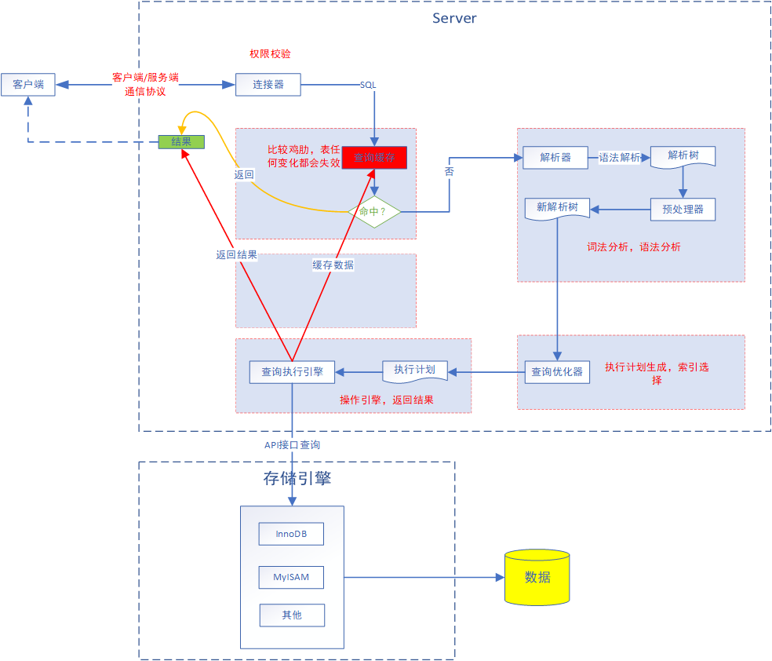

## 查询速度慢的原因

1. 生命周期太长：从客户端到服务端，然后在服务端进行解析、生成执行计划、执行（包括数据的分组聚合处理等）、并返回结果
2. 资源消耗：网络资源、CPU资源、锁等待、IO资源
3. 访问的数据太多，大多数是行数据，也包括列数据
   - 是否向数据库请求了不需要的数据
     - 查询不需要的数据，比如`LIMIT 1000000,10`
     - 是否返回了全部列，比如`select * from `
     - 重复查询相同的数据，可以使用缓存解决
   -  MySQL是否在扫描额外的记录，可以使用`explain`分析，关注以下三个指标
      -  响应时间
         -  服务时间：数据库处理这个查询实际消耗的时间
         -  排队时间：等待时间，比如IO操作、锁等待等
      -  扫描的行数
         -  通过`explain`中的`type`列获取访问类型（全表扫描、范围扫描、唯一索引查询、常数引用等）
         -  使用where条件的方式
            -  在索引中使用where过滤数据，存储引擎层完成
            -  索引覆盖扫描（Extra中出现Using index），服务层直接在索引中处理，不需要回表
            -  冲数据表中返回数据（Extra中出现Using index），服务层完成（先从数据库中获取数据，然后在过滤数据）
      -  返回的行数
         -  优化技巧（扫描比返回的数据多）
            -  使用索引覆盖扫描
            -  修改表结构
            -  重新SQL
<!--more-->

## 重构查询方式

1. 一个复杂查询还是多个复杂查询，根据实际情况确认是否拆分
2. 切分查询，比如定期清理数据
3. 分解关联查询
   - 提高缓存命中和利用率
   - 减少锁竞争
   - 应用层做关联，提高性能和扩展性以及利用数据库的拆分
   - 减少冗余记录查询 

## 查询执行的原理

### 执行步骤

<div align=center>



</div>

### 客户端/服务端通信协议

1. 半双工通信协议：客户端和服务端收发数据不能同时发生，并且一端开始之后另一端必须接收完整消息才能响应
2. 使用`max_allowed_packet`控制一次查询的数据包大小（查询语句很长时）
3. 由于客户端必须接收完整的服务端数据才能让服务器停止发送，当服务端返回数据较多时，通常使用limit进行限制

### 连接器

1. 校验用户名和密码
2. 校验当前用户拥有的权限

### 查询缓存

1. 数据结构类似于hashtable，key：sql，value：数据集
2. 适用于静态表（不变化的表），只要是表经常变化则缓存会失效，严重影响性能（8.0中以去掉）
3. 查询中包含任何用户自定义函数、存储函数、用户变量、临时表、MySQL库中的系统表，**查询结果都不会被缓存**
4. 失效：表结构变化和表数据变化
5. 可以通过SQL_CACHE和SQL_NO_CACHE来控制某个查询语句是否需要进行缓存
6. **尽量不要开启查询缓存**

### 查询优化处理

#### 语法解析和预处理

1. 生成一个解析树
2. 解析器：根据语法进行验证和解析。比如错误的关键字、关键字的顺序、引号是否匹配
3. 预处理：进一步验证解析树，比如表和列表是否存在，比如别名是否冲突歧义
4. 最终生成合法的解析树

#### 查询优化器

选择成本最优的执行计划，可以通过查询当前会话的last_query_cost进行判断。
```sql
MariaDB [information_schema]> show status like 'Last_query_cost';
+-----------------+----------+
| Variable_name   | Value    |
+-----------------+----------+
| Last_query_cost | 2.399000 |
+-----------------+----------+
1 row in set (0.001 sec)
```
value：表示做**个数据页的随机查找，统计信息（由存储引擎实现）包括：每张表或者索引的页面个数、索引的基数、索引和数据行的长度、索引的分布情况等等

##### 导致执行计划不准确的原因

1. 统计信息不准确
2. 不会考虑不受其控制的操作成本（用户自定义函数、存储过程）
3. MySQL认为的最优跟我们想的不一样
4. 不考虑并发查询
5. 并不是任何时候都是基于成本的控制，比如全文索引
6. 执行计划中的成本估算不等同于实际执行的成本

##### 优化方式

1. 静态优化：直接对解析树进行优化，比如简单的代数运算，常用优化等，并且优化后一直生效
2. 动态优化：需要依赖上下文，每次都需要重新评估

##### 支持的优化类型

1. 重新定义关联表的顺序
2. 将外连接转换为内连接
3. 使用等价变化规则，比如(a < b and b = c) and a = 5,优化为：b > 5 and b = c and a = 5
4. 优化count、max、min等函数：找某列的最小值，如果该列有索引，只需要查找B+Tree索引最左端
5. 预估并转换常数表达式
6. 覆盖索引扫描
7. 子查询优化：转换成多个查询
8. 提前终止查询（比如：使用Limit时，查找到满足数量的结果集后会立即终止查询），适用于distinct、not exists、left join
9. 等值传播
10. in的使用，不完全等同于or，通过二分查找的方式完成，如果太多会影响查询性能

#### MySQL中的关联查询

1. 在MySQL中任意查询都是一次关联查询
2. 任何关联查询都是嵌套查询
   - 在一个表中循环获取单条数据
   - 在另一个表中匹配数据，直到所有表匹配完成
   - 根据各个表匹配的行，返回查询中的各个列 

#### 执行计划

MySQL生成一颗指令树（左深度优先树），然后通过存储引擎来完成针对这个树的查找，可以通过explain extend，再执行show warning就可以查看重构出的查询。

#### 关联查询优化器

#### 排序优化

**参考<a href="https://www.sunliaodong.cn/2021/02/14/MySQL%E4%B9%8B%E5%8E%9F%E7%90%86%E5%88%86%E6%9E%90-%E6%8E%92%E5%BA%8F/" target="_blank">排序优化</a>**

### 查询执行引擎

1. 通过调用存储引擎实现的接口来完成，这些接口被称为handler API
2. 查询过程中的每一张表由一个handler实例表示（在查询优化节点完成创建）
3. 包括表的所有列名、索引统计信息等
4. 并不是所有的操作都是由handler完成，比如表锁（如果是所有存储引擎的共性则有服务层完成（时间、日期函数、视图、触发器等），否则由具体的存储引擎完成）

### 返回结果给客户端

1. 即时查询结果为空，也会返回数据，比如影响行数
2. 返回结果根据实际情况是否缓存
3. 数据返回客户端是一个增量、逐步的过程
4. 每一行数据满足通信协议的数据包发送，再通过TCP协议进行传输，在传输过程中，可能对MySQL的数据包进行缓存然后批量发送

## 查询优化器的局限性

### 关联子查询

```sql
--原始SQL
select * from course t 
where t.course_id in (
   select course_id from course_teacher ct where ct.teacher_id = 1);
--MySQL针对in优化后SQL(可使用 explain extended查看执行效率，通过show warnings;查询优化后SQL)
--不同版本优化效果不同
select * from course t 
where exists (
   select * from course_teacher ct 
   where ct.teacher_id = 1 
   and t.course_id = ct.course_id);
```

1. 如果子项比较少，可以使用`group_concat()`优化
2. 可以使用内联或exists优化，但是效果不一定理想（大部分比较优）
3. 一旦使用了DISTINCT和GROUP BY，那么在查询的执行过程中，通常会产生历史表

### UNION的限制

1. MySQL无法将限制条件从外层下推到内层，所以根据实际需求在每个子项中增加限制条件
2. UNION的原理是把数据放到临时表中，然后取出需要的数据，但是顺序不一定，所以可以根据实际需要增加排序操作

### 索引合并优化

MySQL能够访问单个表的多个索引以合并和交叉过滤的方式来定位需要查找的行。

### 等值传递

比如前面说的in，会有传递的优化；但是如果关联表比较大会影响性能，但是这种情况很少出现。

### 并发执行：不支持

### 哈希关联

1. MySQL本身没有实现正在意义的哈希关联（都是嵌套查询），可以通过哈希索引实现；memory 存储引擎使用哈希索引
2. mariadb已经支持哈希关联

### 松散索引扫描

1. MySQL历史版本中不支持松散索引检索，即无法按照不连续的方式扫描一个索引
2. 特别注意组合索引在查询条件中的限制
   ```sql
   --索引：(a,b)
   select ... from table1 where b between 10 and 20;
   ```
3. 5.0之后在特殊场景中会使用松散扫描，比如：在一个分组查询中需要找到分组的最大值和最小值（Using index for group-by）
4. 5.6之后通过“索引条件下推”的方式解决

### 最大值、最小值优化


### 同一个表上查询和更新

## 具体查询优化

## 参考

1. 《高性能MySQL》
2. [面试官：select语句和update语句分别是怎么执行的？](https://www.toutiao.com/i6925236642320073229)
3. [万字总结：学习MySQL优化原理，这一篇就够了！](https://cloud.tencent.com/developer/article/1103154)
4. [The InnoDB Storage Engine](https://dev.mysql.com/doc/refman/5.7/en/innodb-storage-engine.html)