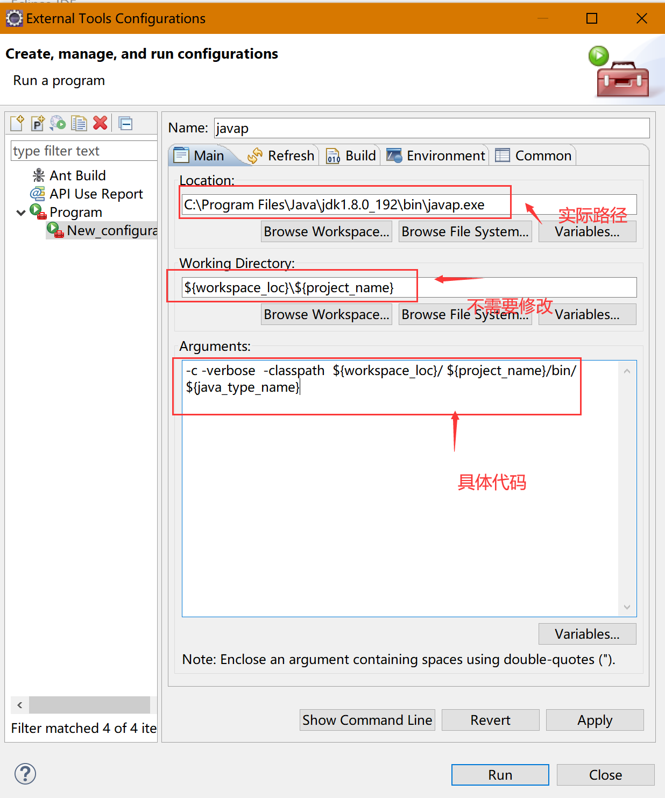
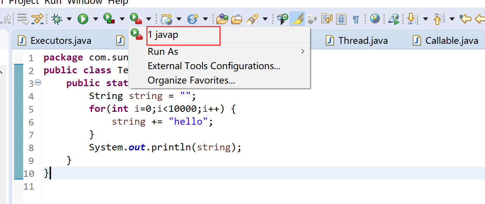

## 集成javap命令

### 配置

1. eclipse中点击工具栏: Run > External Tools > External Tools Configuration
2. 双击”程序”
3. 修改配置

<div align=center>



</div>

```java
Name: javap(随意)
location: jdk实际路径
Working Directory:${workspace_loc}\${project_name} （不要改）
Arguments:-c -verbose  -classpath  ${workspace_loc}/ ${project_name}/bin/${java_type_name}
```

<!--more-->

### 使用

<div align=center>



</div>

### javap的命令说明

参考《[javap详解](https://www.sunliaodong.cn/2021/02/04/Javap%E8%AF%A6%E8%A7%A3/)》

## debug使用技巧

### 常用快捷键说明

1. Step Into (also F5) 跳入
2. Step Over (also F6) 跳过
3. Step Return (also F7) 执行完当前method，然后return跳出此method
4. step Filter 逐步过滤 一直执行直到遇到未经过滤的位置或断点(设置Filter:window-preferences-java-Debug-step Filtering)
5. resume 重新开始执行debug,一直运行直到遇到breakpoint
6. hit count 设置执行次数 适合程序中的for循环(设置 breakpoint view-右键hit count)
7. inspect 检查 运算。执行一个表达式显示执行值
8. watch 实时地监视变量的变化
9. 我们常说的断点(breakpoints)是指line breakpoints,除了line breakpoints,还有其他的断点类型：field(watchpoint)breakpoint,method breakpoint,exception breakpoint.
10. field breakpoint 也叫watchpoint(监视点) 当成员变量被读取或修改时暂挂
11. 添加method breakpoint 进入/离开此方法时暂挂(Run-method breakpoint)
12. 添加Exception breakpoint 捕抓到Execption时暂挂(待续...)

### 断点属性

1. hit count 执行多少次数后暂挂 用于循环
2. enable condition 遇到符合你输入条件(为ture\改变时)就暂挂
3. suspend thread 多线程时暂挂此线程
4. suspend VM 暂挂虚拟机
5. variables 视图里的变量可以改变变量值，在variables 视图选择变量点击右键--change value.一次来进行快速调试。
6. debug 过程中修改了某些code后--〉save&build-->resume-->重新暂挂于断点

### 示例

```java
public static void main(String args[]) {
  MyDate aa = new MyDate();
  aa.addDays(day);                      =============》(1)
  System.out.println("eeeeeeeeeeeeeee");=============》(2)
}

  public String addDays(int more_days) {
    System.out.println("1");               =============》(3)
    String result = "";         =============》(4)
    System.out.println("2");               =============》(5)
    return result;
 }
 ```
 
你在(1)处加断点，运行到此处时如果Step Into (also F5)为跳入，则接着执行到(3)。再执行Step Over (also F6)执行本行，则执行到(4)。最后执行Step Return (also F7)，则跳出addDays方法，跳到(2)

## 配置@author

1. eclipse->window->preference->java->code  styple->code template->Code->New Java files 

```java
点击 Edit 
${filecomment}
${package_declaration}
/**
* @author 孙辽东
* @E-mail:sld880311@126.com
* @qq:767768553
* @version 创建时间：${date} ${time}
* 简单说明
*/
${typecomment}
${type_declaration}
```
2. 在建立类文件的时候输入“/**”的时候自动出来的：eclipse->window->preference->java->code  styple->code template->comments->typles,点击 Edit ，就可以根据自己需要编写了
