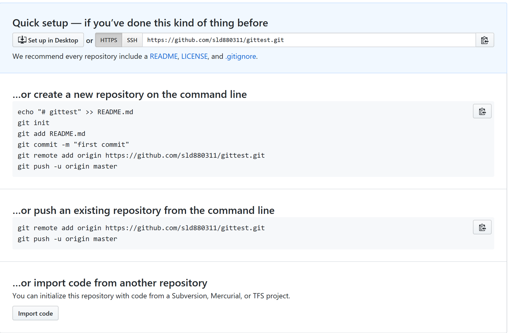
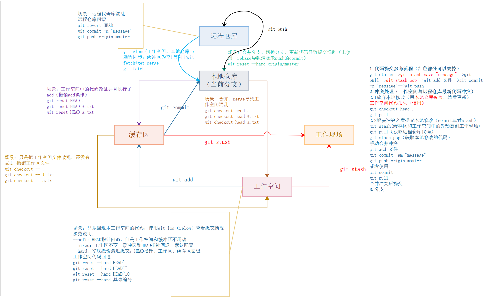

## 提交本地工程到github

```bash
git init
git add .
git commit -m "注释"
git remote add origin https://github.com/sld880311/parkspaceagent

git pull origin master
#如果出现fatal: refusing to merge unrelated histories
使用如下命令 git pull origin master --allow-unrelated-histories

git push -u origin master
```

<!--more-->

### 代码提交示意图

<div align=center>


</div>

### 官方参考图

<div align=center>



</div>

## 使用图解

<div align=center>



</div>

## 命令详解

### Checkout

#### -- filename

把filename文件在工作区的修改撤销到最近一次git add 或 git commit时的内容。

### stash

通过git stash将工作区恢复到上次提交的内容，同时备份本地所做的修改，之后就可以正常git pull了，git pull完成后，执行git stash pop将之前本地做的修改应用到当前工作区。

git stash: 备份当前的工作区的内容，从最近的一次提交中读取相关内容，让工作区保证和上次提交的内容一致。同时，将当前的工作区内容保存到Git栈中。

git stash pop: 从Git栈中读取最近一次保存的内容，恢复工作区的相关内容。由于可能存在多个Stash的内容，所以用栈来管理，pop会从最近的一个stash中读取内容并恢复。

git stash list: 显示Git栈内的所有备份，可以利用这个列表来决定从那个地方恢复。
git stash clear: 清空Git栈。此时使用gitg等图形化工具会发现，原来stash的哪些节点都消失了。


## 分支详解

## 忽略文件参考

在工程下建立文件.gitignore,复制以下内容  

```conf
*.class

# Package Files #
*.jar
*.war
*.ear

# ignore Maven generated target folders
target

# ignore eclipse files
.project
.classpath
.settings
.metadata
```

## 参考

1. [git重要的三个命令stash, checkout, reset的一些总结](https://www.cnblogs.com/shih/p/6826743.html)
2. [Git学习（三）——staging area 工作原理](https://blog.csdn.net/hughgilbert/article/details/70473348)
3. [git中stash的工作原理是什么？](https://segmentfault.com/q/1010000007679514)
4. [git教程 - 概念 原理 使用](https://blog.csdn.net/chenj_freedom/article/details/50543152)
5. [git revert和git reset的区别](https://www.cnblogs.com/houpeiyong/p/5890748.html)
6. [代码回滚：git reset、git checkout和git revert区别和联系](https://blog.csdn.net/hudashi/article/details/7664460)
7. [git reflog](https://blog.csdn.net/ibingow/article/details/7541402)
